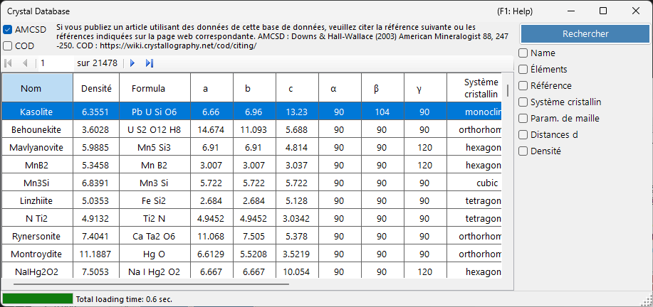
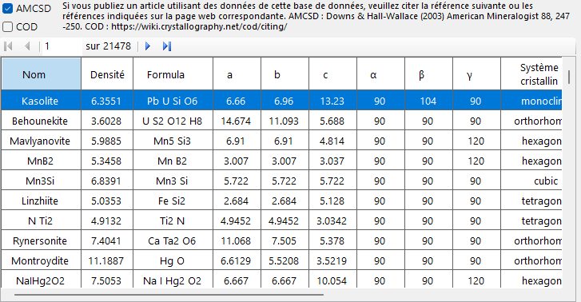
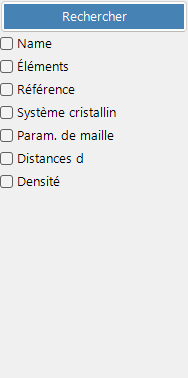

# Base de données de cristaux

La **Base de données de cristaux** offre des fonctions pour rechercher et importer des structures cristallines à partir de deux sources, sélectionnables au moyen des cases à cocher **AMCSD** et **COD** :

- **AMCSD** : la [American Mineralogist Crystal Structure Database](https://www.rruff.net/) fournie avec le logiciel (plus de 20 000 structures).
- **COD** : la [Crystallography Open Database](https://www.crystallography.net/cod/). Comme le fichier est volumineux, il n'est pas fourni avec le programme d'installation ; le fichier de la base de données est téléchargé automatiquement lors de la première utilisation. Lorsque le fichier est mis à jour sur le serveur, il vous est demandé de le télécharger à nouveau.

Veuillez citer les références suivantes lorsque vous utilisez ces bases de données.

Lors de l'utilisation de **AMCSD** :

> Downs, R.T. and Hall-Wallace, M. (2003) The American Mineralogist Crystal Structure Database. *American Mineralogist* **88**, 247-250.

Lors de l'utilisation de **COD** :

> Gražulis, S. et al. (2009) Crystallography Open Database – an open-access collection of crystal structures. *Journal of Applied Crystallography* **42**, 726-729.
>
> Gražulis, S. et al. (2012) Crystallography Open Database (COD): an open-access collection of crystal structures and platform for world-wide collaboration. *Nucleic Acids Research* **40**, D420-D427.

---

## Raccourcis clavier et souris

Cette fenêtre n'a pas de combinaisons avec des touches de modification ; elle se pilote par des clics ordinaires. Les seules entrées non évidentes sont :

| Raccourci | Action |
|----------|--------|
| <kbd>F1</kbd> | Ouvrir cette page du manuel en ligne |
| <kbd>ENTER</kbd> dans n'importe quel champ de recherche | Lancer la recherche dans la base de données (équivaut au bouton **Search**) |
| Cliquer sur une ligne du tableau des résultats | Charger ce cristal dans la fenêtre principale |
| Cliquer sur un élément dans la fenêtre contextuelle **Periodic table** | Faire défiler son filtre : *ignore* → *must include* → *must exclude* |

→ Voir **[21. Raccourcis clavier et souris](21-shortcuts.md)** pour un aperçu de chaque fenêtre.

---

## Tableau

Affiche les cristaux correspondant aux critères de recherche. Sélectionnez un cristal pour le transférer vers les Informations sur le cristal de la fenêtre principale. Appuyez sur **Add** ou **Replace** pour l'ajouter à la Liste des cristaux.

---

## Options de recherche

Saisissez ci-dessous les critères de recherche et appuyez sur le bouton **Search** ou sur la touche **Enter**.

| Critère | Description |
|-----------|-------------|
| **Name** | Nom du cristal |
| **Element** | Sélecteur du tableau périodique (peut/doit/ne doit pas contenir) |
| **Reference** | Titre, revue, auteur |
| **Crystal system** | Sélectionner le système cristallin |
| **Cell Param** | Constantes du réseau et erreur |
| **d-spacing** | Valeurs d de la réflexion la plus forte et erreur |
| **Density** | Densité et erreur |

### Name

Correspondance en texte libre avec le nom du cristal. Les correspondances partielles sont autorisées.

### Element

Appuyez sur le bouton **Periodic Table** pour ouvrir le sélecteur d'éléments. Chaque bouton d'élément parcourt trois états :

- **May or may not include** (par défaut – gris)
- **Must include** (vert)
- **Must exclude** (rouge)

Les trois boutons en haut de la fenêtre réinitialisent chaque élément à l'un des trois états en un seul clic.

### Reference

Correspondance en texte libre avec les métadonnées de la publication : titre de l'article, nom de la revue et liste des auteurs.

### Crystal system

Restreint la recherche à un système cristallin spécifique (Cubic, Tetragonal, Orthorhombic, Hexagonal, Trigonal, Monoclinic, Triclinic).

### Recherche par paramètres de maille

Saisissez les constantes du réseau cibles *a*, *b*, *c*, *α*, *β*, *γ* et les erreurs acceptables. Les champs vides sont traités comme des caractères génériques.

### d-spacing

Saisissez la *d*-spacing de la réflexion la plus forte (ou de plusieurs réflexions fortes) et une erreur acceptable. Utile lorsque seules les positions des pics de diffraction sont connues à partir d'une expérience.

### Density

Filtre par masse volumique (g/cm³) à l'intérieur d'une bande d'erreur acceptable.

---

## Voir aussi

- [Fenêtre principale](0-main-window.md)
- [Informations de symétrie](2-symmetry-information.md)
- [Interaction du faisceau](3-beam-interaction.md)
- [Visualiseur de structure](5-structure-viewer.md)
