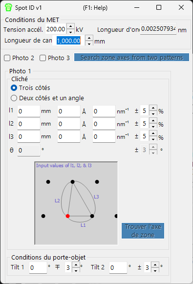

# Spot ID v1

**Spot ID v1** détecte, ajuste et indexe les taches de diffraction à partir d'images expérimentales de diffraction électronique. Il prend également en charge la recherche manuelle d'axe de zone à partir d'une géométrie de taches saisie numériquement (l'ancien **TEM ID**).

---

## Raccourcis clavier et souris

Spot ID v1 prend la géométrie des taches comme **entrée numérique** (l'ancien flux de travail *TEM ID*), et la détection/l'ajustement des taches s'effectuent à l'aide de boutons ; l'image de diffraction est affichée à titre de référence et n'est pas cliquable (le zoom à la souris et la sélection manuelle des taches relèvent de [Spot ID v2](11-spot-id-v2.md)). Le seul raccourci se trouve dans la fenêtre des résultats :

| Raccourci | Action |
|----------|--------|
| <kbd>F1</kbd> | Ouvrir cette page du manuel en ligne |
| Double-clic sur une ligne de la liste des résultats | Sélectionner ce cristal et le faire pivoter vers l'axe de zone correspondant |

→ Voir **[21. Raccourcis clavier et souris](21-shortcuts.md)** pour un aperçu de toutes les fenêtres.

---

## Zone principale

Affiche l'image de diffraction à titre de référence. Chargez les images par glisser-déposer ou via le menu **File**.

### Ajustements de l'image

| Réglage | Description |
|---------|-------------|
| Min / Max | Plage de luminosité (réglable aussi via la barre de défilement) |
| Gradient | Positif ou Négatif |
| Scale | Linéaire ou Log |
| Colour | Niveaux de gris ou Cold-Warm |
| Dust & Scratch | Supprimer les pixels exceptionnellement clairs/sombres (définir la plage et le seuil) |
| Gaussian blur | Appliquer un flou (plage en pixels) |

---

## Optics

Saisissez la source incidente, l'énergie/longueur d'onde, la longueur de caméra et la taille de pixel du détecteur.

> Si un fichier dm3/dm4 (Gatan Digital Micrograph) est chargé, ces valeurs sont définies automatiquement.

---

## Détection et ajustement des taches

Appuyez sur **Detect & fit spots** pour détecter automatiquement les taches de diffraction et les ajuster avec une fonction Pseudo-Voigt 2D. Les résultats apparaissent dans le tableau.

### Options de détection

| Paramètre | Description |
|-----------|-------------|
| Number | Nombre maximal de taches à détecter |
| Nearest neighbour | Distance minimale entre les taches détectées |
| Fitting range | Rayon (pixels) autour de chaque tache pour l'ajustement |

### Commandes du tableau

| Bouton | Action |
|--------|--------|
| Reset range | Réinitialiser la plage d'ajustement pour toutes les taches |
| Show label/symbol | Superposer des étiquettes/symboles sur l'image |
| Clear all spots | Supprimer toutes les taches |
| Save / Copy | Exporter le tableau au format séparé par des tabulations (Excel) |
| Re-fit all | Réajuster toutes les taches |

### Fenêtre de détail de la tache

Cochez la case pour ouvrir une fenêtre de détail affichant la tache sélectionnée (à gauche) et les profils dans quatre directions (à droite). Bleu = données observées, rouge = ajustement.

---

## Index

Appuyez sur **Identify spots** pour indexer les taches détectées par rapport au cristal sélectionné dans la fenêtre principale.

| Réglage | Description |
|---------|-------------|
| Acceptable error | Tolérance pour l'indexation |
| Single grain / Multi grains | Indexer comme cristal unique ou comme plusieurs grains (définir le nombre maximal de grains) |
| Show label/symbol | Superposer les étiquettes indexées sur l'image |
| Refine thickness and direction | Appliquer la théorie dynamique (méthode de Bethe) pour affiner l'épaisseur de l'échantillon et l'orientation du cristal qui correspondent le mieux aux intensités détectées |

---

## Recherche d'axe de zone à partir de la géométrie des taches (ancien TEM ID)

Lorsque vous n'avez pas d'image à charger, vous pouvez tout de même rechercher des axes de zone candidats en saisissant à la main la géométrie d'un cliché de diffraction électronique en aire sélectionnée (SAED). Saisissez les conditions d'observation MET et la géométrie des taches, puis appuyez sur **Search zone axes** pour trouver des orientations cristallines candidates.

### TEM condition

Saisissez les conditions d'observation MET (tension d'accélération, longueur de caméra, etc.).

### Photo 1, 2, 3

Saisissez la géométrie des taches de diffraction.

- Pour saisir la distance entre deux taches sur le détecteur, utilisez le champ **mm**.
- Si vous connaissez la valeur *d*, saisissez-la dans les unités **Å** ou **nm⁻¹**.

**Three sides mode** : Saisissez les longueurs des trois côtés d'un triangle dont l'un des sommets est le direct spot.

**Two sides and an angle mode** : Saisissez les longueurs de deux côtés (y compris le direct spot) ainsi que l'angle entre eux.

---

## Voir aussi

- [Spot ID v2](11-spot-id-v2.md)
- [Simulateur de diffraction](7-diffraction-simulator/index.md)
- [Fenêtre principale](0-main-window.md)
- [Base de données de cristaux](1-crystal-database.md)
- [Simulation EBSD](12-ebsd-simulation.md)
