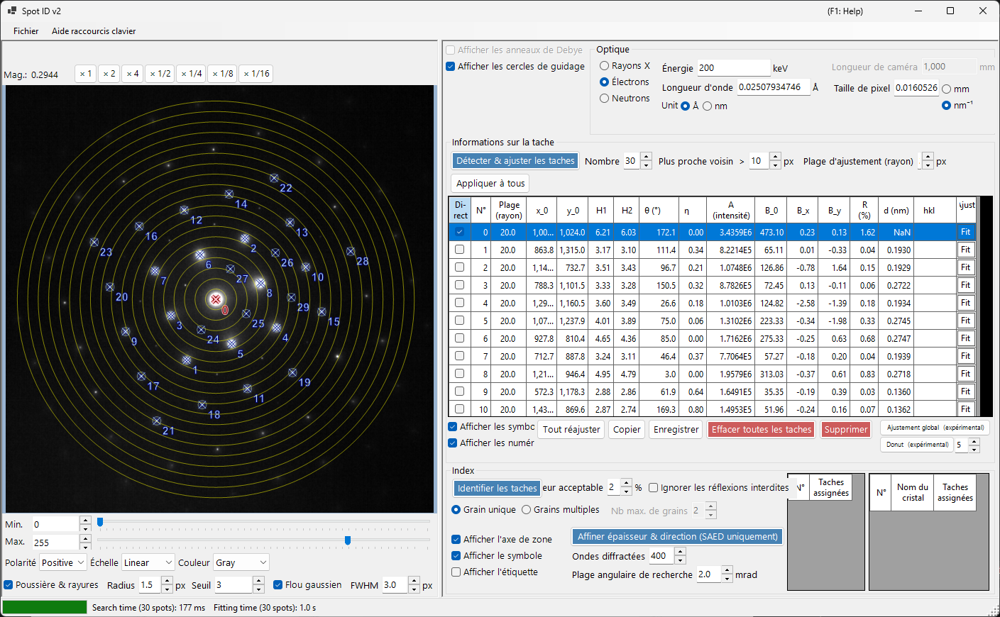
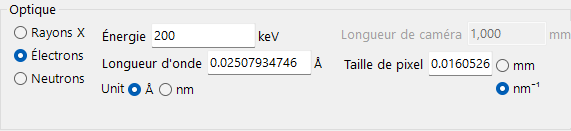
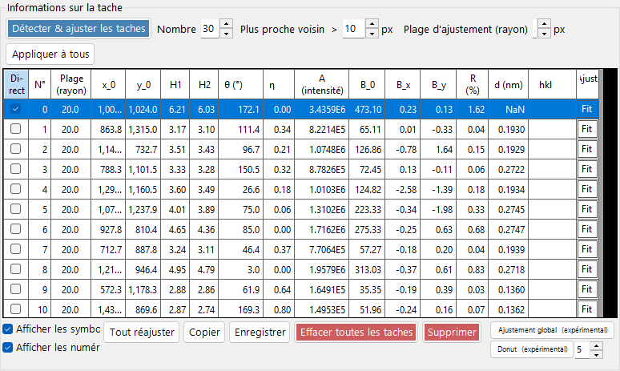
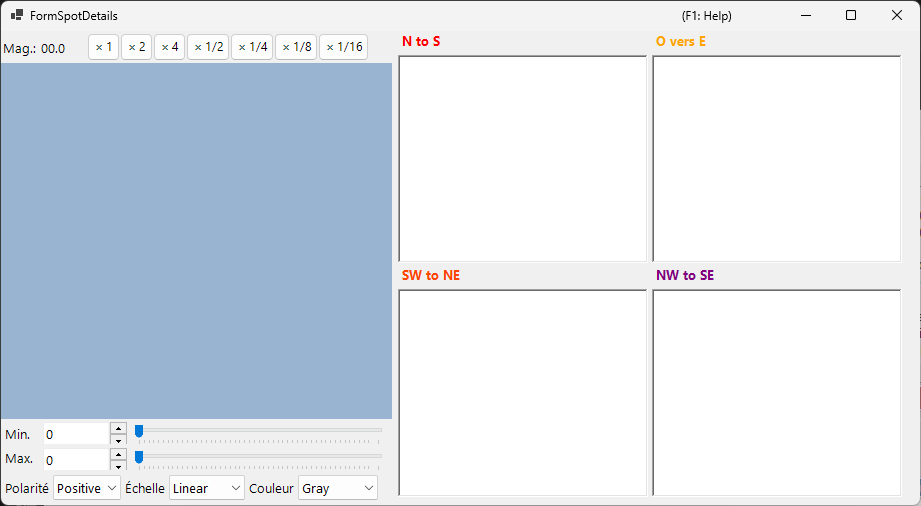
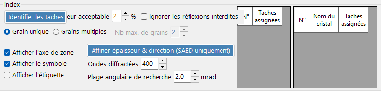

# Spot ID v2

**Spot ID v2** est la version améliorée de [Spot ID](10-spot-id.md) avec une détection des taches optimisée, des algorithmes d'ajustement perfectionnés et un moteur d'indexation plus puissant.

---

## Raccourcis clavier et souris

Vous construisez la liste des taches directement sur l'image chargée. Le volet d'image utilise la [navigation standard de la vue d'image](21-shortcuts.md) de ReciPro pour le déplacement/zoom ; l'édition des taches ajoute les combinaisons ci-dessous.

| Raccourci | Action |
|----------|--------|
| <kbd>F1</kbd> | Ouvrir cette page du manuel en ligne |
| Double-clic gauche sur l'image | Ajouter une tache à ce point (ajustée par pic) |
| <kbd>CTRL</kbd> + double-clic gauche | Ajouter une tache et la marquer comme faisceau direct (000) |
| Clic gauche sur une tache | Sélectionner la tache la plus proche |
| <kbd>CTRL</kbd> + clic droit sur une tache | Supprimer la tache la plus proche |
| <kbd>CTRL</kbd> + touches fléchées | Déplacer la tache sélectionnée d'un pixel |
| Glisser gauche / Glisser milieu (zone vide) | Déplacer l'image |
| Molette de la souris | Zoomer / dézoomer au curseur |
| Glisser droit d'un cadre | Zoomer sur la région sélectionnée |
| Double-clic droit | Dézoomer |
| Double-clic sur l'en-tête de ligne d'une tache (tableau) | Zoomer sur cette tache (×2) |

Le raccourci <kbd>CTRL</kbd>+<kbd>SHIFT</kbd>+<kbd>T</kbd> de la fenêtre principale ouvre/ferme cette fenêtre.

→ Voir **[21. Raccourcis clavier et souris](21-shortcuts.md)** pour un aperçu de chaque fenêtre.

---

## Menu Fichier

Ouvrir / enregistrer une image de diffraction. Le même chargement par glisser-déposer que [Spot ID v1](10-spot-id.md) est pris en charge, et les métadonnées Gatan DM3/DM4 (longueur de caméra, longueur d'onde, taille de pixel) sont prises en compte automatiquement.

---

## Optique

### Source incidente

Sélectionnez le type de rayonnement (rayons X / électron / neutron) et réglez l'énergie ou la longueur d'onde.

### Longueur de caméra / Taille de pixel

La longueur de caméra (mm) et la taille de pixel du détecteur (mm ou nm⁻¹). Lorsqu'un fichier Gatan DM est chargé, ces valeurs sont renseignées à partir de l'en-tête du fichier.

---

## Informations sur la tache

- **Detect & Fit Spots** : Détection automatique des taches à l'aide des maxima locaux et de la soustraction du fond.
- **Number** : Le nombre maximal de taches à détecter.
- **Nearest neighbour** : La séparation minimale (px) autorisée entre les taches détectées. Les pics plus proches que cette valeur sont fusionnés, évitant la double détection d'une même tache.
- **Fitting range (radius)** : Le rayon (px) de la région circulaire utilisée pour ajuster le pic de chaque tache. Les pixels à l'intérieur de ce cercle sont ajustés par une fonction pseudo-Voigt.
- **Apply to All** : Fixe le rayon d'ajustement de chaque tache à la valeur actuelle de **Fitting range (radius)**.
- **Delete spot / Clear spots** : Supprimer une tache individuelle ou toutes les taches détectées.
- **Copy to clipboard** : Copier les positions et les intensités des taches dans le presse-papiers.
- **Details of the spot** : Lorsque cette option est cochée, une fenêtre s'ouvre affichant des informations détaillées sur la tache actuellement sélectionnée.

---

## Index

- **Identify Spots** : Exécute l'algorithme d'indexation pour trouver le cristal et l'axe de zone qui correspondent le mieux.
- **Acceptable error** : Définit l'écart acceptable en distance interréticulaire et en angle pour une correspondance.
- **Ignore prohibited reflections** : Lorsque cette option est cochée, les réflexions interdites par les axes hélicoïdaux et les plans de glissement sont traitées comme non nécessairement satisfaites lors de la recherche de l'axe de zone.
- **Single Grain / Multiple Grains** : Recherche d'une orientation unique (monocristal), ou de plusieurs orientations (une région polycristalline / à grains multiples). Pour plusieurs grains, **Max. num. of grains** définit la limite supérieure du nombre de grains à rechercher.
- **Results** : Les meilleures correspondances sont affichées avec le nom du cristal, l'axe de zone [uvw] et les indices individuels des taches (hkl).

---

## Améliorations par rapport à la v1

- Meilleure gestion du bruit dans la détection des taches.
- Algorithmes d'ajustement plus robustes avec plusieurs formes de profil.
- Indexation plus rapide grâce à des algorithmes de recherche optimisés.
- Prise en charge des taches superposées et des réflexions satellites.

---

## Voir aussi

- [Spot ID v1](10-spot-id.md)
- [Simulateur de diffraction](7-diffraction-simulator/index.md)
- [Fenêtre principale](0-main-window.md)
- [Raccourcis clavier et souris](21-shortcuts.md)
