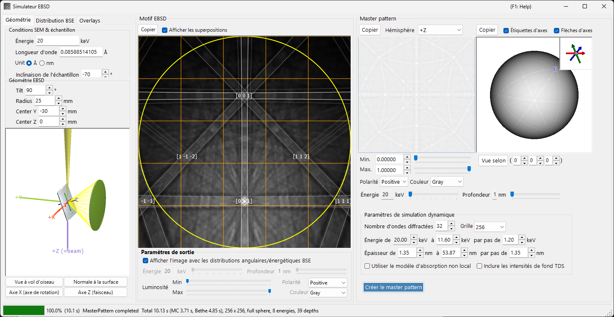
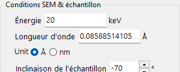
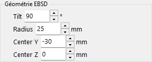
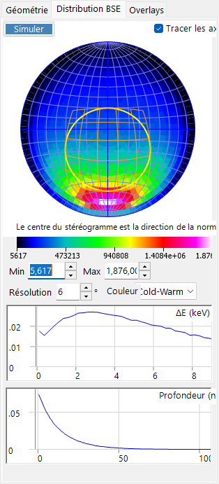
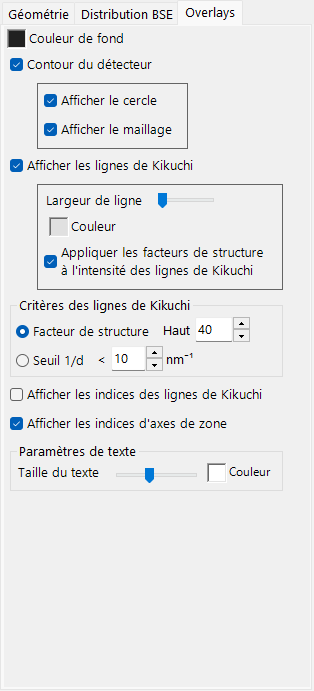
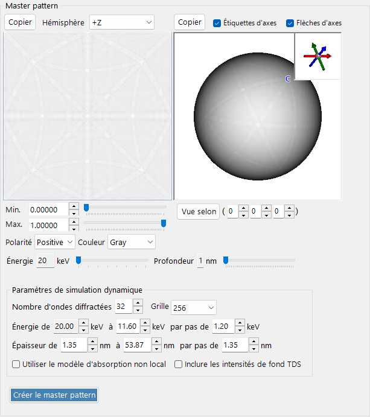
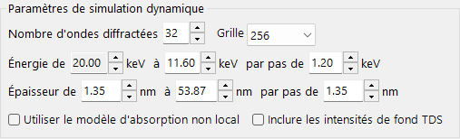
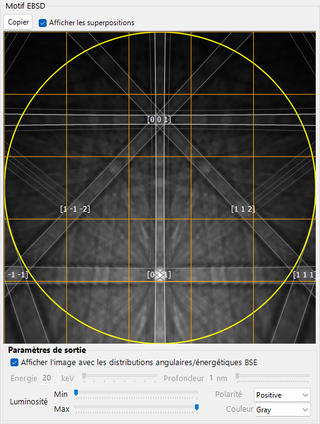

# Simulation EBSD

Le **Simulateur EBSD** simule les figures de diffraction d'électrons rétrodiffusés (EBSD) — figures de Kikuchi — obtenues dans un microscope électronique à balayage (MEB), à l'aide de calculs de théorie dynamique. Il calcule la distribution angulaire/en énergie/en profondeur des électrons rétrodiffusés (BSE) au moyen d'une simulation Monte-Carlo, construit un **master pattern** dynamique (ondes de Bloch) du cristal et le projette sur le détecteur pour l'orientation actuelle du cristal.

La fenêtre comporte trois colonnes.

- **À gauche** : conditions de simulation. Les onglets sélectionnent **Geometry** (géométrie échantillon/détecteur et une vue 3D), **BSE Distribution** (distributions des électrons rétrodiffusés) et **Overlays** (lignes de Kikuchi et autres annotations).
- **Au centre** : la figure EBSD (de Kikuchi) pour l'orientation actuelle du cristal.
- **À droite** : le master pattern indépendant de l'orientation (projection 2D et sphère 3D).

---

## Raccourcis clavier et souris

La vue centrale de la figure EBSD (de Kikuchi) et les vues du master pattern situées à droite réagissent à différentes actions de la souris.

| Raccourci | Action |
|----------|--------|
| <kbd>F1</kbd> | Ouvrir cette page du manuel en ligne |
| Glisser-gauche la figure près du centre | Incliner le cristal |
| Glisser-gauche dans la zone extérieure de la figure | Faire tourner le cristal |
| Double-clic sur la figure | Sélectionner la sous-cellule du détecteur sous le curseur et afficher ses statistiques |
| Glisser-gauche dans une vue 3D (géométrie / sphère du master) | La faire pivoter |
| Glisser-droit, ou molette de la souris, sur une vue 3D | Zoomer |
| <kbd>CTRL</kbd> + double-clic droit sur une vue 3D | Basculer entre orthographique / perspective |
| Glisser / molette sur le master pattern 2D | Déplacer / zoomer l'image |

Les vues 3D utilisent la [navigation de vue](21-shortcuts.md) standard de ReciPro (déplacement désactivé).

→ Voir **[21. Raccourcis clavier et souris](21-shortcuts.md)** pour un aperçu de chaque fenêtre.

---

## Déroulement

Appuyer sur **Build Master Pattern** exécute les étapes suivantes dans l'ordre.

1. **Simulation Monte-Carlo des BSE** : à partir de la composition, de la densité, de la tension d'accélération et de l'inclinaison de l'échantillon actuelles du cristal, environ 2,5 millions d'électrons sont suivis à l'intérieur de l'échantillon (diffusion élastique : sections efficaces de Mott/NIST ; diffusion inélastique : modèle de réponse diélectrique). Cela donne la distribution conjointe *profondeur de pénétration × direction de sortie × énergie de sortie* des électrons rétrodiffusés.
2. **Sélection automatique des plages** : à partir de cette distribution, la plage d'énergie (de l'énergie incidente jusqu'à environ le 80e centile de la perte d'énergie) et la plage de profondeur (jusqu'à environ le 99e centile de la profondeur de pénétration) utilisées dans le calcul dynamique sont déterminées automatiquement.
3. **Construction du master pattern** : pour chaque énergie et profondeur, le problème de diffraction dynamique (ondes de Bloch) est résolu et intégré sur la sphère des directions, pondéré par la distribution Monte-Carlo, afin de fournir l'intensité de diffraction rétrodiffusée dans chaque direction. Le résultat est stocké sur une grille équiaire (Rosca–Lambert).
4. **Projection sur le détecteur, avec pondération** : pour l'orientation actuelle du cristal, l'intensité correspondant à la direction sous-tendue par chaque pixel du détecteur est recherchée dans le master pattern et dessinée sous forme de figure de Kikuchi, éventuellement pondérée par la distribution angulaire/en énergie des BSE.

Les plages d'énergie et de profondeur sont déterminées automatiquement aux étapes 1–2, mais peuvent être ajustées manuellement avant la construction.

---

## Paramètres MEB-EBSD

### Conditions MEB et échantillon

- **Energy** : tension d'accélération du faisceau incident (keV).
- **Wavelength** : longueur d'onde des électrons (Å), liée à Energy.
- **Sample tilt** : angle d'inclinaison de l'échantillon (typiquement 70°). La forte inclinaison en EBSD augmente le rendement en électrons rétrodiffusés.

### Géométrie EBSD

- **Detector tilt** : inclinaison du détecteur (écran phosphorescent).
- **Detector radius** : rayon du détecteur (mm) ; définit le champ de vision angulaire de la figure dessinée.
- **Detector center** : position (Y, Z) du centre du détecteur par rapport au point d'impact du faisceau (mm).

La géométrie peut être inspectée dans la vue 3D de l'onglet **Geometry**.

La plaque grise est l'échantillon, le cylindre/cône vert est le détecteur, et le **+Z (=beam)** violet est le faisceau incident. Les axes cristallins **a / b / c** (fixés à l'échantillon) sont également affichés. Les boutons **Bird's-Eye View**, **Surface Normal**, **X Axis (Rotation Axis)** et **Z Axis (Beam Direction)** alignent la vue sur des directions standard. Voir [Annexe A1. Systèmes de coordonnées](appendix/a1-coordinate-system/2-diffraction.md) pour les définitions des systèmes de coordonnées.

---

## BSE Distribution

L'onglet **BSE Distribution** affiche les distributions Monte-Carlo des électrons rétrodiffusés. Utilisez **Simulate** pour les recalculer.

- **Stereonet** : distribution angulaire (histogramme des directions de sortie) des électrons rétrodiffusés. Le centre est la direction de la normale à la surface, et le contour jaune/orange marque la région sous-tendue par le détecteur. **Draw axes** superpose les axes cristallins, et l'échelle de couleurs (Min/Max, résolution, couleur) est réglable.
- **ΔE (keV)** : distribution de la perte d'énergie des électrons rétrodiffusés.
- **Depth (nm)** : distribution de la profondeur de sortie finale des électrons rétrodiffusés.

Ces distributions sont calculées par le même moteur Monte-Carlo que [Trajectoires électroniques](8-electron-trajectory.md) et servent à pondérer le master pattern.

---

## Overlays

L'onglet **Overlays** configure les annotations dessinées sur la figure EBSD.

- **Background color** : couleur de fond.
- **Detector outline** : le contour du détecteur. **Show circle** (périmètre) / **Show mesh** (grille).
- **Show Kikuchi lines** : dessiner les lignes de Kikuchi. **Line Width** / **Color**, et **Apply structure factors to Kikuchi line intensity**.
- **Show Kikuchi line indices** : afficher les indices des lignes de Kikuchi (bandes).
- **Show zone axis indices** : afficher les indices des axes de zone.
- **Kikuchi line criteria** : quelles lignes de Kikuchi dessiner : **Structure factor** (les *N* premières par facteur de structure) ou **1/d Cutoff** (celles dont 1/d est inférieur à un seuil).
- **Text settings** : **Text Size** / **Color** des étiquettes d'indices.

---

## Master pattern

Le master pattern est l'intensité de diffraction rétrodiffusée sur toutes les directions, calculée à l'avance par la théorie dynamique avec **Build Master Pattern**.

- **Vue 2D** (à gauche) : projection équiaire d'un hémisphère. **Hemisphere** sélectionne l'hémisphère projeté (+Z / −Z).
- **Vue 3D** (à droite) : une sphère sur laquelle l'intensité est mappée. Elle peut être pivotée à la souris, et un encart en haut à droite montre les axes cristallins synchronisés (a/b/c). **Axis Labels** / **Axis Arrows** activent/désactivent les étiquettes/flèches, et **View Along** regarde le long d'un axe de zone choisi [u v w].
- **Min / Max, Polarity, Color** : plage d'intensité affichée, polarité et échelle de couleurs.
- Curseurs **Energy / Depth** : sélectionnent la tranche d'énergie/de profondeur à afficher.
- L'une ou l'autre vue peut être envoyée dans le presse-papiers avec **Copy**.

### Paramètres de la simulation dynamique

- **Number of diffracted waves** : nombre de faisceaux diffractés (ondes) inclus dans le calcul des ondes de Bloch. Plus d'ondes sont plus précises mais plus lentes.
- **Grid** : résolution de la grille du master pattern (par défaut 256).
- **Energy from … to … with step of …** : plage d'énergie et pas intégrés (keV) ; déterminés automatiquement à partir du résultat Monte-Carlo.
- **Thickness from … to … with step of …** : plage de profondeur et pas intégrés (nm) ; déterminés également automatiquement.
- **Use non-local absorption model** : utiliser la forme d'absorption non locale.
- **Include TDS background intensities** : inclure le fond de diffusion thermique diffuse (TDS).

---

## Figure EBSD

Le panneau central affiche la figure EBSD (à bandes de Kikuchi) pour l'orientation actuelle du cristal.

- **Show Dynamical EBSD Pattern (Master Pattern Required)** : projette le master pattern construit sur le détecteur.
- **Show overlays** : dessine les overlays (ci-dessous), tels que les lignes de Kikuchi et les indices.
- **Output parameters**
  - **Show image with BSE angular/energy distributions** : lorsque cette option est cochée, la figure est composée par pondération avec la distribution des BSE (énergie, profondeur, direction) plutôt qu'avec une seule tranche.
  - **Energy / Depth** : lorsque l'option ci-dessus est désactivée, sélectionne la tranche d'énergie/de profondeur à afficher.
  - **Brightness (Min/Max), Polarity, Color** : plage de luminosité, polarité et échelle de couleurs.
- **Copy** : copie la figure dans le presse-papiers.

---

## Voir aussi

- [Trajectoires électroniques](8-electron-trajectory.md) — simulation Monte-Carlo de trajectoires électroniques / BSE utilisée pour la pondération angulaire/en énergie/en profondeur.
- [Simulateur de diffraction](7-diffraction-simulator/index.md) — diffraction électronique dynamique (ondes de Bloch).
- [Annexe A1. Systèmes de coordonnées](appendix/a1-coordinate-system/2-diffraction.md) — définitions des systèmes de coordonnées échantillon/détecteur.
