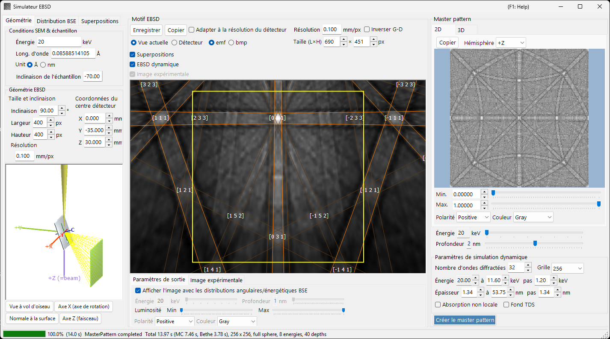
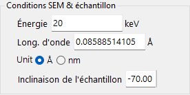
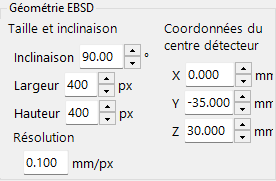
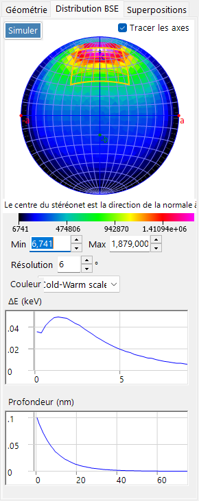
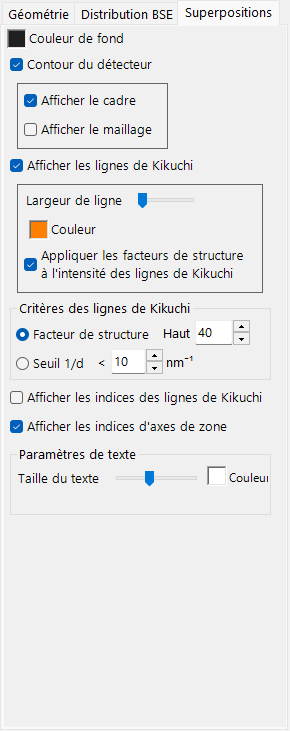
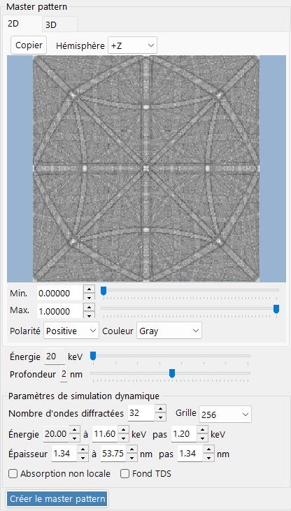
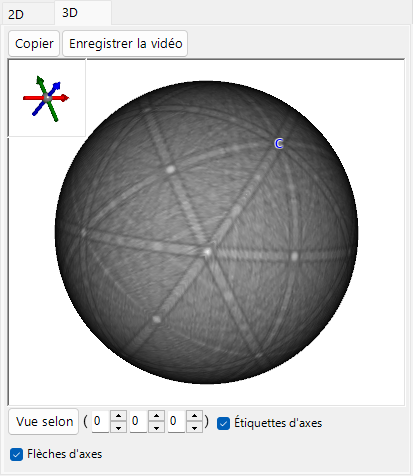
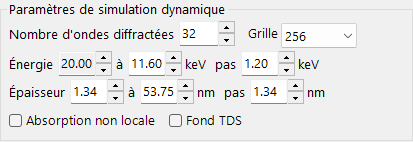
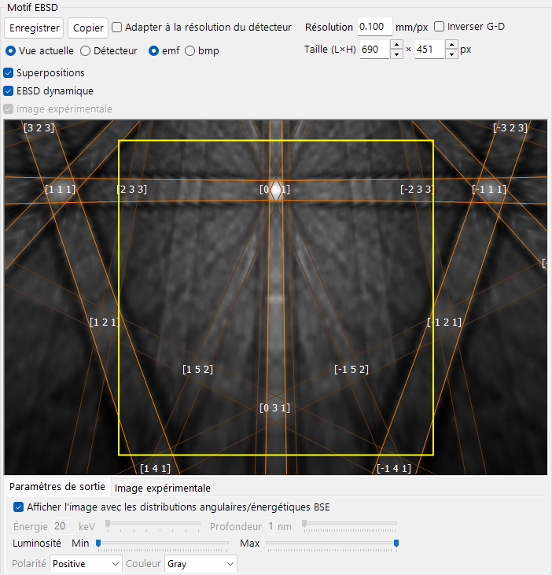
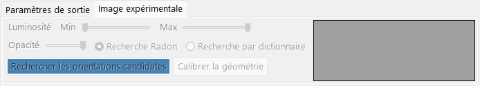

# Simulation EBSD

Le **Simulateur EBSD** simule les figures de diffraction d'électrons rétrodiffusés (EBSD) — figures de Kikuchi — obtenues dans un microscope électronique à balayage (MEB), à l'aide de calculs de théorie dynamique. Il calcule la distribution angulaire/en énergie/en profondeur des électrons rétrodiffusés (BSE) au moyen d'une simulation Monte-Carlo, construit un **master pattern** dynamique (ondes de Bloch) du cristal et le projette sur le détecteur pour l'orientation actuelle du cristal. Une image EBSD expérimentale peut également être chargée et **indexée** : l'orientation qui l'explique le mieux est recherchée automatiquement ([Image expérimentale](#image-expérimentale)).

La fenêtre comporte trois colonnes.

- **À gauche** : conditions de simulation. Les onglets sélectionnent **Géométrie** (géométrie échantillon/détecteur et une vue 3D), **Distribution BSE** (distributions des électrons rétrodiffusés) et **Superpositions** (lignes de Kikuchi et autres annotations).
- **Au centre** : la figure EBSD (de Kikuchi) pour l'orientation actuelle du cristal. En dessous, les onglets sélectionnent **Paramètres de sortie** et **Image expérimentale**.
- **À droite** : le master pattern indépendant de l'orientation, dans les onglets **2D** et **3D**.

La barre d'état en bas affiche l'avancement du calcul en cours et un résumé de son résultat.

---

## Raccourcis clavier et souris

La vue centrale de la figure EBSD (de Kikuchi) et les vues du master pattern situées à droite réagissent à différentes actions de la souris.

| Raccourci | Action |
|----------|--------|
| <kbd>F1</kbd> | Ouvrir cette page du manuel en ligne |
| Glisser-gauche la figure près du centre | Incliner le cristal |
| Glisser-gauche dans la zone extérieure de la figure | Faire tourner le cristal |
| Double-clic sur la figure | Sélectionner la sous-cellule du détecteur sous le curseur et afficher ses statistiques |
| Déposer un fichier image sur la fenêtre | Le charger comme image EBSD expérimentale |
| Glisser-gauche dans une vue 3D (géométrie / sphère du master) | La faire pivoter |
| Glisser-droit, ou molette de la souris, sur une vue 3D | Zoomer |
| <kbd>CTRL</kbd> + double-clic droit sur une vue 3D | Basculer entre orthographique / perspective |
| Glisser / molette sur le master pattern 2D | Déplacer / zoomer l'image |

Les vues 3D utilisent la [navigation de vue](21-shortcuts.md) standard de ReciPro (déplacement désactivé).

→ Voir **[21. Raccourcis clavier et souris](21-shortcuts.md)** pour un aperçu de chaque fenêtre.

---

## Déroulement

Appuyer sur **Créer le master pattern** exécute les étapes suivantes dans l'ordre.

1. **Simulation Monte-Carlo des BSE** : à partir de la composition, de la densité, de la tension d'accélération et de l'inclinaison de l'échantillon actuelles du cristal, environ 2,5 millions d'électrons sont suivis à l'intérieur de l'échantillon (diffusion élastique : sections efficaces de Mott/NIST ; diffusion inélastique : modèle de réponse diélectrique). Cela donne la distribution conjointe *profondeur de pénétration × direction de sortie × énergie de sortie* des électrons rétrodiffusés.
2. **Sélection automatique des plages** : à partir de cette distribution, la plage d'énergie (de l'énergie incidente jusqu'à environ le 95e centile de la perte d'énergie) et la plage de profondeur utilisées dans le calcul dynamique sont déterminées automatiquement. La profondeur est ici l'épaisseur du master pattern, c'est-à-dire la longueur de trajet mesurée le long de la direction de sortie (profondeur de la source ÷ cos χ, où χ est l'angle entre la direction de sortie et la normale à la surface de l'échantillon). La plage de profondeur s'étend jusqu'au 99,9e centile de cette longueur de trajet pour les électrons qui atteignent le détecteur (arrondi par excès à deux chiffres significatifs) et est divisée en 40 pas inégaux, plus fins près de la surface.
3. **Construction du master pattern** : pour chaque énergie et profondeur, le problème de diffraction dynamique (ondes de Bloch) est résolu et intégré sur la sphère des directions, pondéré par la distribution Monte-Carlo, afin de fournir l'intensité de diffraction rétrodiffusée dans chaque direction. Le résultat est stocké sur une grille équiaire (Roşca–Lambert).
4. **Projection sur le détecteur, avec pondération** : pour l'orientation actuelle du cristal, l'intensité correspondant à la direction sous-tendue par chaque pixel du détecteur est recherchée dans le master pattern et dessinée sous forme de figure de Kikuchi, éventuellement pondérée par la distribution angulaire/en énergie des BSE.

Les plages d'énergie et de profondeur sont déterminées automatiquement aux étapes 1–2, mais peuvent être ajustées manuellement avant la construction.

---

## Géométrie

### Conditions SEM & échantillon

- **Energy** : tension d'accélération du faisceau incident (keV).
- **Wavelength** : longueur d'onde des électrons, liée à Energy. **Unit** sélectionne Å ou nm.
- **Sample tilt** : angle d'inclinaison de l'échantillon (typiquement −70°). La forte inclinaison en EBSD augmente le rendement en électrons rétrodiffusés.

### Géométrie EBSD

Le détecteur (écran phosphorescent) est un rectangle défini par un nombre de pixels et une taille de pixel.

- **Taille et inclinaison** : **Tilt** est l'inclinaison du plan du détecteur (°) ; **Width** et **Height** sont le nombre de pixels du détecteur.
- **Résolution** : la taille physique d'un pixel du détecteur (mm/px). La taille physique du détecteur vaut donc Width × Résolution par Height × Résolution.
- **Coordonnées du centre du détecteur** : position **X**, **Y**, **Z** du centre du détecteur par rapport au point d'impact du faisceau (mm). Y et Z, avec l'inclinaison, déterminent la longueur de caméra ; X est le décalage gauche-droite.

Le chargement d'une image expérimentale met **Width** et **Height** à la taille de l'image, de sorte qu'un pixel du détecteur corresponde à un pixel de l'image (la **Résolution** reste inchangée).

La géométrie peut être inspectée dans la vue 3D de l'onglet **Géométrie**.

La plaque grise est l'échantillon, la plaque rectangulaire verte est le détecteur, et le **+Z (=beam)** violet est le faisceau incident. Les axes cristallins **a / b / c** (fixés à l'échantillon) sont également affichés. Les boutons **Vue à vol d'oiseau**, **Normale à la surface**, **Axe X (axe de rotation)** et **Axe Z (faisceau)** alignent la vue sur des directions standard. Voir [Annexe A1. Systèmes de coordonnées](appendix/a1-coordinate-system/2-diffraction.md) pour les définitions des systèmes de coordonnées.

---

## Distribution BSE

L'onglet **Distribution BSE** affiche les distributions Monte-Carlo des électrons rétrodiffusés. Utilisez **Simuler** pour les recalculer.

- **Stereonet** : distribution angulaire (histogramme des directions de sortie) des électrons rétrodiffusés. Le centre est la direction de la normale à la surface, et le contour jaune marque la région rectangulaire sous-tendue par le détecteur. **Tracer les axes** superpose les axes cristallins, et l'échelle de couleurs (**Min** / **Max**, **Resolution**, **Couleur**) est réglable.
- **ΔE (keV)** : distribution de la perte d'énergie des électrons rétrodiffusés.
- **Profondeur (nm)** : distribution de la profondeur à laquelle les électrons rétrodiffusés détectés ont subi leur dernière diffusion inélastique — la même définition de profondeur que celle qui pondère le master pattern.

Ces distributions sont calculées par le même moteur Monte-Carlo que [Trajectoires électroniques](8-electron-trajectory.md) et servent à pondérer le master pattern.

---

## Superpositions

L'onglet **Superpositions** configure les annotations dessinées sur la figure EBSD.

- **Background color** : couleur de fond.
- **Contour du détecteur** : le contour du détecteur. **Afficher le cadre** (le rectangle jaune au bord du détecteur) / **Afficher le maillage** (grille de division).
- **Afficher les lignes de Kikuchi** : dessiner les lignes de Kikuchi. **Largeur de ligne** / **Couleur**, et **Appliquer les facteurs de structure à l'intensité des lignes de Kikuchi** (chaque ligne se fond dans le fond proportionnellement à son facteur de structure).
- **Critères des lignes de Kikuchi** : quelles lignes de Kikuchi dessiner : **Facteur de structure** (les **Top** *N* par facteur de structure) ou **Seuil 1/d** (celles dont 1/d est inférieur à un seuil, nm⁻¹).
- **Afficher les indices des lignes de Kikuchi** : afficher les indices des lignes de Kikuchi (bandes).
- **Afficher les indices d'axes de zone** : afficher les indices des axes de zone.
- **Paramètres de texte** : **Taille du texte** / **Couleur** des étiquettes d'indices.

---

## Master pattern

Le master pattern est l'intensité de diffraction rétrodiffusée sur toutes les directions, calculée à l'avance par la théorie dynamique avec **Créer le master pattern** (**Arrêter** interrompt le calcul en cours).

- Onglet **2D** : projection équiaire (de Lambert) d'un hémisphère. **Hémisphère** sélectionne l'hémisphère projeté (+Z / −Z).
- Onglet **3D** : une sphère sur laquelle l'intensité est mappée. Elle peut être pivotée à la souris, et un encart en haut à gauche montre les axes cristallins synchronisés (a/b/c). **Étiquettes d'axes** / **Flèches d'axes** activent/désactivent les étiquettes/flèches, et **Vue selon** regarde le long de l'axe de zone [u v w] saisi à côté.
- Curseurs **Energy / Depth** : sélectionnent la tranche d'énergie/de profondeur à prévisualiser.
- L'une ou l'autre vue peut être envoyée dans le presse-papiers avec **Copier**.
- **Enregistrer la vidéo** (onglet **3D**) : enregistre une vidéo (MP4) du master pattern sphérique en rotation. La direction de rotation, la vitesse, la durée, les fps et la qualité se règlent dans la même boîte de dialogue « Movie setting » que dans le [Visualiseur de structure](5-structure-viewer.md). Seule cette vue 3D tourne ; l'orientation du cristal (les angles d'Euler de la fenêtre principale) n'est pas modifiée.

### Paramètres de simulation dynamique

- **Number of diffracted waves** : nombre de faisceaux diffractés (ondes) inclus dans le calcul des ondes de Bloch. Plus d'ondes sont plus précises mais plus lentes.
- **Grille** : résolution de la grille du master pattern (pixels par côté, 64–8192 ; par défaut 256). 4096 et 8192 exigent une quantité de mémoire énorme pour les données intermédiaires (avec les 16 énergies × 40 profondeurs par défaut, environ 344 Go à 4096 et 1374 Go à 8192 ; déjà environ 86 Go à 2048) ; il faut donc réduire fortement le nombre de pas en énergie et en profondeur pour qu'elles deviennent utilisables. Si la mémoire est insuffisante, le calcul se termine par « MasterPattern failed » (ReciPro lui-même continue de fonctionner).
- **Energy from … to … with step of …** : plage d'énergie et pas intégrés (keV) ; déterminés automatiquement à partir du résultat Monte-Carlo.
- **Thickness from … to … with step of …** : plage de profondeur et pas intégrés (nm) ; déterminés également automatiquement. Les profondeurs automatiques ne sont pas équidistantes : les cases affichent donc, à titre indicatif, le point le moins profond, la borne supérieure et le premier intervalle ; modifier une case à la main fait passer à des profondeurs équidistantes avec ces valeurs.
- **Absorption non locale** : utiliser la forme d'absorption non locale.
- **Source non locale** : remplace la source de rétrodiffusion localisée aux sites atomiques par la forme non locale du potentiel absorbant (U'_back intégré sur l'hémisphère arrière). Les deux utilisent la même section efficace physique : c'est un changement de modèle, pas un fond additif.
- **Profondeur de la source (MC)** : quel événement Monte-Carlo définit la profondeur de la source cohérente de rétrodiffusion utilisée pour la pondération (énergie × profondeur) : le dernier événement inélastique (défaut), le dernier événement de transport de tout type, ou la dernière décohérence. Dans ce dernier cas, un événement ne réinitialise la source que s'il est assez localisé pour laisser dans l'échantillon l'information « quel atome » : les élastiques avec la probabilité thermique diffuse 1 − exp(−2B s²) du facteur de Debye–Waller (la diffusion de Bragg cohérente non), les inélastiques toujours pour les excitations de cœur ou à forte perte et, pour les excitations de valence, seulement avec la fraction dont le transfert d'impulsion dépasse la coupure plasmon q_c = ω_p/v_F (plasmons et paires électron–trou délocalisées conservent l'état de Bloch). Une source plus superficielle porte une modulation de Kikuchi plus faible : la dernière option fixe le fond diffus par le seul transport, sans paramètre libre. Le changement ne fait que re-classer les électrons enregistrés, sans relancer le Monte-Carlo.
- **Le contraste décroît avec la perte d'énergie** (activé par défaut, E_c = 0.8 keV) : multiplie le contraste de Kikuchi de chaque tranche d'énergie par A(E) = exp(−(E0 − E)/E_c), où E0 est l'énergie du faisceau et E l'énergie de sortie, et reporte la part perdue dans un piédestal plat moyenné sur les directions, de sorte que la luminosité hors contraste de bande est inchangée. Les poids Monte-Carlo comptent chaque électron rétrodiffusé, mais les électrons ayant beaucoup perdu d'énergie ne portent guère de contraste de Kikuchi net ; sans cette correction, chaque tranche porte le contraste complet et les bandes sortent environ 12 % plus larges que pour des électrons monochromatiques à E0 (Si, 20 kV). La valeur par défaut de 0.8 keV a été calibrée en ajustant les largeurs de bande sur un pattern mesuré de Si à 20 kV ; on ne sait pas si elle vaut pour d'autres matériaux et tensions. La modifier ne fait que repondérer les tranches existantes, sans recalculer le master pattern ni le Monte-Carlo.
- **Couche amorphe de surface** : épaisseur (nm) d'une couche de surface non cristalline (oxyde natif, contamination, dommages de polissage ou d'amincissement ionique). Les électrons dont la source cohérente de rétrodiffusion se trouve dans la couche ne portent aucune modulation de Kikuchi et sont ajoutés comme contribution uniforme moyennée en direction, avec la même intensité par électron ; les sources sous la couche sont mesurées depuis la surface du cristal. Le transport est calculé avec la composition et la densité du cristal, ce qui suffit pour quelques nm. 0 désactive ; le changement ne fait que re-classer les électrons enregistrés, sans relancer le Monte-Carlo.
- **Pondérer par la réponse du phosphore** (actif par défaut, E_dead = 2 keV) : pondère chaque électron Monte-Carlo par le rendement lumineux d'un écran phosphore, φ(E) = max(0, E − E_dead), au lieu de compter chaque électron une fois. Les électrons de plus haute énergie quittent l'échantillon incliné plutôt vers l'avant ; la pondération réduit donc le gradient d'intensité de haut en bas du cliché (pour Si à 20 kV d'environ 2,5 à 1,7 sur le détecteur) et atténue légèrement les axes de zone. Elle s'applique au binning dans le plan du détecteur et à la distribution d'énergie par bin ; un changement re-binne les électrons mémorisés sans relancer le Monte-Carlo. À désactiver pour un détecteur direct comptant les électrons. E_dead est l'énergie de couche morte (seuil) du phosphore ; valeurs typiques 0–3 keV pour un écran P43 revêtu d'aluminium.
- **Réinjecter le flux absorbé en fond** (désactivé par défaut) : dans le calcul par ondes de Bloch, les électrons retirés du canal cohérent par l'absorption (diffusion thermique diffuse) disparaissent, alors que physiquement ils atteignent le détecteur sans modulation de Kikuchi. Cette option les réintroduit comme fond diffus D(t) = Σσ_n ∫(1 − N(z))dz (N(z) = densité de l'onde cohérente moyennée sur la maille), ce qui conserve le flux. Les intensités absolues augmentent (à 20 kV, environ 10 % pour Si et 25 % pour Fe₃O₄) ; la brillance relative des axes de zone change peu et dépend du cristal, car le flux réinjecté appartient toujours à la même direction de sortie. Sans effet si les paramètres de déplacement atomique sont nuls (pas d'absorption) ; attribuez un B à ces cristaux.

---

## Figure EBSD

Le panneau central affiche la figure EBSD (à bandes de Kikuchi) pour l'orientation actuelle du cristal. La barre au-dessus de la figure contrôle ce qui est dessiné et la manière dont la figure est copiée.

- **EBSD dynamique** : projette le master pattern construit sur le détecteur ; décoché, seul le fond subsiste.
- **Superpositions** : dessine les lignes de Kikuchi, les indices et le contour du détecteur configurés dans l'onglet **Superpositions**.
- **Image expérimentale** : superpose l'image expérimentale chargée (voir ci-dessous).
- **Inverser G-D** : effectue une symétrie gauche-droite de la figure et de toutes ses superpositions. Décoché (par défaut), il s'agit de la vue depuis le détecteur vers l'échantillon, c'est-à-dire la figure telle qu'une caméra EBSD l'enregistre ; ne le cochez que si votre image expérimentale a la chiralité opposée.
- **Resolution** (mm/px) et **Size (W×H)** (px) : résolution et taille de la vue affichée.
- **Enregistrer** : enregistre la figure dans un fichier, selon la plage et la résolution sélectionnées à côté. Le format (PNG / TIFF / EMF) se choisit dans la boîte de dialogue d'enregistrement.
  - **Pattern values (\*.csv)** écrit, au lieu d'une image, les intensités brutes sur la grille de pixels du détecteur.
  - Un TIFF est écrit en niveaux de gris 16 bits (sans quantification sur 256 niveaux) lorsque la plage est **Détecteur**, que **EBSD dynamique** est affiché et que **Image expérimentale** ne l'est pas. Dans ce cas, les **Superpositions** sont omises quelle que soit leur case à cocher, et les valeurs des pixels correspondent à la figure ramenée linéairement de son propre minimum–maximum à 0–65535 (le minimum et le maximum utilisés sont indiqués dans la barre d'état ; utilisez l'export csv si des valeurs absolues sont nécessaires).
- **Copier** : copie la figure dans le presse-papiers, selon la plage et le format sélectionnés à côté.
  - **Vue actuelle** copie la zone actuellement affichée (avec son déplacement et son zoom) ; **Détecteur** copie uniquement la zone du détecteur, auquel cas le cadre jaune est omis afin que l'image s'arrête exactement au bord du détecteur.
  - **emf** copie un métafichier amélioré (Enhanced Metafile) en conservant les lignes de Kikuchi et les étiquettes d'indices sous forme vectorielle ; **bmp** rastérise l'ensemble.
  - **Adapter à la résolution du détecteur** copie à raison d'un pixel d'image par pixel de détecteur (le côté le plus long est limité à 4096 px). Décoché, la résolution à l'écran est utilisée.

### Paramètres de sortie

- **Afficher l'image avec les distributions angulaires/énergétiques BSE** : lorsque cette option est cochée, la figure est composée par pondération avec la distribution des BSE (énergie, profondeur, direction) plutôt qu'avec une seule tranche.
- **Energy / Depth** : lorsque l'option ci-dessus est désactivée, sélectionne la tranche d'énergie/de profondeur à afficher.
- **Luminosité** (**Min** / **Max**), **Polarité**, **Couleur** : plage de luminosité, polarité et échelle de couleurs.
- **Aplanir le fond** (**FWHM**, px ; inactif par défaut, 100 px) : soustrait au cliché simulé une copie floutée par une gaussienne, retirant la distribution de luminosité lentement variable pour comparer bandes et axes de zone à un cliché expérimental corrigé du fond. La largeur à mi-hauteur est donnée en pixels du détecteur et ne dépend pas du zoom. Agit sur l'image affichée et l'export PNG/TIFF ; l'export CSV garde les valeurs brutes.

### Image expérimentale

Déposez un fichier image EBSD (TIFF, PNG, BMP ou JPEG ; les TIFF 16 bits sont lus en pleine profondeur) n'importe où sur la fenêtre pour le charger comme figure expérimentale. Il est dessiné sur la zone du détecteur — au-dessus de la figure simulée et sous les superpositions de lignes de Kikuchi — de sorte que la simulation peut être comparée directement à la mesure. Le chargement met aussi **Width** et **Height** du détecteur à la taille de l'image.

- **Luminosité** (**Min** / **Max**) : points noir et blanc de l'image superposée, exprimés en fraction de sa propre plage d'intensité (curseurs logarithmiques). Ils n'agissent que sur l'image expérimentale, pas sur la figure simulée.
- **Opacité** : opacité de l'image superposée, de 0 (invisible) à 100 % (opaque). Réduisez-la pour voir la figure simulée en dessous.

L'orientation qui explique l'image est ensuite recherchée par l'un des deux moteurs.

- **Recherche Radon** : compare des modèles cinématiques de bandes de Kikuchi à la carte de Radon (détection de droites) de l'image expérimentale. Elle fonctionne sans master pattern ; s'il en existe un, les candidats sont reclassés par une ZNCC robuste (corrélation croisée normalisée à moyenne nulle) avec la figure simulée.
- **Recherche par dictionnaire** : engendre à partir du master pattern dynamique des figures de dictionnaire pour toutes les orientations et les compare toutes par ZNCC robuste. Elle exige le master pattern et prend quelques secondes, mais elle est plus fiable que la recherche Radon.

**Rechercher les orientations candidates** exécute le moteur sélectionné et liste jusqu'à 10 candidats, du meilleur au moins bon ; si un master pattern est disponible, le meilleur candidat est affiné à ±0,25°. Les colonnes sont :

| Colonne | Signification |
|---------|---------------|
| **#** | Rang (0 = le meilleur) |
| **Score** | Valeur *z* de l'évidence de bandes Radon |
| **Bands** | Bandes appariées / bandes prédites dans le champ de vision |
| **ZNCC** | Corrélation avec la figure simulée |
| **Strong bands (hkl)** | Indices des bandes appariées (recherche Radon uniquement) |

**Cliquer sur une ligne applique cette orientation à tout le programme** : la figure simulée est redessinée par-dessus l'image expérimentale et l'orientation du cristal de toutes les autres fenêtres suit.

**Calibrer la géométrie** affine la géométrie du détecteur — centre de la figure (PC) et distance du détecteur (DD) — en alternance avec l'orientation, en maximisant la ZNCC entre les figures simulée et expérimentale. Cette fonction exige le master pattern, maintient l'inclinaison du détecteur fixe et réécrit le résultat dans les champs **Coordonnées du centre du détecteur** X/Y/Z. Comme le balayage du faisceau d'un MEB ne déplace le centre de la figure que d'une fraction de millimètre, une seule calibration au début d'une expérience suffit généralement pour toute une série d'images.

---

## Voir aussi

- [Trajectoires électroniques](8-electron-trajectory.md) — simulation Monte-Carlo de trajectoires électroniques / BSE utilisée pour la pondération angulaire/en énergie/en profondeur.
- [Simulateur de diffraction](7-diffraction-simulator/index.md) — diffraction électronique dynamique (ondes de Bloch).
- [Annexe A1. Systèmes de coordonnées](appendix/a1-coordinate-system/2-diffraction.md) — définitions des systèmes de coordonnées échantillon/détecteur.
