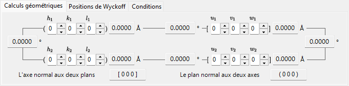
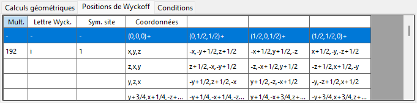
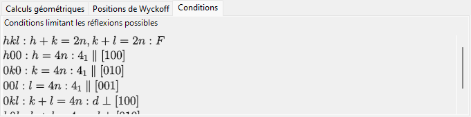
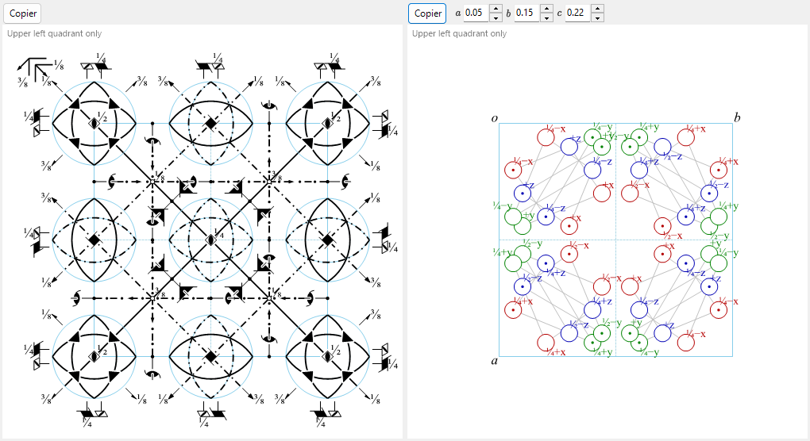

# Informations de symétrie

**Informations de symétrie** affiche des informations détaillées sur la symétrie du groupe d'espace du cristal sélectionné et présente en outre des diagrammes schématiques des éléments de symétrie et des positions générales dans le style des *International Tables for Crystallography* Vol. A.

La fenêtre est divisée en une zone d'identité du groupe d'espace (en haut à gauche), une zone de calcul/tableaux avec onglets (en haut à droite) et deux diagrammes schématiques (en bas).

---

## Raccourcis clavier et souris

Cette fenêtre n'a pas de combinaisons de touches ou de souris particulières. <kbd>F1</kbd> ouvre cette page du manuel, et les deux boutons **Copy** placent le diagramme des éléments de symétrie et le diagramme des positions générales dans le presse-papiers (sous forme de bitmap, ou de fichier EMF vectoriel lorsque **EMF** est coché).

→ Voir **[21. Raccourcis clavier et souris](21-shortcuts.md)** pour un aperçu de chaque fenêtre.

---

## Identité du groupe d'espace

Le panneau en haut à gauche liste, pour le groupe d'espace actuel :

- **Number** (1–230) et l'index de setting
- **Crystal System**
- **Point Group** : symboles de Hermann–Mauguin (HM) et de Schoenflies (SF)
- **Space Group** : symbole court HM, symbole complet HM, symbole SF et **Hall symbol**

---

## Calcul géométrique

Saisissez deux plans cristallins \((h_1, k_1, l_1)\), \((h_2, k_2, l_2)\) ou deux indices de direction \([u_1, v_1, w_1]\), \([u_2, v_2, w_2]\) pour obtenir :

- la distance interréticulaire de chaque plan / la longueur de chaque axe,
- l'angle entre les deux plans (ou les deux axes),
- **l'indice de direction normal aux deux plans** et **l'indice de plan normal aux deux axes**.

Ces calculs tiennent compte de la métrique de la maille actuelle.

---

## Positions de Wyckoff

Liste chaque position de Wyckoff avec sa multiplicité, sa lettre de Wyckoff, sa symétrie de site, et indique s'il s'agit d'une position générale ou spéciale. Pour les réseaux centrés, les vecteurs de translation du réseau sont indiqués dans la ligne d'en-tête.

---

## Conditions

Les conditions de réflexion issues du centrage du réseau et des opérateurs de symétrie de glissement/vissage.

---

## Diagrammes des éléments de symétrie et des positions générales

Les deux panneaux du bas reproduisent les diagrammes schématiques de symétrie du groupe d'espace dans la notation des *International Tables for Crystallography* Vol. A.

- **Éléments de symétrie (à gauche)** : les axes de rotation/vissage, les plans miroir/de glissement ainsi que les centres d'inversion/points de rotoinversion sont représentés avec les symboles graphiques conventionnels.
  - Pour le réseau \(F\) du système cubique, seul un huitième de la maille (uniquement le quadrant supérieur gauche) est représenté.
  - Ces éléments de symétrie peuvent également être tracés directement sur le modèle 3D dans le [Visualiseur de structure](5-structure-viewer.md).
- **Positions générales (à droite)** : les positions équivalentes générales sont tracées sous forme de cercles (une virgule désigne une image miroir), annotées de leurs coordonnées fractionnaires.
  - Pour le système cubique uniquement, des lignes auxiliaires relient les trois cercles liés par un axe de rotation d'ordre trois.

Commandes situées sous les diagrammes :

- **Direction** (`a` / `b` / `c`) : choisissez l'axe cristallin selon lequel projeter.
- **Copy** chaque diagramme dans le presse-papiers sous forme d'image vectorielle (**EMF**) ou d'image matricielle (**BMP**) ; le fichier EMF peut être dissocié et modifié dans PowerPoint.

---

## Voir aussi

- [Base de données de cristaux](1-crystal-database.md)
- [Visualiseur de structure](5-structure-viewer.md)
- [Stéréonet](6-stereonet.md)
- [Géométrie de rotation](4-rotation-geometry.md)
- [Fenêtre principale](0-main-window.md)
