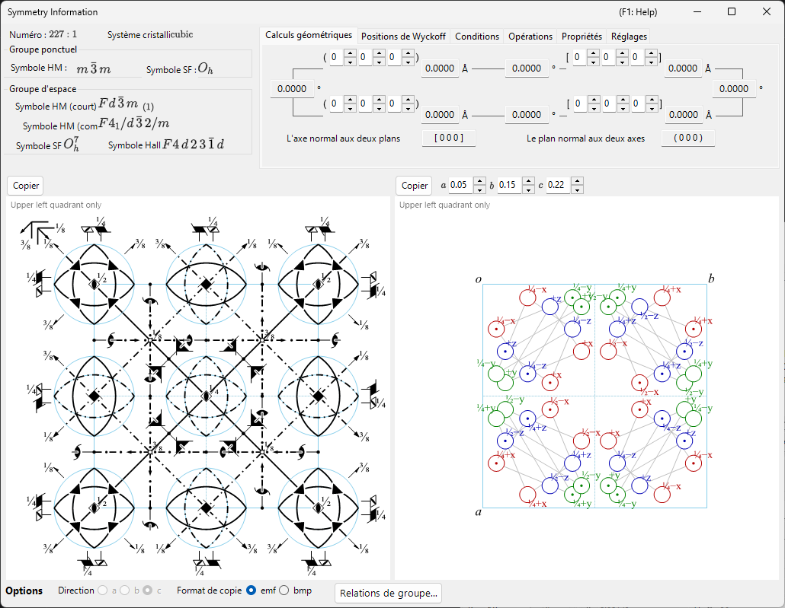
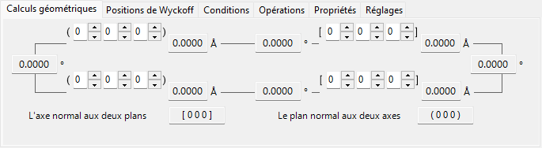
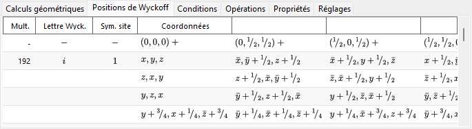
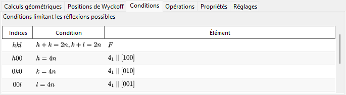
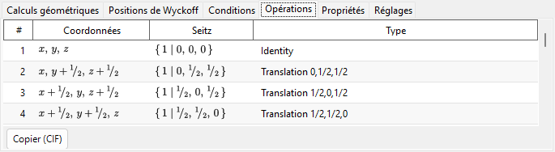
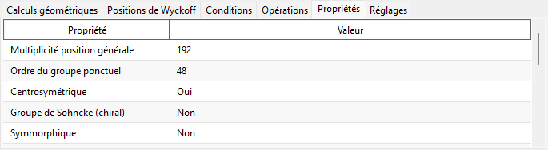
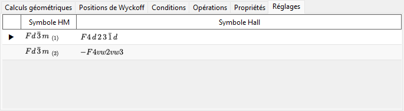
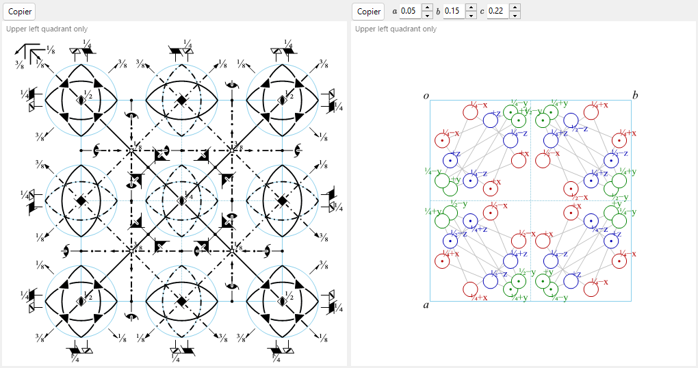

# Informations de symétrie

**Informations de symétrie** affiche des informations détaillées sur la symétrie du groupe d'espace du cristal sélectionné, et dessine en outre des diagrammes schématiques des éléments de symétrie et des positions générales dans le style des *International Tables for Crystallography* Vol. A.

La fenêtre est divisée en une zone d'identité du groupe d'espace (en haut à gauche), une zone de calculs et de tableaux à onglets (en haut à droite) et deux diagrammes schématiques (en bas).

!!! tip "Théorie de la symétrie (Annexe A4)"
    Ce qu'un symbole de Hermann–Mauguin/Hall/Schoenflies encode réellement, les classifications de théorie des groupes de l'onglet **Propriétés** (centrosymétrique, Sohncke, symorphique, polaire, …), la signification des diagrammes des éléments de symétrie et des positions générales ci-dessous, ainsi que les relations groupe–sous-groupe présentées par **Relations de groupe…** sont tous expliqués dans l'**[Annexe A4. Symétrie et groupes d'espace](appendix/a4-symmetry-space-groups/index.md)**.

---

## Raccourcis clavier et souris

Cette fenêtre n'a pas de combinaisons de touches ou de souris particulières. <kbd>F1</kbd> ouvre cette page du manuel, et les deux boutons **Copier** placent le diagramme des éléments de symétrie et le diagramme des positions générales dans le presse-papiers (en vectoriel **emf** ou en matriciel **bmp**, au choix via **Format de copie**).

→ Voir **[21. Raccourcis clavier et souris](21-shortcuts.md)** pour un aperçu de toutes les fenêtres.

---

## Identité du groupe d'espace

Le panneau en haut à gauche liste, pour le groupe d'espace actuel :

- **Numéro** (1–230) et l'indice de setting
- **Système cristallin**
- **Groupe ponctuel** : symboles de Hermann–Mauguin (HM) et de Schoenflies (SF)
- **Groupe d'espace** : symbole HM court, symbole HM complet, symbole SF et **symbole Hall**

---

## Calculs géométriques

Saisissez deux plans cristallins \((h_1, k_1, l_1)\), \((h_2, k_2, l_2)\) ou deux indices de direction \([u_1, v_1, w_1]\), \([u_2, v_2, w_2]\) pour obtenir :

- la distance interréticulaire de chaque plan / la longueur de chaque axe,
- l'angle entre les deux plans (ou les deux axes),
- **l'indice de direction normal aux deux plans** et **l'indice de plan normal aux deux axes**.

Ces calculs tiennent compte de la métrique de la maille actuelle.

---

## Positions de Wyckoff

Liste chaque position de Wyckoff avec sa multiplicité, sa lettre de Wyckoff, sa symétrie de site, et indique s'il s'agit d'une position générale ou spéciale. Pour les réseaux centrés, les vecteurs de translation du réseau sont indiqués dans la ligne d'en-tête.

---

## Conditions

Les conditions de réflexion issues du centrage du réseau et des opérateurs de symétrie de glissement/hélicoïdaux.

---

## Opérations

Liste chaque opération de symétrie de la position générale (translations de centrage du réseau déjà développées) sous la forme d'un triplet de coordonnées, d'un symbole de Seitz et d'un type géométrique en langage clair (par ex. *« 3-fold rotation »*, *« c-glide plane »*, *« screw axis »*). **Copier (CIF)** copie la liste complète dans le presse-papiers sous forme de boucle CIF `_space_group_symop_operation_xyz`.

→ Voir l'**[Annexe A4.1](appendix/a4-symmetry-space-groups/symbols-and-diagrams.md#opérations-de-symétrie-onglet-opérations)** pour la lecture de ces trois notations.

---

## Propriétés

Rapporte les classifications de théorie des groupes du groupe d'espace actuel (multiplicité de la position générale, ordre du groupe ponctuel, centrosymétrique, Sohncke, symorphique, direction polaire, partenaire énantiomorphe, famille cristalline/système réticulaire/type de Bravais, classe cristalline arithmétique, symétrie de Patterson) et indique quelles propriétés physiques macroscopiques (pyroélectricité/ferroélectricité, piézoélectricité, génération de seconde harmonique, activité optique) sont autorisées par cette symétrie.

→ Voir l'**[Annexe A4.1](appendix/a4-symmetry-space-groups/symbols-and-diagrams.md#classification-en-théorie-des-groupes-onglet-propriétés)** pour la signification de chaque terme.

---

## Réglages

Liste, pour référence, tous les choix d'origine et d'axes tabulés qui partagent le numéro IT du groupe d'espace actuel, chacun avec ses symboles HM et Hall ; le setting actuellement affiché est marqué. Sélectionner une ligne ne modifie pas le cristal.

---

## Diagrammes des éléments de symétrie et des positions générales

Les deux panneaux du bas reproduisent les diagrammes schématiques de symétrie du groupe d'espace dans la notation des *International Tables for Crystallography* Vol. A.

- **Éléments de symétrie (à gauche)** : les axes de rotation/hélicoïdaux, les plans miroir/de glissement et les centres d'inversion/points de rotoinversion sont dessinés avec les symboles graphiques conventionnels.
  - Pour le réseau \(F\) du système cubique, seul un huitième de la maille (le quadrant supérieur gauche uniquement) est représenté.
  - Ces éléments de symétrie peuvent aussi être dessinés directement sur le modèle 3D dans le [Visualiseur de structure](5-structure-viewer.md).
- **Positions générales (à droite)** : les positions équivalentes générales sont tracées sous forme de cercles (une virgule signale une image miroir), annotées de leurs coordonnées fractionnaires.
  - Pour le système cubique uniquement, des lignes auxiliaires relient les trois cercles reliés par un axe de rotation d'ordre 3.

Commandes situées sous les diagrammes :

- **Direction** (`a` / `b` / `c`) : choisit l'axe cristallin selon lequel projeter.
- **Copier** : copie chaque diagramme dans le presse-papiers au format choisi via **Format de copie** (vectoriel **emf** / matriciel **bmp**) ; l'emf peut être dissocié puis modifié dans PowerPoint.
- **Relations de groupe…** ouvre un navigateur des relations sous-groupe maximal/supergroupe minimal du groupe d'espace actuel. Voir l'[Annexe A4.2](appendix/a4-symmetry-space-groups/group-subgroup-relations.md) pour sa lecture.

---

## Voir aussi

- [Base de données de cristaux](1-crystal-database.md)
- [Visualiseur de structure](5-structure-viewer.md)
- [Stéréonet](6-stereonet.md)
- [Géométrie de rotation](4-rotation-geometry.md)
- [Fenêtre principale](0-main-window.md)
- [Annexe A4. Symétrie et groupes d'espace](appendix/a4-symmetry-space-groups/index.md) — le contexte cristallographique et de théorie des groupes derrière chaque onglet et diagramme de cette page.
