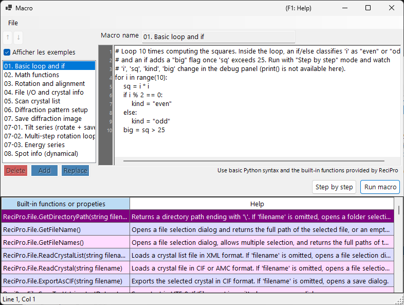

# Macro

ReciPro inclut un système de macros basé sur **IronPython** permettant d'automatiser les opérations sur les cristaux, les simulations de diffraction et les simulations d'images au moyen de scripts.



Dans la capture d'écran ci-dessus, l'option **Show samples** est activée, ce qui affiche les macros d'exemple intégrées. La liste des macros se trouve à gauche, l'éditeur de code à droite, et une table d'aide des fonctions intégrées en bas.

---

## Raccourcis clavier et souris

| Raccourci | Action |
|----------|--------|
| <kbd>F1</kbd> | Ouvrir cette page du manuel en ligne |
| <kbd>CTRL</kbd>+<kbd>S</kbd> | Enregistrer le texte de l'éditeur dans l'entrée sélectionnée de la liste des macros |
| <kbd>F10</kbd> | Avancer d'un pas (pendant l'exécution pas à pas) |
| Double-cliquer sur une ligne de la liste d'aide des fonctions | Insérer la signature de cette fonction à l'emplacement du curseur |
| Déposer un fichier `.mcr` sur la fenêtre | Le charger dans l'éditeur |

**Run**, **Step** et **Stop** sont des boutons (sans raccourci clavier).

→ Voir **[21. Raccourcis clavier et souris](../21-shortcuts.md)** pour avoir une vue d'ensemble de chaque fenêtre.

---

## Présentation

Les macros sont écrites en syntaxe Python. À l'aide des classes et fonctions intégrées de ReciPro, vous pouvez effectuer par programmation les mêmes opérations que celles disponibles via l'interface graphique.

- **Langage** : Python 3 (IronPython 3.4)
- **Stockage** : format binaire compressé dans le Registre Windows (conservé d'une session à l'autre)
- **Accès** : cliquez sur le bouton Macro dans la fenêtre principale pour ouvrir l'éditeur de macros

---

## Fenêtre de l'éditeur

L'éditeur de macros comporte quatre zones principales :

| Zone | Rôle |
|------|---------|
| **Liste des macros** (à gauche) | Macros enregistrées. `Add` ajoute une nouvelle macro, `Replace` écrase celle sélectionnée, `Delete` la supprime. Up/Down réordonnent. |
| **Champ de nom** (en haut) | Identifiant de la macro en cours d'édition. |
| **Zone de code** (à droite) | Éditeur de code Python avec gouttière de numéros de ligne, indentation automatique et fenêtre d'aide de syntaxe. |
| **Table des fonctions intégrées** (en bas) | Liste des fonctions/propriétés intégrées fournies par ReciPro, chacune accompagnée d'une description d'aide. Une référence pendant l'écriture du code. |
| **Barre d'état** (tout en bas) | Affiche la position actuelle du curseur sous la forme `Line N, Col M`. |
| **Panneau de débogage** (visible pendant l'exécution Step) | Liste les variables locales à la ligne courante. |

La barre de titre affiche **`Macro*`** (avec un astérisque) tant qu'il existe des modifications non enregistrées, et revient à **`Macro`** après Add / Replace / <kbd>CTRL</kbd>+<kbd>S</kbd>.

### Macros d'exemple

L'activation de **Show samples** (en haut à gauche) remplace temporairement votre liste de macros par les macros d'exemple intégrées (boucles et conditions de base, fonctions mathématiques, rotation/alignement, parcours de la liste des cristaux, simulation de diffraction/d'image, séries d'inclinaison/d'énergie, informations sur les réflexions, et plus encore). Les exemples sont en lecture seule et affichés dans la langue actuelle de l'interface ; utilisez-les pour apprendre ou comme point de départ à copier. En la désactivant, vos propres macros sont restaurées.

---

## Fonctionnalités d'édition

- **Indentation automatique** : lorsque vous appuyez sur <kbd>ENTER</kbd>, la ligne suivante hérite des espaces de début de la ligne courante. Si la ligne se termine par `:` (après `def`/`if`/`for`/etc.), un niveau d'indentation supplémentaire (4 espaces) est ajouté automatiquement.
- **Retour arrière intelligent** : à l'intérieur des espaces de début, <kbd>BACKSPACE</kbd> supprime un niveau d'indentation complet (4 espaces) au lieu d'un seul caractère.
- **<kbd>TAB</kbd> / <kbd>SHIFT</kbd>+<kbd>TAB</kbd>** :
  - Sans sélection : insère / supprime un niveau d'indentation à l'emplacement du curseur.
  - Sélection multiligne : indente / désindente toutes les lignes sélectionnées en une fois.
- **Autocomplétion** : pendant la saisie, une fenêtre liste les noms de fonctions et les mots-clés du langage correspondants. Les touches fléchées permettent de naviguer, <kbd>ENTER</kbd> ou <kbd>TAB</kbd> valide, <kbd>ESC</kbd> annule.
- **Aide par infobulle** : survoler une entrée d'autocomplétion sélectionnée affiche sa documentation.

### Raccourcis clavier

| Raccourci | Action |
|----------|--------|
| <kbd>CTRL</kbd>+<kbd>S</kbd> | Enregistrer le code actuel dans l'entrée de macro sélectionnée (sur place) |
| <kbd>F10</kbd> | Passer à la ligne suivante (pendant l'exécution Step) |
| <kbd>ENTER</kbd> | Insérer un saut de ligne avec indentation automatique |
| <kbd>TAB</kbd> / <kbd>SHIFT</kbd>+<kbd>TAB</kbd> | Indenter / désindenter |
| <kbd>BACKSPACE</kbd> | Supprimer un niveau d'indentation si l'on se trouve dans les espaces de début |
| <kbd>CTRL</kbd>+<kbd>↑</kbd> / <kbd>CTRL</kbd>+<kbd>↓</kbd> | Sans effet — utilisez les boutons Up/Down pour réordonner les macros |

---

## Exécution des macros

Deux modes d'exécution :

- **Run macro** : exécute le code jusqu'à la fin. En cas d'erreur, une boîte de dialogue apparaît affichant le traceback Python et la ligne fautive est mise en surbrillance dans l'éditeur.
- **Step by step** : met en pause avant chaque ligne. Le panneau de débogage affiche les variables locales. Utilisez <kbd>F10</kbd> (ou le bouton **Next step (F10)**) pour avancer, ou **Stop** pour interrompre.

**Stop** ne fonctionne qu'en mode Step (l'exécution normale de Run macro ne peut pas être interrompue car IronPython ne respecte pas `CancellationToken` et tout s'exécute sur le thread d'interface).

---

## Prise en charge du langage Python

Cet environnement de macros est **IronPython 3.4**. Toutes les fonctionnalités de Python n'ont pas de sens ici.

### Préimporté

- **`math`** est importé au démarrage. Utilisez directement `math.sqrt(x)`, `math.sin(x)`, `math.pi`, `math.radians(deg)`, etc.

### Utilisable

- Flux de contrôle : `if`/`elif`/`else`, `for`, `while`, `def`, `class`, `return`, `try`/`except`/`finally`, `pass`, `break`, `continue`, `lambda`
- Littéraux : `True`, `False`, `None`
- Fonctions intégrées : `len`, `range`, `abs`, `min`, `max`, `sum`, `sorted`, `enumerate`, `zip`, `int`, `float`, `str`, `list`, `dict`, `tuple`, `type`, `isinstance`
- Modules de la bibliothèque standard écrits en Python pur : `random`, `datetime`, `time`, `re`, `json`, `itertools`, `functools`, `collections`

Ces éléments de base sont préenregistrés dans la fenêtre d'autocomplétion, vous pouvez donc les découvrir en tapant les premières lettres.

### NON utilisable

- **`print()`** : il n'y a pas de fenêtre de console ; la sortie n'aboutit nulle part. Utilisez **Step by step** et consultez le panneau de débogage pour inspecter les valeurs.
- **`input()`** : pas d'entrée standard (stdin).
- **Entrées/sorties fichier** (`open`, `with open`) : non prévues pour les macros. Utilisez plutôt les fonctions d'aide `ReciPro.File.*`.
- **Paquets à extension C** : `numpy`, `scipy`, `pandas`, `matplotlib` — non compatibles avec IronPython.

---

## Accès à l'API

L'API de macros de ReciPro est exposée sous le nom de premier niveau **`ReciPro`**. Chaque classe intégrée est un champ de `ReciPro` :

```python
ReciPro.File.*         # File I/O helpers
ReciPro.Crystal.*      # Currently selected crystal
ReciPro.CrystalList.*  # Manage the crystal list
ReciPro.Dir.*          # Crystal orientation (Euler, zone-axis, rotation)
ReciPro.DifSim.*       # Diffraction simulator
ReciPro.HRTEM.*        # HRTEM simulation
ReciPro.STEM.*         # STEM simulation
ReciPro.Potential.*    # Potential simulation
ReciPro.Sleep(ms)      # Pause execution (milliseconds)
```

La fenêtre d'autocomplétion affiche toujours la forme complète `ReciPro.Class.Member` et l'insère telle quelle, si bien que vous avez rarement besoin de taper le préfixe à la main.

Voir [20.1. Fonctions intégrées](1-built-in-functions.md) pour la référence complète de l'API.

---

## Messages d'erreur

Lorsqu'une macro échoue, une boîte de dialogue affiche le traceback Python au format standard :

```
Traceback (most recent call last):
  File "<string>", line 5, in <module>
NameError: name 'abc' is not defined
```

L'éditeur sélectionne automatiquement la ligne signalée dans le traceback (le cadre le plus interne), de sorte que vous pouvez corriger le problème immédiatement. Les erreurs de syntaxe sont également signalées avec leurs numéros de ligne, avant le démarrage de l'exécution.

---

## Voir aussi

- [20.1. Fonctions intégrées](1-built-in-functions.md)
- [20.2. Exemples](2-examples.md)
