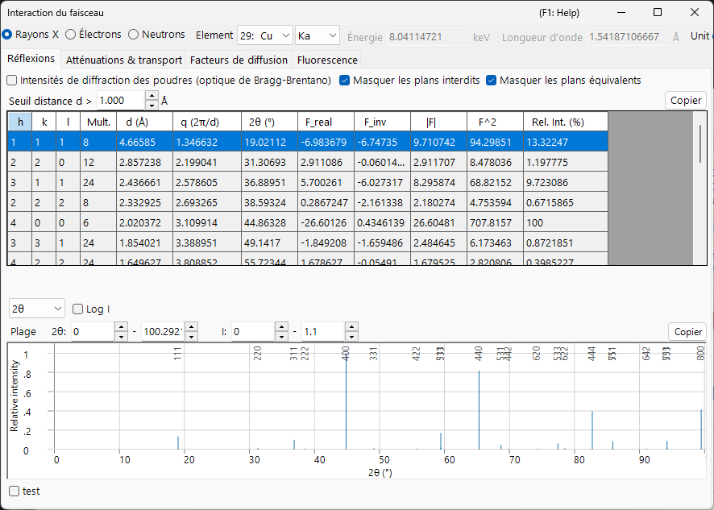
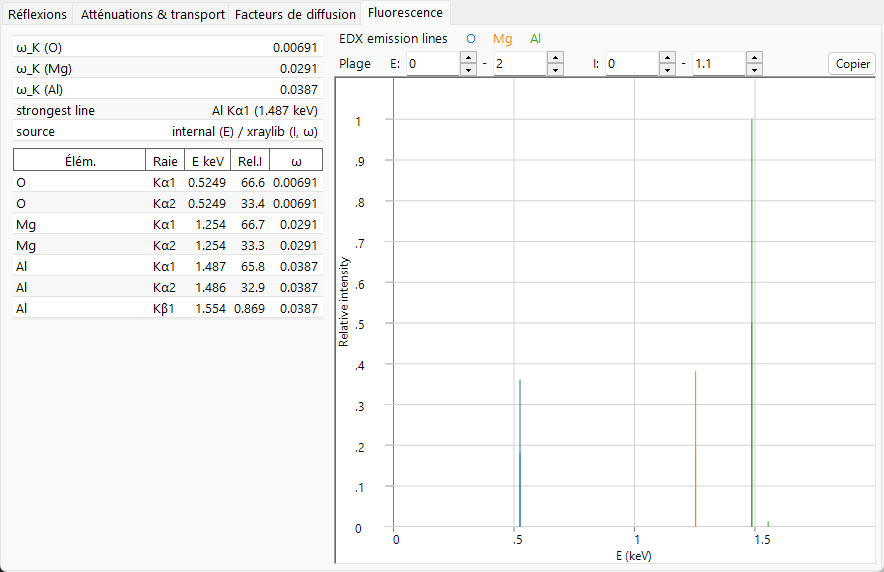

# Interaction du faisceau

L'**Interaction du faisceau** décrit comment le cristal sélectionné interagit avec un faisceau incident de **rayons X, d'électrons ou de neutrons**. Pour un rayonnement choisi, elle calcule les réflexions autorisées et leurs facteurs de structure, l'atténuation et le transport du faisceau à travers le matériau, les facteurs de diffusion atomiques de chaque élément et (pour les rayons X) les raies de fluorescence caractéristiques. Le changement du type de rayonnement en haut recalcule tout, de sorte que le même cristal peut être comparé entre les techniques de diffraction et de spectroscopie.

Le faisceau incident est sélectionné dans le bandeau en haut de la fenêtre ; les quatre onglets en dessous — **Reflections**, **Attenuations & Transport**, **Scattering factors** et **Fluorescence** — montrent les différents aspects de l'interaction. Chaque section d'onglet ci-dessous montre l'onglet sous les faisceaux **X-ray / Electron / Neutron** (utilisez les onglets dans chaque figure) ; le contenu change nettement selon le faisceau.

!!! tip "Contexte de physique du solide (Annexe A2)"
    La diffusion et la physique du solide sous-jacentes à ces quatre onglets — facteurs de diffusion atomiques, facteur de structure, atténuation et transport du faisceau, et fluorescence — sont expliquées dans **[Annexe A2. Interaction du faisceau (contexte de physique du solide)](appendix/a2-beam-interaction/index.md)**.

!!! note "Données de rayons X et bibliothèque xraylib intégrée"
    De nombreuses grandeurs de rayons X (dispersion anomale $f'/f''$, la séparation de diffusion $F(q)+S(q)$, la décomposition photo / Rayleigh / Compton de l'atténuation massique, les sauts aux seuils d'absorption et les rendements de fluorescence) sont évaluées avec la bibliothèque **[xraylib](https://github.com/tschoonj/xraylib)** intégrée. Si xraylib n'est pas disponible, ReciPro se rabat sur ses tables internes (atténuation par photoabsorption uniquement, énergies des raies caractéristiques uniquement) et les cellules concernées affichent **N/A**. La ligne **source** de chaque tableau indique quel jeu de données a été utilisé.

---

## Raccourcis clavier et souris

Cette fenêtre n'a pas de combinaisons de touches spéciales. <kbd>F1</kbd> ouvre cette page du manuel. Dans l'onglet **Scattering factors**, la ligne de curseur verticale peut être **glissée** pour lire le facteur de diffusion de chaque élément à cette position, et chaque onglet possède un bouton **Copy** qui exporte son tableau sous forme de texte collable dans un tableur.

→ Voir **[21. Raccourcis clavier et souris](21-shortcuts.md)** pour toutes les fenêtres en un coup d'œil.

---

## Faisceau et longueur d'onde {#reflections-tab}

Le bandeau supérieur est un **Wave Length Control** partagé avec les autres simulateurs.

- **X-ray / Electron / Neutron** : les facteurs de diffusion atomiques et la physique de l'interaction diffèrent selon le type de faisceau incident, ils sont donc commutés ici.
- Pour les **X-ray**, le choix de l'**Element** (matériau de l'anode) et de la raie caractéristique (Kα, etc.) fixe automatiquement la longueur d'onde de ce rayonnement X caractéristique.
- **Energy (keV)** et **Wavelength (Å)** sont liés ; le réglage de l'un met à jour l'autre, et tous deux déterminent le 2θ utilisé dans le tableau **Reflections**.
- **Unit (Å / nm)** change l'unité de longueur utilisée pour les distances d et les grandeurs similaires.

Le faisceau choisi détermine aussi quels onglets et quelles courbes ont un sens :

| Faisceau | Reflections | Attenuations & Transport | Scattering factors | Fluorescence |
|------|------|------|------|------|
| **X-ray** | facteurs de structure incl. dispersion anomale | µ/ρ, µ, transmission + seuils d'absorption (vs énergie) | $f(s)$ ou $F(q)+S(q)$ | raies caractéristiques + bâtons EDX |
| **Electron** | facteurs de structure électroniques | σ, MFP, \|dE/ds\|, IMFP, parcours (vs énergie) | Peng / Kirkland / 8-Gaussians | — (masqué) |
| **Neutron** | facteurs de structure nucléaires | longueurs de diffusion & sections efficaces (pas de courbe d'énergie) | longueurs de diffusion (pas de dépendance en *s*) | — (masqué) |

L'onglet **Fluorescence** est réservé aux rayons X et disparaît pour les faisceaux d'électrons et de neutrons. Pour les neutrons, les graphiques dépendant de l'énergie dans **Attenuations & Transport** et **Scattering factors** sont remplacés par des tableaux d'éléments, car la longueur de diffusion nucléaire ne dépend ni de l'angle de diffusion ni de l'énergie.

---

## Onglet Reflections

Liste les plans cristallins autorisés (réflexions) du cristal ainsi que le **facteur de structure** et l'intensité de diffraction de chacun. Pour les rayons X, le facteur de structure inclut désormais les termes de **dispersion anomale** $f'/f''$ à l'énergie actuelle, de sorte que `F_inv` (la partie imaginaire) est généralement non nul près d'un seuil d'absorption. La disposition est la même pour chaque faisceau ; seules les valeurs du facteur de structure et le 2θ de chaque réflexion changent.

=== "X-ray"
    

=== "Electron"
    

=== "Neutron"
    

**Options**

- **Powder Diffraction Intensities (Bragg-Brentano Optics)** : calcule l'intensité relative comme une intensité de diffraction sur poudre (Bragg–Brentano), incluant la multiplicité et le facteur de Lorentz–polarisation. Lorsqu'elle est désactivée, l'intensité du facteur de structure est affichée. L'activer force également *Hide equivalent planes* et *Hide prohibited planes*.
- **Hide equivalent planes** : regroupe les plans cristallographiquement équivalents en une seule entrée.
- **Hide prohibited planes** : exclut les plans dont l'intensité est nulle d'après les règles d'extinction.
- **d-Spacing Cutoff >** : exclut les réflexions dont la distance d est inférieure à cette valeur (l'unité de longueur suit la sélection **Unit**).

Chaque ligne correspond à une réflexion (ou à un groupe de plans équivalents par symétrie) :

| Colonne | Signification |
|------|------|
| **h, k, l** | indices de Miller |
| **Multi.** | multiplicité (nombre de plans équivalents par symétrie) |
| **d (Å)** | distance interréticulaire |
| **q (2π/d)** | norme du vecteur de diffusion |
| **2θ (°)** | angle de diffraction pour la longueur d'onde sélectionnée |
| **F_real** | partie réelle du facteur de structure |
| **F_inv** | partie imaginaire du facteur de structure (non nulle avec la dispersion anomale des rayons X) |
| **\|F\|** | amplitude du facteur de structure ($= \sqrt{F_\text{real}^2 + F_\text{inv}^2}$) |
| **F^2** | intensité du facteur de structure ($\lvert F\rvert^2$) |
| **Rel. Int. (%)** | intensité relative, la réflexion la plus forte étant fixée à 100 |

**Diagramme des pics de diffraction.** Sous le tableau, les mêmes réflexions sont tracées sous forme de motif de bâtons, les pics les plus forts étant étiquetés par leur *hkl*.

- Le sélecteur d'axe horizontal permet de choisir entre **2θ** (angle de diffusion en degrés), **d** (distance entre plans réticulaires) et **Q** ($= 4\pi\sin\theta/\lambda$, le vecteur de diffusion / transfert de quantité de mouvement). Les trois options décrivent les mêmes réflexions ; seule l'échelle horizontale change.
- **Log I** bascule l'axe d'intensité entre linéaire et logarithmique. Les intensités de diffraction s'étendent sur plusieurs ordres de grandeur, aussi une échelle logarithmique étire le bas pour révéler les pics faibles qu'une échelle linéaire aplatit contre la ligne de base.
- Les champs **Range** définissent les plages horizontale et d'intensité tracées.

---

## Onglet Attenuations & Transport

À quelle profondeur le faisceau pénètre dans le matériau et comment il perd de l'énergie. Le contenu dépend du faisceau.

=== "X-ray"
    

=== "Electron"
    

=== "Neutron"
    

### X-ray

Les boutons radio choisissent le coefficient tracé en fonction de l'énergie des photons (1–60 keV, axe logarithmique) :

- **µ/ρ** — le coefficient d'atténuation **massique** (cm²/g) : avec quelle force le matériau retire les rayons X par gramme, indépendamment de la densité de son empilement (c'est la valeur que l'on trouve dans les tables de référence). Le graphique montre la valeur **total** avec ses composantes **photo**, **Rayleigh** et **Compton**.
- **µ** — le coefficient d'atténuation **linéaire** $\mu = (\mu/\rho)\cdot\rho$ (cm⁻¹) : l'atténuation par centimètre du matériau réel à sa densité réelle. L'intensité transmise suit $I = I_0\,e^{-\mu t}$, et $1/\mu$ est la distance sur laquelle l'intensité tombe à environ 37 % (1/e).
- **T %** — la **transmission** $T = e^{-\mu t}$ en pourcentage pour l'épaisseur d'échantillon **t** réglée dans le champ **Thickness t** (µm). 100 % = transparent, 0 % = totalement bloqué ; utilisez cela pour juger d'une épaisseur d'échantillon raisonnable à l'énergie actuelle.

Les lignes verticales marquent l'énergie actuelle et les **seuils d'absorption** de chaque élément. Le tableau scalaire à gauche liste, à l'énergie actuelle : **µ/ρ (total)**, **µ (linear)**, **Attenuation length** ($1/\mu$), **HVL** (couche de demi-atténuation, $\ln 2/\mu$), **Transmission** à l'épaisseur *t*, **µ_en/ρ** (coefficient d'absorption d'énergie massique), les décréments de l'indice de réfraction des rayons X **δ** et **β** ($n = 1-\delta+i\beta$), l'angle **θc (critical)** de réflexion totale externe et la **X-ray SLD** réelle (densité de longueur de diffusion). Le tableau inférieur liste les énergies de **seuil** d'absorption **K** et **L3** ainsi que leurs rapports de **Jump** pour chaque élément.

### Electron

Le sélecteur de grandeur choisit ce qui est tracé en fonction de l'énergie du faisceau (1–30 keV) :

- **All (normalized)** — superpose les trois courbes ci-dessous, chacune remise à l'échelle de son propre maximum afin que les formes puissent être comparées sur un seul graphique (lire les valeurs absolues dans le tableau).
- **σ elastic (nm²)** — section efficace de diffusion élastique : la probabilité qu'un seul atome dévie l'électron.
- **Elastic MFP (nm)** — libre parcours moyen : la distance moyenne que l'électron parcourt entre deux événements de diffusion élastique.
- **|dE/ds| (keV/nm)** — norme du pouvoir d'arrêt : l'énergie que l'électron perd par nanomètre parcouru.
- **IMFP (nm)** — libre parcours moyen inélastique : la distance moyenne entre les collisions avec perte d'énergie.
- **Range CSDA (µm)** — la longueur totale du trajet que l'électron parcourt avant de s'arrêter.

Le tableau scalaire liste la **wavelength** de l'électron, **σ elastic**, **Elastic MFP**, **|dE/ds|**, **IMFP**, la **Plasma E** et l'énergie d'excitation moyenne **J**, deux **ranges** électroniques (l'estimation de profondeur de pénétration de Kanaya–Okayama et la longueur de trajet intégrée CSDA) et les **Z, A** moyens. Le tableau par élément donne, pour chaque élément, la fraction atomique et la section efficace élastique σ. Les sections efficaces élastiques utilisent les données **NIST Mott** (50 eV–36 keV) et se rabattent sur le **screened Rutherford** au-dessus de 36 keV.

### Neutron {#scattering-factors-tab}

L'interaction des neutrons est déterminée par les sections efficaces nucléaires plutôt que par une courbe dépendant de l'énergie, aussi cet onglet ne montre que des tableaux. Le tableau scalaire liste la longueur de diffusion cohérente moyenne **b̄**, la **Coherent SLD**, les sections efficaces moyennées cohérente / incohérente / d'absorption / totale (**σ̄_coh**, **σ̄_incoh**, **σ̄_abs**, **σ̄_total**), la section efficace totale macroscopique **Σ_total** et l'**attenuation length** correspondante. La section efficace d'absorption est évaluée avec la loi en 1/v à la longueur d'onde actuelle ; les nucléides pour lesquels cela n'est pas valide (Cd, Sm, Eu, Gd, absorbeurs résonnants) sont signalés. Le tableau par élément liste **b_coh**, **σ_coh** et la fraction atomique.

---

## Onglet Scattering factors {#fluorescence-tab}

Le facteur de diffusion atomique de chaque élément constitutif, tracé en fonction de $s = \sin\theta/\lambda$ (Å⁻¹). Chaque élément est dessiné dans sa propre couleur, et la **ligne de curseur verticale** peut être glissée pour lire le facteur de diffusion de chaque élément à cette position dans le tableau de gauche.

=== "X-ray"
    

=== "Electron"
    

=== "Neutron"
    

- **X-ray** propose deux modes **Model** : **f(s)** trace le facteur de diffusion atomique des rayons X conventionnel (en unités d'électron) ; **F(q)+S(q)** trace le facteur de forme **cohérent** Rayleigh $F(q)$ avec la fonction de diffusion **incohérente** Compton $S(q)$ (depuis xraylib). Le tableau liste aussi les termes de dispersion anomale **f'(E)** et **f''(E)** à l'énergie actuelle.
- **Electron** propose trois paramétrisations du facteur de diffusion électronique : **Peng**, **Kirkland** et **8-Gaussians**. Le tableau montre $f_e(s)$ (nm) et quel **model** l'a produit.
- Les longueurs de diffusion **Neutron** ne dépendent pas de $s$, aussi aucune courbe n'est tracée ; le tableau liste, pour chaque élément, la longueur de diffusion cohérente **b_coh** et ses sections efficaces cohérente / incohérente.
- **Debye-Waller** multiplie chaque facteur par l'amortissement thermique $e^{-B s^2}$ en utilisant le paramètre de déplacement isotrope de chaque atome.

---

## Onglet Fluorescence

Pour un faisceau de rayons X, l'émission de **fluorescence** caractéristique de l'échantillon. (Cet onglet est masqué pour les faisceaux d'électrons et de neutrons.)

Le diagramme **EDX emission lines** trace les raies caractéristiques (Kα1, Kα2, Kβ1, Lα1, Lα2, Lβ1) de chaque élément sous forme de bâtons à leurs énergies de photons, avec une hauteur proportionnelle à fraction atomique × taux radiatif × rendement de fluorescence (un aperçu qualitatif de style EDX ; la section efficace d'excitation et l'efficacité du détecteur ne sont pas modélisées). Le tableau inférieur liste, par raie, l'élément, le nom de la raie, l'énergie **E keV**, l'intensité relative **Rel.I** et le rendement de fluorescence **ω**. Le tableau scalaire indique le rendement de la couche K **ω_K** de chaque élément et la **strongest line** du spectre.

---

## Copier dans le presse-papiers

Chaque onglet possède un bouton **Copy** qui copie son tableau dans le presse-papiers sous forme de texte pouvant être collé dans un tableur tel qu'Excel.

---

## Voir aussi

- [Base de données de cristaux](1-crystal-database.md) — définition du cristal dont l'interaction est calculée.
- [Simulateur de diffraction](7-diffraction-simulator/index.md) — simulation de figures de diffraction à l'aide des facteurs de structure.
- [Annexe A2. Interaction du faisceau (contexte de physique du solide)](appendix/a2-beam-interaction/index.md) — la diffusion et la physique du solide derrière chaque onglet.
