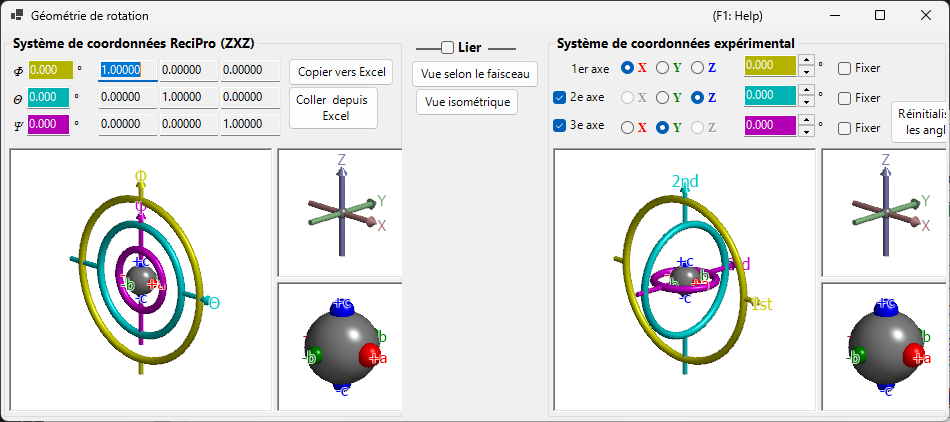

# Géométrie de rotation

Cette fenêtre représente l'état de rotation d'un cristal sous la forme d'une matrice 3×3 et effectue la conversion entre différents systèmes de coordonnées eulériens.

ReciPro utilise trois angles d'Euler — **Ψ**, **θ** et **Φ** — appliqués dans l'ordre **Z–X–Z**. Cependant, cette convention ne correspond pas nécessairement aux axes du goniomètre de votre instrument réel. La fenêtre **Géométrie de rotation** vous permet de convertir les angles d'Euler de ReciPro vers un système de coordonnées défini arbitrairement, ce qui facilite le réglage du goniomètre en laboratoire.

---

## Raccourcis clavier et souris

Les six vues 3D (les panneaux pour ReciPro et pour le goniomètre expérimental / les axes / les objets) sont **liées** — faire pivoter l'une d'elles les fait toutes pivoter ensemble. Elles partagent la [navigation de vue OpenGL](21-shortcuts.md) standard de ReciPro.

| Raccourci | Action |
|----------|--------|
| <kbd>F1</kbd> | Ouvrir cette page du manuel en ligne |
| Glisser-gauche dans une vue | Faire pivoter le modèle (les six vues pivotent ensemble) |
| Molette de la souris, ou glisser-droit vers le haut/bas | Zoomer (les grandes vues du goniomètre) |
| Glisser-milieu | Déplacer (les grandes vues du goniomètre) |
| <kbd>CTRL</kbd> + glisser-droit vers le haut/bas | Modifier la distance de la caméra (mode perspective uniquement) |
| <kbd>CTRL</kbd> + double-clic droit | Basculer entre projection orthographique et perspective |

Dans les petites vues *Axes* et *Objects*, le zoom et le déplacement sont désactivés. Il n'y a pas d'autres raccourcis clavier que <kbd>F1</kbd>.

---

## Système de coordonnées ReciPro (ZXZ)

La moitié supérieure de la fenêtre affiche l'état de rotation dans le « système de coordonnées ReciPro ».

- Les valeurs **Φ, θ, Ψ** sont synchronisées avec les angles d'Euler définis dans la Fenêtre principale.
- **Rotation matrix** affiche la matrice 3×3 correspondant à l'état de rotation actuel.

### Φ, θ, Ψ (angles d'Euler Z–X–Z)

L'orientation du cristal est paramétrée par trois rotations appliquées dans cet ordre :

1. **Φ** — première rotation autour de l'axe **Z**.
2. **θ** — rotation autour de l'axe **X** du repère tourné une fois.
3. **Ψ** — seconde rotation autour de l'axe **Z** du repère tourné deux fois.

Chaque champ numérique est éditable ; modifier une valeur ici met à jour la Fenêtre principale et chaque simulateur lié.

### Rotation matrix

La matrice 3 × 3 produite à partir des (Φ, θ, Ψ) actuels. Utilisez **Copy to Excel** / **Paste from Excel** pour transférer la matrice vers un tableur et inversement.

### Fenêtres OpenGL

La vue 3D montre la rotation actuelle à l'aide de trois tores colorés (anneaux) :

| Couleur | Angle d'Euler | Niveau du goniomètre |
|--------|------------|-----------------|
| **Jaune** | Φ | 1er axe (supérieur) |
| **Bleu clair** | θ | 2e axe (médian) |
| **Rose** | Ψ | 3e axe (inférieur) |

Les flèches **rouge**, **verte** et **bleue** représentent les axes X, Y, Z en coordonnées cartésiennes de l'espace réel. Ceux-ci ne sont *pas* identiques aux axes cristallins affichés dans la Fenêtre principale.

La sphère grise au centre représente l'échantillon ; les sphères rouge/verte/bleue montrent comment l'objet a pivoté depuis son orientation initiale (lorsque Φ = θ = Ψ = 0, elles sont alignées respectivement avec +X, +Y, +Z).

> **Note** : Faire glisser dans la fenêtre OpenGL ne modifie que la *direction de projection* de cette vue, et non l'orientation du cristal elle-même. Pour faire pivoter le cristal, utilisez la Fenêtre principale.

### Boutons

| Bouton | Action |
|--------|--------|
| Copy to Excel | Copier la matrice de rotation 3×3 au format séparé par des tabulations |
| Paste from Excel | Définir la matrice de rotation à partir du presse-papiers (3×3 séparé par des tabulations) |
| View along beam | Faire correspondre à la projection de la Fenêtre principale (axe Z perpendiculaire à l'écran) |
| Isometric | Basculer vers la projection isométrique |

---

## Système de coordonnées expérimental

La moitié inférieure définit les angles d'Euler sur un ensemble arbitraire d'axes de rotation et lit ou définit l'état du goniomètre. C'est ce qu'on appelle le **système de coordonnées expérimental**.

### 1er, 2e, 3e axes

Sélectionnez les axes de rotation du goniomètre parmi **±X**, **±Y** et **±Z** pour chaque niveau (supérieur, médian, inférieur). La représentation graphique se met à jour en conséquence.

Les angles d'Euler de chaque axe sont affichés dans les champs de texte colorés correspondants (jaune, bleu clair, rose). Vous pouvez également saisir les valeurs directement.

---

## Link

Lorsque **Link** est coché, le système de coordonnées ReciPro et le système de coordonnées expérimental sont couplés : leurs angles d'Euler sont ajustés de sorte que l'orientation de l'objet reste cohérente entre les deux systèmes.

### Exemple de procédure

1. En laboratoire, réglez un goniomètre de sorte que l'axe *a* d'un cristal soit aligné avec la direction d'incidence des rayons X et que l'axe *b* soit horizontal.
2. Saisissez les angles d'Euler du goniomètre de laboratoire dans le système de coordonnées expérimental.
3. Dans la Fenêtre principale, faites pivoter le cristal de sorte que l'axe *a* pointe vers la normale à l'écran et que l'axe *b* soit horizontal.
4. Cochez **Link** — désormais, chaque fois que vous orientez le cristal vers une orientation différente dans la Fenêtre principale, les angles de goniomètre requis sont automatiquement affichés.

---

## Voir aussi

- [Fenêtre principale](0-main-window.md)
- [Stéréonet](6-stereonet.md)
- [Système de coordonnées de base et orientation du cristal](appendix/a1-coordinate-system/1-orientation.md)
- [Raccourcis clavier et souris](21-shortcuts.md)
