# Visualiseur de structure

Le **Visualiseur de structure** dessine la structure du cristal sélectionné sous forme d'image tridimensionnelle à l'aide d'OpenGL.

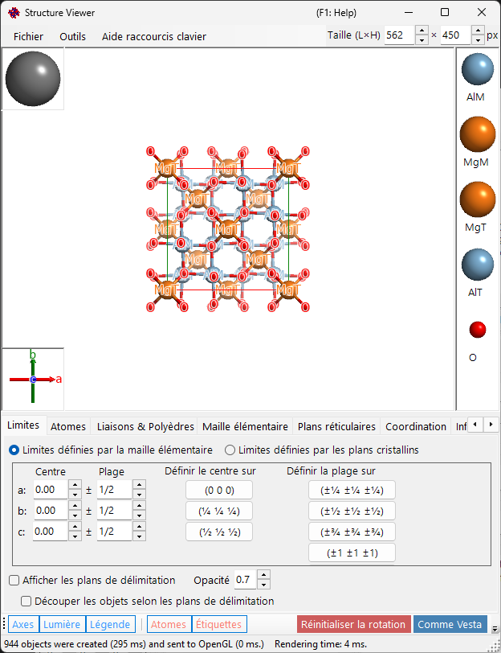

---

## Raccourcis clavier et souris

La fenêtre comporte une grande vue 3D ainsi que deux petits gizmos — la boîte des **axes cristallins** (en bas à gauche) et la boîte de **direction de la lumière** (en haut à gauche) — et chacun réagit différemment à un glisser avec le bouton gauche. La vue principale utilise la [navigation de vue OpenGL](21-shortcuts.md) standard de ReciPro.

| Raccourci | Action |
|----------|--------|
| <kbd>F1</kbd> | Ouvrir cette page du manuel en ligne |
| <kbd>CTRL</kbd>+<kbd>SHIFT</kbd>+<kbd>C</kbd> | Copier l'image rendue dans le presse-papiers |
| Glisser-gauche dans la vue principale | Faire pivoter le modèle |
| Double-clic gauche sur un atome | Afficher ses coordonnées, ses distances aux plus proches voisins et ses angles de liaison |
| Glisser-droite vers le haut/bas, ou molette de la souris | Zoomer |
| Glisser-milieu | Déplacer |
| <kbd>CTRL</kbd> + glisser-droite vers le haut/bas | Modifier la distance de la caméra (mode perspective uniquement) |
| <kbd>CTRL</kbd> + double-clic droit | Basculer entre la projection orthographique et perspective |
| Glisser-gauche sur le gizmo des **axes cristallins** | Faire pivoter le modèle (sans rotation dans le plan) |
| Glisser-gauche sur le gizmo de **lumière** | Modifier la direction de l'éclairage |

Les raccourcis <kbd>CTRL</kbd>+<kbd>SHIFT</kbd> valables dans toute l'application, issus de la [fenêtre principale](0-main-window.md#keyboard-mouse-shortcuts), fonctionnent également lorsque cette fenêtre a le focus.

→ Consultez **[21. Raccourcis clavier et souris](21-shortcuts.md)** pour un aperçu de toutes les fenêtres.

---

## Zone principale

Structure cristalline 3D avec source de lumière, axes cristallins et légende des atomes.
> La boîte **Size (W×H)** en haut à droite de la fenêtre définit la taille en pixels utilisée lors de l'enregistrement ou de la copie de l'image rendue.

---

## Barre de menus

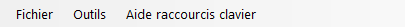

### Menu Fichier

Enregistrer l'image, copier dans le presse-papiers (Ctrl+Shift+C), enregistrer le film (MP4).

**Enregistrer le film** ouvre la boîte de dialogue de réglage du film ci-dessous : définissez la vitesse de rotation, la durée d'enregistrement et la direction (projection actuelle, un indice de direction ou un plan réticulaire), le codec (H.264 / H.265) et la vitesse d'encodage, puis appuyez sur **OK** pour générer un fichier MP4.

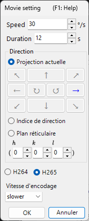

### Menu Outils

---

## Menu des onglets

### Limites définies par la maille

Spécifie la plage de dessin du cristal. Il existe deux modes, commutés à l'aide des boutons radio en haut.

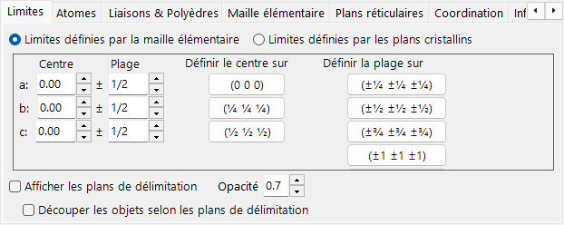

Dans ce mode, les axes *a*, *b*, *c* de la maille sont l'unité de la plage de dessin.

- **Center** : coordonnée fractionnaire centrale du volume de dessin.
- **Range** : limite supérieure/inférieure pour chacun des axes *a*, *b*, *c*.
- Les **boutons prédéfinis** à droite fournissent des valeurs fréquemment utilisées (par exemple, maille 1×1×1, maille 2×2×2).

### Limites définies par les plans cristallins

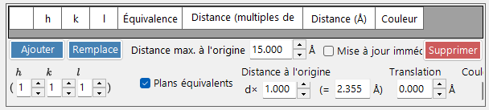

Dans ce mode, la zone de dessin est délimitée par un ensemble de plans cristallins. Si les plans ne définissent pas une région spatialement fermée, ReciPro revient automatiquement à une limite d'une seule maille.

#### Liste des limites

Tous les plans limites enregistrés pour le cristal actuel. Utilisez **Add / Replace / Delete** pour manipuler la liste ; la case à cocher la plus à gauche désactive temporairement un plan sans le supprimer.

> Pour enregistrer les modifications de façon permanente, vous devez également appuyer sur **Add** ou **Replace** dans la **Fenêtre principale**. Sinon, les modifications sont perdues la prochaine fois que vous changez la sélection dans la liste principale des cristaux.

#### Indices H k l

Définit le plan limite par son indice de Miller. La case à cocher inclut les plans cristallographiquement équivalents générés à partir du (*hkl*) sélectionné.

#### Distance par rapport à l'origine

La distance entre le centre du cristal et le plan limite. L'unité peut être choisie entre **d** et **Å**. Avec **d**, la distance correspond à la valeur saisie multipliée par la distance interréticulaire (*d*) du (*hkl*) sélectionné. Avec **Å**, la valeur est la distance absolue. Modifier l'une met automatiquement l'autre à jour.

#### Afficher les plans limites / Opacité

Affiche ou masque les plans limites eux-mêmes. Lorsqu'ils sont affichés, **Opacity** définit la transparence (0 = transparent, 1 = opaque).

#### Découper les objets selon les plans limites

Si cette option est cochée, seule la région intérieure définie par les limites est rendue ; les atomes, liaisons et polyèdres qui coupent les limites sont découpés.

#### Masquer les atomes

Si cette option est cochée, tous les atomes, liaisons et polyèdres sont masqués — utile lorsque seuls la maille ou les plans réticulaires doivent être visualisés.

### Atomes

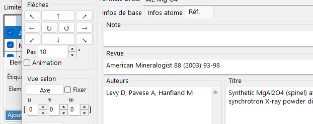

Coordonnées, élément, taux d'occupation, rayon, couleur, matériau. **Apply to same elements**.

#### Liste des atomes

La liste des atomes du cristal. Utilisez **Add / Replace / Delete** pour manipuler la liste ; la case à cocher la plus à gauche masque temporairement un atome.

> Pour enregistrer les modifications de façon permanente, cliquez également sur **Add** ou **Replace** dans la **Fenêtre principale**.

#### Élément et position

- **Label** : étiquette en texte libre pour l'atome (utilisée dans les légendes et les info-bulles).
- **Element** : élément chimique / état d'ionisation.
- **X, Y, Z** : coordonnées fractionnaires. Nombres réels entre 0 et 1, ou fractions telles que `1/2` ou `2/3`.
- **Occ** : taux d'occupation, un nombre réel entre 0 et 1.

#### Décalage de l'origine

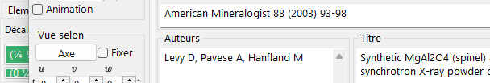

Décale chaque atome du même décalage fractionnaire. Appuyez sur un bouton prédéfini (par exemple, pour échanger le choix d'origine 1 / 2 pour le même groupe d'espace), ou saisissez un décalage personnalisé (Δx, Δy, Δz) et appuyez sur **Apply custom shift**.

#### Apparence

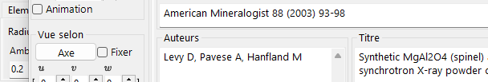

Rayon, couleur et matériau par atome.

- **Radius** : rayon atomique dessiné.
- **Atom color** : couleur de surface.
- **Material** : propriétés de texture / matériau utilisées par le shader OpenGL.
- **Apply to same elements** : applique le rayon et la couleur actuels à tous les atomes de la même espèce d'élément.

### Liaisons et polyèdres

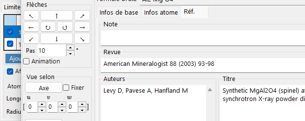

Seuils de longueur de liaison, affichage des polyèdres, arêtes.

#### Liste des liaisons

Toutes les règles de liaison/polyèdre enregistrées pour le cristal. Utilisez **Add / Replace / Delete** ; la case à cocher la plus à gauche désactive temporairement une entrée. Comme pour les atomes et les limites, **Add** / **Replace** dans la **Fenêtre principale** est requis pour rendre la modification permanente.

#### Propriété de liaison

- **Bonding Atom (center)** : espèce d'élément utilisée comme atome central de la liaison / du polyèdre.
- **Bonding Atom (vertex)** : espèce d'élément utilisée comme sommet (l'autre extrémité).
- **Length between … and …** : seuils de distance inférieur et supérieur. Les paires d'atomes en dehors de cette plage ne sont pas dessinées.
- **Bond Radius** : épaisseur de liaison dessinée (rayon du cylindre).
- **Alpha** : transparence de la liaison (0 = transparent, 1 = opaque).

#### Propriété de polyèdre

- **Show Polyhedron** : lorsqu'elle est cochée, le polyèdre défini par la liaison actuelle est dessiné (uniquement si l'ensemble centre/sommet est géométriquement valide).
- **Inner Bonds** : affiche/masque les liaisons à l'intérieur du polyèdre.
- **Center Atom** : affiche/masque l'atome central.
- **Vertex Atoms** : affiche/masque les atomes sommets.
- **Color** / **Alpha** : couleur de face et transparence.
- **Show Edge** : dessine les arêtes reliant les sommets.
- **Edge Color** / **Width** : couleur et épaisseur de ligne des arêtes.

### Maille

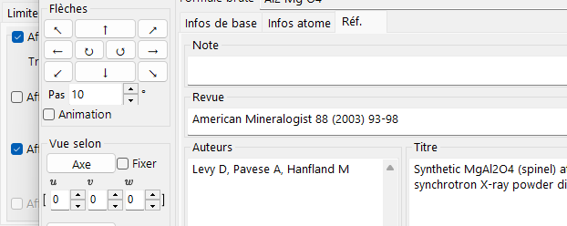

Translation, plans de la maille, arêtes.

#### Translation

Chaque groupe d'espace possède une origine par défaut. Pour éloigner le centre de la maille dessinée de cette origine, réglez la translation le long de *a*, *b*, *c*.

#### Afficher le plan de la maille

Indique si les six faces qui délimitent la maille sont dessinées. Lorsque cette option est activée, vous pouvez régler la couleur des faces et leur transparence.

#### Afficher les arêtes

Indique si les arêtes de la maille sont dessinées. La couleur des arêtes est configurable.

### Plans réticulaires

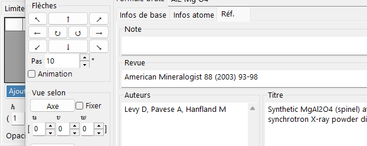

Spécification de l'indice de Miller avec les équivalents cristallographiques.

#### Indices H k l

Spécifie le plan réticulaire par son indice de Miller. La case à cocher inclut éventuellement les plans cristallographiquement équivalents générés à partir de (*hkl*).

#### Translation

Translate le plan réticulaire dessiné d'un multiple entier de sa distance interréticulaire (*d*) — utile pour visualiser les plans successifs d'une même famille.

### Coordination

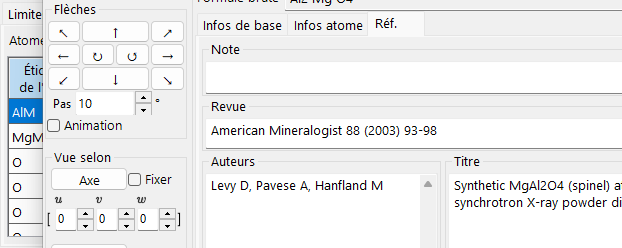

Tableau et graphe de coordination autour de l'atome cible.

#### Tableau (côté gauche)

Liste les atomes qui entourent l'atome cible sélectionné et à quelle distance. L'atome cible est sélectionné dans la liste déroulante au-dessus du tableau.

#### Graphe (côté droit)

Histogramme du nombre de voisins en fonction de la distance, dérivé des mêmes données que le tableau. Ajustez **Bar width** jusqu'à ce que les barres séparent nettement les couches de coordination — cela donne une estimation visuelle du nombre de coordination.

### Information

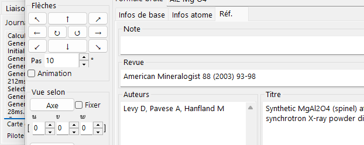

Journal de rendu (temps d'image, informations GPU) et informations de base sur l'atome sélectionné. En cours de construction — les champs peuvent s'enrichir au fil du temps.

### Projection

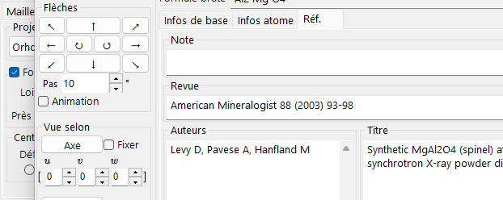

Mode de projection (orthographique/perspective), atténuation en profondeur, qualité de rendu, mode de transparence.

#### Projection

- **Orthographic** : projection parallèle parfaite (point de vue à l'infini).
- **Perspective** : projection perspective depuis la distance du point de vue définie par le curseur.

#### Atténuation en profondeur

Atténue les objets éloignés dans la direction de la profondeur. Les objets plus éloignés que **Far** sont entièrement transparents ; les objets plus proches que **Near** sont entièrement opaques ; les objets intermédiaires sont interpolés linéairement.

#### Centre de projection

Définit le centre de projection sur les coordonnées spécifiées. Activez **Custom** pour saisir des coordonnées arbitraires.

#### Qualité de rendu

Qualité de dessin (subdivision du maillage, anticrénelage). Une qualité supérieure est plus lente — choisissez le réglage adapté à votre GPU.

#### Mode de transparence

Algorithme utilisé pour les atomes et polyèdres translucides.

- **Approximate** : rapide mais peut être imprécis lorsque de nombreux objets translucides se chevauchent.
- **Perfect** : transparence indépendante de l'ordre — précise mais très lente, nécessite en pratique un GPU dédié.

### Éléments de symétrie

L'onglet **Symmetry Elements** dessine les opérateurs de symétrie du groupe d'espace directement sur le modèle 3D (à basculer avec le bouton **Symmetry Elements** de la barre d'outils). Chaque classe d'éléments peut être affichée/masquée indépendamment :

- **Axes de rotation** et **axes hélicoïdaux**
- **Plans miroirs** et **plans de glissement**
- **Centres d'inversion** et **axes de rotoinversion**

Pour chaque classe, vous pouvez ajuster la taille du symbole, l'épaisseur de ligne et la couleur.

### Divers

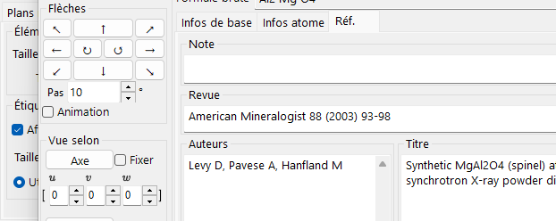

- **Accessory controls** : définit les tailles d'affichage (boule de lumière, axes, légende). **Group by element** active/désactive l'affichage de la légende.
- **Bonded atoms** : **Show bonded atoms even if they are outside the boundaries** continue de dessiner les atomes liés à des atomes situés à l'intérieur de la plage de dessin, même lorsqu'ils tombent en dehors de celle-ci.
- **Label** : définit la taille de police, la couleur et d'autres propriétés des étiquettes des atomes.

---

## Barre d'outils

| Bouton | Description |
|--------|-------------|
| Axes | Afficher l'orientation des axes (taille = constante de réseau) |
| Light | Régler la direction de la lumière |
| Legend | Légende des atomes |
| Atoms | Basculer les objets atomes |
| Labels | Basculer les étiquettes des atomes |
| Unit Cell | Basculer les arêtes de la maille |
| Sym. Elems. | Basculer la superposition des éléments de symétrie (voir ci-dessus) |
| Reset Rotation | Revenir à l'orientation initiale |
| Like Vesta | Apparence de style Vesta |

---

## Voir aussi

- [Fenêtre principale](0-main-window.md)
- [Base de données de cristaux](1-crystal-database.md)
- [Informations de symétrie](2-symmetry-information.md)
- [Simulateur de diffraction](7-diffraction-simulator/index.md)
- [Raccourcis clavier et souris](21-shortcuts.md)
