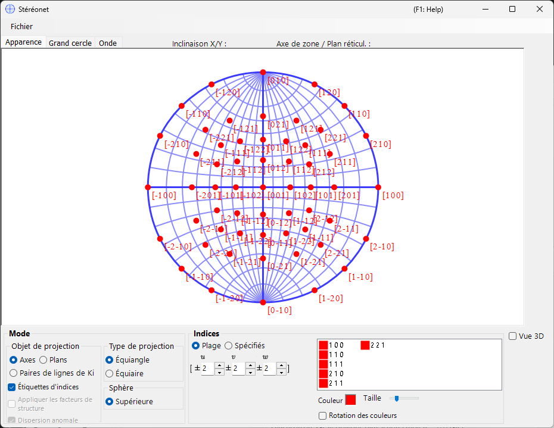
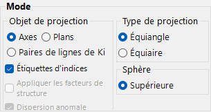
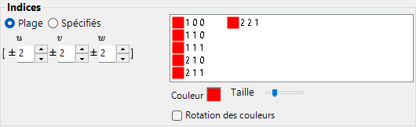
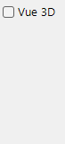
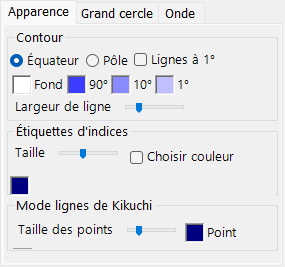
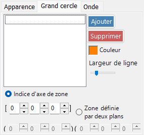
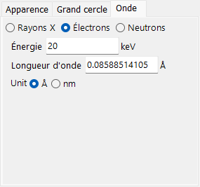

# Stéréonet

Le **Stéréonet** affiche les plans cristallins et les directions des axes à l'aide de la projection stéréographique.

---

## Raccourcis clavier et souris

Le stéréonet lui-même est une projection 2-D ; une sphère 3-D facultative peut être affichée avec **3D display**.

| Raccourci | Action |
|----------|--------|
| <kbd>F1</kbd> | Ouvrir cette page du manuel en ligne |
| Glisser-gauche près du centre | Incliner le cristal |
| Glisser-gauche dans la zone extérieure | Faire tourner le cristal autour de l'axe de visée |
| Double-clic gauche | Basculer entre la projection **Plane** et **Axis** |
| Clic droit | Dézoomer |
| Glisser-droit d'un cadre | Zoomer sur la région sélectionnée |
| Glisser-milieu | Déplacer |
| Déplacer la souris (sans bouton) | Lire les (hkl)/[uvw] sous le curseur — utile pour indexer une tache mesurée |

Le glissement sur le net fait tourner le **cristal** ; l'état de rotation est partagé entre toutes les fenêtres.

Le rendu 3-D utilise la [navigation de vue OpenGL](21-shortcuts.md) standard de ReciPro (glisser-gauche pour tourner, glisser-droit / molette pour zoomer, <kbd>CTRL</kbd> + double-clic droit bascule la projection) et ne fait tourner que la vue 3-D, pas le cristal lui-même.

Les raccourcis <kbd>CTRL</kbd>+<kbd>SHIFT</kbd> valables dans toute l'application, issus de la [fenêtre principale](0-main-window.md#keyboard-mouse-shortcuts), fonctionnent également lorsque cette fenêtre a le focus.

→ Voir **[21. Raccourcis clavier et souris](21-shortcuts.md)** pour un aperçu de chaque fenêtre.

---

## Zone principale

La projection stéréonet des plans cristallins, des indices de direction et des lignes de Kikuchi du cristal sélectionné est affichée.

---

## Menu Fichier

Enregistrer ou copier au format raster ou vectoriel. Le format vectoriel permet d'éditer la police/l'épaisseur des traits dans PowerPoint ou d'autres éditeurs vectoriels.

---

## Mode

### Cible de projection

Sélectionnez ce qui doit être projeté sur le net.

- **Axes** — projette les indices de direction \([uvw]\).
- **Planes** — projette les normales aux plans cristallins \((hkl)\).
- **Kikuchi line pairs** — projette les paires de lignes de Kikuchi.

### Méthode de projection

| Méthode | Description |
|--------|-------------|
| **Wulff** (équiangulaire / stéréographique) | Conserve la relation angulaire entre les éléments projetés, mais pas l'angle solide. Utilisée par les cristallographes classiques pour lire les angles entre axes ou entre plans. |
| **Schmidt** (équivalente / Lambert) | Conserve l'angle solide (l'aire) de chaque région, mais déforme les angles. Préférée pour les figures de pôles statistiques où la densité relative importe. |

### Hémisphère

Choisissez l'hémisphère **Upper** ou **Lower** comme source de projection — cela détermine si la face visible de la sphère est celle la plus proche ou la plus éloignée de l'observateur.

### Options d'affichage

- Afficher les étiquettes d'indices.
- Lorsque **Planes** ou **Kikuchi line pairs** est sélectionné, pondérer chaque point ou ligne par le facteur de structure \(|F_{hkl}|\) (définir la source d'onde et la longueur d'onde dans l'[onglet Wave](#wave)).

> Pour les cristaux trigonaux/hexagonaux, la notation Miller–Bravais (4 indices) peut être activée via **Option ▸ Use Miller-Bravais (hkil) index** dans la fenêtre principale.

---

## Indices

Définit quels plans cristallins / axes sont tracés.

### Mode plage

Spécifiez une plage d'indices \([uvw]\) ou \((hkl)\). ReciPro énumère chaque indice à l'intérieur des limites et projette chacun d'eux.

### Mode spécifié

Spécifie individuellement des axes ou des plans particuliers. Saisissez un indice, appuyez sur **Add** pour l'enregistrer, ou sur **Remove** pour le supprimer. Lorsque **include equivalent indices** est coché, tous les indices cristallographiquement équivalents sont également tracés.

### Colour / Size

Définissez la **colour** et la **size** des points tracés. Cochez **Change colour automatically** pour coder par couleur différemment chaque ensemble d'axes/plans équivalents — utile pour distinguer les familles sur un tracé multi-indices.

---

## 3D Options

Contrôle la superposition du net 3D (sphère) — opacité de la sphère, indicateurs d'axes, etc.

---

## Menu des onglets

### Appearance

#### Outline

Manière dont le contour du stéréonet est tracé — le cercle de délimitation et la grille facultative latitude/longitude en grands cercles. Choisissez **Equator** ou **Pole**, activez **1° Lines** et le remplissage **Background**, définissez les couleurs de grille **90° / 10° / 1°** et ajustez la **Line width** avec le curseur.

#### Index labels

- **Size** — taille des étiquettes d'indices.
- **Specify color** — utilise une seule couleur fixe pour toutes les étiquettes d'indices au lieu de la couleur propre à chaque point ; utile lorsque les points sont codés par couleur mais que vous souhaitez toutes les étiquettes dans une même couleur pour une meilleure lisibilité.
- **Delimiter** — caractère placé entre les indices de chaque étiquette : **None** (p. ex. 100), **Space** (1 0 0) ou **Comma** (1,0,0).

#### Kikuchi line mode

- **Point size** — taille des points tracés.
- **Point** / **Label** — couleurs des points et de leurs étiquettes.

### Great and Small Circle

Tracez des grands cercles et des petits cercles. Spécifiez-les soit par **zone-axis index** \([uvw]\) (le grand cercle formé par la zone de cet axe), soit par **two crystal-plane indices** qui partagent l'axe de zone. L'épaisseur des traits des cercles est également configurable au moyen d'un curseur.

### Wave {#wave}

Disponible uniquement lorsque **Planes** ou **Kikuchi line pairs** est sélectionné comme cible de projection. Définit la source d'onde (X-ray / electron / neutron) ainsi que la longueur d'onde ou l'énergie nécessaires au calcul des facteurs de structure cristalline utilisés pour l'option **structure-factor weighting** dans [Mode](#mode).

---

## Voir aussi

- [Fenêtre principale](0-main-window.md)
- [Géométrie de rotation](4-rotation-geometry.md)
- [Visualiseur de structure](5-structure-viewer.md)
- [Simulateur de diffraction](7-diffraction-simulator/index.md)
- [Système de coordonnées de base et orientation du cristal](appendix/a1-coordinate-system/1-orientation.md)
