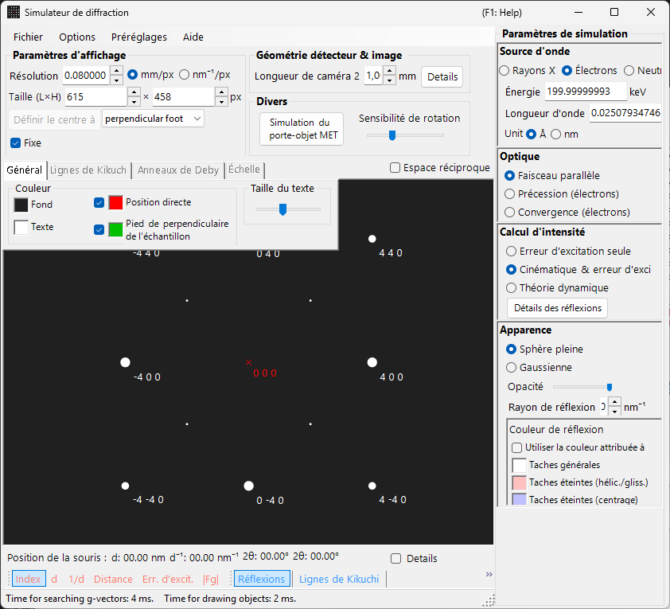

# Simulation SAED (Selected Area Electron Diffraction)

La simulation **SAED (Selected Area Electron Diffraction)** calcule les diagrammes de diffraction électronique de monocristal produits par un faisceau d'électrons parallèle. Il s'agit du mode par défaut du [simulateur de diffraction](index.md).

> Cette page répertorie chaque réglage qui apparaît dans le panneau **Spot property** à droite lorsque vous choisissez **Wave Length = Electron** et **Incident beam mode = Parallel**. Pour les opérations à l'échelle de la fenêtre, telles que le dessin et l'enregistrement, voir la [page de vue d'ensemble](index.md).

Conditions de l'interface : Wave Length = Electron, Incident beam mode = Parallel, Intensity calculation = Only excitation error / Kinematical / Dynamical.

---

## Vue d'ensemble

Simule le diagramme de diffraction produit lorsqu'un faisceau d'électrons parallèle traverse un échantillon mince. Les positions des taches sont fixées par la relation géométrique entre la sphère d'Ewald et les points du réseau réciproque, et la brillance de chaque tache est calculée selon le mode de calcul d'intensité sélectionné.

---

## Wave Length

Réglez la source de rayonnement sur **Electron**. Saisissez l'énergie (keV) ou la longueur d'onde (nm), et la longueur d'onde corrigée relativistement est calculée. Pour les sources de rayons X et de neutrons, voir [Simulation de diffraction des rayons X](4-x-ray-neutron-diffraction.md).

---

## Incident beam mode

Réglez la géométrie du faisceau incident sur **Parallel**. Il s'agit de la géométrie d'onde plane standard utilisée pour la SAED et la diffraction des rayons X.

> **Note** : Pour les électrons, vous pouvez choisir **Parallel / Precession (electron = PED) / Convergence (CBED)**. Le choix de **Precession** donne une [simulation PED](2-ped-simulation.md), et le choix de **Convergence** donne une [simulation CBED](3-cbed-simulation.md) ; dans les deux cas, le calcul d'intensité passe automatiquement à Dynamical.

---

## Intensity calculation

Détermine la manière dont les intensités des taches sont calculées.

### Erreur d'excitation seule

L'intensité est déterminée uniquement à partir de la distance géométrique entre la sphère d'Ewald et le point du réseau réciproque (l'erreur d'excitation $s_g$). Plus $\lvert s_g \rvert$ est petit, plus l'intensité est élevée ; elle atteint son maximum à la valeur définie par **Radius** et tombe à zéro lorsque $\lvert s_g \rvert$ dépasse le rayon. Comme le facteur de structure du cristal est ignoré, c'est le mode le plus rapide et il convient pour vérifier les positions des taches de diffraction.

### Cinématique

En plus de l'erreur d'excitation, le facteur de structure cinématique $\lvert F_{hkl} \rvert^2$ est intégré dans l'intensité. Les règles d'extinction sont correctement reflétées, ce qui rend ce mode adapté aux échantillons minces ou à la diffraction faible.

### Dynamique (méthode des ondes de Bloch, électron uniquement)

Un calcul dynamique rigoureux par la méthode des ondes de Bloch (méthode de Bethe). Il reproduit la diffusion multiple et la variation de l'intensité dépendante de l'épaisseur, et il est requis pour les échantillons épais ou la diffraction forte. Disponible uniquement lorsque Electron est sélectionné. Pour la théorie, voir [Annexe A3. Méthode des ondes de Bloch](../appendix/a3-bloch-wave/calculation.md).

> **Note** : Lorsque **Dynamical** est sélectionné, un panneau **Bloch wave settings** apparaît en dessous.

---

## Bloch wave settings (théorie dynamique)

Actif uniquement lorsque **Intensity calculation = Dynamical**.

| Paramètre | Description |
|-----------|-------------|
| **Number of diffracted waves** | Nombre d'ondes de Bloch incluses dans le problème aux valeurs propres. Des valeurs plus grandes donnent des intensités plus précises mais augmentent le temps de calcul en $O(N^3)$ |
| **Thickness** | Épaisseur de l'échantillon (nm) utilisée dans le calcul dynamique |

---

## Spot appearance

Contrôle la manière dont chaque tache de diffraction est rendue.

- **Solid sphere / Gaussian** : le modèle géométrique du point du réseau réciproque. **Solid sphere** dessine la section transversale (un cercle) entre une sphère de rayon $R$ et la sphère d'Ewald, l'aire du cercle correspondant à l'intensité de diffraction ; **Gaussian** dessine la section transversale (une gaussienne 2-D) d'une gaussienne 3-D avec $\sigma = R$, dont l'intégrale correspond à l'intensité de diffraction.
- **Opacity** : transparence de la tache (0 = transparente, 1 = opaque).
- **Radius (R)** : rayon virtuel du point du réseau réciproque. La taille de la tache est fixée par la combinaison du mode **Appearance** et de l'**Intensity calculation** (par exemple, Solid sphere + Dynamical donne un rayon proportionnel à $I_\text{dyn}^{1/2}$).
- **Brightness** : actif uniquement en mode **Gaussian**. Intensité intégrée de la gaussienne rendue.
- **Color scale** : **Gray scale** ou **Cold-warm**.
- **Log scale** : afficher les intensités sur une échelle logarithmique. Utile pour les diagrammes présentant un grand contraste d'intensité.
- **Spot color** : couleur de la tache utilisée lorsque l'échelle de couleurs n'est pas employée.
- **Use crystal color** : lorsque cette option est cochée, les taches sont dessinées dans la couleur attribuée à chaque cristal.

---

## Spot labels

Les étiquettes superposées aux taches sont sélectionnées dans la [barre d'outils](index.md#toolbar).

| Label | Contenu |
|-------|---------|
| **Index** | indices de Miller $(hkl)$ |
| **d** | distance interréticulaire $d$ |
| **Distance** | distance de tache à tache sur le détecteur |
| **Excit. Err.** | erreur d'excitation $s_g$ |
| **\|Fg\|** | valeur absolue du facteur de structure $\lvert F_{hkl} \rvert$ |

---

## Opérations communes

Les informations sur le détecteur, le retournement, l'affichage de l'espace réciproque, les lignes de Kikuchi, les anneaux de Debye, les lignes d'échelle, les réglages de couleur, l'enregistrement, et autres sont communs à tous les modes. Voir la [page de vue d'ensemble](index.md). Les détails par réflexion obtenus à partir du calcul dynamique peuvent être consultés dans les [informations sur les taches de diffraction](index.md#diffraction-spot-information).

---

## Voir aussi

- [Simulateur de diffraction (vue d'ensemble)](index.md)
- [Calcul SAED en faisceau parallèle](../appendix/a3-bloch-wave/calculation.md#parallel-beam-saed)
- [Simulation de diffraction des rayons X](4-x-ray-neutron-diffraction.md)
- [Simulation de diffraction électronique en précession (PED)](2-ped-simulation.md)
- [Définition du système de coordonnées](../appendix/a1-coordinate-system/1-orientation.md)
