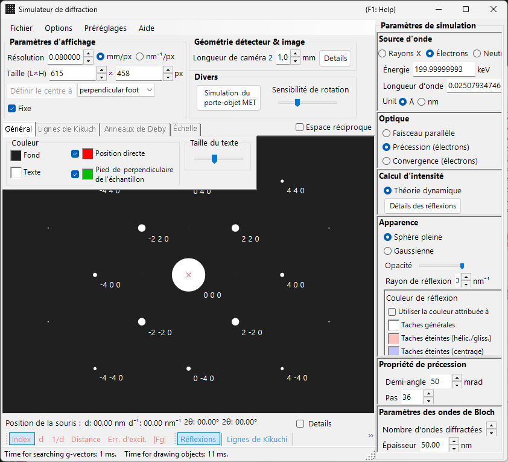
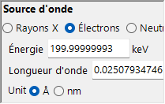
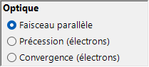
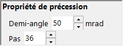
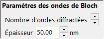
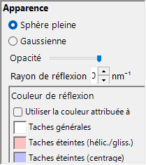

# Simulation de la diffraction électronique en précession (PED)

La simulation **PED (Precession Electron Diffraction)** calcule les clichés de diffraction électronique obtenus en faisant précesser le faisceau incident sur un cône autour de l'axe optique.

> Cette page recense tous les paramètres qui apparaissent sur le côté droit lorsque vous sélectionnez **Wave = Electron beam, Incident beam = Precession (electron), Intensity = Dynamical (automatic)**. Notez que **la sélection de Precession (electron) pour le faisceau incident bascule automatiquement le calcul d'intensité sur Dynamical**. Pour les opérations à l'échelle de la fenêtre, telles que le dessin et l'enregistrement, consultez la [page de présentation](index.md).

Conditions GUI : **Wave = Electron beam, Incident beam = Precession (electron), Intensity = Dynamical (automatic)**

---

## Présentation

En PED, le faisceau électronique est mis en précession sur un cône autour de l'axe optique, et les clichés de diffraction obtenus pour chaque direction de faisceau sur le cône de précession sont intégrés. Par rapport à la SAED conventionnelle, cela offre les avantages suivants :

- Les effets dynamiques sont moyennés, ce qui donne des données d'intensité proches des rapports d'intensité cinématiques
- Les réflexions des zones de Laue d'ordre supérieur (HOLZ) sont observées plus clairement
- Des données d'intensité adaptées à l'analyse structurale peuvent être obtenues

---

## Réglage de la longueur d'onde

Puisque la PED est une diffraction électronique, sélectionnez **Electron beam** comme source. La saisie de l'énergie des électrons (keV) ou de la longueur d'onde (nm) calcule la longueur d'onde corrigée relativiste.

---

## Faisceau incident

Pour la géométrie du faisceau incident, sélectionnez **Precession (electron)** (disponible uniquement lorsque le faisceau électronique est sélectionné).

> **Note** : La sélection de **Precession (electron)** **bascule automatiquement le calcul d'intensité sur Dynamical**, et le panneau de réglages de la méthode des ondes de Bloch ainsi que le panneau de réglages de la précession apparaissent. **Only excitation error** / **Kinematical** ne peuvent plus être sélectionnés.

---

## Réglages de la précession

Définissez la forme et l'échantillonnage du cône de précession.

| Paramètre | Description | Recommandé |
|-----------|-------------|-------------|
| **Semi-angle** | Demi-angle du cône de précession (mrad) | 10–40 mrad |
| **Step** | Nombre de directions de faisceau parallèle échantillonnées sur le cône de précession. Des valeurs plus grandes donnent une intégration plus lisse mais augmentent linéairement le temps de calcul | 36–72 |

---

## Calcul d'intensité et réglages des ondes de Bloch

Dès que **Precession (electron)** est sélectionné, **Intensity = Dynamical (automatic)** est fixé. Pour le faisceau parallèle dans chaque direction de précession, l'intensité de diffraction est calculée par la méthode des ondes de Bloch (calcul dynamique), et l'intégration sur toutes les directions donne le cliché PED.

| Paramètre | Description | Recommandé |
|-----------|-------------|-------------|
| **No. of diffracted waves** | Nombre d'ondes de Bloch incluses dans le problème aux valeurs propres. Des valeurs plus grandes donnent des intensités plus précises, mais le temps de calcul croît en $O(N^3)$ | 50–200 |
| **Thickness** | Épaisseur de l'échantillon utilisée dans le calcul dynamique (nm) | — |

Le coût de calcul correspond à peu près à « nombre d'étapes × calcul des ondes de Bloch par direction ». Pour les détails du calcul dynamique, consultez [Calcul dynamique (méthode des ondes de Bloch)](../appendix/a3-bloch-wave/calculation.md).

---

## Aspect des taches

Contrôle la manière dont chaque tache de diffraction est dessinée.

- **Solid sphere / Gaussian** : Modèle géométrique des nœuds du réseau réciproque. **Solid sphere** dessine la section d'une sphère de rayon $R$ avec la sphère d'Ewald, et **Gaussian** dessine la section (une gaussienne 2D) d'une gaussienne 3D avec $\sigma = R$ et la sphère d'Ewald.
- **Opacity** : Transparence de la tache (0 = transparent, 1 = opaque).
- **Radius (R)** : Rayon des nœuds du réseau réciproque. Pour les intensités dynamiques, l'intégrale gaussienne $=$ Brightness $\times I_\text{dyn}$, et Solid sphere utilise le rayon $R \times I_\text{dyn}^{1/2}$ (de sorte que l'aire est proportionnelle à l'intensité dynamique).
- **Brightness** : Disponible uniquement en mode **Gaussian**. Intensité intégrée de la gaussienne dessinée.
- **Colour scale** : Carte de couleurs **Gray scale** ou **Cold-warm**.
- **Log scale** : Affiche l'intensité sur une échelle logarithmique.
- **Spot colour** : Couleur de la tache utilisée lorsqu'aucune carte de couleurs n'est appliquée.
- **Use crystal colour** : Dessine les taches dans la couleur attribuée à chaque cristal.

---

## Comparaison avec la SAED

| Caractéristique | SAED | PED |
|---------|------|-----|
| Faisceau | Parallèle, fixe | En précession (balayage conique) |
| Effets dynamiques | Importants | Moyennés, plus faibles |
| Réflexions HOLZ | Faibles | Apparaissent fortement |
| Fiabilité de l'intensité | Peut être insuffisante pour l'analyse structurale | Adaptée à l'analyse structurale |
| Temps de calcul | Court | Long |

---

## Voir aussi

- [Simulateur de diffraction (présentation)](index.md)
- [Simulation de diffraction des rayons X](4-x-ray-neutron-diffraction.md)
- [Simulation SAED](1-saed-simulation.md)
- [Calcul dynamique (méthode des ondes de Bloch)](../appendix/a3-bloch-wave/calculation.md)
