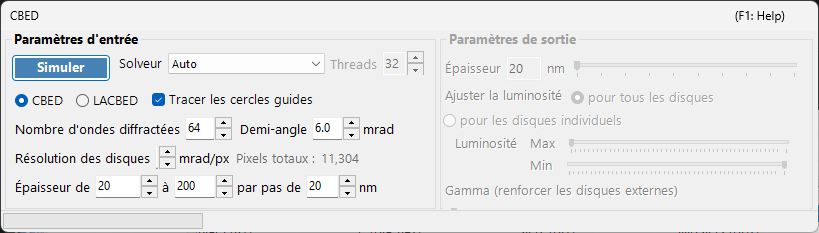
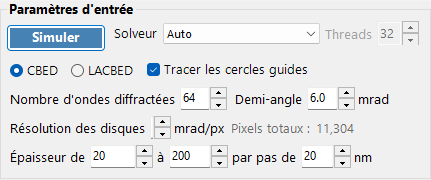
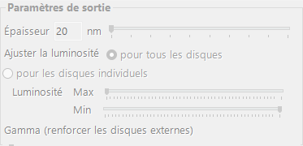

# Simulation CBED

La **simulation CBED (Convergent-Beam Electron Diffraction)** calcule et affiche des clichés de diffraction à faisceau convergent à l'aide de la méthode des ondes de Bloch (Bethe). Les clichés CBED montrent des disques de diffraction au lieu de taches et contiennent de riches informations sur la symétrie, l'épaisseur et la structure du cristal.

> Cette page liste tous les paramètres de la fenêtre dédiée qui s'ouvre lorsque vous sélectionnez **Wavelength = Electron** et **Incident beam = Convergence (CBED, electron only)** dans le [Simulateur de diffraction](index.md). Le passage du faisceau incident à la convergence bascule automatiquement **Intensity calculation** sur **Dynamical**, et cette fenêtre de paramètres CBED s'ouvre. Pour le tracé et l'enregistrement des clichés de diffraction ainsi que pour les autres opérations communes au simulateur de diffraction, voir la [page d'aperçu](index.md).

Conditions GUI : Wave Length = Electron · Incident beam = Convergence (CBED, electron only) · Intensity calculation = Dynamical (automatique)

---

## Paramètres d'entrée

| Paramètre | Description | Par défaut / Typique |
|-----------|-------------|-------------------|
| **Mode** | **CBED** : cliché standard à faisceau convergent où chaque disque correspond à une réflexion, avec le disque transmis (000) au centre. **LACBED** (Large-Angle CBED) : cliché à faisceau convergent à grand angle où les disques de réflexions différentes se recouvrent. Utile pour observer les lignes HOLZ (higher-order Laue zone) et la symétrie | CBED |
| **Convergence semi-angle (mrad)** | Demi-angle du cône du faisceau convergent. Détermine la taille de chaque disque de diffraction (le diamètre du disque dans l'espace réciproque correspond à $2\alpha$) | 5–30 mrad |
| **Disk resolution (mrad/px)** | Résolution angulaire à l'intérieur de chaque disque. Des valeurs plus petites donnent une résolution plus élevée, mais le nombre de directions de faisceau (pixels) calculées croît comme le carré, de sorte que le temps de calcul augmente lui aussi de manière quadratique. Le nombre total de pixels résultant (= nombre total de directions de faisceau) est affiché à droite | — |
| **No. of Bloch waves** | Nombre maximal de faisceaux inclus dans le calcul des ondes de Bloch pour chaque direction de faisceau incident. Davantage de faisceaux donnent une meilleure précision, mais le coût du problème aux valeurs propres croît comme $O(N^3)$ | 100–500 |
| **Thickness range** | Valeurs de début, de fin et de pas de l'épaisseur de l'échantillon (nm). Plusieurs épaisseurs sont calculées ensemble et commutées à l'aide du curseur d'épaisseur du côté de la sortie | — |
| **Solver** | Moteur de calcul pour le problème aux valeurs propres. **Auto** : sélectionne automatiquement le meilleur solveur. **Eigenproblem (MKL)** : basé sur Intel MKL (le plus rapide). **Eigenproblem (Eigen)** : bibliothèque C++ Eigen. **Managed** : .NET managé pur (le plus lent mais toujours disponible) | Auto |
| **Thread count** | Nombre de threads parallèles pour le calcul | — |
| **Draw disk outlines** | Lorsqu'elle est cochée, trace un cercle indiquant la limite de chaque disque de diffraction | — |

---

## Run / Stop

- **Start** : démarre la simulation CBED avec les paramètres d'entrée actuels.
- **Stop** : annule le calcul en cours.

---

## Paramètres de sortie

Une fois le calcul terminé, les paramètres de sortie deviennent disponibles. Tous modifient uniquement l'affichage sans recalculer.

| Paramètre | Description |
|-----------|-------------|
| **Sample thickness** | Sélectionne l'épaisseur de l'échantillon à afficher, dans la plage d'épaisseur des paramètres d'entrée, à l'aide d'un curseur |
| **Brightness adjustment** | **Common to all disks** : utilise une échelle de luminosité commune à tous les disques pour afficher le cliché CBED complet. **Per disk** : affiche un seul disque sélectionné à pleine résolution, normalisé à l'intérieur de ce disque |
| **Brightness (Max / Min)** | Limites supérieure et inférieure de l'intensité affichée. À ajuster lorsque vous souhaitez accentuer des détails faibles |
| **γ (emphasis of outer disks)** | Correction gamma. Utilisée pour rendre les disques externes sombres à grand angle plus faciles à voir par rapport au disque transmis central |
| **Scale** | Sélectionne la gradation d'intensité parmi **Positive** / **Negative** (noir et blanc inversés) |
| **Color** | Carte de couleurs utilisée pour l'affichage. Choisissez parmi **Gray** et d'autres |

---

## Contexte physique

En CBED, le faisceau incident est considéré comme un cône d'ondes planes de directions différentes. Pour chaque direction (chaque point à l'intérieur du diaphragme de convergence = une onde plane incidente partielle), la méthode des ondes de Bloch résout l'équation de Schrödinger des électrons à l'intérieur du cristal, et les résultats sont réorganisés en disques de diffraction. Les lignes HOLZ (higher-order Laue zone) apparaissent sous forme de fines lignes sombres/claires à l'intérieur des disques, provenant de réflexions dans les zones de Laue supérieures. Elles sont sensibles au paramètre de maille le long de l'axe $c$ et sont utiles pour l'analyse structurale tridimensionnelle.

Pour les détails théoriques, voir [Calcul CBED](../appendix/a3-bloch-wave/cbed.md).

---

## Voir aussi

- [Simulateur de diffraction (aperçu)](index.md)
- [Simulation SAED](1-saed-simulation.md)
- [Simulation PED](2-ped-simulation.md)
- [Calcul CBED](../appendix/a3-bloch-wave/cbed.md)
