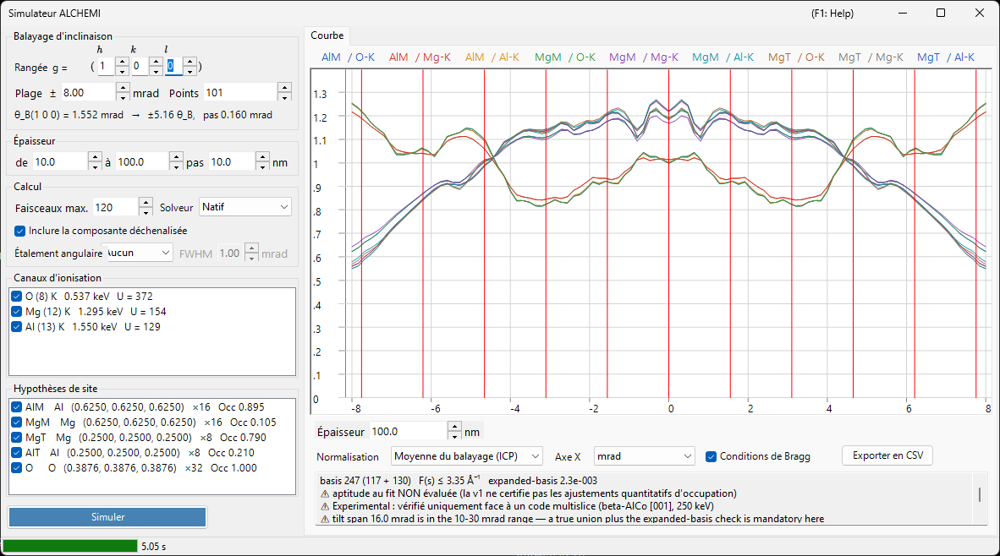

# Simulation ALCHEMI

**ALCHEMI (Atom Location by CHannelling-Enhanced MIcroanalysis)** détermine **quel site occupe un dopant** en mesurant les rendements de rayons X caractéristiques pendant que le cristal est incliné le long d'une rangée systématique, puis en exploitant la dépendance en orientation. Le simulateur ALCHEMI de ReciPro calcule, en direct (forward), la **courbe d'inclinaison (rendement d'ionisation en fonction de l'orientation)** à partir d'une structure cristalline et d'un jeu d'hypothèses de site.

> **Il s'agit d'une fonction Preview.** La v1 n'effectue qu'un **calcul direct unidimensionnel** ; l'ajustement aux données expérimentales et la carte 2D (2D-HARECXS) ne sont pas implémentés (ces onglets sont masqués). **À la connaissance des auteurs, il n'existe aucun autre simulateur direct ALCHEMI accessible au public.** Faute d'implémentation permettant un recoupement, lisez [Domaine de validité et limites connues](#domaine-de-validité-et-limites-connues) avant d'exploiter les résultats de façon quantitative.

Ouvrez-le depuis le menu **Options** du [Simulateur de diffraction](index.md) → **Simulateur ALCHEMI...**

Conditions GUI : Wave Length = Electron (le cristal, la tension d'accélération et l'orientation proviennent du simulateur de diffraction parent)



La fenêtre présente **les réglages à gauche** (balayage, épaisseur, calcul, canaux d'ionisation, hypothèses de site) et **le résultat à droite** (onglet Courbe).

---

## Ce qui est calculé

Pour chaque orientation incidente, le champ d'onde dans le cristal est résolu par la méthode des ondes de Bloch, et pour chaque couple site $s$ / canal d'ionisation $c$ le rendement d'ionisation est intégré analytiquement jusqu'à l'épaisseur $t$.

$$
Y_\text{dyn} = \mathrm{Re} \sum_{jj'} \alpha_j^{*}\,\bigl(C^{\dagger} \mu_{s,c} C\bigr)_{jj'}\, \alpha_{j'}\, F_{jj'}(t),
\qquad F_{jj'}(t) = \frac{e^{\lambda t} - 1}{\lambda}
$$

La matrice d'ionisation $\mu$ ne dépend que de la différence de deux réflexions, $G = \mathbf{g}_h - \mathbf{g}_g$.

$$
\mu_{hg} = \sum_a \mathrm{Occ}_a\, e^{-M_a(G)}\, \sigma_c\, F_c(|G|/2)\, e^{-2\pi i\,G \cdot \mathbf{r}_a}
$$

- $\sigma_c$ : section efficace totale d'ionisation, modèle **Bote–Salvat**
- $F_c(s)$ : facteur de forme d'ionisation normalisé, tables **DHFS** générées en interne (même base de données que [Interaction du faisceau](../3-beam-interaction.md) et [STEM-EDX](../9-hrtem-stem-simulator/2-stem-simulation.md))
- $e^{-M_a(G)}$ : facteur de Debye-Waller (les ADP anisotropes sont pris en charge)

Cela correspond à l'**approximation du facteur de forme local** d'ICSC (Oxley & Allen 2003). La MDFF à deux impulsions n'est pas utilisée.

### Composante déchenalisée

Les électrons retirés du champ de Bloch cohérent par l'absorption thermique diffuse parcourent l'épaisseur restante en tant qu'électrons de direction aléatoire, et y ionisent également.

$$
Y_\text{dech} = \frac{\mu_{00}}{V_c}\,\bigl(t - L_\text{coh}(t)\bigr),
\qquad L_\text{coh}(t) = \int_0^t \sum_g |\psi_g(z)|^2\,dz
$$

Décocher **Inclure la composante déchenalisée** dans le cadre **Calcul** supprime ce terme. Il représente plusieurs dizaines de pour cent du rendement total aux épaisseurs usuelles ; l'omettre fait paraître le contraste de site plus fort qu'il ne l'est.

### Grandeur de sortie

La grandeur primaire est le **nombre de lacunes de couche interne créées par électron incident**. **La conversion en photons X (rendement de fluorescence et branchement des raies), l'auto-absorption des rayons X dans l'échantillon, ainsi que l'efficacité et l'angle solide du détecteur NE sont PAS appliqués.**

⚠ **Les lacunes ne sont pas des coups.** Entre cette grandeur et une intensité EDX mesurée s'intercalent trois étapes supplémentaires — atomique, échantillon et instrumentale — dont ReciPro n'effectue aucune.

1. **lacune → photon** : rendement de fluorescence et branchement des raies de la couche
2. **photon → photon sortant de l'échantillon** : auto-absorption des rayons X, qui dépend de la **profondeur à laquelle le photon a été créé** et de l'angle de sortie
3. **photon → coup** : efficacité du détecteur, angle solide et traitement du spectre

L'étape 2 en particulier ne se rattrape pas après coup en multipliant la courbe finie par un unique facteur d'absorption : il faudrait d'abord résoudre le rendement en profondeur. Comparer ces courbes à des intensités mesurées, à des facteurs k ou à des compositions suppose donc d'effectuer ces étapes en dehors de ReciPro.

Notez lesquelles survivent à une normalisation. Les étapes 1 et 3, ainsi que toute absorption traitée comme une constante, sont **multiplicatives et indépendantes de l'orientation** : elles disparaissent donc dans la normalisation ICP (moyenne du balayage), même pour deux raies d'énergies très différentes. **L'auto-absorption, en général, non** : la canalisation modifie la distribution en profondeur où les lacunes sont créées, si bien que la fraction absorbée varie elle-même au long du balayage et survit à la normalisation. C'est contre ce résidu que le choix de raies d'énergies voisines est utile.

---

## Volet gauche : réglages

### Balayage d'inclinaison

| Élément | Description | Défaut |
|---------|-------------|--------|
| **Rangée g = ( h k l )** | Rangée systématique à balayer, donnée par les indices de réflexion $(h\,k\,l)$ de son vecteur du réseau réciproque $\mathbf{g} = h\mathbf{a}^* + k\mathbf{b}^* + l\mathbf{c}^*$ — et non une direction $[u\,v\,w]$. L'axe d'inclinaison est pris perpendiculaire à la fois au faisceau et à ce $\mathbf{g}$, de sorte que le balayage traverse les conditions de Bragg de cette rangée | (1 0 0) |
| **Plage ±** | Demi-largeur du balayage en inclinaison (mrad). Au-delà d'environ 10 mrad, une base union fixe n'est plus garantie ; au-delà de 30 mrad, on sort de la garantie v1 | 8 mrad |
| **Points** | Nombre de points de balayage (3–1001) | 101 |

La ligne du dessous indique l'angle de Bragg $\theta_B$ de la rangée choisie, à combien de $\theta_B$ correspond la largeur de balayage, et le pas d'inclinaison — vous voyez donc avant l'exécution jusqu'où va réellement le balayage.

⚠ **La valeur par défaut de ±8 mrad est un point de départ commode, pas un optimum de la littérature.** La revue de Jones (2002) ne prescrit aucune largeur de balayage chiffrée en mrad, et les bornes supérieures citées dans le tableau ci-dessus sont des limites du calcul numérique de la v1, non des recommandations. Jugez plutôt l'étendue en unités de $\theta_B$ (c'est ce qu'indique la ligne sous le tableau) et choisissez-la de sorte que les traits dynamiques que vous voulez comparer tombent à l'intérieur du balayage.

⚠ L'affirmation selon laquelle l'éclairement peut être ouvert jusqu'à **environ l'angle de Bragg** — donnée par Jones pour la condition optimisée en rangée systématique — porte sur le **demi-angle de convergence du cône incident**, c'est-à-dire sur **Étalement angulaire** dans le cadre **Calcul** ci-dessous. Ce n'est **pas** une demi-largeur de balayage recommandée. Ce sont deux grandeurs différentes, à ne pas confondre.

### Épaisseur

Donnez le début, la fin et le pas (nm). **Toutes les épaisseurs sont calculées ensemble en une seule exécution** ; le résultat se sélectionne avec la case **Épaisseur** sous la courbe (les boutons fléchés parcourent les épaisseurs calculées ; une valeur saisie est ramenée à la plus proche). Si le début et la fin ne donnent qu'une seule épaisseur, il n'y a rien à sélectionner et la case est désactivée.

Le contraste de site varie fortement — et peut même changer de signe — entre échantillons minces et épais ; vérifiez donc plusieurs épaisseurs avant de conclure. C'est pourquoi le sélecteur d'épaisseur se trouve juste sous la courbe.

### Calcul

| Élément | Description | Défaut |
|---------|-------------|--------|
| **Faisceaux max.** | Borne supérieure du nombre d'ondes de Bloch par orientation (1–1600). L'union sur tout le balayage est plus grande | 120 |
| **Solveur** | Moteur de calcul du problème aux valeurs propres : **Natif** (Eigen C++) ou **Managé** (.NET). Là où le solveur natif est indisponible, le choix est fixé à Managé | Natif |
| **Inclure la composante déchenalisée** | Ajouter ou non $Y_\text{dech}$ ci-dessus | activé |
| **Étalement angulaire** | Convolue la courbe avec l'étalement angulaire du faisceau incident : **Aucun** ou **Gaussian** avec une largeur à mi-hauteur en mrad. C'est un post-traitement sur l'axe des orientations, appliqué **avant** la normalisation d'affichage | Aucun |

**Le plafond de 1600 faisceaux est le pendant de la plage tabulée $s \le 16\ \text{Å}^{-1}$ du facteur de forme d'ionisation.** En pratique, même 1600 faisceaux n'exigent qu'environ 10,5 Å⁻¹, de sorte que la plage tabulée n'est jamais épuisée tant que le plafond est respecté. La valeur réellement atteinte est indiquée sur la première ligne de la zone de [diagnostic de base](#diagnostic-de-base) sous le graphique.

### Canaux d'ionisation

Liste des couples élément / couche à ioniser. Chaque ligne se lit `élément (Z) couche   énergie de seuil   U = surtension`, avec une étiquette entre parenthèses là où la prudence s'impose.

- Les canaux qui **ne peuvent pas être excités** (l'énergie incidente est sous le seuil d'absorption) ou qui sont **hors de la plage tabulée** sont listés avec le motif et ne peuvent pas être cochés
- Les canaux dont la surtension $U = E_0/E_\text{seuil}$ est inférieure à 1,2 portent un avertissement, la section efficace y étant moins fiable

### Hypothèses de site

Liste des sites atomiques dont le rendement est calculé séparément, affichés sous la forme `étiquette élément (x, y, z) ×multiplicité Occ occupation`.

⚠ **Dans l'approximation traceur, un canal peut être associé à n'importe quel site.** Associer le canal d'ionisation d'un dopant à la géométrie d'un site hôte (position, ADP, occupation) est l'usage prévu ; restreindre l'association aux éléments identiques serait une erreur. **Toutes les combinaisons** des canaux et sites cochés sont calculées.

### Simuler / Arrêter

**Simuler** lance le balayage. La progression est indiquée dans la barre d'état en cinq étapes (résolution des données d'ionisation → construction de la base union → construction des matrices d'ionisation → résolution des orientations → vérification de la base élargie) ; **Arrêter** interrompt à tout moment.

---

## Volet droit : onglet Courbe

Une fois le calcul terminé, une courbe est tracée par couple site × canal. La légende se lit `étiquette de site / canal`.

| Élément | Description |
|---------|-------------|
| **Épaisseur** | Sélectionne l'épaisseur affichée ; les boutons fléchés parcourent les épaisseurs calculées et une valeur saisie est ramenée à la plus proche (rien n'est recalculé) |
| **Normalisation** | **Moyenne du balayage (ICP)** = diviser par la moyenne sur tout le balayage (la grandeur normalement utilisée en ALCHEMI) / **Maximum = 1** / **Brut (par électron)** |
| **Axe X** | Bascule entre **mrad** et **θ_B** (en unités de l'angle de Bragg de la rangée balayée) |
| **Conditions de Bragg** | Trace des traits verticaux en $\theta = n\,\theta_B$ |
| **Exporter en CSV** | Écrit les courbes brutes pour chaque orientation, épaisseur, site et canal dans un fichier CSV ([ci-dessous](#export-csv)) |

⚠ **La normalisation n'est qu'une transformation d'affichage.** La grandeur stockée est toujours le nombre de lacunes créées par électron incident, et **Maximum = 1 sert uniquement à l'affichage** — il ne doit pas servir de référence ICP.

### Contraste et corrélation

Les dernières lignes de la zone de diagnostic en lecture seule sous la courbe (faire défiler pour la suite ; le texte peut être sélectionné et copié) donnent, par série, le **contraste** $(\max-\min)/\text{moyenne}$ et le **coefficient de corrélation** $r$ par rapport à la première série. C'est un résumé permettant de juger d'un coup d'œil quel site agit : deux séries dont $r$ est proche de $+1$ ont la même dépendance en orientation, ce qui signifie que ces données ne peuvent pas séparer ces sites.

### Diagnostic de base

Les premières lignes de la zone de diagnostic indiquent l'état de la base, un élément par ligne.

```text
basis 347 (184 + 163)   F(s) ≤ 6.20 Å⁻¹   expanded-basis 6.7e-3
⚠ aptitude au fit NON évaluée (la v1 ne certifie pas les ajustements quantitatifs d'occupation)
⚠ Experimental : vérifié uniquement face à un code multislice (beta-AlCo [001], 250 keV)
```

- **basis N (centre seul + ajoutés par l'union)** : taille de la véritable union des réflexions sur toutes les orientations du balayage
- **F(s) ≤ … Å⁻¹** : le plus grand argument de facteur de forme réellement exigé par la base
- **expanded-basis** : écart relatif maximal lorsque le centre et les deux extrémités du balayage sont résolus de nouveau avec une base 1,25×. C'est un **indicateur indirect de l'erreur de convergence**
- **aptitude au fit** : la v1 indique toujours **NON évaluée**. Le diagnostic présente trois défauts connus — son dénominateur est le
  maximum sur tout le tenseur, son numérateur est le rendement absolu, et il passe trivialement quand la base 1,25× n'augmente
  pas réellement — de sorte que certifier un résultat « apte » se tromperait dans la mauvaise direction
- **Experimental** : chaque exécution porte cette étiquette avec le domaine vérifié, car seul β-AlCo a été contrôlé quantitativement

⚠ **La v1 ne certifie pas les ajustements quantitatifs d'occupation.** La valeur brute du diagnostic reste affichée et plus elle est petite mieux c'est, mais traitez-la comme une indication, non comme une note de réussite. Notez aussi qu'elle est définie sur le **rendement absolu** : elle est donc conservatrice si vous ne regardez que l'ICP (qui divise par la moyenne du balayage).

D'autres avertissements sont ajoutés sous forme de lignes séparées (chacune précédée de ⚠) dans la zone de diagnostic, dans les situations suivantes.

- **Tension d'accélération inférieure à 80 kV** : à cette tension, la table de facteurs de forme ne garantit pas $s$ jusqu'à $16\ \text{Å}^{-1}$. Le calcul reste correct tant que le $s$ exigé par la base reste dans la plage certifiée : c'est donc un **avis, pas un refus**
- **Troncature du facteur de forme** : là où $F(s)$ au-delà de la plage certifiée a été tronqué à zéro, **la borne d'erreur correspondante $|F| \le \varepsilon$ est affichée numériquement**. Rien n'est extrapolé en silence

---

## Export CSV {#export-csv}

**Exporter en CSV** écrit un tableau au format long précédé d'un en-tête au format `# key: value` (abrégé ci-dessous). L'en-tête est conçu pour que le fichier seul énonce les conditions nécessaires à sa reproduction.

```text
# generator: ReciPro ALCHEMI, ver 4.947 (2026-08-09)
# model: LocalFormFactor (local form-factor approximation; NOT the two-momentum MDFF)
# quantity: IonizationVacanciesGenerated (PerIncidentElectron)
# crystal: MgAl2O4 (spinel) / F d -3 m
# cell_nm: a 0.808000 b 0.808000 c 0.808000 alpha 90.0000 beta 90.0000 gamma 90.0000 deg
# accelerating_voltage_kV: 200.000
# scan_row_hkl: 1 0 0
# theta_B_mrad: 1.552030
# thicknesses_nm: 10.0000 20.0000 ... 100.0000
# angular_spread: Gaussian1D FWHM 1.0000 mrad (kernel renormalized at the scan ends)
# processing_order: forward yield -> angular spread convolution -> (display normalization, NOT applied to these columns)
# basis: 202 beams (120 centre-only + 82 added by the union), hash 1F3A...
# expanded_basis_max_rel_diff: 9.500e-004
# fit_eligibility: NotEvaluated (v1 does not certify quantitative occupancy fits; raw diagnostic AcceptedForFit=True at tolerance 3e-3)
# occupancy_coupling: Tracer (dilute limit; site responses may be combined linearly). VCA is not implemented
# verification: Experimental. Quantitatively verified only for beta-AlCo [001] at 250 keV (Al-K / Co-K / Co-L). ...
# not_modelled: X-ray self-absorption, detector efficiency and solid angle, fluorescence yield and line branching, background, specimen thickness distribution, specimen bending
# channel[Al-K]: edge 1.5596 keV, sigma 1.95e-007 nm2, sigma_source ... , F(s)_source ... (tabulated to s = 16.0 A^-1), not truncated
# site[AlM]: atom indices 0, occupancy from the crystal
# conventions: tilt is the signed rotation about the axis perpendicular to both the beam and g(scan_row_hkl), positive toward +g; angles in mrad; lengths in nm; ...
tilt_mrad,thickness_nm,site,channel,dynamic,dechannelled,total,dynamic_conv,dechannelled_conv,total_conv
```

`dynamic` / `dechannelled` / `total` sont stockés séparément, de sorte que **la contribution de la composante déchenalisée peut être évaluée après coup**. Les colonnes `*_conv` n'apparaissent que si l'étalement angulaire est activé et contiennent les courbes convoluées : le fichier porte donc à la fois le résultat brut reproductible et celui à comparer à une expérience. Les valeurs sont brutes (par électron incident) et ne passent pas par la normalisation d'affichage ; le séparateur décimal est toujours un point.

---

## Domaine de validité et limites connues

« Calculable » et « vérifié quantitativement » sont deux choses différentes. Cette section précise la seconde.

### Pas d'exactitude ±% générale — trois choses à distinguer

ReciPro **ne** donne délibérément **pas** d'exactitude générale du type « occupations de site à ±N % ». La revue de Jones (2002) ne rapporte pas non plus d'erreur d'occupation universelle, et les chiffres publiés de cette forme appartiennent à un système mesuré par une procédure : ils ne sont pas une propriété de la méthode, encore moins de ce simulateur.

Pour juger un résultat, distinguez trois choses différentes.

**Précision** : la reproductibilité du nombre — statistique de comptage, barre d'erreur renvoyée par une régression, dispersion entre répétitions. Un faible résidu d'ajustement, ou un coefficient de corrélation proche de 1, n'établit pas à lui seul que le modèle est juste. Dans le cas discuté par Jones, l'ajout d'une constante libre à l'ajustement en a amélioré la précision sans démontrer une meilleure exactitude.

**Biais de modèle** : l'erreur systématique du calcul direct lui-même — l'absence de corrélation de site du terme déchenalisé, l'approximation du facteur de forme local, l'absence de distribution d'épaisseur et de courbure (tout cela ci-dessous). Cette physique manquante ne diminue pas si l'on accumule plus de coups ou si l'on ajoute des points de balayage. (Agrandir la base est autre chose : cela réduit l'erreur **numérique** de troncature, que le [diagnostic de base](#diagnostic-de-base) rapporte séparément.)

**Vérifications indépendantes** : l'accord avec quelque chose qui ne partage pas les mêmes hypothèses — et il y en a deux niveaux. La comparaison avec une **implémentation** formulée indépendamment (code contre code) éprouve la formulation et la programmation ; c'est ce qui a été fait ici, pour un système. La comparaison avec l'**expérience**, seule à confronter la physique au réel, n'a pas été faite.

### Domaine vérifié quantitativement

**β-AlCo [001] à 250 keV, canaux Al-K / Co-K / Co-L** — et rien d'autre. Comparaison avec un calcul multitranche + phonons gelés (py_multislice), dont la formulation dynamique est totalement indépendante :

- **Site Al (colonne légère)** : résidu RMS rapporté à la modulation ICP ≤3,2 % à toutes les épaisseurs, ≤0,6 % pour $t \ge 10$ nm
- **Site Co (colonne lourde)** : ≤3 % pour $t \le 4$ nm, mais **6–17 % pour $t \gtrsim 10$ nm**

Tout autre système, élément, couche ou tension est « calculable » mais non « vérifié quantitativement ».

**Aucune comparaison avec des données expérimentales n'a été effectuée.** La comparaison ci-dessus est une comparaison entre codes, sur $t$ = 2–30 nm. La valeur de 10–19 points citée dans la section suivante est un *diagnostic* servant à isoler la cause de l'écart : ce n'est pas une correction appliquée par le simulateur, et l'accord obtenu après son application n'est pas revendiqué comme une vérification.

### Erreur systématique connue — le terme déchenalisé n'a pas de corrélation de site

Le terme déchenalisé de la v1 est une constante indépendante de l'orientation ; son seul effet sur l'ICP est de le ramener vers 1. En réalité, une partie des électrons diffusés thermiquement se rechenalise dans les colonnes et, étant de forts diffuseurs, revient **préférentiellement vers les colonnes lourdes**. Dans la comparaison ci-dessus, la valeur effective de cette contribution était **sous-estimée de 10 à 19 points sur les colonnes lourdes**.

→ **Pour les sites légers ou faiblement diffusants, ou pour $t \lesssim 5$ nm, l'accord avec une implémentation indépendante est de 1–3 %. Pour les colonnes lourdes avec $t \gtrsim 10$ nm, il subsiste une erreur systématique de 6–17 % de la modulation ICP.** Un modèle de réinjection portant une corrélation de site est reporté à la v1.1 ou plus tard.

### Non inclus dans le modèle direct

**Une simple convolution par l'élargissement angulaire ne reproduira pas une expérience.** Rien de ce qui suit n'est inclus.

- **Distribution d'épaisseur** et **flexion** de l'échantillon
- **Auto-absorption** des rayons X
- **Efficacité et angle solide du détecteur**
- **Fond continu** (rayonnement de freinage, raies superposées)

L'**étalement angulaire du faisceau incident** (demi-angle de convergence, dérive) *est* modélisé — voir **Étalement angulaire** dans le cadre Calcul — mais la convolution ne remplace aucun des points ci-dessus.

### Raies de basse énergie — là où l'approximation locale est la plus faible {#local-approximation}

La matrice d'ionisation de la v1 est fonction du seul vecteur $G = \mathbf{g}_h - \mathbf{g}_g$ (approximation du facteur de forme local). ICSC indique que cela est raisonnable pour des couches internes fortement liées dont l'émission caractéristique se situe **au-dessus d'environ 3–4 keV** (Oxley & Allen 2003, p. 941).

⚠ **Ce chiffre est un repère empirique et dépendant du modèle, pas un seuil strict — et ReciPro ne s'en sert pas pour rejeter quoi que ce soit.** Les raies situées en dessous sont calculées normalement, et ce sont souvent celles qui intéressent : Al-K est à 1,49 keV et Co-L à 0,79 keV, toutes deux appartenant au jeu β-AlCo utilisé pour la comparaison entre codes ci-dessus.

Ce que ce chiffre repère, c'est l'endroit où la réduction à un **seul** vecteur $G$ commence à devenir insuffisante. L'événement d'ionisation ne se produit pas sur le noyau : sa probabilité est maximale à une distance finie du noyau, et cette distance croît quand l'énergie requise diminue. Notez ce que l'approximation conserve et ce qu'elle abandonne : $F_c(|G|/2)$ dépend du moment, une portée d'interaction finie **est** donc conservée ; ce qui est abandonné, c'est la dépendance séparée vis-à-vis des deux transferts de moment, c'est-à-dire la structure non locale de la MDFF complète. À mesure que la délocalisation augmente, c'est cette structure abandonnée qui commence à compter.

L'énergie de la raie ne suffit pas à certifier un résultat : l'extension spatiale de la couche, l'orientation, l'épaisseur et les vecteurs réciproques réellement exigés par la base interviennent tous. Traitez 3–4 keV comme une invitation à regarder de plus près, non comme une note de réussite. Lorsque le choix existe, comparer des raies d'**énergies voisines** rend les biais de délocalisation des deux plus comparables ; Jones (2002) recommande précisément cela comme première mesure pratique, et comme seconde de préférer une rangée systématique à un axe de zone — c'est la géométrie que calcule la v1 (un axe de zone canalise plus fortement, mais demande une correction de délocalisation plus grande).

⚠ Les basses énergies d'émission souffrent aussi le plus de l'**auto-absorption des rayons X** — l'ampleur dépendant toutefois de la composition de l'échantillon et de ses seuils d'absorption, de la longueur de trajet et de l'angle de sortie, et non de la seule énergie émise. C'est une source d'erreur **distincte**, absolument pas modélisée (voir [Grandeur de sortie](#grandeur-de-sortie) plus haut), et elle fausse la comparaison avec une expérience indépendamment de ce que fait l'approximation locale.

### Hypothèses du modèle

- **Approximation traceur uniquement** : la superposition linéaire des réponses de site n'est valable que dans la limite diluée où le dopant ne perturbe pas le champ d'onde élastique. La VCA à concentration finie est hors du périmètre de la v1
- **Approximation du facteur de forme local** : $\mu$ n'est fonction que de $G = \mathbf{g}_h - \mathbf{g}_g$, et non de la MDFF à deux impulsions (Modèle A d'OAR 1999). L'approximation est la plus faible pour les couches K des éléments légers et les seuils de basse énergie — voir [ci-dessus](#local-approximation)
- **Des lacunes, pas des photons X** : le rendement de fluorescence et le branchement des raies ne sont pas appliqués
- **La borne inférieure de la tension d'accélération est 80 kV** : c'est la tension la plus basse à laquelle $s = 16\ \text{Å}^{-1}$ peut être garanti, non un seuil de refus

---

## Voir aussi

- [Simulateur de diffraction (aperçu)](index.md)
- [Simulation CBED](3-cbed-simulation.md)
- [Calcul dynamique (cœur commun)](../appendix/a3-bloch-wave/calculation.md)
- [Simulation STEM](../9-hrtem-stem-simulator/2-stem-simulation.md) — STEM-EDX, qui utilise la même base de données d'ionisation
- [Interaction du faisceau](../3-beam-interaction.md) — données de sections efficaces et de seuils d'absorption
