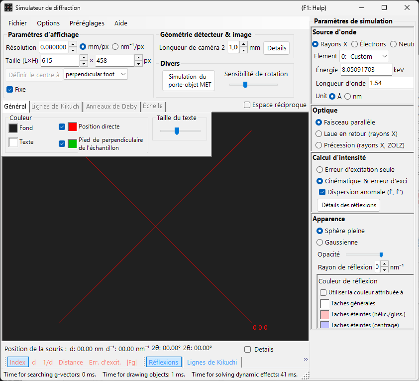
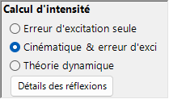

# Simulation de diffraction des rayons X / des neutrons

La **simulation de diffraction des rayons X / des neutrons** calcule les figures de diffraction des rayons X et des neutrons sur monocristal. C'est l'un des principaux modes du [simulateur de diffraction](index.md).

> Cette page répertorie chaque réglage qui apparaît à droite lorsque vous sélectionnez **Wave Length = X-ray** (ou neutron). Pour les opérations à l'échelle de la fenêtre, telles que le tracé et l'enregistrement, voir la [page de présentation](index.md).

Conditions GUI : Wave Length = X-ray / Neutron · Incident beam = Parallel / Precession (X-ray) / Back-Laue · Intensity calculation = Only excitation error / Kinematical

---

## Présentation

Les rayons X ont une longueur d'onde plus grande que les électrons (Cu Kα : 0.15406 nm = 1.5406 Å), de sorte que la sphère d'Ewald est plus fortement courbée. Par conséquent, moins de points du réseau réciproque satisfont simultanément la condition de diffraction que pour les électrons. Comme le pouvoir de diffusion atomique est faible et que la diffusion multiple est faible, la théorie cinématique de la diffraction fournit une précision suffisante pour les intensités (le calcul dynamique n'est pris en charge que pour les électrons).

---

## Wave Length

Sélectionnez **X-ray** comme source de rayonnement. Les rayons X peuvent être spécifiés de deux manières : rayons X caractéristiques et rayonnement synchrotron.

### Rayons X caractéristiques

Le choix d'un **élément** et d'une **transition** fixe la longueur d'onde des rayons X caractéristiques. La transition est spécifiée en notation de Siegbahn (Kα₁ / Kα₂ / Kβ, etc.). Longueurs d'onde Kα₁ d'éléments représentatifs :

| Élément | Raie | Longueur d'onde (Å) | Énergie (keV) |
|---------|------|-----------------|--------------|
| Cu | Kα₁ | 1.5406 | 8.048 |
| Mo | Kα₁ | 0.7107 | 17.479 |
| Co | Kα₁ | 1.7890 | 6.930 |
| Cr | Kα₁ | 2.2910 | 5.415 |

### Rayonnement synchrotron

Réglez **Element** sur **0: Custom** et entrez directement l'énergie (keV) ou la longueur d'onde (Å). Toute longueur d'onde peut être utilisée.

---

## Mode du faisceau incident

Sélectionne la géométrie du faisceau incident. Trois modes sont disponibles pour les rayons X.

### Parallel

L'onde plane standard. Un faisceau incident parallèle utilisé pour la SAED et la diffraction des rayons X sur monocristal.

### Precession (X-ray) — chambre de précession

Simule une chambre de précession de rayons X. Il s'agit d'un cliché de précession qui capture une seule couche du réseau réciproque.

### Back-Laue (Laue en réflexion)

Simule une figure de Laue en réflexion avec des rayons X blancs (polychromatiques). Dans cette géométrie en réflexion, le détecteur est placé du côté de la source et **Monochrome** est désactivé. La géométrie de réflexion est donnée par **Tau / Phi** dans **Detector geometry** (voir [Detector geometry](index.md#detector-geometry)).

> **Note** : Les options du faisceau incident suivent la longueur d'onde. **Precession (electron)** et **Convergence (CBED)** n'apparaissent que lorsque le rayonnement électronique est sélectionné, tandis que les options **Precession (X-ray)** et **Back-Laue** ci-dessus n'apparaissent que lorsque le rayonnement X est sélectionné. Pour les neutrons, seul **Parallel** est disponible. Selon l'état au moment de la capture, la capture d'écran peut ne pas afficher les options spécifiques aux rayons X.

---

## Calcul de l'intensité

Sélectionne la méthode utilisée pour calculer les intensités des taches. Deux modes sont disponibles pour les rayons X.

### Only excitation error

L'intensité est déterminée uniquement par la distance géométrique entre la sphère d'Ewald et le point du réseau réciproque (l'erreur d'excitation $s_g$). Un $\lvert s_g \rvert$ plus petit donne une intensité plus élevée, atteignant son maximum à la valeur définie par **Radius**, et tombant à zéro lorsque $\lvert s_g \rvert$ dépasse Radius. Le facteur de structure est ignoré.

### Kinematical & excitation error

En plus de l'erreur d'excitation, le facteur de structure cinématique $\lvert F_{hkl} \rvert^2$ est intégré à l'intensité. Les règles d'extinction sont strictement respectées. Les facteurs de Lorentz et de polarisation ne sont pas inclus (il s'agit d'une simulation de la figure géométrique).

> **Note** : La **théorie dynamique** est désactivée pour les rayons X (disponible uniquement lorsque le rayonnement électronique est sélectionné).

---

## Apparence des taches

Contrôle la manière dont chaque tache de diffraction est rendue.

- **Solid sphere / Gaussian** : modèle géométrique du point du réseau réciproque. **Solid sphere** utilise la section transversale entre une sphère de rayon *R* et la sphère d'Ewald (l'aire du cercle correspond à l'intensité de diffraction) ; **Gaussian** utilise la section transversale entre une gaussienne 3D avec σ = *R* et la sphère d'Ewald (l'intégrale de la gaussienne 2D correspond à l'intensité de diffraction).
- **Opacity** : transparence de la tache (0 = transparent, 1 = opaque).
- **Radius (R)** : rayon du point du réseau réciproque. La taille de la tache rendue est déterminée par la combinaison de **Appearance** et de **Intensity calculation**.
- **Brightness** : actif uniquement en mode **Gaussian**. Définit l'intensité intégrée de la gaussienne rendue.
- **Color scale** : choix entre les cartes de couleurs **Gray scale** et **Cold-warm**.
- **Log scale** : afficher les intensités sur une échelle logarithmique.
- **Spot color** : couleur par défaut de la tache lorsque l'échelle de couleurs ne s'applique pas.
- **Use crystal color** : lorsque cette case est cochée, dessine les taches dans la couleur attribuée à chaque cristal.

---

## Anneaux de Debye (polycristallin)

Les anneaux de Debye d'un échantillon polycristallin peuvent être affichés. Activez **Debye rings** dans la barre d'outils (voir [Barre d'outils](index.md#toolbar)).

- **Ignore diffraction intensity** : dessine tous les anneaux avec la même couleur et la même intensité (utilisé pour une comparaison purement géométrique qui ignore le facteur de structure).
- **Show index label** : affiche l'indice (*hkl*) près de chaque anneau.

Les réglages détaillés se trouvent dans l'onglet Debye rings du [menu à onglets](index.md#drawing-overlay-tabs).

---

## Diffraction des neutrons

Sélectionner **Neutron** dans le contrôle Wave Length calcule une figure de diffraction des neutrons. Entrez l'énergie (meV) ou la longueur d'onde (nm). Le faisceau incident ne peut être que **Parallel**. Le calcul de l'intensité peut être **Only excitation error** ou **Kinematical** (Dynamical n'est pas disponible). L'intensité cinématique utilise la longueur de diffusion des neutrons au lieu du facteur de diffusion atomique.

---

## Différences entre la diffraction des rayons X et des électrons

| Caractéristique | Diffraction des rayons X | Diffraction des électrons |
|---------|-------------------|----------------------|
| Longueur d'onde | Longue (0.5–2.5 Å) | Courte (0.02–0.04 Å) |
| Courbure de la sphère d'Ewald | Grande | Petite (presque plate) |
| Réflexions simultanées | Peu nombreuses | Nombreuses |
| Facteur de diffusion | Facteur de diffusion atomique $f(s)$ | Facteur de diffusion électronique $f_e(s)$ |
| Effets dynamiques | Généralement faibles | Importants |
| Règles d'extinction | Strictement respectées | Peuvent être violées par la diffusion multiple |

---

## Opérations communes

Pour les opérations à l'échelle de la fenêtre, telles que la longueur de caméra, la géométrie du détecteur, l'enregistrement des figures et les réglages de couleur, voir la [page de présentation](index.md). La géométrie détaillée du détecteur est configurée dans la fenêtre de géométrie ci-dessous.

---

## Voir aussi

- [Simulateur de diffraction (présentation)](index.md)
- [Simulation SAED](1-saed-simulation.md)
- [Simulation de diffraction électronique en précession (PED)](2-ped-simulation.md)
- [Simulation de diffraction électronique à faisceau convergent (CBED)](3-cbed-simulation.md)
- [Système de coordonnées — orientation du cristal](../appendix/a1-coordinate-system/1-orientation.md)
