# Crystal Diffraction (Simulateur de diffraction)

**Crystal Diffraction (Simulateur de diffraction)** simule les diagrammes de diffraction des rayons X, des neutrons et des électrons d'un monocristal.

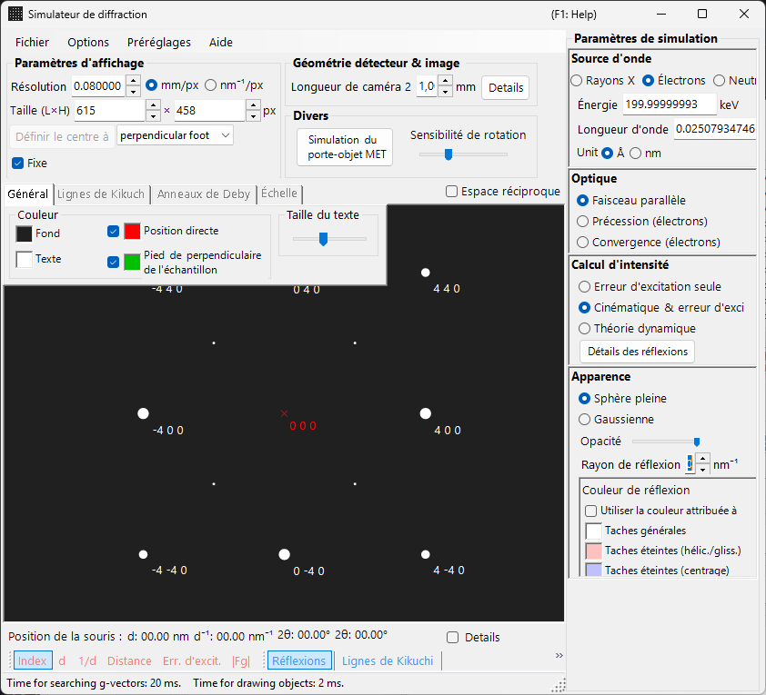

La fenêtre comporte **à gauche** une zone de tracé du diagramme de diffraction et **à droite** les panneaux de réglage des propriétés des réflexions (longueur d'onde, faisceau incident, calcul d'intensité, apparence, etc.). La combinaison de la longueur d'onde et du faisceau incident détermine le mode d'acquisition (diffraction des rayons X, SAED, PED, CBED), et les panneaux de droite se reconfigurent en conséquence.

---

## Comment cette page et les pages de mode se répartissent le travail

- **Cette page (hub)** : rassemble les opérations communes à tous les modes (raccourcis, menus, barre d'outils, informations sur l'écran/le détecteur, onglets de superposition, informations sur les réflexions, géométrie du détecteur, compression dynamique).
- **Chaque page de mode** : couvre **chaque réglage qui apparaît à droite** lorsque ce mode est sélectionné (longueur d'onde, faisceau incident, calcul d'intensité, apparence, réglages des ondes de Bloch, réglages de précession, etc.), de sorte que chaque page est autonome (il existe certains chevauchements entre les modes).

| Mode | Contenu | Page |
|------|----------|------|
| **Diffraction des rayons X (et des neutrons)** | Diagramme de diffraction des rayons X / des neutrons d'un monocristal (parallèle, précession rayons X, Back Laue) | [Simulation de diffraction des rayons X](4-x-ray-neutron-diffraction.md) |
| **SAED** | Diffraction électronique en faisceau parallèle (selected-area electron diffraction) | [Simulation SAED](1-saed-simulation.md) |
| **PED** | Diffraction électronique en précession | [Simulation PED](2-ped-simulation.md) |
| **CBED** | Diffraction électronique en faisceau convergent | [Simulation CBED](3-cbed-simulation.md) |

---

## Aperçu rapide des modes

Recherchez la page dont vous avez besoin à partir de la combinaison de la **longueur d'onde (source)** et du **faisceau incident**.

| Longueur d'onde | Faisceau incident | Mode | Page |
|------------|--------------------|------|------|
| Électron | Parallèle | SAED | [Simulation SAED](1-saed-simulation.md) |
| Électron | Précession (électron = PED) | PED | [Simulation PED](2-ped-simulation.md) |
| Électron | Convergence (CBED) | CBED | [Simulation CBED](3-cbed-simulation.md) |
| Rayons X | Parallèle | Diffraction des rayons X | [Simulation de diffraction des rayons X](4-x-ray-neutron-diffraction.md) |
| Rayons X | Précession (rayons X) | Précession rayons X (caméra de précession) | [Simulation de diffraction des rayons X](4-x-ray-neutron-diffraction.md) |
| Rayons X | Back Laue | Laue en rétroréflexion | [Simulation de diffraction des rayons X](4-x-ray-neutron-diffraction.md) |
| Neutron | Parallèle | Diffraction des neutrons | [section neutrons de la Simulation de diffraction des rayons X](4-x-ray-neutron-diffraction.md) |

> **Note** : Les choix de faisceau incident changent avec la longueur d'onde. Pour les électrons : **Parallèle, Précession (électron = PED), Convergence (CBED)** ; pour les rayons X : **Parallèle, Précession (rayons X), Back Laue** ; pour les neutrons : **Parallèle** uniquement. Sélectionner **Précession (électron = PED)** ou **Convergence (CBED)** bascule automatiquement le calcul d'intensité sur **Dynamical**.

---

## Raccourcis clavier et souris

Ceux-ci s'appliquent à la fenêtre du diagramme de diffraction partagée par les simulations rayons X, SAED et PED. Le glissement sur le diagramme fait tourner le **cristal**. Il n'y a **pas de zoom à la molette de la souris** ici — zoomez avec le clic droit / le glissement droit.

| Raccourci | Action |
|----------|--------|
| <kbd>F1</kbd> | Ouvrir cette page du manuel en ligne |
| Glissement gauche près du centre | Incliner le cristal |
| Glissement gauche dans la zone extérieure | Faire pivoter le cristal autour de l'axe du faisceau |
| Double-clic gauche sur une réflexion | Afficher les détails de la réflexion (indice, *d*, facteur de structure, erreur d'excitation) |
| Glissement milieu | Déplacer le diagramme |
| <kbd>CTRL</kbd> + Glissement milieu | Déplacer le centre du détecteur (lorsque la zone du détecteur est affichée) |
| Clic droit | Dézoomer |
| Glissement droit d'un cadre | Zoomer sur la région sélectionnée |
| Double-clic droit sur la barre d'état | Copier un résumé textuel des réglages actuels |
| Double-clic droit sur un bouton de couche actif (Spots / Kikuchi / Debye / Scale) | Faire clignoter cette couche |

Les fenêtres auxiliaires ouvertes d'ici en ajoutent quelques autres :

| Raccourci | Action |
|----------|--------|
| Double-clic gauche sur le stéréonet — **TEM holder** | Régler l'inclinaison du porte-objet sur ce point |
| Touches fléchées — **TEM holder** | Modifier l'inclinaison du porte-objet pas à pas (cocher d'abord **Arrow keys**) |
| Déposer un fichier `.prm` ou une image — **Detector geometry** | Charger la géométrie du détecteur / l'image de superposition |
| Déposer un profil `.txt` — **Dynamic compression** | Charger un profil pression/temps (faire glisser la ligne rouge dans le graphique pour balayer) |

Les raccourcis <kbd>CTRL</kbd>+<kbd>SHIFT</kbd> applicables à toute l'application, depuis la fenêtre principale, fonctionnent également lorsque cette fenêtre a le focus (voir [fenêtre principale](../0-main-window.md)).

→ Voir **[21. Raccourcis clavier et souris](../21-shortcuts.md)** pour toutes les fenêtres en un coup d'œil.

---

## Itinéraires rapides par objectif

| Objectif | Commencer par | Référence |
|------|------------|-----------|
| Produire une diffraction électronique en faisceau parallèle (SAED) | Régler **Incident beam** sur **Parallel** et **Wavelength** sur électron | [Simulation SAED](1-saed-simulation.md), [calcul SAED en faisceau parallèle](../appendix/a3-bloch-wave/calculation.md) |
| Produire une diffraction des rayons X d'un monocristal | Basculer **Wavelength** sur rayons X / Synchrotron | [Simulation de diffraction des rayons X](4-x-ray-neutron-diffraction.md) |
| Produire une diffraction électronique en précession (PED) | Régler **Incident beam** sur **Precession (electron)**, puis fixer le demi-angle et le pas | [Simulation PED](2-ped-simulation.md) |
| Produire une diffraction électronique en faisceau convergent (CBED) | Régler **Incident beam** sur **Convergence (CBED, electron only)** et définir les conditions dans la fenêtre CBED | [Simulation CBED](3-cbed-simulation.md), [calcul CBED](../appendix/a3-bloch-wave/cbed.md) |
| Examiner la liste des réflexions issue du calcul dynamique | Sélectionner **Dynamical** et ouvrir **Spot Details** ou **Details** | [Calcul dynamique (cœur partagé)](../appendix/a3-bloch-wave/calculation.md) |
| Comparer la géométrie du détecteur avec une image expérimentale | Ouvrir les réglages de géométrie du détecteur via **Details** et utiliser l'image de superposition | [Système de coordonnées du détecteur](../appendix/a1-coordinate-system/2-diffraction.md) |

---

## Zone principale

Le diagramme de diffraction est simulé au centre de l'écran.

### Commande à la souris

Voir « Raccourcis clavier et souris » en haut de cette page.

### Position de la souris

Les informations correspondant à la position du curseur (curseur *q*, *d*, 2θ, azimut, etc.) sont affichées dans la ligne d'état au-dessus du diagramme. Cocher **Details** ajoute des informations plus détaillées (le (*hkl*) de la réflexion la plus proche, l'erreur d'excitation, le facteur de structure, etc.).

---

## Menu File

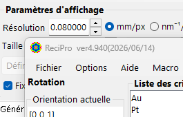

| Élément de menu | Description |
|-----------|-------------|
| **Save** | Enregistrer le diagramme de diffraction affiché dans un fichier. |
| **Save detector area** | Enregistrer uniquement le recadrage de la zone du détecteur. |
| **Copy** | Copier l'image affichée dans le presse-papiers. |
| **Copy detector area** | Copier uniquement le recadrage de la zone du détecteur. |

### Preset {#toolbar}

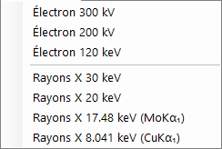

Enregistrer et rappeler une configuration complète du simulateur — longueur d'onde, géométrie du détecteur, réglages des onglets, propriétés des réflexions, etc. — sous forme de preset. Utile pour passer rapidement d'un instrument / mode d'acquisition à l'autre.

---

## Barre d'outils

| Bouton | Description |
|--------|-------------|
| Spots | Afficher / masquer la couche des réflexions de diffraction |
| Kikuchi | Afficher / masquer la couche des lignes de Kikuchi |
| Debye | Afficher / masquer la couche des anneaux de Debye |
| Scale | Afficher / masquer la couche des lignes d'échelle |
| Index / d / Distance / Excitation error / Structure factor | Choix de l'étiquette attachée à chaque réflexion |

---

## Informations sur l'écran et le détecteur

### Écran

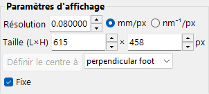

| Élément | Description |
|------|-------------|
| **Resolution** | La taille d'un pixel (mm). Elle n'a pas besoin de correspondre à la taille réelle des pixels du détecteur ; elle est traitée comme une échelle d'affichage et mise à jour automatiquement lorsque vous zoomez avec la souris. |
| **Size (W×H)** | Largeur et hauteur en pixels de la zone de tracé. Selon la résolution de votre écran, de très grandes valeurs peuvent ne pas être réglables. |
| **Set centre / Fix centre** | Régler le centre du diagramme sur n'importe quel pixel de la zone de tracé et, si nécessaire, le fixer. Lorsqu'il est fixé, le centre ne peut pas être déplacé par le déplacement à la souris. |
| **Horizontal flip / Vertical flip / Negative image** | Retournements géométriques (horizontal / vertical) et inversion du contraste du diagramme affiché. Utilisez-les pour faire correspondre l'orientation ou le contraste d'une image expérimentale. |
| **Reciprocal space** | Superpose la sphère d'Ewald et les vecteurs du réseau réciproque sur le diagramme, visualisant quelles réflexions sont excitées. |

### Détecteur (longueur de caméra)

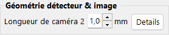

- **Camera length** : Distance de l'échantillon au détecteur (mm).
- **Details** : Ouvre la fenêtre des réglages de géométrie du détecteur (voir [Géométrie du détecteur](#detector-geometry) ci-dessous).

### Misc

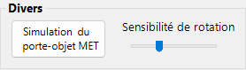

- **Rotation sensitivity** : Amplitude de la rotation du cristal par pixel de glissement de la souris.
- **TEM holder simulation** : Ouvre la fenêtre de simulation liée au porte-objet (voir ci-dessous).

---

## Simulation du porte-objet MET {#drawing-overlay-tabs}

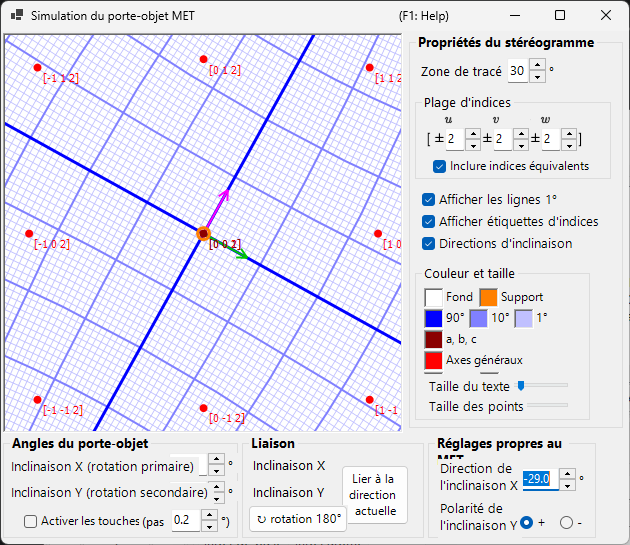

Ouvre une fenêtre qui lie le diagramme de diffraction à un **TEM holder** à double inclinaison (ou à rotation). Le réglage des angles d'inclinaison du porte-objet met à jour le diagramme et l'orientation du cristal, et les orientations accessibles peuvent être affichées sur un stéréonet (ajouté dans la v4.914). Un double-clic gauche sur le stéréonet règle l'inclinaison du porte-objet sur ce point, et cocher **Arrow keys** permet aux touches fléchées de modifier l'inclinaison pas à pas.

---

## Onglets de superposition du tracé

### General

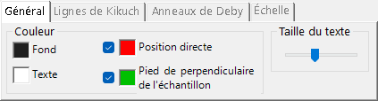

Définit les couleurs des réflexions, des étiquettes, des lignes de Kikuchi, des anneaux de Debye et des autres superpositions. Les réglages effectués ici s'appliquent à tous les modes de rendu.

### Lignes de Kikuchi

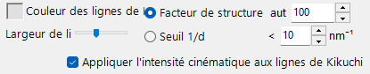

Actif lorsque les lignes de Kikuchi sont activées dans la barre d'outils.

- **Reflection selection** : Choisit quelles réflexions génèrent les lignes de Kikuchi. Soit **structure factor** (les *N* premières réflexions selon $\lvert F_{hkl}\rvert$), soit **1/d cutoff** (toutes les réflexions dont le 1/d est inférieur au seuil (nm⁻¹)).
- **Line appearance** : Définit la largeur de ligne, la couleur des lignes de Kikuchi et **Draw with kinematical intensity** (met à l'échelle l'intensité de la ligne selon l'intensité cinématique de la réflexion).
- **Threshold** : Un paramètre hérité. Exécute le calcul des lignes de Kikuchi uniquement pour les réflexions dont le *d* est supérieur à la valeur spécifiée (conservé pour compatibilité).

### Anneaux de Debye

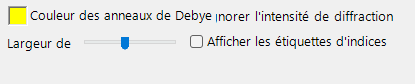

Actif lorsque les anneaux de Debye sont activés dans la barre d'outils.

- **Ignore diffraction intensity** : Si coché, tous les anneaux de Debye sont tracés avec la même couleur et la même intensité (en ignorant le facteur de structure du cristal). Utilisez-le pour une comparaison purement géométrique.
- **Show index label** : Si coché, le (*hkl*) apparaît à proximité de chaque anneau.

### Scale

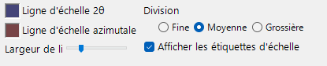

Actif lorsque les lignes d'échelle sont activées dans la barre d'outils.

- **2θ / Azimuth scale lines** : **2θ** représente un angle de diffusion constant (cercles concentriques), **Azimuth** représente un angle azimutal constant (lignes radiales depuis le centre). Les couleurs sont configurables indépendamment.
- **Line width** : Épaisseur des lignes d'échelle.
- **Division** : Intervalle angulaire entre les lignes d'échelle adjacentes.
- **Show scale labels** : Indique si des étiquettes numériques sont tracées sur les lignes d'échelle.

### Misc {#diffraction-spot-information}

Réglages divers tels que la sensibilité de rotation à la souris.

- **Mouse sensitivity** : Amplitude de la rotation du cristal par pixel de glissement de la souris.

---

## Informations sur les réflexions de diffraction

Liste les détails par réflexion calculés par la méthode des ondes de Bloch (calcul Dynamical). Ouvrez-la avec le bouton **Spot Details** (panneau de calcul d'intensité) ou la case à cocher **Details**.

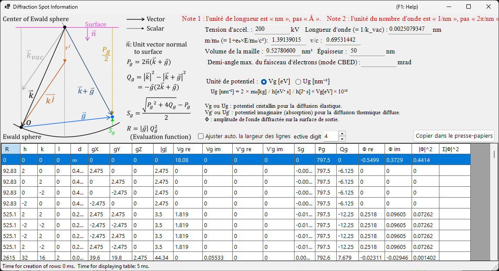

### Schéma et définitions

Le schéma (en haut à gauche) montre les vecteurs sur la sphère d'Ewald et définit les grandeurs utilisées dans le tableau ($\hat{\mathbf{n}}$ est le vecteur unitaire normal à la surface de l'échantillon, $\mathbf{k}$ est le vecteur d'onde incident, $\mathbf{g}$ est le vecteur du réseau réciproque).

- $P_g = 2\,\hat{\mathbf{n}} \cdot (\mathbf{k} + \mathbf{g})$
- $Q_g = |\mathbf{k}|^2 - |\mathbf{k} + \mathbf{g}|^2 = -\mathbf{g} \cdot (2\mathbf{k} + \mathbf{g})$
- **Erreur d'excitation :** $S_g = \dfrac{\sqrt{P_g^2 + 4 Q_g} - P_g}{2}$
- **Fonction d'évaluation :** $R = |\mathbf{g}|\, Q_g^2$ — classe les réflexions selon l'intensité de leur excitation (plus petit = plus proche de la sphère d'Ewald = plus fortement excité ; le faisceau transmis $g=0$ a $R=0$ et vient en premier). Le tableau est trié par $R$ croissant.

### Colonnes du tableau

| Colonne | Signification |
|--------|---------|
| **R** | fonction d'évaluation $R = \lvert\mathbf{g}\rvert\, Q_g^2$ (ci-dessus ; utilisée pour la sélection / l'ordonnancement des réflexions) |
| **h, k, (i,) l** | indices de Miller (*i* est l'indice hexagonal redondant, affiché uniquement pour les cristaux hexagonaux) |
| **d** | distance interréticulaire (nm) |
| **gX, gY, gZ** | composantes du vecteur du réseau réciproque *g* (1/nm) |
| **\|g\|** | norme de *g* (1/nm) |
| **Vg re / Vg im** | coefficient de Fourier du potentiel cristallin pour la diffusion élastique, $V_g$ (réel / imaginaire) |
| **V'g re / V'g im** | potentiel imaginaire (d'absorption) pour la diffusion thermique diffuse (TDS), $V'_g$ (réel / imaginaire) |
| **Sg** | erreur d'excitation $S_g$ (ci-dessus ; 1/nm) |
| **Pg** | grandeur auxiliaire $P_g = 2\,\hat{\mathbf{n}}\cdot(\mathbf{k}+\mathbf{g})$ (ci-dessus) |
| **Qg** | grandeur auxiliaire $Q_g = -\mathbf{g}\cdot(2\mathbf{k}+\mathbf{g})$ (ci-dessus) |
| **Φ re / Φ im** | amplitude complexe $\Phi$ de l'onde diffractée dynamique sur la surface de sortie (réel / imaginaire) |
| **\|Φ\|^2** | intensité diffractée $\lvert\Phi\rvert^2$ de cette réflexion |
| **Σ\|Φ\|^2** | somme cumulée de $\lvert\Phi\rvert^2$ (total sur les réflexions ; utile comme contrôle de conservation de l'intensité) |

### Unités de potentiel et autres commandes

- **Unit of potential** : Bascule le potentiel affiché entre **Vg [eV]** (potentiel électrostatique, eV) et **Ug [nm⁻²]** (la grandeur mise à l'échelle $U_g = (2 m_0/h^2)\, V_g$ qui entre dans les équations des ondes de Bloch). Les en-têtes de colonnes changent en conséquence entre *Vg / V'g* et *Ug / U'g*.
- Au-dessus du tableau sont affichés la tension d'accélération, la longueur d'onde ($\lambda = 1/k_\text{vac}$), le rapport de masse relativiste $m/m_0$, le rapport de vitesse $v/c$, le volume de la maille, l'épaisseur de l'échantillon et (en mode CBED) le demi-angle maximal du faisceau d'électrons.
- **Note 1 :** l'unité de longueur est le **nm**, pas l'Å. **Note 2 :** l'unité de nombre d'onde est le **1/nm**, pas le 2π/nm.
- **Effective digit** : nombre de chiffres significatifs affichés dans le tableau. **Auto resize row width** : ajustement automatique des largeurs de colonnes. **Copy to clipboard** : exporte le tableau sous forme de texte pouvant être collé dans un tableur. (Ce formulaire est affiché en anglais même sous une interface en japonais.)

---

## Géométrie du détecteur {#detector-geometry}

Une fenêtre pour la configuration détaillée de la géométrie du détecteur (longueur de caméra, inclinaison, rotation) et la superposition d'une image expérimentale. Ouvrez-la via **Details** dans le panneau **Detector geometry**.

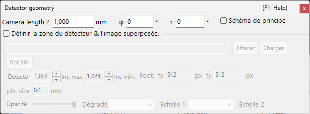

### Réglages de la géométrie du détecteur

Spécifiez la géométrie de réflexion telle que la longueur de caméra et l'inclinaison du détecteur (**Tau / Phi**). Pour Back Laue (Laue en rétroréflexion), réglez ici la géométrie qui place le détecteur du côté de la source.

### Zone du détecteur et image superposée

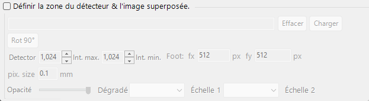

Spécifiez la zone active du détecteur et déposez une image expérimentale pour la superposer. Utilisez ceci pour superposer le diagramme simulé et une image expérimentale et affiner la géométrie du détecteur.

Voir aussi [Système de coordonnées du détecteur](../appendix/a1-coordinate-system/2-diffraction.md) pour les définitions du système de coordonnées.

---

## Compression dynamique

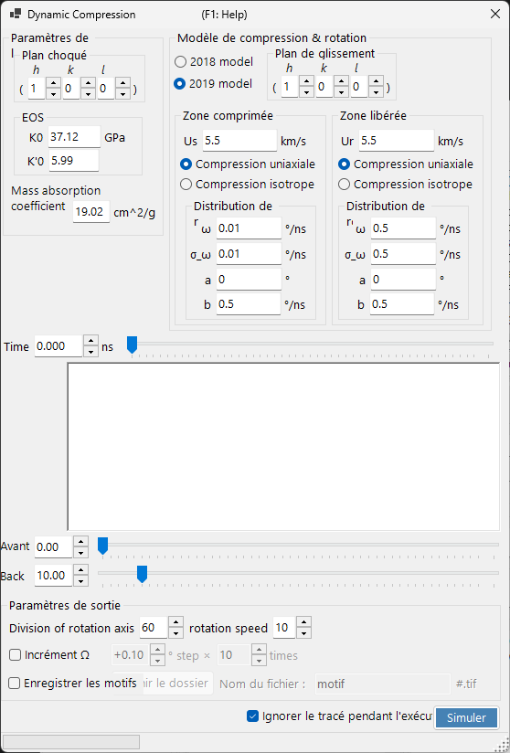

Une fenêtre pour balayer le profil pression/temps d'une expérience à haute pression (compression dynamique). Déposez un profil pression/temps `.txt` sur cette fenêtre pour le charger, puis faites glisser la ligne rouge dans le graphique pour parcourir continuellement le temps (la pression) tout en reflétant l'état correspondant dans le diagramme de diffraction.

---

## Sujets connexes

- [Simulation de diffraction des rayons X](4-x-ray-neutron-diffraction.md)
- [Simulation SAED](1-saed-simulation.md)
- [Simulation PED](2-ped-simulation.md)
- [Simulation CBED](3-cbed-simulation.md)
- [Calcul dynamique (cœur partagé)](../appendix/a3-bloch-wave/calculation.md)
- [Système de coordonnées du détecteur](../appendix/a1-coordinate-system/2-diffraction.md)
