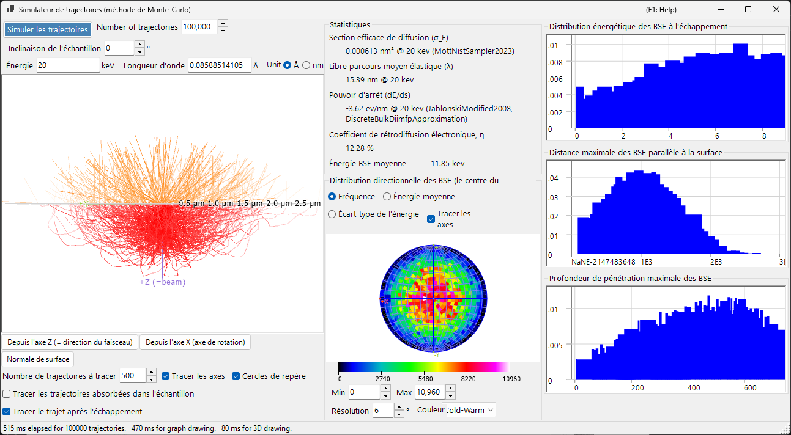
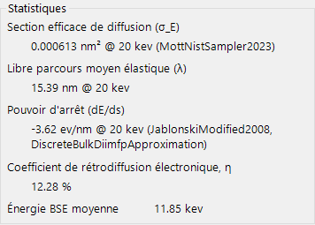
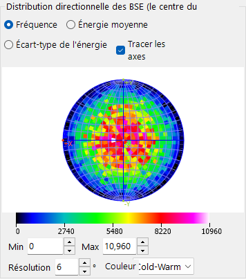
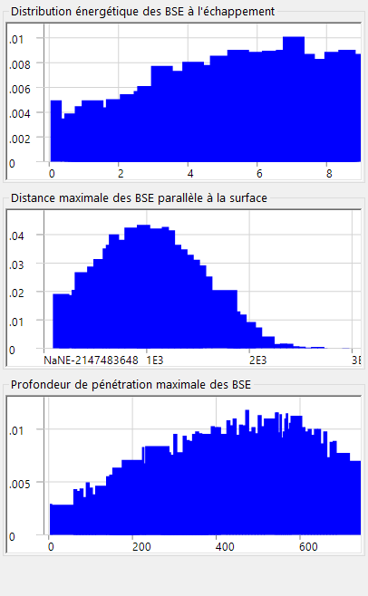

# Trajectoires électroniques

Le **Simulateur de trajectoire** calcule les trajectoires électroniques à l'intérieur d'un échantillon par la **méthode de Monte-Carlo** : les électrons incidents subissent une diffusion élastique et inélastique, et les distributions résultantes des électrons rétrodiffusés (direction, énergie, profondeur de pénétration) sont accumulées. Ces distributions alimentent également la pondération angulaire/énergétique/en profondeur utilisée par la [12. Simulation EBSD](12-ebsd-simulation.md).

---

## Raccourcis clavier et souris

Les trajectoires sont affichées dans une vue 3-D OpenGL. Elle utilise la [navigation de vue](21-shortcuts.md) standard de ReciPro, mais **le déplacement est désactivé** — utilisez les boutons de préréglage de vue pour passer aux orientations standard.

| Raccourci | Action |
|----------|--------|
| <kbd>F1</kbd> | Ouvrir cette page du manuel en ligne |
| Glisser avec le bouton gauche | Faire pivoter le modèle |
| Glisser vers le haut/bas avec le bouton droit, ou molette de la souris | Zoom |
| <kbd>CTRL</kbd> + Double-clic droit | Basculer entre la projection orthographique / perspective |

→ Voir **[21. Raccourcis clavier et souris](21-shortcuts.md)** pour une vue d'ensemble de toutes les fenêtres.

---

## Conditions de calcul

Énergie du faisceau, nombre d'électrons incidents, échantillon/matériau et autres paramètres de Monte-Carlo (voir la capture d'écran d'ensemble ci-dessus).

### Énergie du faisceau

Tension d'accélération du faisceau d'électrons incident (keV). Définit l'énergie cinétique utilisée à la fois pour les modèles de diffusion élastique (Mott) et inélastique (réponse diélectrique).

### Nombre d'électrons incidents

Nombre d'électrons à simuler. Davantage d'électrons réduisent le bruit statistique mais augmentent linéairement le temps d'exécution.

### Échantillon / matériau

Composition et densité de l'échantillon. Par défaut, le cristal actuellement sélectionné dans la fenêtre principale, mais cela peut être remplacé pour des études portant uniquement sur les trajectoires.

### Inclinaison de l'échantillon

Angle d'inclinaison de l'échantillon. Utilisé lorsque les données de trajectoire alimentent le [simulateur EBSD](12-ebsd-simulation.md) (typiquement 70° pour l'EBSD).

### Modèle de section efficace

Le modèle de section efficace de diffusion élastique (Mott / Bethe / NIST). Les différents modèles font un compromis entre vitesse et précision aux grands angles d'inclinaison ou à proximité des seuils d'absorption.

---

## Options du stéréonet

Options d'affichage de la distribution angulaire tracée sur la projection stéréographique (voir la capture d'écran d'ensemble ci-dessus).

### Méthode de projection

Projection **Wulff** (équiangulaire) ou **Schmidt** (équi-aire). Schmidt est généralement préférée lors de la lecture de la densité statistique.

### Hémisphère

Trace l'hémisphère supérieur (rétrodiffusé) ou inférieur (transmis).

### Résolution / Échelle de couleurs

Largeur de classe de l'histogramme angulaire et carte de couleurs utilisée pour l'affichage de la densité.

---

## Statistiques

Résumé de l'exécution.

- **Rendement de rétrodiffusion** — fraction des électrons incidents qui ressortent par la surface d'entrée.
- **Libre parcours moyen** — distance moyenne entre les événements de diffusion.
- **Profondeur de pénétration moyenne** — profondeur maximale moyenne atteinte par un électron avant qu'il ne ressorte ou soit absorbé.
- **Temps écoulé / Débit** — coût en temps réel de l'exécution.

---

## Distribution directionnelle des BSE

Distribution angulaire des électrons rétrodiffusés (le centre du stéréonet correspond à la direction de la normale à la surface). Le contour jaune/orange (lorsqu'il est présent) marque la région sous-tendue par le détecteur EBSD.

---

## Profils

Profils en profondeur et en énergie des électrons simulés.

### Profil en profondeur

Histogramme de la profondeur de sortie finale (nm) des électrons rétrodiffusés. Utilisé par le simulateur EBSD pour pondérer l'intégration en profondeur du master pattern.

### Profil énergétique

Histogramme de la perte d'énergie ΔE (keV) des électrons rétrodiffusés. Utilisé par le simulateur EBSD pour pondérer l'intégration en énergie.

---

## Voir aussi

- [Simulation EBSD](12-ebsd-simulation.md)
- [Calcul EBSD](appendix/a3-bloch-wave/ebsd.md)
- [Diffraction dynamique (onde de Bloch)](appendix/a3-bloch-wave/index.md)
- [Simulateur HRTEM/STEM](9-hrtem-stem-simulator/index.md)
- [Simulateur de diffraction](7-diffraction-simulator/index.md)
