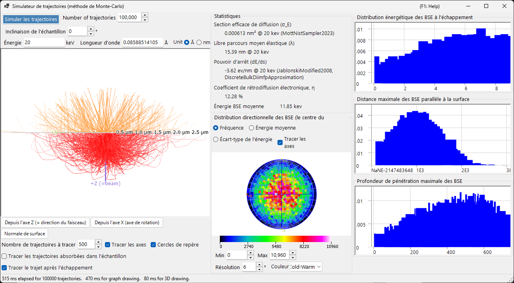
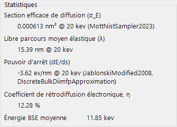
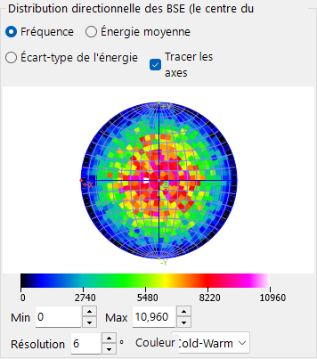
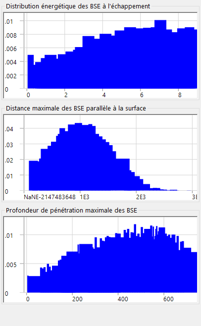

# Trajectoires électroniques

Le **Simulateur de trajectoires (méthode de Monte-Carlo)** calcule les trajectoires électroniques à l'intérieur d'un échantillon par la **méthode de Monte-Carlo** : les électrons incidents subissent une diffusion élastique et inélastique, et les distributions résultantes des électrons rétrodiffusés (BSE) — direction, énergie à l'échappement, profondeur de pénétration et étalement latéral — sont accumulées. Ces distributions alimentent également la pondération angulaire/énergétique/en profondeur utilisée par la [12. Simulation EBSD](12-ebsd-simulation.md).

La fenêtre comporte trois colonnes : la **vue 3-D des trajectoires** à gauche, les **Statistiques** et le stéréonet de **distribution directionnelle des BSE** au centre, et trois **histogrammes** à droite. La composition et la densité de l'échantillon proviennent du cristal sélectionné dans la fenêtre principale ; seuls l'énergie du faisceau, l'inclinaison de l'échantillon et le nombre de trajectoires se règlent ici.

---

## Raccourcis clavier et souris

Les trajectoires sont affichées dans une vue 3-D OpenGL. Elle utilise la [navigation de vue](21-shortcuts.md) standard de ReciPro, mais **le déplacement est désactivé** — utilisez les boutons de préréglage de vue pour passer aux orientations standard.

| Raccourci | Action |
|----------|--------|
| <kbd>F1</kbd> | Ouvrir cette page du manuel en ligne |
| Glisser avec le bouton gauche | Faire pivoter le modèle |
| Glisser vers le haut/bas avec le bouton droit, ou molette de la souris | Zoom |
| <kbd>CTRL</kbd> + Double-clic droit | Basculer entre la projection orthographique / perspective |

→ Voir **[21. Raccourcis clavier et souris](21-shortcuts.md)** pour une vue d'ensemble de toutes les fenêtres.

---

## Conditions de calcul

Les commandes situées en haut de la fenêtre définissent le calcul :

- **Simuler les trajectoires** : lance le calcul de Monte-Carlo. La barre d'état en bas de la fenêtre indique séparément le temps écoulé pour le calcul des trajectoires, le tracé des graphiques et le rendu 3-D.
- **Number of trajectories** : nombre d'électrons incidents à suivre. Davantage d'électrons réduisent le bruit statistique de toutes les distributions ci-dessous, au prix d'un temps d'exécution qui croît linéairement.
- **Inclinaison de l'échantillon** (°) : inclinaison de la surface de l'échantillon autour de l'axe *X*. Laissez 0 pour une incidence normale ; utilisez **−70°** pour reproduire la géométrie du [simulateur EBSD](12-ebsd-simulation.md), où la forte inclinaison augmente le rendement de rétrodiffusion.
- **Energy** (keV) / **Wavelength** / **Unit** : la tension d'accélération du faisceau incident, et la longueur d'onde électronique corrigée relativistement qui lui est liée. L'énergie fixe l'énergie cinétique utilisée à la fois par le modèle élastique (Mott NIST) et par le modèle inélastique (pouvoir d'arrêt / IMFP).

Les modèles de diffusion eux-mêmes ne sont pas sélectionnables par l'utilisateur : les sections efficaces élastiques proviennent de la table de Mott NIST fournie (avec repli sur la formule de Rutherford écrantée hors de son domaine), et le pouvoir d'arrêt de la forme de Jablonski modifiée (2008). Le modèle effectivement utilisé est indiqué à côté de chaque valeur dans **Statistiques**. Voir [Atténuation et transport](appendix/a2-beam-interaction/attenuation-transport.md) pour la description de ces modèles.

### Vue 3-D des trajectoires

Les trajectoires rouges sont celles des électrons absorbés dans l'échantillon, les orange celles des électrons qui s'échappent en tant qu'électrons rétrodiffusés. Les cercles de repère concentriques sont gradués en nm (ou µm), et **+X**, **+Y**, **+Z (=beam)** indiquent les axes.

- **Depuis l'axe Z (= direction du faisceau)** / **Depuis l'axe X (axe de rotation)** / **Normale de surface** : orientent la vue selon les directions standard.
- **Nombre de trajectoires à tracer** : nombre de trajectoires calculées à afficher (tracer chacune des 100 000 trajectoires serait illisible et lent).
- **Tracer les axes** / **Cercles de repère** : les flèches des axes et l'échelle des distances.
- **Tracer les trajectoires absorbées dans l'échantillon** : inclut les électrons qui ne s'échappent jamais.
- **Tracer le trajet après l'échappement** : continue à tracer le trajet d'un électron rétrodiffusé après qu'il a quitté la surface.

---

## Statistiques

Valeurs pour l'énergie de faisceau actuelle, avec entre crochets le modèle qui a produit chacune d'elles.

- **Section efficace de diffusion (σ_E)** (nm²) — section efficace élastique totale par atome.
- **Libre parcours moyen élastique (λ)** (nm) — distance moyenne entre deux événements de diffusion élastique.
- **Pouvoir d'arrêt (dE/ds)** (eV/nm, négatif) — énergie perdue par unité de longueur de trajet.
- **Coefficient de rétrodiffusion électronique, η** (%) — fraction des électrons incidents qui ressortent par la surface d'entrée. C'est la grandeur sur laquelle repose le contraste de l'imagerie BSE.
- **Énergie BSE moyenne** (keV) — énergie moyenne des électrons rétrodiffusés au moment de leur échappement.

---

## Distribution directionnelle des BSE

Distribution angulaire des électrons rétrodiffusés, tracée sur un stéréonet dont le centre correspond à la direction de la normale à la surface.

- **Fréquence** / **Énergie moyenne** / **Écart-type de l'énergie** : la grandeur représentée en couleur — le nombre d'électrons sortant dans chaque direction, leur énergie moyenne, ou la dispersion de cette énergie.
- **Tracer les axes** : superpose les directions +X / ±Y / ±Z.
- **Min** / **Max**, **Resolution**, **Couleur** : les bornes de l'échelle de couleurs, la largeur des classes angulaires de l'histogramme, et la carte de couleurs.

---

## Histogrammes

Trois distributions des électrons rétrodiffusés, toutes normalisées à une aire unité.

### Distribution énergétique des BSE à l'échappement

Histogramme de l'**énergie que les électrons rétrodiffusés possèdent encore lorsqu'ils quittent l'échantillon** (keV) — et non de leur perte d'énergie. Le simulateur EBSD l'utilise pour pondérer l'intégration en énergie du master pattern.

### Distance maximale des BSE parallèle à la surface

Histogramme de la distance parcourue **latéralement** (parallèlement à la surface, nm) par chaque électron rétrodiffusé avant son échappement. Elle donne la taille latérale du volume d'interaction, et donc la limite intrinsèque de résolution spatiale d'une mesure BSE ou EBSD.

### Profondeur de pénétration maximale des BSE

Histogramme de la profondeur maximale **perpendiculairement à la surface** (nm) atteinte par chaque électron rétrodiffusé avant son échappement. Le simulateur EBSD l'utilise pour pondérer l'intégration en profondeur du master pattern.

---

## Voir aussi

- [Simulation EBSD](12-ebsd-simulation.md)
- [Calcul EBSD](appendix/a3-bloch-wave/ebsd.md)
- [Atténuation et transport](appendix/a2-beam-interaction/attenuation-transport.md) — les sections efficaces élastiques, le pouvoir d'arrêt et les parcours utilisés ici.
- [Diffraction dynamique (onde de Bloch)](appendix/a3-bloch-wave/index.md)
- [Simulateur HRTEM/STEM](9-hrtem-stem-simulator/index.md)
- [Simulateur de diffraction](7-diffraction-simulator/index.md)
