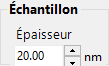
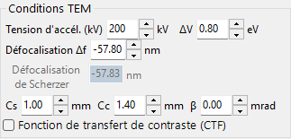
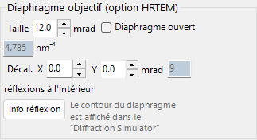
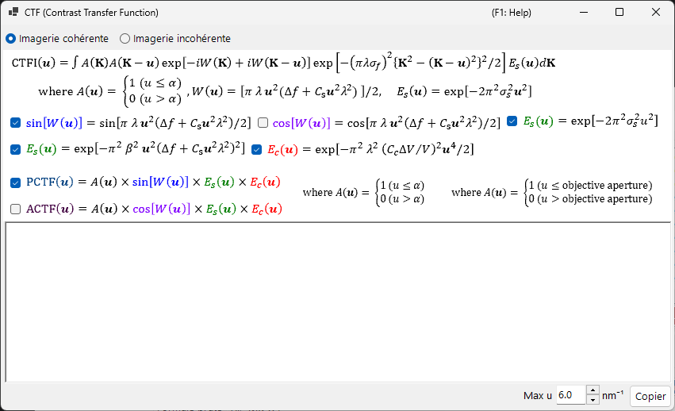
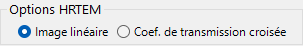
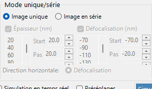
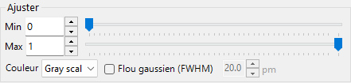

# Simulation HRTEM

Simule des images de franges de réseau en TEM haute résolution. Le mode principal du [Simulateur HRTEM/STEM](index.md).

---

## Déroulement du calcul

1. **Méthode des ondes de Bloch** : calcule la propagation de l'onde électronique à travers le potentiel cristallin ; fournit l'amplitude et la phase de l'onde sortante
2. **Fonction de lentille** : applique les aberrations de la lentille objectif (aberration sphérique $C_s$, défocalisation $\Delta f$)
3. **Cohérence partielle** : prend en compte la taille finie de la source (cohérence spatiale) et la largeur en énergie (cohérence temporelle)
4. **Formation de l'image** : calcule l'intensité $|\psi(\mathbf{r})|^2$

---

## Paramètres de l'échantillon

| Paramètre | Description |
|-----------|-------------|
| **Thickness** | Épaisseur de l'échantillon (nm). Les images HRTEM dépendent fortement de l'épaisseur |

---

## Paramètres optiques

### Conditions TEM

| Paramètre | Description |
|-----------|-------------|
| **Acc. Vol.** | Tension d'accélération (kV). La longueur d'onde corrigée relativistiquement est affichée à côté |
| **Defocus** | Valeur de défocalisation (nm). Le défocus de Scherzer est affiché comme référence |

### Paramètres intrinsèques

| Paramètre | Description | Typique |
|-----------|-------------|---------|
| **Cs** | Aberration sphérique (mm) | 0.5–1.0 (conventionnelle) ; < 0.01 (corrigée Cs) |
| **Cc** | Aberration chromatique (mm) | 1.0–2.0 |
| **β** | Demi-angle d'illumination (mrad) | 0.1–1.0 |
| **ΔE** | Largeur en énergie à 1/*e* (eV) | 0.5–2.0 |

---

## Fonction de transfert de contraste de phase (PCTF)

Affichée dans l'onglet de la fonction de lentille :

- $\sin\chi(u)$ : fonction de transfert de contraste de phase ($\chi(u)$ est la fonction d'aberration de la lentille)
- $E_\text{s}(u)$ : enveloppe de cohérence spatiale
- $E_\text{c}(u)$ : enveloppe de cohérence temporelle

Défocus de Scherzer : $\Delta f = -\sqrt{\tfrac{4}{3}\,C_s \lambda}\ (\approx -1.155\,\sqrt{C_s \lambda})$, la condition qui donne une large bande PCTF négative (contraste sombre = positions atomiques). ReciPro utilise cette valeur originale de Scherzer — obtenue en fixant le minimum de la phase d'aberration $\chi$ à $-2\pi/3$ — et la valeur affichée dans l'interface suit cette formule ; certaines références utilisent plutôt la valeur de *Scherzer étendue* $-1.2\sqrt{C_s\lambda}$.

---

## Diaphragme objectif

Définissez la taille du diaphragme (mrad) et sa position. **Open aperture** le supprime. Le nombre d'ondes de Bloch prises en compte dépend des conditions du diaphragme.

---

## Modèles de cohérence partielle

| Modèle | Description |
|-------|-------------|
| **Quasi-coherent (linear image)** | Rapide. Valide sous l'approximation de phase faible |
| **TCC (Transmission Cross Coefficient)** | Plus précis ; temps de calcul plus long |

---

## Modes de simulation

| Mode | Description |
|------|-------------|
| **Single image** | Une image à l'épaisseur et au défocus actuels |
| **Serial image** | Matrice d'images sur des plages d'épaisseur × défocus (Start / Step / Num) |

---

## Ajustement de l'image

| Réglage | Description |
|---------|-------------|
| **Min / Max** | Plage d'affichage (curseurs d'ajustement de l'image) |
| **Colour** | Niveaux de gris ou Cold-Warm |
| **Gaussian blur (FWHM)** | Applique un filtre gaussien |
| **Unit cell** | Superpose une grille de maille |
| **Scale** | Affiche une barre d'échelle |

---

## Voir aussi

- [Simulateur HRTEM/STEM (aperçu)](index.md)
- [Simulation STEM](2-stem-simulation.md)
- [Simulation de potentiel](3-potential-simulation.md)
- [Annexe A3.2 — Formation de l'image HRTEM](../appendix/a3-bloch-wave/hrtem.md)
