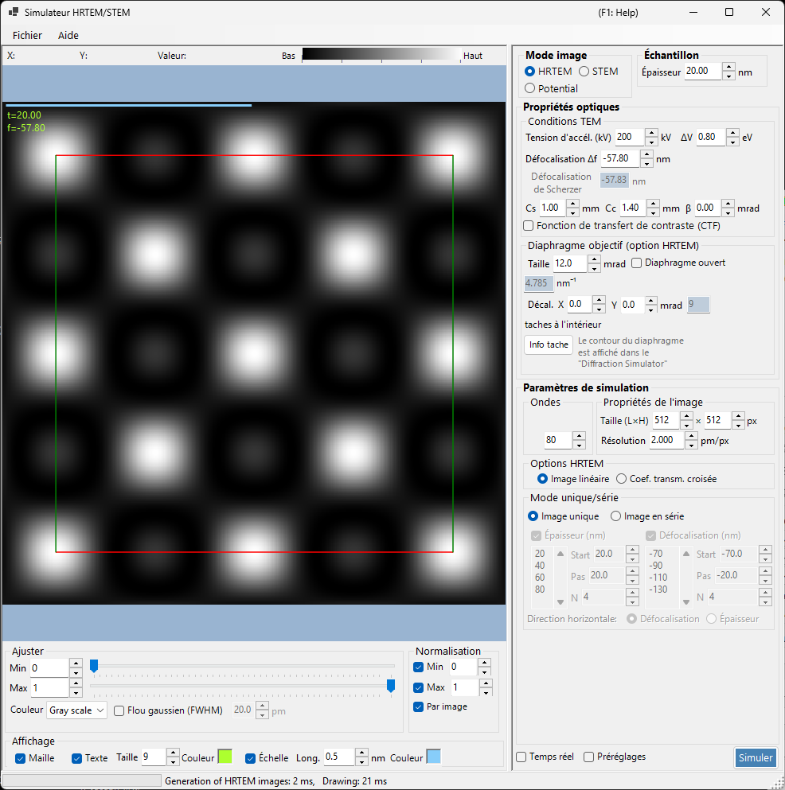
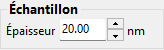
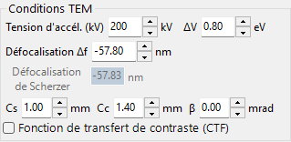
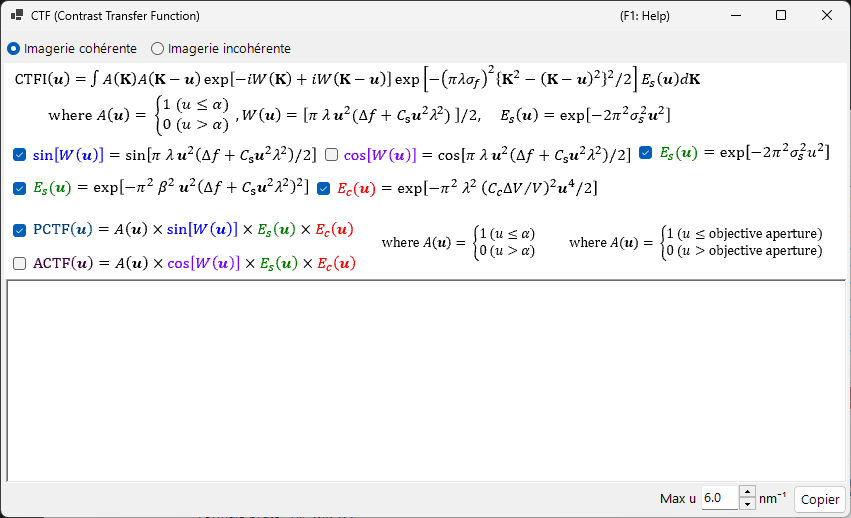
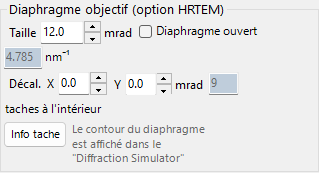
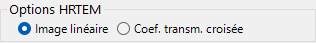
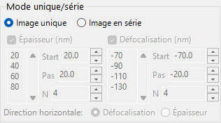
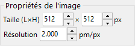
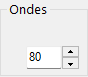

# Simulation HRTEM

La simulation **HRTEM (High-Resolution Transmission Electron Microscopy)** calcule des images de franges de réseau en MET haute résolution. C'est le mode principal du [Simulateur HRTEM/STEM](index.md).

> Cette page décrit tous les réglages qui apparaissent à droite lorsque **Mode image = HRTEM**. Pour les commandes situées à gauche — affichage du résultat et réglage de sa luminosité — voir la [page de présentation](index.md#display-settings).

---

## Présentation

Une image HRTEM se forme lorsque l'onde électronique transmise à travers l'échantillon est imagée sous l'influence des aberrations de la lentille objectif. ReciPro calcule la propagation de l'onde électronique dans l'échantillon avec la méthode des ondes de Bloch (calcul dynamique) et génère l'image HRTEM au moyen de la fonction de transfert de contraste de phase (PCTF).

### Déroulement du calcul

1. **Méthode des ondes de Bloch** : calcule la propagation de l'onde électronique dans le potentiel cristallin et obtient l'amplitude et la phase de l'onde sortante
2. **Fonction de lentille** : applique les aberrations de la lentille objectif (aberration sphérique $C_s$, défocalisation $\Delta f$)
3. **Cohérence partielle** : prend en compte la taille finie de la source (cohérence spatiale) et la fluctuation d'énergie (cohérence temporelle)
4. **Formation de l'image** : calcule la distribution d'intensité $|\psi(\mathbf{r})|^2$

Pour la théorie, voir l'[Annexe A3.2 — Formation de l'image HRTEM](../appendix/a3-bloch-wave/hrtem.md).

---

## Échantillon

- **Épaisseur** : épaisseur de l'échantillon (nm). Les images HRTEM dépendent fortement de l'épaisseur. En mode **Image en série**, cette valeur est ignorée et c'est la liste d'épaisseurs décrite plus bas qui est utilisée.

---

## Conditions TEM

Définit les conditions d'imagerie de la lentille objectif.

| Paramètre | Description | Par défaut / typique |
|-----------|-------------|-------------------|
| **Tension d'accél. (kV)** | Tension d'accélération. La longueur d'onde des électrons corrigée relativistiquement est affichée à droite | 200 kV |
| **Défocalisation Δf** | Défocalisation de la lentille objectif (nm). La valeur de référence de la **défocalisation de Scherzer** est affichée en dessous | −57.8 nm |
| **Cs** | Coefficient d'aberration sphérique (mm). Affecte la CTF et la défocalisation de Scherzer | 0.5–1.0 (conventionnel), < 0.01 (corrigé Cs) |
| **Cc** | Coefficient d'aberration chromatique (mm). Détermine le flou de l'image dû à la dispersion en énergie | 1.0–2.0 mm |
| **β** | Demi-angle d'illumination (mrad). Représente l'effet de taille finie de la source (cohérence spatiale) | 0.1–1.0 mrad |
| **ΔV** | Largeur à mi-hauteur de la dispersion en énergie des électrons (eV). Avec Cc, elle détermine l'étalement de focalisation dû à l'aberration chromatique | 0.5–2.0 eV |

> **Menu contextuel** : sur le panneau Conditions TEM, vous pouvez appliquer en un clic **Mettre toutes les aberrations à zéro** / **Régler la défocalisation à la valeur de Scherzer** / **Régler la défocalisation à 0 nm**. Des préréglages de conditions (300kV ARM300F, 200kV 2100F, etc.) sont disponibles via **Préréglages** en bas à gauche.

### Défocalisation de Scherzer

La valeur de défocalisation au voisinage de laquelle le contraste de phase est optimal, calculée à partir de la longueur d'onde actuelle et de l'aberration sphérique $C_s$ (affichée pour référence).

$$\Delta f_{\text{Scherzer}} = -\sqrt{\tfrac{4}{3}\,C_s \lambda}\quad\left(\approx -1.155\,\sqrt{C_s \lambda}\right)$$

Dans cette condition, la PCTF est négative sur une large plage de fréquences spatiales, de sorte que les positions atomiques apparaissent en contraste sombre. ReciPro adopte cette valeur de Scherzer originale (obtenue en fixant le minimum de la phase d'aberration $\chi$ à $-2\pi/3$), et la valeur affichée dans l'interface suit cette formule. Notez que certaines références utilisent plutôt la valeur de *Scherzer étendue* $-1.2\sqrt{C_s\lambda}$, qui élargit davantage la bande de transfert.

---

## Fonction de lentille / Fonction de transfert de contraste (CTF)

Cocher **Fonction de transfert de contraste (CTF)** ouvre une fenêtre qui trace la manière dont les aberrations de la lentille et la défocalisation transfèrent le contraste de l'image à chaque fréquence spatiale.

- $\sin\chi(u)$ : fonction de transfert de contraste de phase ($\chi(u)$ est la fonction d'aberration de la lentille)
- $E_\text{s}(u)$ : fonction enveloppe de cohérence spatiale ; l'amortissement dû à la taille finie de la source ($\beta$)
- $E_\text{c}(u)$ : fonction enveloppe de cohérence temporelle ; l'amortissement dû à la fluctuation d'énergie ($C_c$, $\Delta V$)

Modifier la limite supérieure de l'axe horizontal $u$ (fréquence spatiale) change la plage tracée.

---

## Diaphragme objectif (option HRTEM)

Limite les ondes diffractées qui traversent le diaphragme objectif. Le nombre d'ondes diffractées coupées par le diaphragme modifie aussi le nombre de taches incluses dans le calcul des ondes de Bloch (la borne supérieure est le nombre maximal d'ondes de Bloch défini dans **Ondes**).

- **Taille** : demi-angle du diaphragme objectif (mrad). Plus il est petit, plus les ondes diffractées aux grands angles sont coupées, et plus les détails haute résolution sont lissés. Le rayon équivalent dans l'espace réciproque $\sin\theta/\lambda$ (nm⁻¹) est affiché.
- **Décal. X** / **Y** : décalage du centre du diaphragme objectif (mrad). Utilisé pour l'imagerie en champ sombre et en faisceau incliné.
- **Diaphragme ouvert** : ouvre le diaphragme objectif (infini), de sorte que toutes les ondes diffractées contribuent à l'image.
- **taches à l'intérieur** : le nombre de faisceaux diffractés (taches) situés à l'intérieur du diaphragme (lecture seule).
- **Info tache** : ouvre un tableau listant les faisceaux diffractés à l'intérieur du diaphragme (intensité, amplitude complexe, etc.).

> La taille du diaphragme objectif est également affichée dans le **Simulateur de diffraction**.

---

## Options HRTEM (modèle de cohérence partielle)

Sélectionne le modèle d'interférence utilisé pour intégrer les contributions de toutes les directions du faisceau incident.

- **Image linéaire** : peu coûteux en calcul. Adapté aux échantillons minces pour lesquels l'approximation de l'objet de phase faible est valable ; il multiplie la PCTF par les enveloppes de cohérence spatiale et temporelle.
- **Coef. transm. croisée** : coûteux en calcul mais plus précis. Il intègre le coefficient de transmission croisée complet ; c'est le modèle à utiliser pour les diffuseurs forts qui excitent de nombreuses ondes diffractées intenses.

Pour plus de détails, voir l'[Annexe A3.2 — Formation de l'image HRTEM](../appendix/a3-bloch-wave/hrtem.md).

---

## Mode unique/série

- **Image unique** : calcule une image HRTEM à l'épaisseur et à la défocalisation actuelles.
- **Image en série** : génère un ensemble d'images en faisant varier par pas l'épaisseur et la défocalisation (série en épaisseur / série focale). Utile pour trouver la condition qui correspond le mieux à une image expérimentale.

Pour une image en série, définissez les éléments suivants.

| Élément | Description |
|------|-------------|
| **Épaisseur (nm)** / **Défocalisation (nm)** | La grandeur à faire varier (les deux sont possibles) |
| **Start / Pas / N** | Valeur de départ, largeur du pas et nombre d'images. Ils sont développés dans la zone de liste ci-dessous, qui peut aussi être modifiée directement |
| **Direction horizontale:** | Lorsque l'épaisseur et la défocalisation varient toutes deux, la grandeur disposée selon la direction horizontale de la grille (**Défocalisation** ou **Épaisseur**) |

Faire varier à la fois l'épaisseur et la défocalisation produit une matrice d'images lignes × colonnes.

---

## Propriétés de l'image

- **Taille (L×H)** : nombre de pixels de l'image simulée (512×512 par défaut).
- **Résolution** : résolution d'échantillonnage (pm/px). Une valeur plus petite résout des franges de réseau plus fines, mais le temps de FFT augmente proportionnellement.

---

## Ondes

- Nombre maximal d'ondes de Bloch utilisées dans la méthode de Bethe (calcul dynamique), 80 par défaut. Un nombre plus élevé améliore la précision, mais la résolution du problème aux valeurs propres prend un temps en $O(N^3)$.

---

## Voir aussi

- [Simulateur HRTEM/STEM (présentation)](index.md)
- [Simulation STEM](2-stem-simulation.md)
- [Simulation du potentiel](3-potential-simulation.md)
- [Annexe A3.2 — Formation de l'image HRTEM](../appendix/a3-bloch-wave/hrtem.md)
