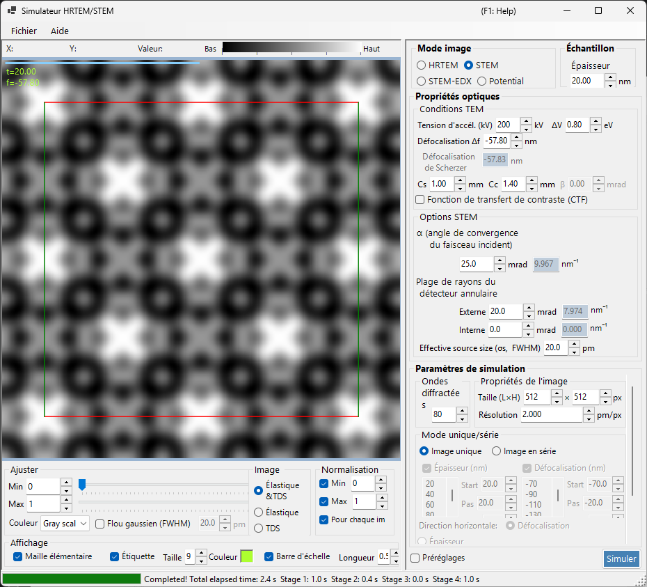

# Simulation STEM

La simulation **STEM (Scanning Transmission Electron Microscopy)** calcule des images de microscopie électronique en transmission à balayage à l'aide de la méthode des ondes de Bloch.

> Cette page répertorie tous les réglages qui apparaissent à droite lorsque **Image mode = STEM**. Pour les commandes d'affichage du résultat, de luminosité et de normalisation situées à gauche, voir la [page de présentation](index.md). Seule la **cible d'affichage** spécifique au STEM est reprise ci-dessous.

---

## Présentation

Un faisceau électronique convergent est balayé sur l'échantillon, et les électrons transmis et diffusés à chaque position de balayage sont collectés par des détecteurs annulaires. ReciPro calcule l'image STEM avec la méthode des ondes de Bloch (calcul dynamique).

### Déroulement du calcul

1. À chaque position de balayage, calculer les intensités diffractées avec la méthode des ondes de Bloch pour chaque direction d'incidence de la sonde convergente.
2. Intégrer l'intensité diffusée sur la plage angulaire du détecteur.
3. Les contributions de la diffusion élastique et de la diffusion thermique diffuse (TDS) peuvent toutes deux être calculées.

Voir l'[Annexe A3.4 — Calcul STEM](../appendix/a3-bloch-wave/stem.md) pour la théorie.

---

## Types de détecteurs

| Détecteur | Plage angulaire | Contribution principale | Contraste |
|----------|-------------|-------------------|----------|
| **BF** (fond clair) | 0 – angle de convergence | Élastique | Contraste de phase |
| **ABF** (fond clair annulaire) | Partie interne de l'angle de convergence | Élastique | Sensible aux éléments légers |
| **LAADF** (fond noir annulaire à petit angle) | Juste à l'extérieur de l'angle de convergence | Élastique + TDS | Sensible aux déformations |
| **HAADF** (fond noir annulaire à grand angle) | Bien à l'extérieur de l'angle de convergence | TDS (inélastique) | Contraste en Z ($\propto Z^2$) |

> **Réglages de détecteur typiques** (chacun disponible en un clic depuis le menu contextuel des options STEM, tous avec un angle de convergence α = 25 mrad) :
> BF (0–5 mrad) / ABF (12–24 mrad) / LAADF (26–60 mrad) / HAADF (80–250 mrad)

---

## Paramètres de l'échantillon

- **Thickness** : épaisseur de l'échantillon (nm). Cette valeur est ignorée en mode **Serial image**.

---

## Conditions MET

| Paramètre | Description | Par défaut / typique |
|-----------|-------------|-------------------|
| **Acc. Vol. (kV)** | Tension d'accélération. La longueur d'onde des électrons corrigée relativistiquement est affichée à côté | 200 kV |
| **Defocus Δf** | Défocalisation de la lentille objectif (lentille formant la sonde) (nm) | −57.8 nm |
| **Cs** | Coefficient d'aberration sphérique (mm). Affecte la taille de la sonde | 0.5–1.0 mm |
| **Cc** | Coefficient d'aberration chromatique (mm) | 1.0–2.0 mm |
| **ΔV (FWHM)** | Largeur à mi-hauteur de la dispersion en énergie des électrons (eV) | 0.5–2.0 eV |

> **β (demi-angle d'illumination) est désactivé en mode STEM**, car l'angle de convergence α en assume le rôle.

---

## Options STEM (optique)

Définissez la géométrie de la sonde convergente et du détecteur annulaire. Chaque angle est également affiché à droite après conversion en rayon dans l'espace réciproque $\sin\theta/\lambda$ (nm⁻¹).

| Paramètre | Description | Par défaut / typique |
|-----------|-------------|-------------------|
| **α (convergence angle)** | Demi-angle de la sonde convergente (mrad). Des valeurs plus grandes donnent une sonde plus fine et modifient le contraste de diffraction | 15–25 mrad |
| **(Annular) detector inner angle** | Demi-angle de collection interne du détecteur annulaire (mrad). Le signal à l'intérieur de cet angle est exclu | BF: 0, HAADF: 80 |
| **(Annular) detector outer angle** | Demi-angle de collection externe du détecteur annulaire (mrad). Le signal à l'extérieur de cet angle est exclu | BF: 5, HAADF: 250 |
| **Effective source size σs (FWHM)** | Taille effective de la source d'électrons. Des valeurs plus grandes brouillent la sonde et réduisent le contraste des détails fins | — |

---

## Options STEM (simulation)

- **Slice thickness for inelastic** : épaisseur de tranche de l'échantillon (nm) utilisée lors du calcul de l'intensité TDS (thermique diffuse, inélastique). Des valeurs plus petites sont plus précises mais plus lentes.
- **Angular resolution** : résolution d'échantillonnage angulaire des directions d'incidence de la sonde (mrad). Des valeurs plus petites échantillonnent la sonde plus finement mais sont plus lentes.

---

## Mode d'image (single / serial)

- **Single image** : calcule une seule image STEM à l'épaisseur courante.
- **Serial image** : génère une série d'images avec l'épaisseur / la défocalisation variées par paliers (définies via **Start / Step / Num** ; la liste ci-dessous peut aussi être modifiée directement).

---

## Propriétés de l'image

- **Size (W×H)** : nombre de pixels de l'image balayée (par défaut 512×512). En STEM, cela correspond au nombre de points de balayage et fait varier linéairement le temps de calcul.
- **Resolution** : résolution d'échantillonnage (pm/px).

---

## Ondes diffractées

- **Max Bloch waves** : nombre maximal d'ondes de Bloch utilisées dans la méthode de Bethe (par défaut 80). Le coût du problème aux valeurs propres varie comme le cube du nombre d'ondes.

---

## Cible d'affichage STEM (côté résultat)

Le sélecteur d'affichage en bas à gauche de la fenêtre choisit quelle composante de diffusion de l'image STEM déjà calculée afficher (commutable sans recalcul).

| Cible d'affichage | Description |
|----------------|-------------|
| **Elastic** | Image issue uniquement de la diffusion élastique |
| **TDS** | Image issue uniquement de la diffusion thermique diffuse |
| **Elastic & TDS** | Somme de l'élastique + TDS |

---

## Coût de calcul

La simulation STEM est coûteuse en calcul, il convient donc de régler les paramètres suivants de manière appropriée.

| Facteur | Impact |
|--------|--------|
| **Angle de convergence** | Plus grand → plus de recouvrement des disques CBED → coût plus élevé |
| **Ondes de Bloch** | Le coût du problème aux valeurs propres varie comme N³ |
| **Résolution angulaire** | Plus fine → plus précise mais le coût varie comme N² |
| **Pixels de l'image (Size)** | Variation linéaire avec le nombre de points de balayage |

---

## Importance du facteur de température

Pour la simulation HAADF-STEM, les atomes doivent posséder un facteur de température isotrope (facteur de Debye-Waller) non nul. Si la valeur est inconnue, fixez $B \approx 0.5\ \text{Å}^2$. Avec un facteur de température nul, l'intensité TDS est nulle et l'image HAADF n'est pas calculée correctement.

| Détecteur | Plage | Contribution principale |
|----------|-------|-------------------|
| BF, ABF | À l'intérieur de l'angle de convergence | Élastique |
| LAADF, HAADF | À l'extérieur de l'angle de convergence | Inélastique (TDS) |

---

## Comparaison avec Dr. Probe

Il a été confirmé que les simulations STEM de ReciPro concordent étroitement avec l'interface graphique largement utilisée Dr. Probe (v1.10). La figure ci-dessous compare les deux pour les détecteurs BF, ABF, LAADF et HAADF sur une série d'épaisseurs (2.96–60.05 nm), à la fois sans aberration (à gauche) et avec Cs = 0.2 mm, défocalisation = −25.9 nm (à droite). Les deux codes concordent pour tous les types de détecteurs et toutes les épaisseurs.

Un rapport plus détaillé est disponible au format PDF : [Comparison of STEM simulations by Dr. Probe GUI (v1.10) and ReciPro (v4.854)](https://github.com/seto77/ReciPro/files/10976084/ComparisonSTEMsimulations.pdf).

---

## Voir aussi

- [Simulateur HRTEM/STEM (présentation)](index.md)
- [Simulation HRTEM](1-hrtem-simulation.md)
- [Simulation de potentiel](3-potential-simulation.md)
- [Annexe A3.4 — Calcul STEM](../appendix/a3-bloch-wave/stem.md)
- [Annexe A3.4 — Calcul STEM](../appendix/a3-bloch-wave/stem.md)
