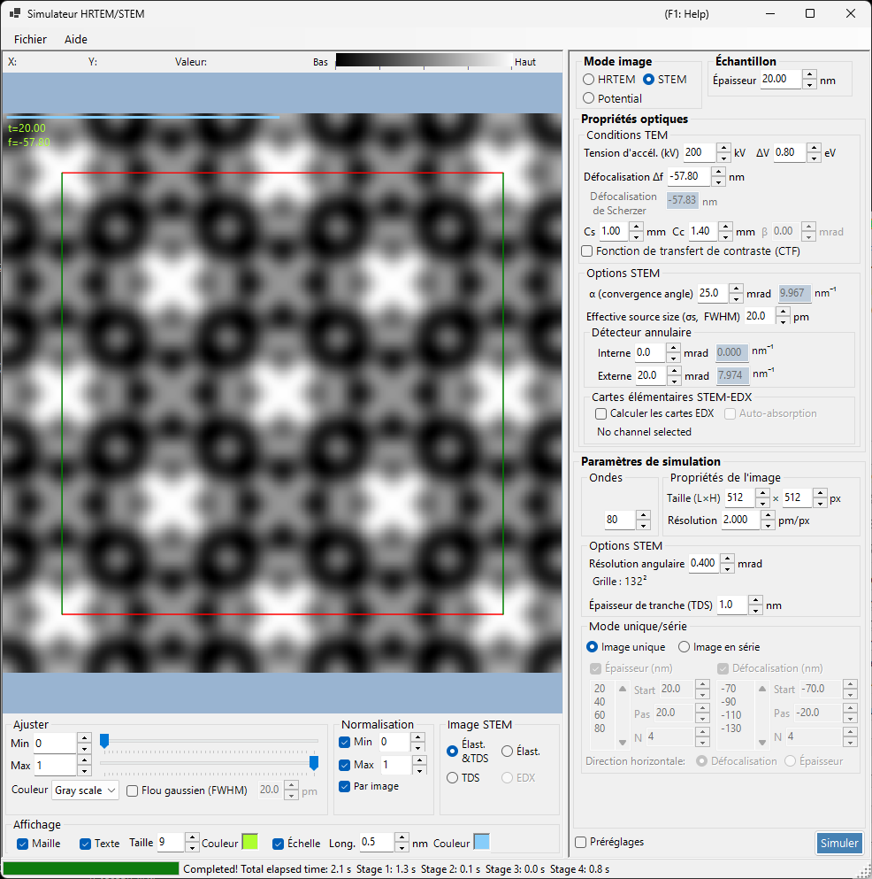
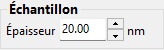
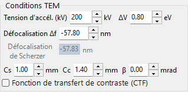
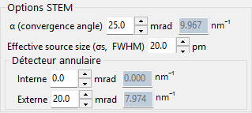
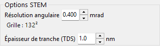
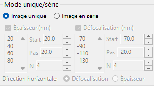
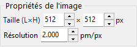
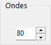
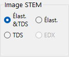
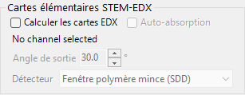

# Simulation STEM

La simulation **STEM (Scanning Transmission Electron Microscopy)** calcule des images de microscopie électronique en transmission à balayage à l'aide de la méthode des ondes de Bloch.

> Cette page répertorie tous les réglages qui apparaissent à droite lorsque **Image mode = STEM**. Pour les commandes d'affichage du résultat, de luminosité et de normalisation situées à gauche, voir la [page de présentation](index.md). Seule la **cible d'affichage** spécifique au STEM est reprise ci-dessous.

---

## Présentation

Un faisceau électronique convergent est balayé sur l'échantillon, et les électrons transmis et diffusés à chaque position de balayage sont collectés par des détecteurs annulaires. ReciPro calcule l'image STEM avec la méthode des ondes de Bloch (calcul dynamique).

### Déroulement du calcul

1. À chaque position de balayage, calculer les intensités diffractées avec la méthode des ondes de Bloch pour chaque direction d'incidence de la sonde convergente.
2. Intégrer l'intensité diffusée sur la plage angulaire du détecteur.
3. Les contributions de la diffusion élastique et de la diffusion thermique diffuse (TDS) peuvent toutes deux être calculées.

Voir l'[Annexe A3.4 — Calcul STEM](../appendix/a3-bloch-wave/stem.md) pour la théorie.

---

## Types de détecteurs

| Détecteur | Plage angulaire | Contribution principale | Contraste |
|----------|-------------|-------------------|----------|
| **BF** (fond clair) | 0 – angle de convergence | Élastique | Contraste de phase |
| **ABF** (fond clair annulaire) | Partie interne de l'angle de convergence | Élastique | Sensible aux éléments légers |
| **LAADF** (fond noir annulaire à petit angle) | Juste à l'extérieur de l'angle de convergence | Élastique + TDS | Sensible aux déformations |
| **HAADF** (fond noir annulaire à grand angle) | Bien à l'extérieur de l'angle de convergence | TDS (inélastique) | Contraste en Z ($\propto Z^2$) |

> **Réglages de détecteur typiques** (chacun disponible en un clic depuis le menu contextuel des options STEM, tous avec un angle de convergence α = 25 mrad) :
> BF (0–5 mrad) / ABF (12–24 mrad) / LAADF (26–60 mrad) / HAADF (80–250 mrad)

---

## Paramètres de l'échantillon

- **Thickness** : épaisseur de l'échantillon (nm). Cette valeur est ignorée en mode **Serial image**.

---

## Conditions MET

| Paramètre | Description | Par défaut / typique |
|-----------|-------------|-------------------|
| **Acc. Vol. (kV)** | Tension d'accélération. La longueur d'onde des électrons corrigée relativistiquement est affichée à côté | 200 kV |
| **Defocus Δf** | Défocalisation de la lentille objectif (lentille formant la sonde) (nm) | −57.8 nm |
| **Cs** | Coefficient d'aberration sphérique (mm). Affecte la taille de la sonde | 0.5–1.0 mm |
| **Cc** | Coefficient d'aberration chromatique (mm) | 1.0–2.0 mm |
| **ΔV (FWHM)** | Largeur à mi-hauteur de la dispersion en énergie des électrons (eV) | 0.5–2.0 eV |

> **β (demi-angle d'illumination) est désactivé en mode STEM**, car l'angle de convergence α en assume le rôle.

---

## Options STEM (optique)

Définissez la géométrie de la sonde convergente et du détecteur annulaire. Chaque angle est également affiché à droite après conversion en rayon dans l'espace réciproque $\sin\theta/\lambda$ (nm⁻¹).

| Paramètre | Description | Par défaut / typique |
|-----------|-------------|-------------------|
| **α (convergence angle)** | Demi-angle de la sonde convergente (mrad). Des valeurs plus grandes donnent une sonde plus fine et modifient le contraste de diffraction | 15–25 mrad |
| **(Annular) detector inner angle** | Demi-angle de collection interne du détecteur annulaire (mrad). Le signal à l'intérieur de cet angle est exclu | BF: 0, HAADF: 80 |
| **(Annular) detector outer angle** | Demi-angle de collection externe du détecteur annulaire (mrad). Le signal à l'extérieur de cet angle est exclu | BF: 5, HAADF: 250 |
| **Effective source size σs (FWHM)** | Taille effective de la source d'électrons. Des valeurs plus grandes brouillent la sonde et réduisent le contraste des détails fins | — |

---

## Options STEM (simulation)

- **Slice thickness for inelastic** : épaisseur de tranche de l'échantillon (nm) utilisée lors du calcul de l'intensité TDS (thermique diffuse, inélastique). Des valeurs plus petites sont plus précises mais plus lentes.
- **Angular resolution** : résolution d'échantillonnage angulaire des directions d'incidence de la sonde (mrad). Des valeurs plus petites échantillonnent la sonde plus finement mais sont plus lentes. Le nombre de directions croît comme le carré de ce rapport, ce qui en fait le principal levier sur le temps de calcul ; voir [Échantillonnage angulaire de la sonde](../appendix/a3-bloch-wave/stem.md#angular-sampling) pour les mesures de convergence.

---

## Mode d'image (single / serial)

- **Single image** : calcule une seule image STEM à l'épaisseur courante.
- **Serial image** : génère une série d'images avec l'épaisseur / la défocalisation variées par paliers (définies via **Start / Step / Num** ; la liste ci-dessous peut aussi être modifiée directement).

---

## Propriétés de l'image

- **Size (W×H)** : nombre de pixels de l'image balayée (par défaut 512×512). En STEM, cela correspond au nombre de points de balayage et fait varier linéairement le temps de calcul.
- **Resolution** : résolution d'échantillonnage (pm/px).

---

## Ondes diffractées

- **Max Bloch waves** : nombre maximal d'ondes de Bloch utilisées dans la méthode de Bethe (par défaut 80). Le coût du problème aux valeurs propres varie comme le cube du nombre d'ondes.

---

## Cible d'affichage STEM (côté résultat) {#stem-display-target}

Le sélecteur d'affichage en bas à gauche de la fenêtre choisit quelle composante de diffusion de l'image STEM déjà calculée afficher (commutable sans recalcul).

| Cible d'affichage | Description |
|----------------|-------------|
| **Elastic** | Image issue uniquement de la diffusion élastique |
| **TDS** | Image issue uniquement de la diffusion thermique diffuse |
| **Elastic & TDS** | Somme de l'élastique + TDS |
| **EDX** | Carte de rayons X caractéristiques. La raie à afficher (par exemple `O-K`) se choisit dans la liste déroulante en dessous, et **EDX commun** dans *Normalisation* place tous les canaux sur une même plage d'affichage partagée, de sorte que changer de canal ne remet pas l'image à l'échelle |

!!! note
    Les trois images sont reconstruites à partir de la partie réelle de la somme de Fourier, de sorte que **Elastic & TDS** est exactement la somme des deux autres. Jusqu'à la version 4.944, c'est le module qui était pris, ce qui rompait cette identité et éclaircissait légèrement les pixels sombres. Voir [Reconstruction d'une image réelle](../appendix/a3-bloch-wave/stem.md#real-image-reconstruction).

---

## Cartes élémentaires STEM-EDX {#stem-edx}

Cochez **Calculer les cartes EDX** pour calculer des cartes de rayons X caractéristiques en parallèle de l'image de type ADF. Il ne s'agit pas d'un mode séparé : les signaux élastique, TDS et EDX sont issus du même calcul STEM, et l'on bascule ensuite de l'un à l'autre dans [Cible d'affichage STEM](#stem-display-target) sans recalcul.

Il n'y a pas de sélecteur d'élément. Lorsque la case est cochée, **tous les canaux élément/couche calculables pour ce cristal à cette tension d'accélération** sont calculés, et la ligne sous la case les énumère (par exemple `3 carte(s) : O-K, Mg-K, Al-K`). Un canal est disponible lorsque le seuil d'ionisation se situe sous la tension d'accélération et que la couche est couverte par les données fournies — K : C–Sn (Z = 6–50), L-total : Ca–Rn (Z = 20–86). La table fournie contient des facteurs de forme d'ionisation entièrement relativistes jusqu'à un vecteur de diffusion de 8 Å⁻¹ pour chaque canal, de sorte que les raies L des éléments lourds jusqu'au radon sont simulées sans extrapolation. Si aucun canal n'est disponible, le calcul est refusé avec un message explicatif plutôt que de produire une carte vide.

La ligne suivante indique la grille de directions de la sonde, par exemple `Grille : 132² (recommandé : ≥48²)`. Cette grille est déterminée par **Résolution angulaire** et par l'angle de convergence ; voir [Échantillonnage angulaire de la sonde](../appendix/a3-bloch-wave/stem.md#angular-sampling). En dessous de la division recommandée, le résidu hermitien ±q peut dépasser la tolérance et interrompre le calcul ; c'est pourquoi la valeur passe en orange et une boîte de dialogue de confirmation s'affiche avant le lancement du calcul.

!!! warning "Ce que représentent les valeurs"
    La carte donne le **nombre de lacunes de couche interne créées par électron incident** — une grandeur du modèle, pas un nombre de rayons X prédit. Le rendement de fluorescence, l'auto-absorption dans l'échantillon, l'angle solide du détecteur et l'efficacité du détecteur ne sont **pas** appliqués. Utilisez les cartes pour la distribution spatiale et pour comparer épaisseurs ou orientations, pas pour une quantification absolue.

### Paramètres du détecteur (réservés)

**Auto-absorption**, **Angle de sortie** et **Détecteur** sont disposés mais désactivés : ils appartiennent au modèle de détecteur qui n'est pas encore implémenté. Ils sont affichés afin que le panneau ne bouge pas lorsque ce modèle arrivera. Leur effet à terme diffère par nature :

| Facteur | Contraste pixel à pixel dans une carte | Rapport entre cartes élémentaires |
|---|---|---|
| Auto-absorption (angle de sortie) | **le modifie** | **le modifie** |
| Fenêtre du détecteur / couche morte / efficacité | aucun effet | **le modifie fortement** |
| Angle solide du détecteur, courant de faisceau, temps de séjour | aucun effet | aucun effet |

La dernière ligne explique pourquoi ReciPro n'expose ni le courant de faisceau ni le temps de séjour : ils multiplient chaque pixel de chaque carte par le même nombre, s'annulent dans tout rapport et sont invisibles après la normalisation d'affichage.

### Précision et coût

Le STEM-EDX n'impose aucune limite supplémentaire sur le nombre d'ondes ni sur l'épaisseur de tranche : il emprunte les mêmes chemins de calcul que l'image de type ADF, de sorte que tout réglage qui convient au STEM convient aussi à l'EDX.

La précision est laissée à votre appréciation, exactement comme pour le nombre d'ondes ou la résolution angulaire. À titre de référence, l'erreur d'intégration en profondeur croît à peu près proportionnellement à **Épaisseur de tranche (TDS)** — environ 2–3 % à 1 nm, 4–8 % à 2 nm et 12–23 % à 4 nm (relatif au pic, SrTiO₃ à 39 nm). Diviser par deux l'épaisseur de tranche divise environ par deux l'erreur et double environ le travail d'intégration en profondeur.

Si des aberrations sont définies (par exemple Cs = 1 mm avec la défocalisation de Scherzer à α = 25 mrad), la phase d'aberration oscille rapidement sur la grille de directions de la sonde, et STEM-EDX peut refuser le calcul avec une erreur *non-Hermitian residual* même sur une grille fine — ce refus protège la carte d'artefacts de grille de quelques pour cent. Réduisez Cs et la défocalisation (la moyenne de balayage d'une carte EDX ne dépend pas du tout des aberrations), ou rendez la **Résolution angulaire** nettement plus fine en acceptant un calcul plus long.

---

## Coût de calcul

La simulation STEM est coûteuse en calcul, il convient donc de régler les paramètres suivants de manière appropriée.

| Facteur | Impact |
|--------|--------|
| **Angle de convergence** | Plus grand → plus de recouvrement des disques CBED → coût plus élevé |
| **Ondes de Bloch** | Le coût du problème aux valeurs propres varie comme N³ |
| **Résolution angulaire** | Plus fine → plus précise mais le coût varie comme N² |
| **Pixels de l'image (Size)** | Variation linéaire avec le nombre de points de balayage |

---

## Importance du facteur de température

Pour la simulation HAADF-STEM, les atomes doivent posséder un facteur de température isotrope (facteur de Debye-Waller) non nul. Si la valeur est inconnue, fixez $B \approx 0.5\ \text{Å}^2$. Avec un facteur de température nul, l'intensité TDS est nulle et l'image HAADF n'est pas calculée correctement.

| Détecteur | Plage | Contribution principale |
|----------|-------|-------------------|
| BF, ABF | À l'intérieur de l'angle de convergence | Élastique |
| LAADF, HAADF | À l'extérieur de l'angle de convergence | Inélastique (TDS) |

---

## Comparaison avec Dr. Probe

Il a été confirmé que les simulations STEM de ReciPro concordent étroitement avec l'interface graphique largement utilisée Dr. Probe (v1.10). La figure ci-dessous compare les deux pour les détecteurs BF, ABF, LAADF et HAADF sur une série d'épaisseurs (2.96–60.05 nm), à la fois sans aberration (à gauche) et avec Cs = 0.2 mm, défocalisation = −25.9 nm (à droite). Les deux codes concordent pour tous les types de détecteurs et toutes les épaisseurs.

Un rapport plus détaillé est disponible au format PDF : [Comparison of STEM simulations by Dr. Probe GUI (v1.10) and ReciPro (v4.854)](https://github.com/seto77/ReciPro/files/10976084/ComparisonSTEMsimulations.pdf).

---

## Comparaison avec py_multislice

Les cartes STEM-EDX de ReciPro ont également été vérifiées avec [py_multislice](https://github.com/HamishGBrown/py_multislice), un code multislice / phonon gelé indépendant. La figure ci-dessous compare les cartes O-K, Ti-K et Sr-L de SrTiO₃ [001] à 200 kV sur une série d'épaisseurs (3,91–62,48 nm), sans aberration (à gauche) et avec Cs = 0,2 mm, défocalisation = −25,9 nm (à droite).

Les formes normalisées des cartes concordent à 1–2 % pour Ti-K et Sr-L dans la limite mince. Les **totaux** diffèrent de ±10–17 % car les deux codes tirent leurs sections efficaces d'ionisation de sources différentes (Bote–Salvat dans ReciPro, tables du groupe Allen dans py_multislice). Le rapport ReciPro / py_multislice décroît aussi avec l'épaisseur, parce que le modèle absorptif de ReciPro retire les électrons diffusés thermiquement alors que le phonon gelé les laisse ioniser — ce qui quantifie l'erreur pratique de l'approximation absorptive pour l'EDX.

Le rapport complet, avec les courbes quantitatives et l'analyse en fréquence spatiale, est disponible en PDF : [Comparaison de simulations STEM-EDX par py_multislice et ReciPro (v4.945)](../../assets/references/STEM_EDX_pyms_comparison.pdf).

---

## Voir aussi

- [Simulateur HRTEM/STEM (présentation)](index.md)
- [Simulation HRTEM](1-hrtem-simulation.md)
- [Simulation de potentiel](3-potential-simulation.md)
- [Annexe A3.4 — Calcul STEM](../appendix/a3-bloch-wave/stem.md)
