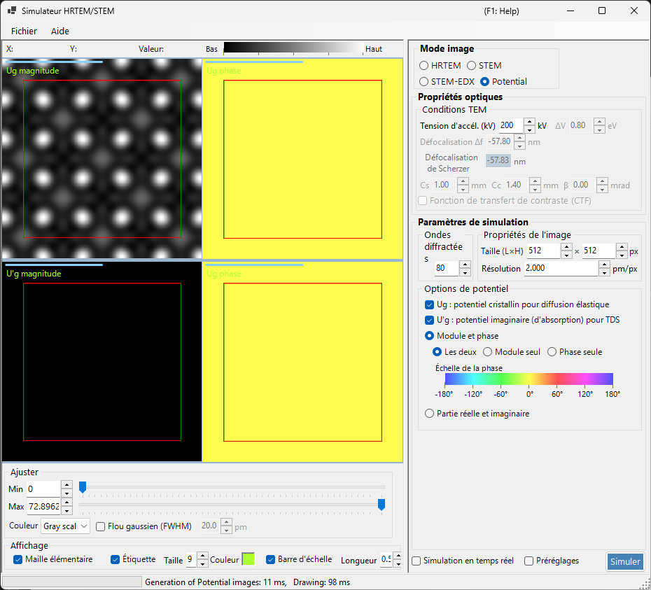
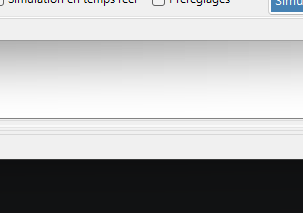
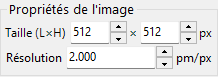
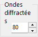

# Simulation du potentiel

La **simulation du potentiel** calcule et affiche la distribution 2D du potentiel cristallin. Aucun effet de transfert d'image (aberrations de lentille, détecteur) n'est appliqué : elle visualise le potentiel cristallin projeté lui-même.

> Cette page couvre tous les réglages qui apparaissent du côté droit lorsque **Image mode = Potential**. Pour l'affichage des résultats, l'ajustement de la luminosité et les autres commandes situées à gauche, voir la [page de présentation](index.md#display-settings).

---

## Présentation

Les électrons à l'intérieur d'un cristal sont diffusés par le potentiel cristallin. Sa distribution sous-tend tous les phénomènes de diffraction et d'imagerie et constitue une information clé pour comprendre la structure cristalline. Comme ce mode n'inclut ni aberrations de lentille ni effets dynamiques dépendant de l'épaisseur, il convient bien à l'examen de la structure elle-même.

> **En mode potentiel, les panneaux d'épaisseur de l'échantillon, de normalisation de l'intensité et de mode d'image (single / serial) ne sont pas affichés.** Parmi les conditions MET, seule la tension d'accélération est active.

---

## Conditions MET

- **Acc. voltage (kV)** — tension d'accélération. Elle définit la longueur d'onde des électrons et sert à calculer les coefficients de Fourier $U_g$ du potentiel.

> **Defocus, Cs, Cc, β, ΔE et la PCTF sont inactifs en mode potentiel** (aucune optique de formation de l'image n'est appliquée) et apparaissent grisés.

---

## Options du potentiel

Sélectionne quel potentiel afficher et comment l'afficher.

### Potentiel cible

| Type | Description |
|------|-------------|
| **$U_g$ — elastic scattering potential** | Le potentiel cristallin (électrostatique) responsable de la diffusion élastique. Représente la force de diffusion |
| **$U'_g$ — absorption potential** | Le potentiel imaginaire (d'absorption) issu de la diffusion thermique diffuse (TDS). Représente la perte du canal élastique |

$U_g$ et $U'_g$ peuvent être affichés en même temps (un volet est ajouté pour chaque case cochée).

### Méthode d'affichage

| Mode | Options |
|------|---------|
| **Magnitude and phase** | **Both** / **Magnitude only** / **Phase only** (la phase est rendue avec une roue chromatique, et une échelle de phase est affichée en dessous) |
| **Real and imaginary part** | **Both** / **Real only** / **Imaginary only** |

---

## Propriété de l'image

- **Size (W×H)** — dimensions en pixels de l'image générée (512×512 par défaut).
- **Resolution** — résolution d'échantillonnage (pm/px).

---

## Ondes diffractées

- **Max Bloch waves** — nombre maximal d'ondes de Bloch (coefficients de Fourier) inclus dans la synthèse de Fourier du potentiel (80 par défaut). Des valeurs plus grandes incluent des fréquences spatiales plus élevées et reproduisent des détails plus fins du potentiel.

---

## Ajustement de l'image (côté gauche)

La luminosité (Min / Max), l'échelle de couleurs et la superposition de la grille de la maille se règlent à gauche dans **Adjust** et **Display** (voir la [page de présentation](index.md#display-settings)).

---

## Voir aussi

- [Simulateur HRTEM/STEM (présentation)](index.md)
- [Simulation HRTEM](1-hrtem-simulation.md)
- [Simulation STEM](2-stem-simulation.md)
