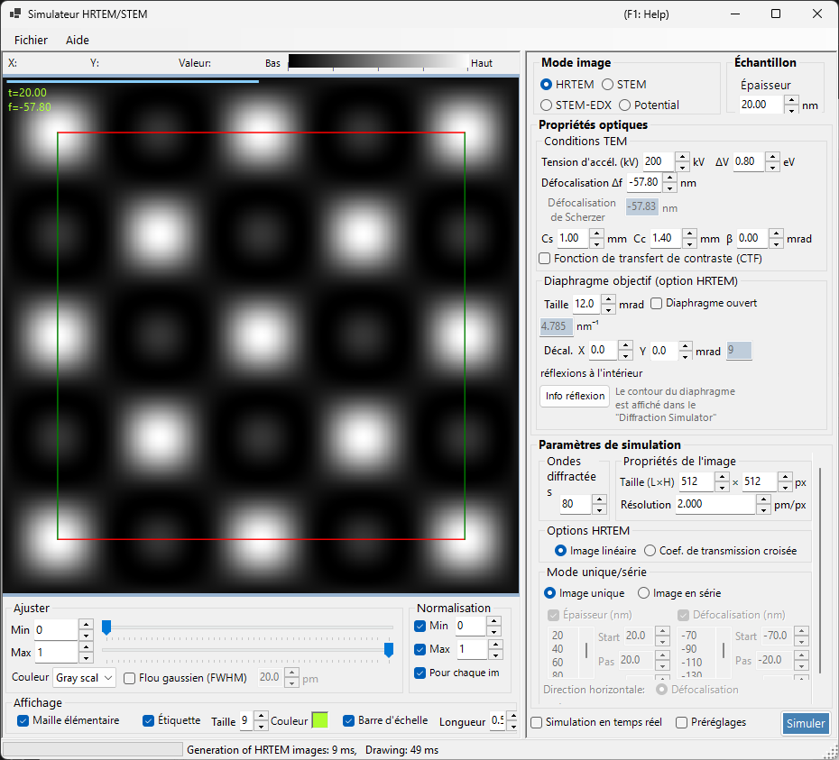
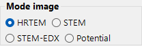
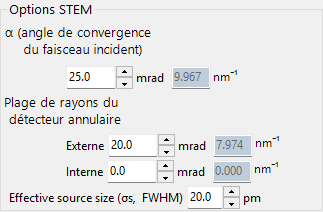
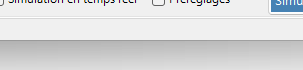
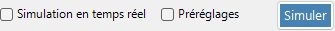
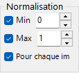
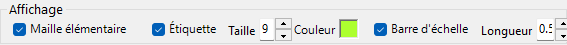
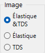

# HRTEM / STEM Simulator

Le **simulateur HRTEM/STEM** simule les images de franges de réseau MET (HRTEM), les images STEM et les potentiels projetés. Cliquez sur **Simulate** pour lancer le calcul.

---

## Raccourcis clavier et souris

Les résultats sont affichés sous la forme d'un ou plusieurs volets d'image. Ils utilisent la [navigation standard de vue d'image](../21-shortcuts.md) de ReciPro, et tous les volets se déplacent et zooment ensemble.

| Raccourci | Action |
|----------|--------|
| <kbd>F1</kbd> | Ouvrir cette page du manuel en ligne |
| <kbd>CTRL</kbd>+<kbd>C</kbd> (grille d'images sélectionnée) | Copier la ou les images dans le presse-papiers sous forme de métafichier |
| Glisser avec le bouton gauche / le bouton du milieu | Déplacer l'image (tous les volets se déplacent ensemble) |
| Molette vers le haut / vers le bas | Zoom avant (×2) / arrière (×0.5) à la position du curseur |
| Glisser un rectangle avec le bouton droit | Zoomer sur la région sélectionnée |
| Clic droit / Double-clic droit | Zoom arrière (×0.5) |
| <kbd>CTRL</kbd> + glisser un rectangle avec le bouton droit | Sélectionner une zone rectangulaire |
| Double-clic gauche sur un volet | Agrandir ce volet / restaurer la grille (dispositions à plusieurs volets) |
| Déplacer la souris (sans bouton) | Lire la position (pm) et la valeur du pixel à la position du curseur |

→ Voir **[21. Raccourcis clavier et souris](../21-shortcuts.md)** pour un aperçu de chaque fenêtre.

---

## Itinéraires rapides par objectif

| Objectif | Point de départ | Référence |
|------|------------|-----------|
| Calculer une image HRTEM | Régler **Image mode** sur **HRTEM**, puis définir la tension d'accélération et la défocalisation dans **TEM conditions** | [Simulation HRTEM](1-hrtem-simulation.md), [Formation de l'image HRTEM](../appendix/a3-bloch-wave/hrtem.md) |
| Calculer une image STEM | Régler **Image mode** sur **STEM**, puis définir l'angle de convergence et le détecteur dans **STEM options** | [Simulation STEM](2-stem-simulation.md), [Calcul STEM](../appendix/a3-bloch-wave/stem.md) |
| Visualiser le potentiel projeté | Régler **Image mode** sur **Potential** | [Simulation du potentiel](3-potential-simulation.md) |
| Générer une série en épaisseur / défocalisation | Configurer **Single / Serial** et les conditions d'image dans **HRTEM options** | [Simulation HRTEM](1-hrtem-simulation.md) |
| Utiliser HAADF-STEM avec TDS | Définir des facteurs de température atomiques non nuls et utiliser un détecteur LAADF / HAADF | [Calcul STEM](../appendix/a3-bloch-wave/stem.md) |

---

## Flux de travail de base

1. Sélectionnez le cristal et l'orientation dans la fenêtre principale, puis ouvrez ce simulateur.
2. Choisissez HRTEM, STEM ou Potential dans **Image mode**.
3. Définissez la tension d'accélération, la défocalisation, les aberrations, les diaphragmes et les réglages de convergence STEM dans **Optical property**.
4. Définissez l'épaisseur, la taille de l'image, la résolution, le nombre d'ondes de Bloch et le modèle de cohérence partielle dans **Simulation property**.
5. Cliquez sur **Simulate**, puis ajustez la luminosité, la normalisation, la barre d'échelle et les étiquettes dans **Display settings**.

---

## Zone d'image

La moitié gauche de la fenêtre affiche l'image simulée. La barre d'état en haut indique la position du curseur (**X:**, **Y:**) et la valeur de l'image **Value:** (intensité) sous le curseur, à côté d'une échelle d'intensité **Low → High** qui reflète la carte de couleurs et la plage de luminosité actuelles.

---

## Menu Fichier

### Menu Aide

---

## Image mode / Sample

{align=left}

HRTEM, Potential ou STEM.

{ align=left style="clear: both" }
Définit l'épaisseur de l'échantillon.

## Optical property { style="clear: both" }

### TEM conditions

Tension d'accélération, défocalisation (Scherzer affiché).

#### Acc. voltage

Tension d'accélération du microscope électronique. Une modification met à jour la longueur d'onde corrigée relativistiquement (affichée à côté du champ) et, conjointement avec **Cs**, la valeur suggérée de la **défocalisation de Scherzer** affichée ci-dessous.

#### Defocus

Valeur de défocalisation de la lentille objectif. La défocalisation de Scherzer (la valeur qui maximise le transfert de contraste de phase dans l'approximation de l'objet de phase faible) est affichée ci-dessous comme référence.

### Inherent property (HRTEM optical aberrations)

Paramètres d'aberration propres au microscope utilisés par le calcul de la fonction de lentille.

- **Cs** — coefficient d'aberration sphérique.
- **Cc** — coefficient d'aberration chromatique.
- **β** — demi-angle d'éclairage (effet de source finie).
- **ΔE** — largeur à 1/e de la fluctuation de l'énergie des électrons.

### Lens function

Tracés de la fonction de lentille. L'ajustement de la limite supérieure de *u* modifie la plage de tracé.

- **sin[χ(u)]** — fonction de transfert de contraste de phase (PCTF).
- **E_s(u)** — fonction enveloppe de cohérence spatiale.
- **E_c(u)** — fonction enveloppe de cohérence temporelle.

### Objective aperture (HRTEM option)

Cs, Cc, beta, delta-E, PCTF, enveloppes de cohérence spatiale/temporelle, diaphragme objectif.

#### Size

Taille du diaphragme objectif en mrad. Cochez **Open aperture** pour retirer le diaphragme. Le nombre de taches de diffraction prises en compte dans le calcul des ondes de Bloch dépend du diaphragme ; le maximum est limité par la valeur **Max Bloch waves** dans **Simulation property**.

#### Shift

Déplacement horizontal du diaphragme en mrad — utilisé pour reproduire un diaphragme objectif décalé en HRTEM.

#### Spot info

Ouvre la liste détaillée des réflexions (intensité, amplitude complexe, etc.) pour les réflexions traversant le diaphragme. Pratique lorsque le simulateur de diffraction est également ouvert pour comparaison.

### STEM options (optical)

#### Convergence semi-angle

Demi-angle de la sonde convergente (mrad). Contrôle la taille de la sonde STEM et la résolution spatiale de l'image simulée.

#### Detector geometry

Angles de collecte interne/externe du détecteur annulaire (mrad). Choisissez entre BF (petit angle interne), ABF, LAADF, HAADF (grand angle interne).

#### Scan area / step

Champ de balayage (champ de vision) et taille de pixel pour l'image STEM.

---

## Simulation property

### HRTEM options

Max Bloch waves, pixels/résolution de l'image, cohérence partielle (quasi-coherent / TCC), mode Single/Serial.

#### Max Bloch waves

Nombre maximal d'ondes de Bloch utilisées dans le calcul dynamique. Une augmentation améliore la précision au prix d'un temps de résolution des valeurs propres en *O*(*N*³).

#### Image property (pixels & resolution)

Dimensions en pixels et résolution d'échantillonnage de l'image simulée. Une résolution plus élevée donne un motif de franges plus fin, mais un temps de FFT proportionnellement plus long par tranche.

#### Partial-coherent model

Comment l'interférence des ondes est traitée lors de la combinaison des contributions provenant de toutes les directions du faisceau incident.

- **Quasi-coherent** — modèle rapide et approché qui multiplie la fonction de transfert de contraste de phase par les enveloppes de cohérence spatiale et temporelle.
- **Transmission cross coefficient (TCC)** — modèle plus précis qui intègre sur le coefficient de transmission croisée complet. Plus lent mais exact dans le régime d'imagerie linéaire.

Voir [Annexe A3.2 — Formation de l'image HRTEM](../appendix/a3-bloch-wave/hrtem.md).

#### Single / Serial mode

- **Single image** — simule une image unique à l'épaisseur définie dans **Sample property** et à la défocalisation définie dans **Optical property**.
- **Serial image** — génère une matrice épaisseur × défocalisation selon **Start / Step / Num** pour chacune. Utile pour trouver la condition qui correspond le mieux à une image expérimentale.

### STEM options (simulation)

- **Bloch wave count** — même rôle que pour le HRTEM, appliqué par position de sonde.
- **Angular resolution** — nombre de points d'échantillonnage dans l'intégration sur la direction de la sonde.
- **TDS treatment** — indique s'il faut inclure la diffusion thermique diffuse via les facteurs de température *B*. Requis pour LAADF/HAADF.

### Potential options

Affiché lorsque **Image mode = Potential**.

- **Target potential** — choisissez **U_g** (élastique) ou **U′_g** (absorption / TDS).
- **Display method** — **Magnitude and phase**, ou **Real and imaginary part**.

### Image properties

### Diffracted waves

---

## Simulate

---

## Display settings

### Adjust

Luminosité min/max, échelle de couleurs, flou gaussien.

### Normalization

### Display

Étiquette (épaisseur/défocalisation), barre d'échelle, superposition de la maille.

### STEM image

---

## Simulation STEM

Le calcul dépend de : angle de convergence, nombre d'ondes de Bloch, résolution angulaire.

| Détecteur | Contribution |
|----------|-------------|
| BF, ABF | Élastique |
| LAADF, HAADF | Inélastique (TDS) |

> Définissez des facteurs de température non nuls pour le TDS (B = 0.5 Ų en cas de doute). Intensité HAADF $\propto Z^2$.

Un rapport plus détaillé est disponible au format PDF : [Comparaison des simulations STEM par Dr. Probe GUI (v1.10) et ReciPro (v4.854)](https://github.com/seto77/ReciPro/files/10976084/ComparisonSTEMsimulations.pdf). Voir [Simulation STEM](2-stem-simulation.md) pour plus de détails.

---

## Voir aussi

- [Simulation HRTEM](1-hrtem-simulation.md)
- [Simulation STEM](2-stem-simulation.md)
- [Simulation du potentiel](3-potential-simulation.md)
- [Diffraction dynamique (onde de Bloch)](../appendix/a3-bloch-wave/index.md)
- [Simulateur de diffraction](../7-diffraction-simulator/index.md)
- [Trajectoires électroniques](../8-electron-trajectory.md)
