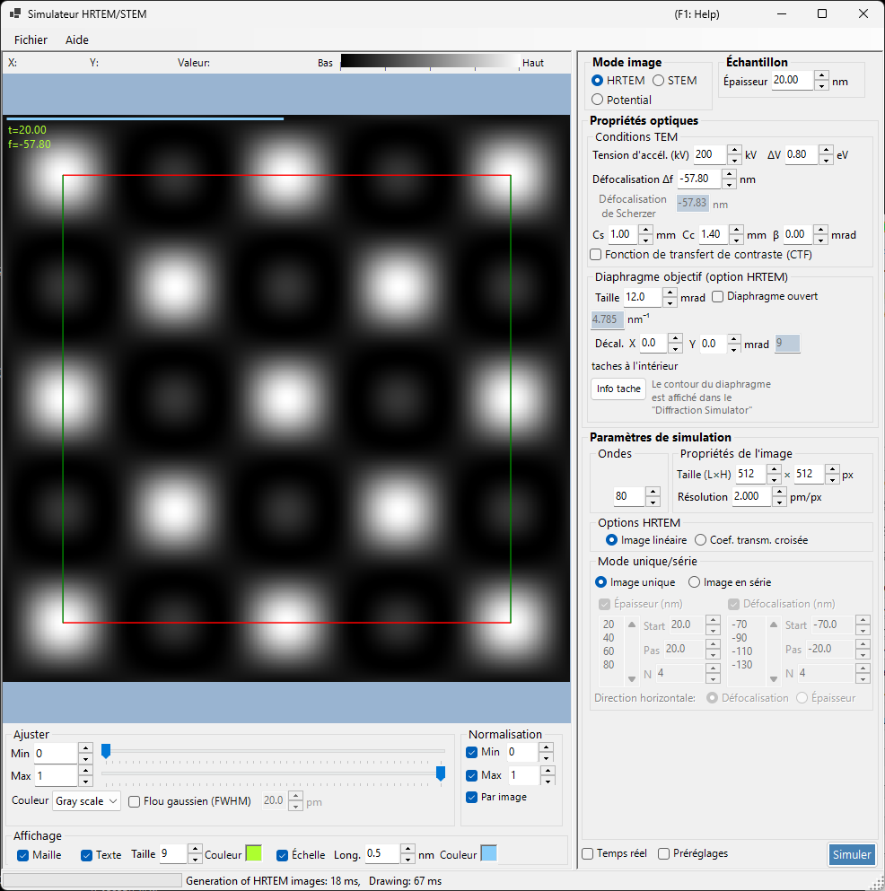
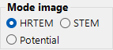
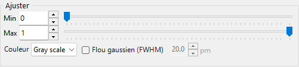
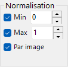
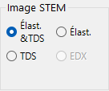
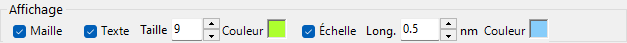
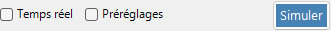
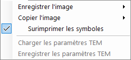
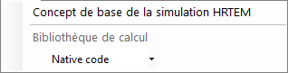

# Simulateur HRTEM / STEM

Le **Simulateur HRTEM/STEM** simule les images de franges de réseau en MET (HRTEM), les images STEM et les potentiels cristallins projetés pour le cristal et l'orientation sélectionnés. Cliquez sur **Simuler** pour lancer le calcul.

La fenêtre est divisée en deux moitiés. Le **côté gauche** affiche le résultat de la simulation et en règle l'apparence (volets d'image, luminosité, couleur, barre d'échelle, etc.) ; le **côté droit** regroupe les conditions de calcul (**Propriétés optiques** et **Paramètres de simulation**).

---

## Cette page et les pages des modes

- **Cette page (présentation)** : les opérations communes à tous les modes, ainsi que les **commandes d'affichage et d'ajustement du résultat situées à gauche**.
- **Pages des modes** : tous les réglages qui apparaissent sur le **côté droit** pour ce mode, décrits de sorte que chaque page soit autonome (certains réglages figurent donc sur plusieurs pages).

| Mode | Contenu | Page |
|------|---------|------|
| **HRTEM** | Images de franges de réseau en MET haute résolution | [Simulation HRTEM](1-hrtem-simulation.md) |
| **STEM** | Images de microscopie électronique en transmission à balayage (BF / ABF / LAADF / HAADF) | [Simulation STEM](2-stem-simulation.md) |
| **Potential** | Potentiel cristallin projeté ($U_g$ / $U'_g$) | [Simulation du potentiel](3-potential-simulation.md) |

---

## Raccourcis clavier et souris

Les résultats sont affichés sous la forme d'un ou plusieurs volets d'image. Ils utilisent la [navigation standard de vue d'image](../21-shortcuts.md) de ReciPro, et tous les volets se déplacent et zooment ensemble.

| Raccourci | Action |
|----------|--------|
| <kbd>F1</kbd> | Ouvrir cette page du manuel en ligne |
| <kbd>CTRL</kbd>+<kbd>C</kbd> (grille d'images sélectionnée) | Copier la ou les images dans le presse-papiers sous forme de métafichier |
| Glisser avec le bouton gauche / le bouton du milieu | Déplacer l'image (tous les volets se déplacent ensemble) |
| Molette vers le haut / vers le bas | Zoom avant (×2) / arrière (×0.5) à la position du curseur |
| Glisser un rectangle avec le bouton droit | Zoomer sur la région sélectionnée |
| Clic droit / Double-clic droit | Zoom arrière (×0.5) |
| <kbd>CTRL</kbd> + glisser un rectangle avec le bouton droit | Sélectionner une zone rectangulaire |
| Double-clic gauche sur un volet | Agrandir ce volet / restaurer la grille (dispositions à plusieurs volets) |
| Déplacer la souris (sans bouton) | Lire la position (pm) et la valeur du pixel à la position du curseur |

→ Voir **[21. Raccourcis clavier et souris](../21-shortcuts.md)** pour un aperçu de chaque fenêtre.

---

## Itinéraires rapides par objectif

| Objectif | Point de départ | Référence |
|------|------------|-----------|
| Calculer une image HRTEM | Régler **Mode image** sur **HRTEM**, puis définir la tension d'accélération et la défocalisation dans **Conditions TEM** | [Simulation HRTEM](1-hrtem-simulation.md), [Formation de l'image HRTEM](../appendix/a3-bloch-wave/hrtem.md) |
| Calculer une image STEM | Régler **Mode image** sur **STEM**, puis définir l'angle de convergence et le détecteur dans **Options STEM** | [Simulation STEM](2-stem-simulation.md), [Calcul STEM](../appendix/a3-bloch-wave/stem.md) |
| Visualiser le potentiel projeté | Régler **Mode image** sur **Potential** | [Simulation du potentiel](3-potential-simulation.md) |
| Générer une série en épaisseur / défocalisation | En HRTEM, configurer **Mode unique/série** et les conditions d'image | [Simulation HRTEM](1-hrtem-simulation.md) |
| Utiliser HAADF-STEM avec TDS | Définir des facteurs de température atomiques non nuls et placer le détecteur STEM en LAADF / HAADF | [Calcul STEM](../appendix/a3-bloch-wave/stem.md) |

---

## Flux de travail de base

1. Sélectionnez le cristal et l'orientation dans la fenêtre principale, puis ouvrez cette fenêtre.
2. Choisissez HRTEM, STEM ou Potential dans **Mode image**.
3. Définissez la tension d'accélération, la défocalisation, les aberrations, le diaphragme, l'angle de convergence STEM, etc. dans **Propriétés optiques** (voir les pages des modes).
4. Définissez l'épaisseur, la taille de l'image, la résolution, le nombre d'ondes de Bloch, le modèle de cohérence partielle, etc. dans **Paramètres de simulation** (voir les pages des modes).
5. Cliquez sur **Simuler**, puis ajustez l'apparence avec **Ajuster**, **Normalisation** et **Affichage** à gauche si nécessaire.

---

## Sélection du mode image

{ align=left }

**Mode image**, en haut à droite, sélectionne le type de calcul. Les panneaux de droite (**Propriétés optiques** et **Paramètres de simulation**) s'adaptent au mode choisi.

- **HRTEM** — images de franges de réseau en MET haute résolution → [Simulation HRTEM](1-hrtem-simulation.md)
- **STEM** — images de microscopie électronique en transmission à balayage → [Simulation STEM](2-stem-simulation.md)
- **Potential** — potentiel cristallin projeté → [Simulation du potentiel](3-potential-simulation.md)

---

## Zone d'image (côté gauche)

La moitié gauche de la fenêtre affiche l'image simulée. La barre d'état en haut indique la position du curseur (**X:**, **Y:**) et la valeur de l'image **Valeur:** (intensité) sous le curseur, à côté d'une échelle d'intensité **Bas → Haut** qui reflète la carte de couleurs et la plage de luminosité actuelles.

Lorsque plusieurs images sont produites (image en série, ou module/phase d'un potentiel), elles sont disposées en grille, et tous les volets zooment et se déplacent ensemble.

---

## Affichage et ajustement des résultats (panneau de gauche) {#display-settings}

Le panneau en bas à gauche règle l'apparence du résultat — luminosité, couleur, normalisation et superpositions. Ces réglages s'appliquent à tous les modes et prennent effet sans recalcul.

### Ajuster

- **Min** / **Max** : extrémités inférieure (noir) et supérieure (blanc) de la plage d'intensité affichée. Utilisez les curseurs pour régler le contraste.
- **Couleur** : échelle de couleurs de l'image — **Gray scale** (niveaux de gris) ou **Cold-Warm** (du bleu au rouge).
- **Flou gaussien (FWHM)** : lorsque cette case est cochée, applique un flou gaussien dont la largeur à mi-hauteur (pm) est indiquée à droite, pour simuler une résolution finie (fonction d'étalement du point).

### Normalisation

- **Par image** : lorsque cette case est cochée, chaque image est normalisée séparément (décochée, toute la série partage une échelle commune).
- **Min** / **Max** : fixe l'extrémité inférieure / supérieure de la normalisation à la valeur indiquée à droite, au lieu du minimum / maximum de l'image.

### Image STEM

Affiché uniquement en mode STEM. Sélectionne la composante de diffusion de l'image STEM calculée qui est affichée (**Élast.**, **TDS** ou **Élast. & TDS**). Si le calcul a aussi produit des [cartes STEM-EDX](2-stem-simulation.md#stem-edx), **EDX** est proposé comme quatrième choix. Comme ce réglage est propre au STEM, il est également décrit sur la page [Simulation STEM](2-stem-simulation.md).

### Affichage

Définit les éléments superposés à l'image.

- **Maille** : superpose le contour de la maille projetée, pour relier le contraste de l'image au réseau cristallin.
- **Texte** : superpose des étiquettes telles que l'épaisseur, la défocalisation et les indices. La **Taille** (taille de police) et la **Couleur** peuvent être spécifiées.
- **Échelle** : superpose une barre d'échelle. La **Long.** (longueur, nm) et la **Couleur** peuvent être spécifiées.

---

## Lancement de la simulation

- **Simuler** : lance le calcul avec le cristal, les conditions du microscope, l'épaisseur, la défocalisation et les réglages d'affichage actuels.
- **Arrêter** : interrompt le calcul en cours (affiché uniquement pendant le calcul).
- **Temps réel** : lorsque cette case est cochée, recalcule immédiatement lorsque le cristal est tourné (masqué en mode STEM).
- **Préréglages** : affiche ou masque la fenêtre des préréglages, qui enregistre et rappelle des conditions d'imagerie TEM.

---

## Menu Fichier

- **Enregistrer l'image** : enregistre **comme image (format PNG)**, **comme image (format TIFF)** ou **comme métafichier (EMF)**. **Enregistrer individuellement en mode série** écrit une à une les images d'un calcul en série.
- **Copier l'image** : copie dans le presse-papiers **comme image** ou **comme métafichier (EMF)**.
- **Surimprimer les symboles** : incruste la maille, les étiquettes et la barre d'échelle dans l'image enregistrée.
- **Charger les paramètres TEM** / **Enregistrer les paramètres TEM** : enregistre les conditions optiques (tension d'accélération, aberrations, etc.) dans un fichier et les restaure.

## Menu Aide

- **Concept de base de la simulation HRTEM** : ouvre l'explication de la formation de l'image HRTEM ([Annexe A3.2](../appendix/a3-bloch-wave/hrtem.md)).
- **Bibliothèque de calcul** : sélectionne la bibliothèque de calcul — **Native code** (C++/Eigen rapide) ou **Managed code** (.NET). Le code natif est normalement plus rapide.

---

## Voir aussi

- [Simulation HRTEM](1-hrtem-simulation.md)
- [Simulation STEM](2-stem-simulation.md)
- [Simulation du potentiel](3-potential-simulation.md)
- [Diffraction dynamique (onde de Bloch)](../appendix/a3-bloch-wave/index.md)
- [Simulateur de diffraction](../7-diffraction-simulator/index.md)
- [Trajectoires électroniques](../8-electron-trajectory.md)
