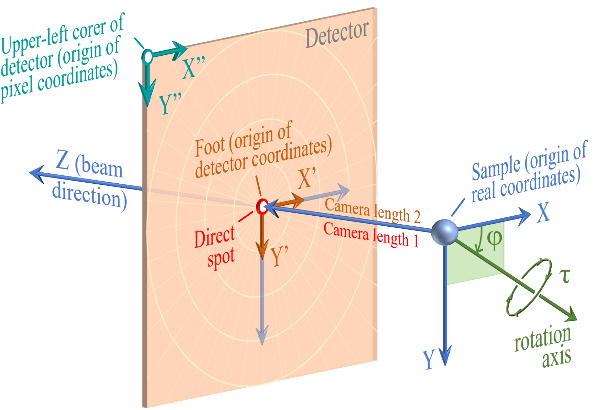
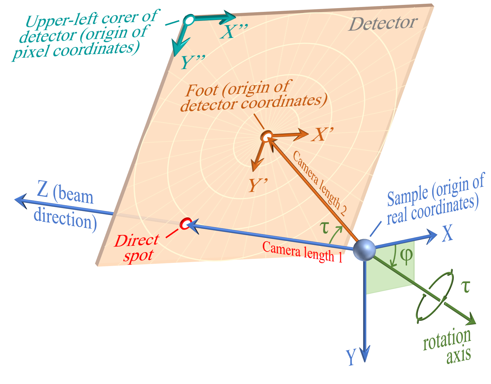

# Annexe A1.2. Système de coordonnées pour la simulation de diffraction

<!-- 260526Cl: 図(Coordinates4-5)に合わせ座標記号を数式(MathJax)化・用語色を図に一致 (.rp-*: docs/src/assets/stylesheets/extra.css)。 -->

La fonction **Simulateur de diffraction** simule le cliché de diffraction enregistré sur un détecteur. Le détecteur est un plan fini de pixels placé à une distance fixe de l'échantillon, et il peut être incliné par rapport au faisceau incident. Pour reproduire cela avec précision, il faut connaître la relation géométrique entre le détecteur et l'échantillon, ainsi que la taille des pixels et leur nombre. Pour le système de coordonnées de base (orientation), voir [A1.1. Système de coordonnées de base et orientation du cristal](1-orientation.md).

!!! note "Z et Y diffèrent du système d'orientation"
    Dans le système de coordonnées du détecteur, $Z$ est parallèle au faisceau et $Y$ pointe vers le bas. Cela diffère du système de coordonnées d'orientation, dans lequel le faisceau est dirigé selon $-Z$ et $Y$ pointe vers le haut. Le système du détecteur suit la convention habituelle d'image/détecteur (origine en haut à gauche, $Y$ croissant vers le bas).

## Avant la rotation (détecteur perpendiculaire au faisceau)

{width=500px}

Trois systèmes de coordonnées sont définis :

- **Coordonnées réelles** ($X$, $Y$, $Z$) : coordonnées cartésiennes 3D en mm, avec l'**échantillon** comme origine. $Z$ est parallèle au faisceau ; vu selon $Z$, $X$ pointe vers la droite et $Y$ vers le bas. Lorsque le détecteur est perpendiculaire au faisceau, $X$ / $Y$ sont parallèles à $X'$ / $Y'$.
- **Coordonnées du détecteur** ($X'$, $Y'$) : coordonnées 2D en mm sur le plan du détecteur, avec le **foot** comme origine. $X'$ / $Y'$ pointent vers la droite / le bas sur le détecteur et sont parallèles à $X''$ / $Y''$.
- **Coordonnées en pixels** ($X''$, $Y''$) : coordonnées 2D en unités de pixels, avec le **coin supérieur gauche** du détecteur comme origine, suivant les lignes et colonnes de pixels du détecteur.

Lorsque le détecteur est perpendiculaire au faisceau, le **foot** et le **direct spot** coïncident, et **Camera length 1** est égal à **Camera length 2**.

## Après la rotation (détecteur incliné)

{width=500px}

L'inclinaison du détecteur est décrite par deux paramètres :

| Paramètre | Description |
|-----------|-------------|
| $\varphi$ | Direction de l'axe de rotation — son angle par rapport à l'axe $X$, mesuré dans le plan $XY$ ($Z$ = 0) |
| $\tau$ | Angle de rotation autour de cet axe (vis à droite) |

Une fois le détecteur incliné :

- Le **direct spot** et le **foot** ne coïncident plus.
- **Camera length 1** ($C_1$) = distance de l'échantillon au direct spot.
- **Camera length 2** ($C_2$) = distance de l'échantillon au foot.
- L'origine des **coordonnées du détecteur** reste au **foot** ; l'origine des **coordonnées en pixels** reste au **coin supérieur gauche**.
- Les directions $X$ / $Y$ ne coïncident plus avec $X'$ / $Y'$.

## Glossaire des paramètres

| Terme | Définition |
|------|------------|
| **Échantillon (Sample)** | Le matériau qui diffuse le faisceau incident ; l'origine des coordonnées réelles |
| **Coordonnées réelles** ($X$, $Y$, $Z$) | Coordonnées 3D (mm) du montage expérimental ; origine à l'échantillon, $Z$ toujours parallèle au faisceau |
| **Direct spot** | Intersection du faisceau incident avec le détecteur |
| **Foot** | Le pied de la perpendiculaire abaissée de l'échantillon sur le plan du détecteur ; origine des coordonnées du détecteur. Ne coïncide avec le direct spot que lorsque le détecteur est perpendiculaire au faisceau. En mode image superposée, la position du foot est définie en coordonnées en pixels |
| **Coordonnées du détecteur** ($X'$, $Y'$) | Coordonnées 2D (mm) sur le plan du détecteur ; origine au foot |
| **Coordonnées en pixels** ($X''$, $Y''$) | Coordonnées 2D (pixels) sur le plan du détecteur ; origine au coin supérieur gauche |
| **Camera length 1** ($C_1$) | Distance de l'échantillon au direct spot (mm) |
| **Camera length 2** ($C_2$) | Distance de l'échantillon au foot (mm) |
| **Pixel size** | Longueur du côté d'un pixel (carré) (mm) ; seuls les pixels carrés sont pris en charge |
| **Detector width / height** | Nombre de pixels horizontalement / verticalement |

<!-- 260813Cl: 清華大との交換スキーマレビューで混同が判明したため、2つの励起誤差定義の注記を追加。 -->
## Deux définitions de l'erreur d'excitation $S_g$

ReciPro utilise délibérément deux définitions différentes de l'erreur d'excitation, adaptées à leur contexte :

- **Affichage cinématique et `SpotInfo()` (mode cinématique/erreur d'excitation)** : la distance **radiale** signée entre le nœud du réseau réciproque et la sphère d'Ewald, $S_g = k - \lvert\boldsymbol{g} - \boldsymbol{C}\rvert$, avec le centre de la sphère $\boldsymbol{C} = (0, 0, k)$ et $k = 1/\lambda$. $S_g > 0$ signifie que le nœud se trouve à l'intérieur de la sphère. Le simulateur cinématique ne suppose ni forme ni épaisseur d'échantillon, si bien qu'aucune normale à la surface n'y existe ; la distance radiale isotrope est le choix neutre pour sélectionner et afficher les réflexions.
- **Calcul dynamique (Bethe)** : la distance mesurée **le long de la normale à la surface de l'échantillon** $\boldsymbol{n}$, $S_g = \sqrt{P_g^2/4 + Q_g} - P_g/2$, avec $P_g = 2\boldsymbol{n}\cdot(\boldsymbol{k}_0 + \boldsymbol{g})$ et $Q_g = k_0^2 - \lvert\boldsymbol{k}_0 + \boldsymbol{g}\rvert^2$. Cette définition est imposée par la condition aux limites appliquée à la surface de l'échantillon.

Les deux coïncident presque en incidence normale (normale à la surface parallèle au faisceau), mais ce **ne sont pas la même grandeur** ; ne mélangez pas des valeurs issues des sorties cinématique et dynamique.
