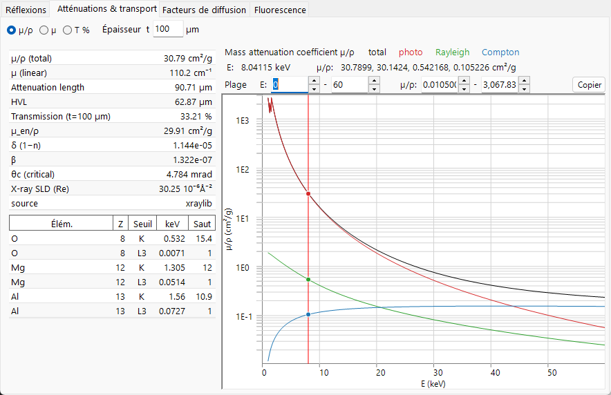
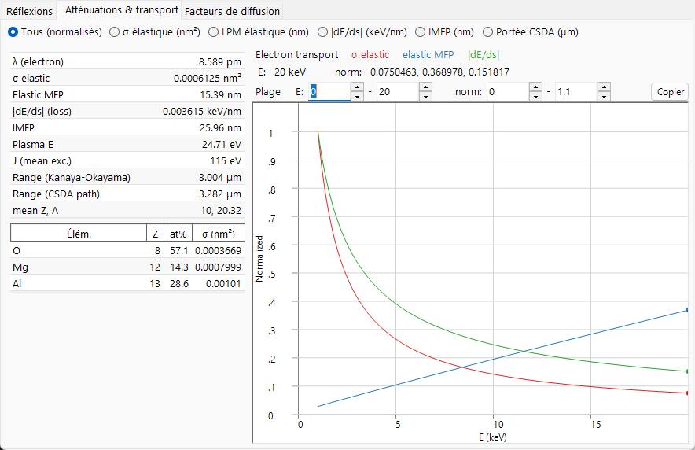
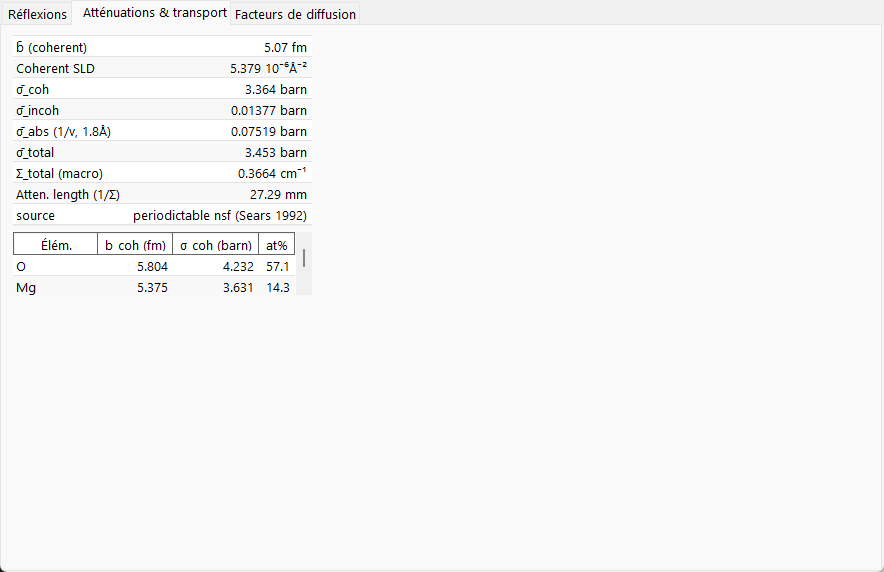

# Atténuation & transport

Les facteurs de diffusion décrivent un événement de diffusion unique ; cette page traite de ce qui arrive au faisceau **dans son ensemble** lorsqu'il traverse le solide — à quelle vitesse il est retiré, à quelle profondeur il pénètre et (pour les électrons) comment il est ralenti. La physique pertinente est entièrement différente pour les trois faisceaux, ce qui explique pourquoi l'onglet **Attenuations & Transport** modifie aussi radicalement ses graphiques et ses tableaux selon le rayonnement.

=== "X-ray"
    

=== "Electron"
    

=== "Neutron"
    

---

## Rayons X — absorption et réfraction

### Atténuation de Beer–Lambert

Un faisceau de rayons X monochromatique est retiré exponentiellement avec la longueur de parcours :

$$I(t) = I_0\, e^{-\mu t}, \qquad \mu = \rho\,(\mu/\rho).$$

- $\mu/\rho$ : le **coefficient d'atténuation massique** (cm²/g) — la grandeur tabulée, indépendante de la densité.
- $\mu$ : le **coefficient d'atténuation linéaire** (cm⁻¹) à la densité réelle $\rho$ du matériau.
- $1/\mu$ : la **longueur d'atténuation** (l'intensité tombe à $1/e$).
- $\text{HVL} = \ln 2/\mu$ : la **couche de demi-atténuation**.
- $T = e^{-\mu t}$ : la transmission pour un échantillon d'épaisseur $t$.

### Ce qui compose $\mu/\rho$

L'atténuation massique totale est la somme de trois processus, tracés séparément dans l'onglet :

$$\left(\frac{\mu}{\rho}\right)_\text{total} = \left(\frac{\tau}{\rho}\right)_\text{photo} + \left(\frac{\mu}{\rho}\right)_\text{Rayleigh} + \left(\frac{\mu}{\rho}\right)_\text{Compton}.$$

Pour un composé, l'atténuation massique est la somme pondérée par la masse des valeurs élémentaires, tandis que le coefficient linéaire additionne directement les sections efficaces atomiques :

$$\left(\frac{\mu}{\rho}\right)_\text{mix} = \sum_i w_i\left(\frac{\mu}{\rho}\right)_i, \qquad \mu = \sum_i n_i\,\sigma_i,$$

avec $w_i$ les fractions massiques et $n_i$ les densités numériques. Les trois composantes sont :

- **Photoabsorption** $\tau$ — un photon est absorbé et éjecte un électron lié. Elle domine à basse énergie, diminuant approximativement comme $\tau/\rho \propto Z^{3\!-\!4}/E^{3}$ entre les seuils. C'est le terme qui éjecte l'électron de couche interne dont la relaxation produit la [fluorescence](fluorescence.md).
- **Diffusion Rayleigh (cohérente)** — diffusion élastique sur les électrons liés, liée au facteur de forme cohérent $F(q)$.
- **Diffusion Compton (incohérente)** — diffusion inélastique sur les électrons faiblement liés, liée à la fonction incohérente $S(q)$ ; son importance relative croît à haute énergie. Le photon diffusé est décalé en longueur d'onde de

$$\Delta\lambda = \lambda' - \lambda = \frac{h}{m_e c}\,(1-\cos\varphi),$$

  de sorte qu'un événement Compton retire le photon du faisceau monochromatique (une perte inélastique).

Les **seuils d'absorption** sont les montées abruptes de $\tau$ lorsque l'énergie du photon franchit l'énergie de liaison d'une couche ($K$, $L_3$, …), ouvrant un nouveau canal d'ionisation. Le **rapport de saut** est le facteur par lequel $\mu/\rho$ augmente à la traversée du seuil ; ReciPro liste les énergies et les sauts des seuils $K$ et $L_3$. Le **coefficient d'absorption massique d'énergie** $\mu_\text{en}/\rho$ est la partie de $\mu/\rho$ qui dépose l'énergie localement (à l'exclusion de l'énergie emportée par les photons diffusés et fluorescents).

### Réfraction, angle critique et SLD

L'indice de réfraction des rayons X d'un solide est **légèrement inférieur à 1**, écrit

$$n = 1 - \delta + i\beta, \qquad \beta = \frac{\mu_\text{abs}\lambda}{4\pi} = \frac{r_e\lambda^2}{2\pi}\sum_i n_i\,f''_i, \qquad \delta \simeq \frac{r_e\lambda^2}{2\pi}\sum_i n_i\,(Z_i+f'_i),$$

où $n_i$ est la densité numérique de l'élément $i$ et $r_e$ le rayon classique de l'électron. Ici $\mu_\text{abs}$ est la partie absorptive de l'atténuation (liée à $f''$) ; elle n'est pas nécessairement égale au $\mu$ total ci-dessus, qui contient aussi la diffusion Rayleigh et Compton. Comme $n<1$, les rayons X subissent une **réflexion externe totale** en dessous d'un petit **angle critique** rasant

$$\theta_c \simeq \sqrt{2\delta}.$$

Cela découle de la géométrie de réfraction : pour un angle rasant $\alpha$, le vecteur d'onde vertical à l'intérieur du solide est $k_z^2 \simeq k^2(\alpha^2 - 2\delta)$, qui atteint zéro à $\alpha = \alpha_c = \sqrt{2\delta}$ ; en dessous, l'onde ne peut pas se propager dans le matériau et est totalement réfléchie. La partie réelle de la **densité de longueur de diffusion**, $\text{SLD} = r_e\sum_i n_i (Z_i + f'_i)$, fixe $\delta$ et constitue l'analogue pour les rayons X de la SLD neutronique utilisée en réflectométrie. ReciPro indique $\delta$, $\beta$, $\theta_c$ et la SLD des rayons X dans le tableau scalaire.

---

## Électrons — diffusion, ralentissement et portée

Un électron rapide dans un solide à la fois **diffuse** (changement de direction) et **perd** continûment de l'énergie, de sorte que son transport nécessite plus d'une échelle de longueur.

### Diffusion élastique et libre parcours moyen

La section efficace élastique $\sigma_\text{el}$ mesure avec quelle facilité un atome unique dévie l'électron. ReciPro utilise les sections efficaces **NIST Mott** (une solution en ondes partielles de l'équation de Dirac relativiste dans le potentiel atomique écranté), valables environ sur **50 eV – 36.4 keV** ; en dehors de cette plage, ou pour les éléments absents de la table, il se rabat sur l'approximation de **Rutherford écrantée**. Les deux ne se raccordent pas nécessairement de façon parfaitement lisse à la frontière. La section efficace totale est l'intégrale angulaire de la section différentielle,

$$\sigma_\text{el} = 2\pi\int_0^\pi \frac{d\sigma}{d\Omega}\,\sin\Theta\,d\Theta, \qquad \frac{d\sigma}{d\Omega} \propto \frac{Z^2}{E^2}\,\frac{1}{\big[\sin^2(\Theta/2)+\eta\big]^2},$$

où le paramètre d'écrantage $\eta$ arrondit la divergence vers l'avant de la section efficace de Rutherford nue ; le traitement de Mott inclut en outre les effets de spin et relativistes que le modèle de Rutherford écranté omet. À partir de la section efficace,

$$\Sigma_\text{el} = \sum_i n_i\,\sigma_{\text{el},i}, \qquad \lambda_\text{el} = \frac{1}{\Sigma_\text{el}},$$

on obtient le coefficient de diffusion macroscopique et le **libre parcours moyen élastique** — la distance moyenne entre événements élastiques.

### Pouvoir d'arrêt et pertes inélastiques

L'énergie est perdue principalement au profit des excitations électroniques (ionisation, plasmons). Le **pouvoir d'arrêt** est défini comme une grandeur positive,

$$S(E) = -\frac{dE}{ds} > 0,$$

où ici $s$ est la **longueur de parcours** le long de la trajectoire (la variable de la courbe *|dE/ds|* de l'onglet), et non la variable de diffusion $\sin\theta/\lambda$ utilisée ailleurs dans cette annexe. Le gradient d'énergie $dE/ds$ est négatif, de sorte que l'onglet trace $S$ vers le haut. Aux énergies de l'ordre du keV, il suit, sur le plan conceptuel, la forme de **Bethe**

$$S(E) \;\propto\; \frac{Z\rho}{A}\,\frac{1}{E}\,\ln\!\frac{E}{J},$$

avec $J$ l'**énergie d'excitation moyenne** du solide. Cette esquisse non relativiste ne montre que la mise à l'échelle ; ReciPro évalue une forme corrigée/empirique (de type Joy–Luo) qui reste bien conditionnée à basse énergie. L'**énergie de plasmon** $E_p$ dans le tableau scalaire est une caractérisation apparentée mais distincte des mêmes excitations électroniques. Le **libre parcours moyen inélastique** (IMFP) est la distance moyenne correspondante entre collisions avec perte d'énergie ; ReciPro peut l'évaluer à partir de la formule prédictive **TPP-2M**,

$$\lambda_\text{in}(E) = \frac{E}{E_p^2\left[\beta_\text{T}\ln(\gamma_\text{T} E) - C/E + D/E^2\right]},$$

avec $E$ en eV, $\lambda_\text{in}$ en Å, et les paramètres $\beta_\text{T},\gamma_\text{T},C,D$ construits à partir de $E_p$, de la densité, de la largeur de bande interdite et du nombre d'électrons de valence.

### Deux types de portée

- **Portée CSDA** — l'approximation du ralentissement continu (continuous-slowing-down approximation) intègre le pouvoir d'arrêt pour donner la longueur de parcours totale parcourue avant que l'électron ne s'arrête :

$$R_\text{CSDA} = \int_{E_\text{cut}}^{E_0} \frac{dE}{S(E)}.$$

(En pratique, l'intégrale descend jusqu'à une coupure de basse énergie $E_\text{cut}$, en dessous de laquelle l'esquisse de Bethe ci-dessus n'est plus valable.)

- **Portée de Kanaya–Okayama** — une estimation empirique largement utilisée de la **profondeur de pénétration** (et non de la longueur de parcours), tenant compte de la trajectoire tortueuse et diffusée :

$$R_\text{KO}\,[\mu\text{m}] = 0.0276\,\frac{A\,E_0^{1.67}}{\rho\,Z^{0.89}}, \qquad (E_0\ \text{in keV}).$$

Les deux répondent à des questions différentes — distance totale parcourue vs. profondeur atteinte dans le solide — et diffèrent donc en valeur, et ReciPro indique les deux. Ces portées fixent le volume d'interaction sous-jacent aux simulations de [trajectoire électronique](../../8-electron-trajectory.md) et EBSD.

---

## Neutrons — section efficace macroscopique et loi en 1/v

Pour les neutrons, il n'y a pas de courbe d'atténuation dépendant de l'énergie ; l'interaction est fixée par les **sections efficaces nucléaires**. Le faisceau est atténué par la section efficace totale macroscopique, elle-même la somme des parties cohérente, incohérente et d'absorption :

$$\Sigma_\text{total} = \sum_i n_i\,\sigma_{\text{total},i}, \qquad \sigma_\text{total} = \sigma_\text{coh} + \sigma_\text{inc} + \sigma_\text{abs}(\lambda), \qquad T = e^{-\Sigma_\text{total} t},$$

avec une longueur d'atténuation $1/\Sigma_\text{total}$. La partie d'absorption dépend de la vitesse du neutron $v$ (donc de la longueur d'onde) : pour la plupart des nucléides, le temps passé près du noyau évolue comme $1/v$, donnant la **loi en 1/v**

$$\sigma_\text{abs}(\lambda) = \sigma_\text{abs}(\lambda_0)\,\frac{\lambda}{\lambda_0}, \qquad \lambda_0 = 1.798\ \text{Å}\ (\text{thermal}, 2200\ \text{m/s}).$$

Quelques absorbeurs puissants (Cd, Sm, Eu, Gd) présentent des **résonances** de basse énergie qui violent la simple mise à l'échelle en 1/v ; ReciPro signale ces nucléides. La **densité de longueur de diffusion** cohérente, $\text{SLD} = \sum_i n_i\, b_{\text{coh},i}$, est l'analogue neutronique de la SLD des rayons X ci-dessus.

---

## La pénétration en un coup d'œil

Les trois faisceaux sondent des profondeurs très différentes — la raison pratique pour laquelle ils répondent à des questions différentes :

| Faisceau | Échantillon typique | Pénétration (ordre de grandeur) | Déterminée par |
|---|---|---|---|
| Rayons X (≈8 keV) | poudre / monocristal | 10–100 µm | $\mu = \rho(\mu/\rho)$ |
| Électron (≈200 keV) | lame MET | 10–100 nm (utile) | MFP élastique + perte inélastique |
| Neutron (thermique) | massif, de taille cm | 1–10 cm | $\Sigma_\text{total}$ |

Les mêmes échelles de longueur expliquent pourquoi les électrons exigent des échantillons ultraminces et une théorie dynamique, tandis que les neutrons voient un échantillon massif entier sous une cinématique de diffusion simple.

---

## Voir aussi

- [Facteurs de diffusion atomique](scattering-factor.md) — la séparation $F(q)$/$S(q)$ derrière Rayleigh/Compton, et les sections efficaces de Mott.
- [Fluorescence](fluorescence.md) — la relaxation qui suit la photoabsorption des rayons X.
- [3. Interaction du faisceau](../../3-beam-interaction.md) — l'onglet *Attenuations & Transport*.
- [8. Trajectoire électronique](../../8-electron-trajectory.md) · [12. Simulation EBSD](../../12-ebsd-simulation.md) — où les portées électroniques sont utilisées.
