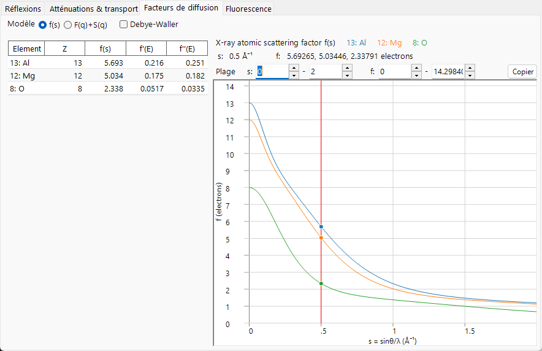
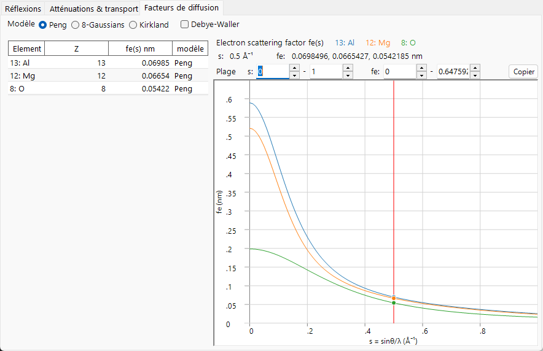
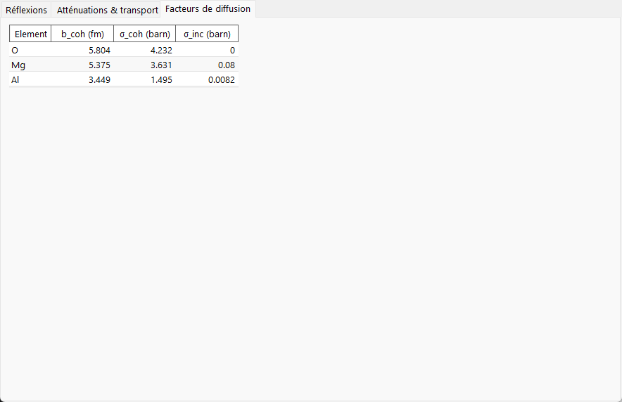

# Facteurs de diffusion atomique

Le **facteur de diffusion atomique** (ou *facteur de forme*) mesure l'intensité avec laquelle un atome isolé diffuse le faisceau incident en fonction de la variable de diffusion $s=\sin\theta/\lambda$. Les trois rayonnements interagissent avec des parties complètement différentes de l'atome, de sorte que leurs facteurs de diffusion ont des ordres de grandeur, des unités et des dépendances angulaires différents. C'est la principale raison pour laquelle l'onglet **Scattering factors** a un aspect si différent entre les faisceaux de rayons X, d'électrons et de neutrons.

=== "X-ray"
    

=== "Electron"
    

=== "Neutron"
    

---

## Rayons X — diffusion par le nuage électronique

Les rayons X sont diffusés par les **électrons** de l'atome. Un électron libre isolé diffuse avec la section efficace différentielle classique de **Thomson**, fixée par le rayon classique de l'électron $r_e = e^2/(4\pi\varepsilon_0 m_e c^2) \approx 2.82\times10^{-5}\ \text{Å}$ :

$$\left(\frac{d\sigma}{d\Omega}\right)_e = r_e^2\,\frac{1+\cos^2 2\theta}{2}.$$

Les électrons de l'atome sont répartis dans l'espace avec une densité numérique $\rho_e(\mathbf r)$, et le facteur de diffusion atomique est la **transformée de Fourier** de cette densité. La section efficace atomique est alors la section efficace d'un seul électron multipliée par $|f_0|^2$ :

$$f_0(\mathbf Q) = \int \rho_e(\mathbf r)\, e^{\,i\mathbf Q\cdot\mathbf r}\, d^3r ,
\qquad
\left(\frac{d\sigma}{d\Omega}\right)_\text{atom} = r_e^2\,\frac{1+\cos^2 2\theta}{2}\,|f_0(s)|^2 .$$

- Dans la direction vers l'avant ($s\to 0$), tous les électrons diffusent en phase, de sorte que $f_0(0) = Z$, le numéro atomique. Le facteur est exprimé en **unités électroniques** (multiples de l'amplitude de Thomson — la seconde équation ci-dessus l'explicite).
- À mesure que $s$ augmente, la diffusion provenant des différentes parties du nuage se déphase et $f_0(s)$ décroît. Une distribution électronique diffuse (externe, de valence) fait chuter rapidement $f_0$ ; les électrons de cœur fortement liés continuent de contribuer jusqu'à des $s$ élevés.

En pratique, $f_0(s)$ est tabulé comme une somme de gaussiennes (la forme analytique de **Waasmaier–Kirfel** qu'utilise ReciPro, une extension des anciennes tables de Cromer–Mann),

$$f_0(s) = \sum_{i} a_i\, e^{-b_i s^2} + c ,$$

ce que ReciPro évalue pour tracer la courbe. Les coefficients sont tabulés pour $s$ en Å⁻¹, de sorte que chaque $b_i$ a des unités de Ų ; ReciPro manipule $s^2$ en interne en nm⁻² et applique la conversion par le facteur 100 mentionnée dans l'[index](index.md).

### Dispersion anomale (résonante)

L'image de la transformée de Fourier suppose que les électrons diffusent comme s'ils étaient libres. Lorsque l'énergie du photon s'approche d'un **seuil d'absorption**, les électrons liés réagissent de manière résonante et deux termes de correction dépendant de l'énergie apparaissent :

$$f(s,E) = f_0(s) + f'(E) + i\,f''(E) \qquad \text{(textbook, } e^{+i\phi}\ \text{convention).}$$

- $f'(E)$ : correction de dispersion réelle (réduit le nombre effectif d'électrons près d'un seuil).
- $f''(E)$ : partie imaginaire, maximale juste au-dessus d'un seuil.
- Les deux sont liés par les relations de **Kramers–Kronig**, de sorte qu'un pic d'absorption ($f''$) s'accompagne d'une excursion dispersive de $f'$.

Ce ne sont pas des paramètres libres. La causalité (Kramers–Kronig) lie $f'$ à $f''$, et le **théorème optique** lie $f''$ directement à la section efficace de photoabsorption :

$$f'(E) = \frac{2}{\pi}\,\mathcal{P}\!\!\int_0^\infty \frac{E'\,f''(E')}{E'^2 - E^2}\,dE',
\qquad
f''(E) = \frac{\sigma_\text{abs}(E)}{2\,r_e\,\lambda}.$$

Ici, $\sigma_\text{abs}$ est essentiellement la partie **photoabsorption** de l'atténuation (et non les termes de Rayleigh/Compton) — la même structure de seuil que celle observée sur la page [Atténuation & transport](attenuation-transport.md).

ReciPro évalue $f'$ et $f''$ à l'énergie courante à l'aide de la bibliothèque **xraylib** intégrée et les liste dans le tableau (avec $f'' > 0$). Deux points de signe importent. Premièrement, xraylib renvoie $F_{ii}$ avec le signe opposé à la convention cristallographique, donc ReciPro en inverse le signe pour rapporter un **$f''$ positif**. Deuxièmement, sous la convention de phase $\exp(-2\pi i\,\mathbf g\cdot\mathbf r)$ de ReciPro, le facteur complexe qui entre réellement dans le facteur de structure est $f_0 + f' - i f''$ — le $+i f''$ écrit ci-dessus appartient à la convention opposée ($e^{+2\pi i}$). C'est pourquoi `F_inv` (la partie imaginaire du facteur de structure) devient non nulle près d'un seuil — voir [Facteur de structure](structure-factor.md).

---

## Électrons — diffusion par le potentiel électrostatique

Un électron rapide est chargé, il est donc diffusé par le **potentiel électrostatique** $V(\mathbf r)$ de l'atome — la combinaison du noyau positif et du nuage électronique négatif. Le facteur de diffusion électronique $f_e$ est par conséquent la transformée de Fourier du potentiel, ce qui le relie au facteur de rayons X via l'équation de Poisson. Le résultat est la **relation de Mott–Bethe** :

$$f_e(s) = C_\text{MB}\,\frac{Z - f_0(s)}{s^2} \;\;\propto\; \frac{Z - f_X(Q)}{Q^2}.$$

Le préfacteur $C_\text{MB}$ est construit à partir de constantes fondamentales et dépend du système d'unités ainsi que de l'emploi de $s$ ou de $Q$. ReciPro n'évalue pas directement cette relation — il utilise les formes ajustées de Peng / Kirkland / 8 gaussiennes ci-dessous — elle est donc donnée ici pour la compréhension physique plutôt que pour le calcul. Explicitée avec les constantes (pour $s$ et $f_e$ en Å),

$$f_e(s)\,[\text{Å}] = \frac{m_e e^2}{8\pi\varepsilon_0 h^2}\,\frac{Z - f_0(s)}{s^2} \simeq 0.023934\,\frac{Z - f_0(s)}{s^2}, \qquad s\ \text{in Å}^{-1},$$

avec un $\times 0.1$ supplémentaire lorsque ReciPro rapporte $f_e$ en nm, et un facteur relativiste $\gamma$ additionnel (ci-dessous) dans le potentiel dynamique.

La physique réside dans le numérateur $Z - f_0$ : l'électron voit la **différence** entre la charge nucléaire $Z$ et le nuage électronique d'écrantage $f_0$, c'est-à-dire le potentiel atomique net.

- **Ordre de grandeur.** En raison du facteur $1/s^2$, $f_e$ est fortement piqué vers les petits angles et est bien plus grand (dans ses propres unités) et plus dirigé vers l'avant que $f_0$. C'est pourquoi la diffraction électronique est dominée par les réflexions d'ordre bas et pourquoi la diffusion dynamique (multiple) est importante — voir [Annexe A3](../a3-bloch-wave/index.md).
- **Limite aux petits angles.** Pour un atome *neutre*, à la fois $Z-f_0\to 0$ et $s^2\to 0$, de sorte que $f_e(0)$ est fini (une limite $0/0$ fixée par le rayon atomique quadratique moyen). Pour un **ion**, le nuage ne compense plus $Z$ et la queue coulombienne à longue portée fait diverger $f_e$ lorsque $s\to 0$ ; les facteurs électroniques ioniques tabulés doivent être traités avec précaution aux plus petits angles.
- **Correction relativiste.** Aux énergies du TEM, la masse et la longueur d'onde de l'électron sont relativistes. La longueur d'onde utilise la forme relativiste $\lambda = h/\sqrt{2 m_0 e U\,(1 + e U/2 m_0 c^2)}$, et le potentiel d'interaction porte le facteur relativiste $\gamma = 1 + eU/m_0c^2$. ReciPro applique cette correction lors de la formation du potentiel dynamique.

ReciPro propose trois paramétrisations de $f_e(s)$ :

- **Peng** : un ajustement à cinq gaussiennes, $f_e(s)=\sum_i a_i e^{-b_i s^2}$, pratique et largement utilisé pour la diffusion électronique élastique.
- **Kirkland** : un ajustement mixte lorentzien + gaussien, $f_e(q)=\sum_i \dfrac{a_i}{q^2+b_i} + \sum_i c_i\,e^{-d_i q^2}$. **Sa variable indépendante est $q = 2s = 1/d$, et non $s$** — une source fréquente d'erreurs d'un facteur deux lors de la comparaison des modèles ($q$ en Å⁻¹, avec les coefficients ajustés $a_i,b_i,c_i,d_i$ dans les unités correspondantes).
- **8-Gaussians** : un ajustement à huit termes valable sur une plage de $s$ plus large.

**Choisir un modèle.** Les trois ajustent le même $f_e(s)$ sous-jacent et concordent étroitement à bas $s$ ; ils diffèrent principalement par la plage et par la manière dont le cœur atomique est représenté. **Peng** (atomes neutres et ions courants, précis jusqu'à $s\approx2\text{–}6$ Å⁻¹) est le choix par défaut habituel pour les facteurs de structure SAED/CBED ; **Kirkland** s'étend à des $s$ plus élevés avec un terme de cœur lorentzien, adapté au HRTEM/STEM (rappel : $q=2s$) ; **8-Gaussians** est destiné aux réflexions atteignant des $s$ très élevés. Pour un élément léger, les trois sont quasiment indiscernables ; les différences apparaissent pour les éléments lourds à grand angle.

---

## Neutrons — diffusion par le noyau

Les neutrons thermiques sont non chargés et interagissent avec la matière principalement par l'**interaction nucléaire forte**, dont la portée (femtomètres) est totalement négligeable devant la longueur d'onde du neutron (ångströms). L'interaction est représentée par le **pseudopotentiel de Fermi**, une source ponctuelle dont l'intensité est la longueur de diffusion $b$ :

$$V(\mathbf r) = \frac{2\pi\hbar^2}{m_n}\,b\,\delta(\mathbf r)
\qquad\Longrightarrow\qquad
\frac{d\sigma}{d\Omega} = |b|^2 .$$

Comme le diffuseur est ponctuel, $b$ est **indépendant de $s$** — il n'y a pas de décroissance de type facteur de forme, ce qui explique pourquoi l'onglet **Scattering factors** ne trace aucune courbe pour les neutrons et affiche à la place un tableau de longueurs de diffusion.

- $b$ est une propriété du **nucléide**, et non de la configuration électronique. Elle varie de façon irrégulière d'un élément à l'autre (et entre isotopes), peut être **négative** (par ex. ¹H, Ti, Mn) et n'a aucune relation monotone avec $Z$. C'est la base du contraste neutronique (atomes légers près d'atomes lourds, marquage isotopique).
- **Cohérent vs incohérent.** Un élément réel est un mélange d'isotopes et d'états de spin nucléaire avec des $b$ différents. La décomposition $b = \langle b\rangle + \delta b$ donne une partie cohérente (provenant de la moyenne) et une partie incohérente (provenant de la dispersion) :

$$\sigma_\text{coh} = 4\pi\,|\langle b\rangle|^2, \qquad \sigma_\text{inc} = 4\pi\big(\langle |b|^2\rangle - |\langle b\rangle|^2\big), \qquad \sigma_s = \sigma_\text{coh} + \sigma_\text{inc}.$$

  La partie cohérente produit la diffraction de Bragg (c'est elle qui entre dans le facteur de structure) ; la partie incohérente est un fond plat et isotrope (élevé pour ¹H, la raison de la deutération).

!!! note "Valeurs tabulées"
    ReciPro lit $b_\text{coh}$ et les sections efficaces dans une table de nucléides plutôt que de les calculer. Pour les nucléides résonants, le $\sigma_\text{coh}$ listé n'est pas nécessairement égal au $4\pi b^2$ naïf ; les valeurs du tableau font donc foi. La diffusion neutronique magnétique (par les spins électroniques non appariés, qui *possède* bel et bien un facteur de forme dépendant de $s$) n'est pas modélisée ici.

---

## En un coup d'œil

| | X-ray | Electron | Neutron |
|---|---|---|---|
| Diffusé par | nuage électronique $\rho_e(\mathbf r)$ | potentiel électrostatique $V(\mathbf r)$ | noyau (point) |
| Dépendance en $s$ | décroît (TF du nuage) | $\propto (Z-f_0)/s^2$, fortement vers l'avant | aucune ($b$ constant) |
| Valeur vers l'avant | $f_0(0)=Z$ | finie (neutre) / divergente (ion) | $b$ |
| Dépendance en énergie | $f',f''$ près des seuils | relativiste $\lambda,\gamma$ | $\sigma_\text{abs}\propto 1/v$ (pas $b$) |
| Ordre de grandeur typique | $\propto Z$ | piqué vers l'avant, croît avec $Z$ | irrégulier, peut être $<0$ |

---

## Voir aussi

- [Index — géométrie et la variable $s$](index.md)
- [Facteur de structure](structure-factor.md) — comment ces facteurs se combinent sur une maille.
- [3. Interaction du faisceau → onglet Scattering factors](../../3-beam-interaction.md#scattering-factors-tab)
