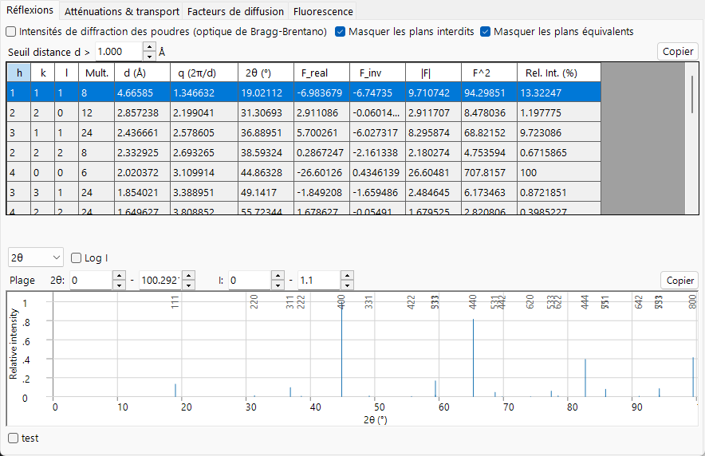
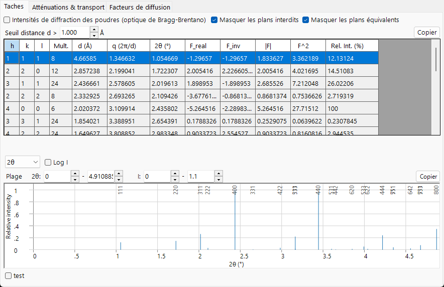
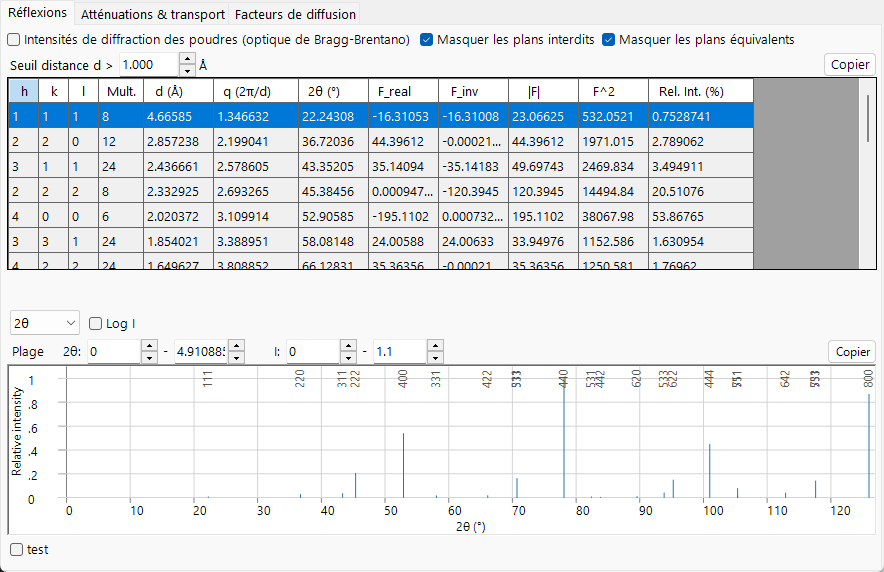

# Facteur de structure

Le facteur de diffusion atomique décrit un seul atome ; le **facteur de structure** décrit comment tous les atomes de la maille diffusent *ensemble*. C'est la grandeur que l'onglet **Réflexions** tabule (`F_real`, `F_inv`, $\lvert F\rvert$, $F^2$), et il constitue le lien entre la physique atomique de la page précédente et les intensités diffractées.

=== "X-ray"
    

=== "Electron"
    

=== "Neutron"
    

---

## Interférence sur la maille

Le facteur de structure de la réflexion $\mathbf g = (hkl)$ est la somme cohérente des facteurs de diffusion atomiques, chacun pondéré par la phase issue de la position fractionnaire $\mathbf r_j = (x_j,y_j,z_j)$ de l'atome :

$$F_{\mathbf g} = \sum_{j} o_j\, f_j(s,E)\, T_j(\mathbf g)\, \exp\!\left(-2\pi i\,(h x_j + k y_j + l z_j)\right).$$

- $o_j$ : **occupancy** du site (taux d'occupation, fractionnaire, pour une occupation partielle ou mixte).
- $f_j(s,E)$ : le facteur de diffusion atomique de l'atome $j$ pour le faisceau courant — $f_0+f'-if''$ pour les rayons X dans la [convention de phase](index.md#phase-convention) de ReciPro, $f_e$ pour les électrons, $b$ pour les neutrons.
- $T_j(\mathbf g)$ : le facteur de Debye–Waller (ci-dessous).
- La phase $-2\pi i$ suit la [convention](index.md#phase-convention) de ReciPro.

L'intensité est le module au carré,

$$I_{\mathbf g} \;\propto\; \lvert F_{\mathbf g}\rvert^2 = F_\text{real}^2 + F_\text{inv}^2 ,$$

ce qui correspond à la colonne $F^2$ du tableau. `F_real` et `F_inv` sont les parties réelle et imaginaire du facteur de structure complexe. Même avec des facteurs atomiques purement réels, $F_{\mathbf g}$ est en général complexe pour une structure non centrosymétrique (ou pour une origine décalée) ; la dispersion anomale des rayons X ($f$ complexe) et les longueurs de diffusion neutronique complexes ajoutent une contribution imaginaire supplémentaire. `F_inv` ne s'annule pour *toutes* les réflexions que lorsque la structure est centrosymétrique avec l'origine en un centre de symétrie et que tous les facteurs sont réels.

---

## Le facteur de Debye–Waller

Les atomes vibrent autour de leurs sites d'équilibre, étalant la densité de diffusion et réduisant les facteurs aux grands angles. Pour un mouvement isotrope,

$$T_j = \exp\!\left(-B_j\, s^2\right), \qquad B_j = 8\pi^2\langle u_j^2\rangle,$$

où $\langle u_j^2\rangle$ est le déplacement quadratique moyen le long de la direction de diffusion et $B_j$ le paramètre de déplacement isotrope (Ų). Un mouvement anisotrope généralise ceci en

$$T_j = \exp\!\left(-2\pi^2\,\mathbf g^{\mathsf T}\!\mathbf U_j\,\mathbf g\right),$$

avec $\mathbf U_j$ le tenseur de déplacement et $\mathbf g$ le vecteur du réseau réciproque ($|\mathbf g|=1/d$, et non $Q=2\pi\lvert\mathbf g\rvert$). Pour un solide de Debye, le déplacement quadratique moyen est lui-même une fonction de la température $T$, de la masse atomique $M$ et de la température de Debye $\Theta_D$,

$$\langle u^2\rangle = \frac{3\hbar^2}{M k_B \Theta_D}\left[\frac14 + \left(\frac{T}{\Theta_D}\right)^2\!\int_0^{\Theta_D/T}\frac{x}{e^x-1}\,dx\right],$$

de sorte que $B$ croît avec la température et décroît pour les atomes lourds. ReciPro utilise directement les valeurs $B_j$ tabulées ou saisies plutôt que de calculer ceci. Comme $T_j$ multiplie le facteur de diffusion, l'onglet **Facteurs de diffusion** peut appliquer le même amortissement $e^{-Bs^2}$ aux courbes tracées. L'amortissement croît avec la température et avec $s$, ce qui explique pourquoi la diffusion thermique diffuse (intensité retirée des faisceaux de Bragg cohérents et redistribuée dans un fond diffus) alimente le potentiel absorptif dans la théorie dynamique ([Annexe A3](../a3-bloch-wave/index.md)).

---

## Extinctions : systématiques vs accidentelles

Une réflexion peut être **absente** pour deux raisons distinctes :

- **Extinctions systématiques (liées au groupe d'espace).** Le centrage du réseau et les éléments de symétrie possédant une composante de translation (axes hélicoïdaux, plans de glissement) font disparaître *exactement* des classes entières de réflexions, pour chaque cristal de ce groupe d'espace, indépendamment du contenu atomique. Ce sont les règles qui sous-tendent **Hide prohibited planes**.
- **Quasi-extinctions accidentelles.** Lorsque les contributions atomiques s'annulent par hasard pour une structure particulière, l'intensité est faible mais non interdite par la symétrie, et elle peut réapparaître si la composition ou les positions changent. Celles-ci ne sont *pas* supprimées par les règles d'extinction.

Une extinction systématique est une annulation de phase entre les copies de la maille reliées par symétrie. Pour des translations de centrage $\mathbf t_\alpha$, le facteur de structure porte un facteur commun

$$F_{\mathbf g} \propto \sum_\alpha e^{-2\pi i\,\mathbf g\cdot\mathbf t_\alpha},$$

qui est nul pour certains $hkl$. Pour le centrage interne (body-centring, $\mathbf t = \tfrac12,\tfrac12,\tfrac12$),

$$1 + e^{-\pi i (h+k+l)} = 0 \quad\Longleftrightarrow\quad h+k+l \ \text{odd}.$$

Les extinctions systématiques les plus courantes sont :

| Élément de symétrie | Condition d'extinction | Réflexions affectées |
|---|---|---|
| $I$ (centré interne) | $h+k+l$ impair | tous les $hkl$ |
| $F$ (centré face) | $h,k,l$ de parité mixte | tous les $hkl$ |
| $C$ (centré C) | $h+k$ impair | tous les $hkl$ |
| axe hélicoïdal $2_1$ $\parallel b$ | $k$ impair | $0k0$ |
| plan de glissement $a$ $\perp b$ | $h$ impair | $h0l$ |
| plan de glissement $c$ $\perp b$ | $l$ impair | $h0l$ |

Les conditions de centrage s'appliquent à chaque réflexion ; les conditions d'axe hélicoïdal et de plan de glissement ne s'appliquent qu'à la rangée axiale ou à la zone correspondante, ce qui est précisément ce qui les rend diagnostiques du groupe d'espace.

---

## La loi de Friedel et sa rupture

Pour une structure à facteurs de diffusion réels (non résonants), conjuguer la somme et inverser le signe de $\mathbf g$ montre directement que (en omettant les poids réels $o_j T_j$ par souci de clarté)

$$F_{-\mathbf g} = \sum_j f_j\, e^{+2\pi i\,\mathbf g\cdot\mathbf r_j} = \left(\sum_j f_j\, e^{-2\pi i\,\mathbf g\cdot\mathbf r_j}\right)^{*} = F_{\mathbf g}^{*}, \qquad\text{hence}\qquad \lvert F_{hkl}\rvert = \lvert F_{\bar h\bar k\bar l}\rvert \quad\text{(Friedel's law).}$$

La diffraction apparaît alors centrosymétrique même lorsque le cristal ne l'est pas. **La dispersion anomale peut briser cela.** En écrivant le facteur de structure comme une partie normale (qui se conjugue proprement) plus une partie anomale, $F_{\mathbf g} = A_{\mathbf g} - i B_{\mathbf g}$ et $F_{-\mathbf g} = A_{\mathbf g}^{*} - i B_{\mathbf g}^{*}$ dans la convention $f = f_0 + f' - i f''$ de ReciPro, la **différence de Bijvoet** est

$$\lvert F_{\mathbf g}\rvert^2 - \lvert F_{-\mathbf g}\rvert^2 = -4\,\operatorname{Im}\!\left(A_{\mathbf g}\, B_{\mathbf g}^{*}\right),$$

non nulle uniquement lorsque les parties normale et anomale ont des phases différentes — c'est-à-dire lorsque des diffuseurs anomaux chimiquement distincts occupent des sites non centrosymétriques. (La différence s'annule pour une structure centrosymétrique, un élément unique, ou tout cas où chaque atome porte le même facteur complexe.) C'est ce qui permet de déterminer la structure absolue (chiralité) d'un cristal non centrosymétrique, et c'est la raison physique pour laquelle ReciPro indique un `F_inv` non nul et des $\lvert F\rvert$ distincts pour les paires de Friedel dès qu'une énergie de rayons X proche d'un seuil est choisie.

---

## Du facteur de structure à l'intensité sur poudre

Activer **Powder Diffraction Intensities (Bragg–Brentano)** convertit $\lvert F\rvert^2$ en une intensité relative sur poudre en intégrant la géométrie d'un polycristal orienté aléatoirement :

$$I_{hkl} \;\propto\; m_{hkl}\, \lvert F_{hkl}\rvert^2\, L p(\theta),$$

- $m_{hkl}$ : **multiplicité** — le nombre de plans équivalents par symétrie qui se superposent au même $2\theta$ (la colonne *Multi.* du tableau).
- $Lp(\theta)$ : le facteur de **Lorentz–polarisation** pour l'optique Bragg–Brentano, $Lp = \dfrac{1+\cos^2 2\theta}{\sin^2\theta\,\cos\theta}$, qui rehausse fortement les pics aux petits angles.

Comme les plans équivalents sont fusionnés en une seule raie dans ce mode, ReciPro force également *Hide equivalent planes* et *Hide prohibited planes*.

---

## Voir aussi

- [Facteurs de diffusion atomiques](scattering-factor.md) — les $f_j$ qui entrent dans la somme.
- [Atténuation & transport](attenuation-transport.md) — ce qu'il advient du faisceau entre les événements de diffusion.
- [3. Interaction du faisceau → onglet Réflexions](../../3-beam-interaction.md#reflections-tab)
- [Annexe A3. Diffraction dynamique](../a3-bloch-wave/index.md) — lorsque $\lvert F\rvert^2$ (cinématique) ne suffit plus.
