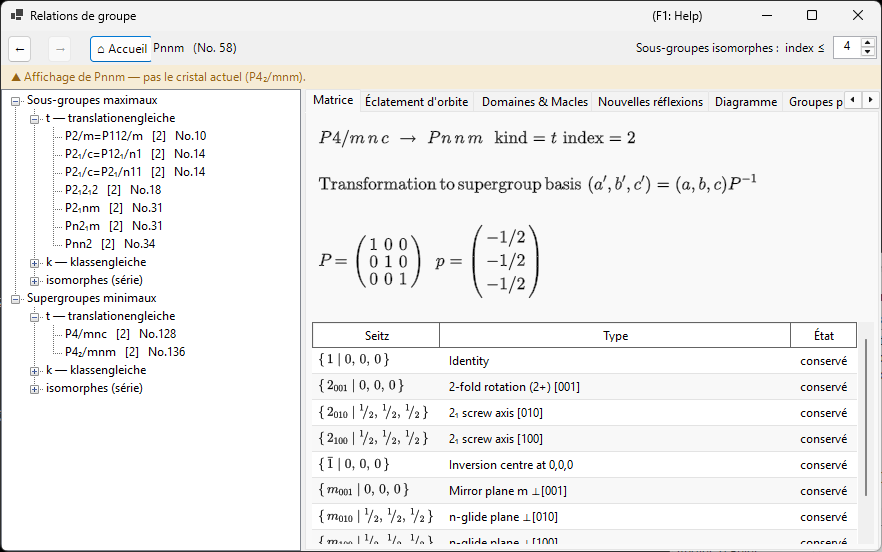
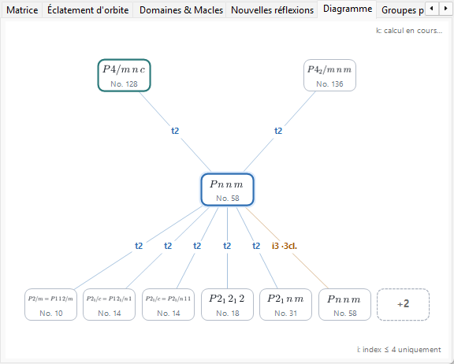
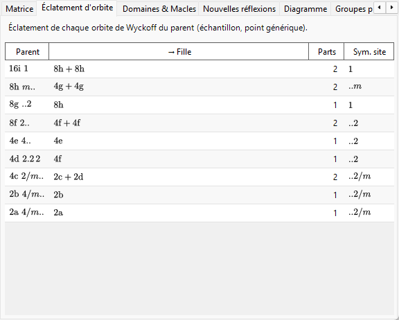
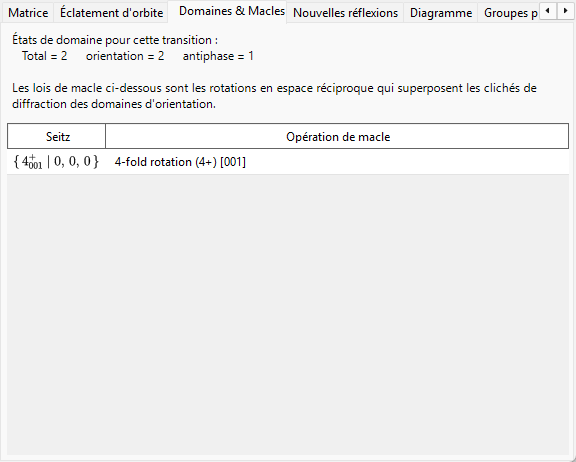
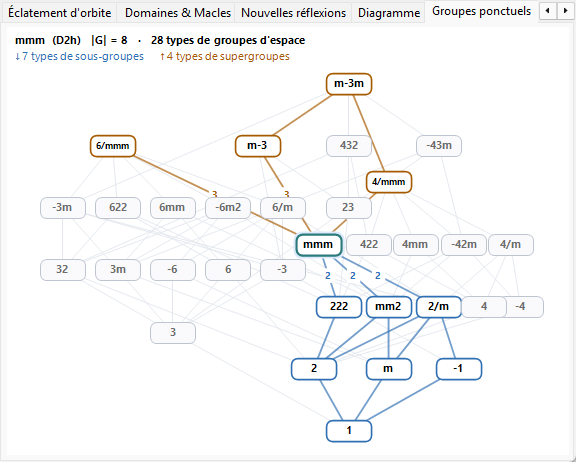
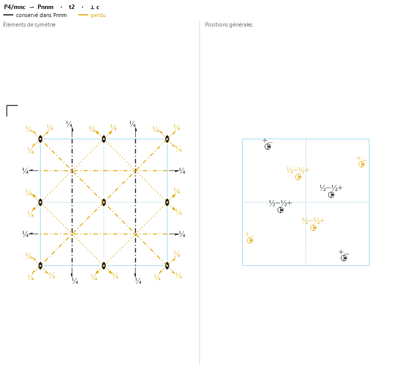

# A4.2. Relations groupe–sous-groupe

**Relations de groupe…** est un navigateur des relations sous-groupe maximal / supergroupe minimal des 230 types de groupes d'espace, ouvert depuis le panneau **Options** d'[Informations de symétrie](../../2-symmetry-information.md). Contrairement à une table statique, chaque relation qu'il affiche est calculée à l'exécution directement à partir des opérations de symétrie du groupe d'espace actuel lui-même (voir [A4.1](symbols-and-diagrams.md#opérations-de-symétrie-onglet-opérations)), de sorte qu'elle peut être contre-vérifiée opération par opération au lieu d'être simplement acceptée comme une transcription des *International Tables*, Vol. A1.

Cette page explique le vocabulaire de théorie des groupes qu'utilise le navigateur, puis passe en revue chacun de ses onglets.

---

## Théorème de Hermann : sous-groupes *t*, *k* et isomorphes

Un sous-groupe $H<G$ est **maximal** si aucun sous-groupe de $G$ ne se situe strictement entre $H$ et $G$. Un théorème dû à Carl Hermann (1929) affirme que, pour les groupes d'espace tridimensionnels tabulés ici, tout sous-groupe maximal d'un groupe d'espace $G$ est de l'un de deux types :

- **sous-groupe translationengleiche (*t*-)** — « à translations égales » : $H$ conserve *toutes* les translations de $G$ (le même réseau, la même maille), mais un groupe ponctuel plus petit. L'indice $[G:H]$ (le nombre de classes latérales de $H$ dans $G$) est égal à l'indice des groupes ponctuels $[P_G:P_H]$.
- **sous-groupe klassengleiche (*k*-)** — « à classe égale » : $H$ conserve la *même classe cristalline géométrique* (le même type de groupe ponctuel) que $G$, mais seulement un sous-réseau des translations de $G$ — une maille conventionnelle plus grande, et/ou moins de vecteurs de centrage. L'indice est égal à l'indice des réseaux de translation $[T_G:T_H]$.

**Les sous-groupes isomorphes** sont le cas particulier, important, des sous-groupes *k*- où $H$ est de surcroît du *même type de groupe d'espace* que $G$ lui-même (seulement une maille plus grande — une relation qui se répète indéfiniment, de sorte que les sous-groupes isomorphes forment une série infinie indexée par la taille de la maille, contrairement aux sous-groupes *t*- et *k*- non isomorphes de $G$, en nombre fini). Pour un sous-groupe isomorphe *maximal*, l'indice est toujours une puissance d'un nombre premier ($p$, et en trois dimensions parfois $p^2$ ou $p^3$) ; la puissance qui apparaît dépend de la façon dont le réseau quotient fini se décompose comme module sous l'action du groupe ponctuel. Notez aussi que le changement de base vers un sous-réseau peut comporter un véritable changement de vecteurs de base et un décalage d'origine, et pas simplement un agrandissement uniforme de la maille le long d'un axe.

Parce que toute relation de sous-groupe d'indice fini (maximale ou non) peut être atteinte par une chaîne d'étapes maximales, lister uniquement les sous-groupes maximaux (et, dans l'autre sens, les supergroupes minimaux) suffit à décrire le réseau complet des relations de sous-groupes d'indice fini — c'est exactement pourquoi l'ITA Vol. A1, et ce navigateur, ne tabulent que les relations maximales/minimales.

!!! note "Deux types seulement — isomorphe est une sous-classe, pas un troisième type"
    Il est courant, par raccourci, de parler des « sous-groupes *t*-, *k*- et isomorphes » comme s'il s'agissait de trois catégories de même rang, et l'arbre de ce navigateur est effectivement organisé en trois branches par commodité. Formellement, cependant, le théorème de Hermann est une dichotomie en **deux** (*t* ou *k*) ; les sous-groupes isomorphes sont simplement les sous-groupes *k*- qui se trouvent reproduire le type de groupe d'espace de $G$ lui-même.

### L'indice comme nombre de classes latérales

Parce que les groupes d'espace sont infinis (ils contiennent des translations), « indice » signifie toujours ici **le nombre de classes latérales (cosets) de $H$ dans $G$**, et non un rapport d'ordres $|G|/|H|$ (les deux ordres sont infinis) — pour les groupes finis les deux notions coïncident, mais pour les groupes d'espace seule la définition par décompte de classes latérales a un sens. L'arbre et l'onglet Matrice affichent tous deux cet indice sous la forme `t, index 2` ou `k, index 3`.

### Sous-groupes conjugués et classe de conjugaison

Une même relation de sous-groupe abstraite peut souvent se réaliser dans $G$ de plusieurs façons géométriquement distinctes — reliées par l'orientation ou la position plutôt que par le type — par exemple l'image miroir d'un plan miroir, ou un axe hélicoïdal le long d'une direction orientée différemment mais équivalente par symétrie. Deux telles réalisations $H$ et $H'$ sont conjuguées **dans $G$** si $H' = gHg^{-1}$ pour un certain $g\in G$ ; le navigateur regroupe toutes les copies $G$-conjuguées d'une relation en une seule entrée et rapporte leur nombre comme la taille de la *classe de conjugaison*. C'est une notion strictement plus fine que le regroupement des sous-groupes selon l'équivalence (plus grossière) sous le normalisateur euclidien ou affine de $G$ — une classification que l'ITA elle-même utilise parfois à la place — de sorte que des sous-groupes partageant le même type et le même indice n'appartiennent pas automatiquement à une même classe de conjugaison ; ils peuvent se répartir en plusieurs.

---

## Navigation dans le navigateur

- **L'arbre** (volet de gauche) possède deux racines, **Sous-groupes maximaux** et **Supergroupes minimaux**, chacune scindée en une branche **`t — translationengleiche`**, une branche **`k — klassengleiche`** et une branche **`isomorphes (série)`**. Les classes non conjuguées partageant le même type fils et le même indice recevraient sinon des étiquettes identiques ; elles sont donc distinguées par un suffixe `· classe n`. Dans la branche **isomorphes** des Sous-groupes maximaux, les classes de conjugaison équivalentes sous le *normalisateur affine* de $G$ sont de plus regroupées sous une même ligne d'orbite (*« … — m classes (équivalentes par normalisateur) »*) — la même granularité que les entrées IIc de l'ITA Vol. A1 — et la borne d'énumération se règle avec le compteur **Sous-groupes isomorphes : index ≤** de la barre d'outils (2–27, 4 par défaut ; les bornes plus élevées sont calculées en arrière-plan).
- L'onglet **Diagramme** dessine un squelette simplifié à la Bärnighausen : le groupe actuel au centre (mis en évidence), ses supergroupes minimaux au-dessus et ses sous-groupes maximaux en dessous — **relations *t*-, *k*- et isomorphes confondues**, puisque chacune constitue une « étape maximale ». Chaque arête porte une étiquette avec son type et son indice (`t2`, `k3`, `i3`), avec un code couleur : bleu pour *t*, bleu-vert pour *k* et orange pour isomorphe. Les symboles des nœuds sont composés comme de vrais symboles cristallographiques — indices inférieurs pour les axes hélicoïdaux, barres supérieures pour les rotoinversions. Les classes non conjuguées partageant le même type cible, le même genre et le même indice sont fusionnées en un seul nœud dont l'étiquette d'arête porte le nombre de classes (par ex. `k2 ·2 cl.`) — l'arbre reste l'endroit où examiner chaque classe individuellement. Lorsqu'une rangée contient plus de relations que la largeur de la fenêtre n'en admet, les nœuds rétrécissent d'un cran et le reste est rassemblé dans un nœud en pointillés `+N` (non cliquable — utilisez l'arbre pour la liste complète) ; un petit rappel `i: index ≤ 4 uniquement` apparaît dans le coin dès que des arêtes isomorphes sont affichées, et `k: calcul en cours…` tant que la recherche inverse des supergroupes *k*- est encore en construction. Lorsque vous descendez de sous-groupe en sous-groupe par double-clics, la chaîne des groupes traversés (votre *branche sélectionnée*) est dessinée sous forme de colonne verticale violette au-dessus du groupe actuel — un arbre de Bärnighausen à plusieurs niveaux retraçant votre propre chemin de transition (par ex. $Pm\bar3m \rightarrow P4/mmm \rightarrow Pmmm \rightarrow \ldots$), chaque arête portant l'étiquette de la relation empruntée ; remonter ou appuyer sur **Précédent** élague la branche en conséquence, et les chaînes de plus de trois ancêtres sont abrégées par un `⋮ +N` estompé. Ceci ne montre que le squelette de théorie des groupes — un véritable arbre de Bärnighausen, au sens des relations structurales, porte aussi à chaque arête les transformations de maille, l'éclatement des positions de Wyckoff et les corrélations de coordonnées atomiques, qui résident dans les autres onglets décrits ci-dessous plutôt que sur le diagramme lui-même.
- **Un simple clic** (sur un nœud de l'arbre, ou un nœud du Diagramme) sélectionne une relation et remplit les onglets de détail en dessous. **Un double-clic** *navigue* : il réancre tout le navigateur sur ce groupe d'espace, ce qui permet de cheminer pas à pas de groupe en sous-groupe puis en sous-groupe.
- **Précédent / Suivant / Accueil** parcourent votre historique de navigation ; **Accueil** revient toujours au groupe d'espace du cristal depuis lequel vous avez réellement ouvert le navigateur.
- Le **fil d'Ariane** (en haut) affiche le groupe d'espace actuellement présenté (`symbole HM (No. n)`) ; la **bannière de contexte** juste en dessous devient verte (« Affichage du groupe d'espace du cristal actuel. ») quand il correspond à votre cristal, ou ambre (« Affichage de … — pas le cristal actuel (…). ») quand vous avez navigué ailleurs — un rappel que parcourir un sous-groupe ne modifie *pas* votre cristal.

---

## Onglet Matrice

Montre le changement de base et le décalage d'origine entre le setting parent et le setting fils, selon la convention de l'ITA : les nouveaux vecteurs de base sont $(\mathbf a',\mathbf b',\mathbf c')=(\mathbf a,\mathbf b,\mathbf c)\cdot P$, et les coordonnées d'un point dans le setting parent sont $\mathbf x_{\text{parent}} = P\,\mathbf x_{\text{child}} + \mathbf p$. La matrice $3\times3$ $P$ et le décalage d'origine $\mathbf p$ sont imprimés sous forme de fractions.

- Lorsque vous avez atteint cette relation depuis **Sous-groupes maximaux**, $P$ et $\mathbf p$ sont affichés directement (sens parent → fils).
- Lorsque vous l'avez atteinte depuis **Supergroupes minimaux**, l'onglet montre $P^{-1}$ (et le décalage inversé en conséquence), avec la légende *« dérivée de la table des sous-groupes du supergroupe »* — le navigateur mémorise toujours une relation du point de vue du groupe le plus grand et l'inverse à la demande, au lieu d'entretenir deux copies indépendantes.
- **Sous-groupes conjugués de cette classe : $n$** rapporte la taille de la classe de conjugaison décrite plus haut.
- Une table des générateurs liste chaque représentant de classe latérale, étiqueté **conservé** (encore présent dans $H$) ou **perdu** (présent dans $G$ mais pas dans $H$ — ce sont exactement les opérations responsables de la brisure de symétrie), chacun avec son symbole de Seitz et sa description de type géométrique d'[A4.1](symbols-and-diagrams.md#opérations-de-symétrie-onglet-opérations).
- Si le type de groupe d'espace cible d'une relation candidate n'a pas pu être identifié dans le catalogue de ReciPro, l'onglet le dit clairement au lieu de deviner, et n'affiche que le symbole du groupe ponctuel.

---

## Onglet Éclatement d'orbite

Montre comment chaque position de Wyckoff du groupe *parent* se scinde lorsque la symétrie s'abaisse vers $H$ : une ligne par position parent, listant la multiplicité/lettre/symétrie de site du parent, les multiplicités/lettres filles résultantes (jointes par `+` si l'orbite se scinde en plusieurs), le nombre de morceaux, et les symétries de site filles distinctes.

Ceci est calculé en substituant réellement **un point échantillon générique fixé** dans les opérations des deux groupes et en comparant les orbites obtenues — un éclatement *échantillonné* numériquement, et non le formalisme entièrement symbolique de l'éclatement de Wyckoff (tel qu'employé par des outils comme WYCKSPLIT) ; c'est délibérément qu'il s'intitule « Éclatement d'orbite » et non « Éclatement de Wyckoff » — un traitement entièrement symbolique pourrait en principe suivre chaque coïncidence de paramètre spécial, tandis que cette approche échantillonnée ne rapporte que l'éclatement observé en un point générique et ne signalerait pas, à elle seule, une coïncidence qui ne se produit que pour des valeurs spéciales de $x,y,z$.

Pour une relation ***k*- ou isomorphe**, la même approche échantillonnée est appliquée au réseau de translation plus grossier : l'onglet montre comment chaque orbite parent se scinde à mesure que des translations de réseau sont perdues, et les multiplicités filles sont comptées **dans la maille agrandie du sous-groupe** (de sorte que, pour un agrandissement de maille d'indice $n$, les multiplicités des morceaux totalisent $n$ fois la multiplicité parent).

---

## Onglet Domaines & Macles

Lorsqu'un cristal se transforme de $G$ vers un sous-groupe $H$, chacune des $[G:H]$ classes latérales de $H$ dans $G$ correspond à un **état de domaine** possible : l'état de référence est la classe de l'identité, et chaque autre classe — représentée par une opération « perdue » de l'onglet Matrice — engendre un état de domaine supplémentaire relié à la référence par cette opération.

Pour un **sous-groupe *t*-** en particulier, le réseau de translation est inchangé ($T_G=T_H$) ; il n'existe donc, du point de vue de la théorie des groupes, aucun **domaine d'antiphase (de translation)** ici — chaque état de domaine diffère de la référence par une véritable opération de groupe ponctuel, jamais par un simple décalage. L'onglet rapporte donc toujours `antiphase = 1` et `orientation = total`, c'est-à-dire que les $[G:H]$ états de domaine sont tous des **domaines d'orientation**.

Pour une transition ***k*- ou isomorphe**, la situation est exactement inverse : le groupe ponctuel est inchangé, il n'y a donc qu'**un seul état d'orientation**, et les translations de réseau perdues engendrent des **domaines d'antiphase (de translation)** — l'onglet rapporte `orientation = 1` et `antiphase = total`. Chaque translation perdue est listée comme un symbole de Seitz de translation pure, accompagné du vecteur d'antiphase correspondant exprimé dans la maille du sous-groupe. Comme tous les domaines d'antiphase partagent la même orientation, leurs réflexions fondamentales coïncident exactement ; seules les réflexions de surstructure (voir l'onglet **Nouvelles réflexions**) portent une différence de phase à la traversée d'une paroi d'antiphase.

La **loi de macle** pour une paire de domaines d'orientation est la partie matricielle de l'opération perdue — une rotation ou une réflexion, exprimée comme agissant sur le réseau direct ou réciproque — qui applique l'orientation du réseau d'un domaine sur celle de l'autre. Pour une transition vers un sous-groupe *t*-, cette opération est par construction une symétrie du réseau du groupe *parent* $G$ ; si la métrique réelle de la structure de basse symétrie conserve encore cette symétrie de réseau, les réseaux réciproques des deux domaines coïncident alors exactement après l'opération de macle et leurs diagrammes de diffraction se superposent complètement — le cas idéalisé de maclage *par mériédrie* que décrit cet onglet. Dans une transition réelle, la phase de basse symétrie développe généralement une petite déformation spontanée qui ne conserve la métrique du parent qu'approximativement ; en pratique, la superposition n'est donc souvent qu'approchée (maclage par *pseudo-mériédrie*) ; cet onglet rapporte la loi de macle exacte au sens de la théorie des groupes et de la métrique idéale, non une mesure de la proximité d'un cristal réel donné avec elle.

Un cas dégénéré, avec une liste de classes latérales vide, est rapporté comme `(domaine unique)` (l'indice 1 n'est jamais affiché comme relation).

---

## Onglet Nouvelles réflexions

Pour une transition vers un sous-groupe *t*-, liste les réflexions qui deviennent autorisées par la symétrie dans $H$ alors qu'elles étaient systématiquement absentes dans $G$ — c'est-à-dire les réflexions que les conditions de réflexion du parent (onglet [Conditions](../../2-symmetry-information.md)) interdisent, mais pas celles de $H$. La fenêtre de recherche se règle avec le compteur **Fenêtre de recherche** de l'onglet : $|h|,|k|,|l|\le4$ par défaut, ajustable de 2 à 8 (des bornes plus grandes peuvent lister beaucoup plus de réflexions).

Comme un sous-groupe *t*- n'agrandit jamais la maille, il ne s'agit **pas** de réflexions de surstructure/à indices fractionnaires — elles restent des $(h,k,l)$ entiers de la maille parent, et deviennent seulement *autorisées* parce qu'un plan de glissement ou un axe hélicoïdal qui les forçait à s'annuler n'est plus présent. (De véritables réflexions de surstructure à indices parent fractionnaires ne deviennent possibles que lorsque la maille elle-même s'agrandit, ce qui se produit pour un sous-groupe *k*-, pas pour un sous-groupe *t*-.) Une réflexion qui apparaît ici est seulement *permise* par la symétrie ; qu'elle soit réellement observée dépend encore du facteur de structure de la structure réelle, de plus basse symétrie.

Pour une relation ***k*- ou isomorphe**, l'onglet liste les nouvelles réflexions **indexées sur la maille agrandie du sous-groupe** (là encore dans la fenêtre de recherche) et classe chacune d'elles dans la dernière colonne :

- les **réflexions de surstructure** correspondent à des indices parent *fractionnaires*, affichés entre parenthèses (par ex. `(1/2 0 1)`) — elles apparaissent uniquement parce que la maille s'est agrandie ;
- les **réflexions libérées** sont entières dans la maille parent, mais étaient interdites par une condition de réflexion du parent que le sous-groupe lève — la règle parent levée est affichée à la place (cela inclut la perte de translations de centrage, par ex. un parent centré $I$ perdant sa condition $h+k+l$ pair).

Les réflexions autorisées à la fois dans le parent et dans le fils (réflexions fondamentales) ne sont pas listées. Si le type de groupe d'espace du fils n'a pas pu être identifié, les conditions de réflexion du fils sont inconnues et l'onglet indique que la prédiction n'est pas possible.

---

## Onglet Groupes ponctuels

Tandis que le reste du navigateur chemine entre groupes *d'espace*, cet onglet montre la carte plus large sur laquelle se déroulent ces cheminements : le **diagramme de Hasse des 32 types de groupes ponctuels cristallographiques** (classes cristallines géométriques) — l'ordre partiel indiquant quel type apparaît comme sous-groupe de quel autre. Chaque nœud est un type de groupe ponctuel ; l'axe vertical est l'ordre du groupe (1 en bas, 48 en haut, sur une échelle logarithmique), la famille hexagonale/trigonale formant la tour de gauche et la tour cubique–quadratique–orthorhombique celle de droite. Une arête est une relation de sous-groupe *maximale* (de couverture) — aucun troisième type ne s'intercale strictement entre les deux — et il existe exactement 80 arêtes de ce genre parmi les 32 types. Le diagramme est un ordre partiel mais *pas* un treillis au sens mathématique : il possède deux éléments maximaux, $m\bar3m$ et $6/mmm$, qui ne sont pas comparables.

- Le groupe ponctuel du groupe d'espace que vous parcourez porte un halo bleu pâle (comme le nœud actuel de l'onglet Diagramme) et constitue par défaut le type *sélectionné*.
- **Cliquez** sur n'importe quel nœud pour le sélectionner à sa place : ses **types de sous-groupes sont mis en évidence en bleu**, ses **types de supergroupes en orange**, et les nombres portés par les arêtes propres du nœud sélectionné sont l'**indice** (rapport des ordres) de cette étape maximale. Les types sans relation avec la sélection restent gris. Cliquer sur un espace vide ramène la sélection sur le groupe ponctuel actuel. (Cliquer ne navigue jamais nulle part — un type de groupe ponctuel correspond à de nombreux groupes d'espace, pas à un seul.)
- La légende en haut résume le type sélectionné : les symboles de Hermann–Mauguin et de Schoenflies, l'ordre du groupe $|G|$, le nombre de types de groupes d'espace, parmi les 230, qui lui appartiennent, et les tailles de ses ensembles de types de sous-groupes/supergroupes.

Ce diagramme est l'ombre, côté groupes ponctuels, du théorème de Hermann : une étape de sous-groupe *t*- dans l'arbre descend ici exactement d'une arête (l'indice de groupe d'espace d'une étape *t*- est égal à l'indice des groupes ponctuels porté par l'arête), tandis que les étapes *k*- et isomorphes restent sur le même nœud.

---

## Onglet Éléments et positions

Là où l'onglet **Matrice** liste les opérations conservées et perdues sous forme de table, cet onglet montre la même information *géométriquement*, dans les deux figures que les cristallographes lisent déjà côte à côte dans l'ITA Vol. A : à gauche, le [diagramme des éléments de symétrie](symbols-and-diagrams.md#symmetry-element-diagram) du parent (axes, plans et centres d'inversion) ; à droite, le **diagramme des positions générales** du parent. Les deux figures suivent une même règle de couleur — **ce qui survit dans $H$ est noir, ce qui est perdu est jaune**, avec la maille dessinée en bleu en dessous — de sorte que l'onglet répond d'un coup d'œil aux questions : quels éléments de symétrie se brisent, et comment l'orbite de la position générale se scinde, lorsque le cristal se transforme de $G$ vers le sous-groupe $H$. La direction de projection (⟂ *a*, *b* ou *c*) est choisie automatiquement selon le système cristallin du parent, et l'en-tête indique la relation, son type et son indice, ainsi que la projection.

**À gauche — Éléments de symétrie.**

- La superposition dessine en noir les éléments de symétrie reconstruits directement à partir du propre ensemble d'opérations de $H$, par-dessus les éléments du parent qui sont perdus, dessinés en jaune — de sorte que les éléments conservés sont précisément ceux qui réapparaissent dans $H$, sans devoir deviner symbole par symbole.
- Un élément de symétrie qui se dégrade en un élément d'ordre inférieur est représenté par le seul symbole survivant : là où un axe d'ordre 4 ne conserve que son axe d'ordre 2, seul le **symbole noir d'ordre 2** apparaît. Un élément perdu n'est imprimé en jaune que là où rien ne survit à son emplacement géométrique, afin que la symétrie survivante reste lisible.

La figure de gauche traite trois situations, selon la façon dont la maille du sous-groupe se rapporte à celle du parent :

- **Même maille conventionnelle** — sous-groupes *translationengleiche* (*t*-), et sous-groupes *klassengleiche* (*k*-) qui ne suppriment que des vecteurs de centrage ($\det$ de la base du sous-réseau $= 1$). Ici les éléments de $H$ vivent dans la maille du parent, de sorte que la superposition est un diagramme d'une seule maille parente. (Une relation *k*- supprimant le centrage, p. ex. $I$- ou $F$-centré $\to$ primitif, fait passer au jaune les axes hélicoïdaux et les plans de glissement engendrés par le centrage.)
- **Agrandissement de maille dans le plan** — relations *k*- ou isomorphes dont l'agrandissement se situe dans le plan *a*–*b* ($a'=n_a a$, $b'=n_b b$, avec *c* inchangé) dans un parent orthorhombique, quadratique ou cubique. La maille agrandie est dessinée (projetée ⟂ *c*) comme une grille $n_a\times n_b$ de tuiles de la maille parente, et **chaque tuile est colorée indépendamment** : un élément de symétrie conservé dans $H$ apparaît en noir dans les tuiles où cette copie subsiste, et en jaune là où l'agrandissement de la maille l'a supprimé — ainsi un doublement de maille se voit directement comme une copie sur deux passant au jaune.
- **Sinon** (agrandissement le long de l'axe de visée $c$, changements de maille obliques/non orthogonaux, parents hexagonaux/trigonaux/monocliniques) la symétrie perdue ne peut être dessinée sans ambiguïté dans une projection 2-D, de sorte que l'onglet affiche une brève note renvoyant aux onglets **Domaines & Macles** et **Nouvelles réflexions**, qui portent déjà l'information sur la symétrie de réseau perdue pour ces cas.

**À droite — Positions générales.** Sous $G$, tous les points dessinés forment une seule orbite (une seule position générale) ; sous $H$, cette orbite se scinde en $[G:H]$ sous-orbites (à comparer avec l'onglet **Éclatement d'orbite**). La sous-orbite contenant le point représentatif — l'ensemble qui demeure une seule position générale de $H$ — est dessinée en **noir** ; les points des autres sous-orbites, qui ne lui sont plus équivalents une fois la symétrie abaissée, sont **jaunes**. Là où la projection fait coïncider deux points équivalents, on utilise le *cercle scindé* (« split circle ») standard de l'ITA : un cercle divisé par une ligne verticale, avec une virgule marquant la moitié en image miroir et une étiquette de hauteur (`+`, `½−`, …) à côté de chaque moitié. **Si une moitié survit dans $H$ et que l'autre est perdue, la ligne de séparation ainsi que la virgule et l'étiquette de hauteur de la moitié perdue sont dessinées en jaune**, de sorte qu'une position à demi perdue se lit directement sur la figure. La coloration des orbites est affichée pour les relations à maille conservée (*t*-, et *k*- supprimant le centrage) ; pour les relations qui agrandissent la maille, le panneau de droite affiche une brève note à la place.

Pour les groupes d'espace R affichés dans le repère à axes rhomboédriques (Rho), aucune des deux figures ne peut être tracée dans cette projection ; l'onglet affiche une note à la place, et les deux diagrammes sont disponibles dans le repère à axes hexagonaux (Hex) du même groupe d'espace R.

---

## Limitations actuelles

Les moteurs de sous-groupes *t*- et *k*- du navigateur, les recherches inverses de supergroupes *t*- et *k*-, ainsi que la classification isomorphe (IIc), sont entièrement implémentés et vérifiés de manière indépendante contre les tables d'opérations des groupes d'espace, et les onglets **Éclatement d'orbite**, **Domaines & Macles** et **Nouvelles réflexions** sont opérationnels pour tous les types de relation. Les limitations restantes sont affichées comme telles plutôt que passées sous silence :

- **Les sous-groupes isomorphes sont énumérés jusqu'à la borne du compteur (indice ≤ 4 par défaut, au plus 27).** Une série isomorphe continue indéfiniment vers des indices supérieurs ; la note grisée sur la branche indique donc toujours la borne courante plutôt que de prétendre que la liste est complète. Le regroupement en orbites de normalisateur repose sur une recherche bornée des générateurs du normalisateur ; il est vérifié contre l'ITA A1 pour les cas testés, mais une preuve formelle de complétude pour chaque groupe reste à établir — au pire, une orbite pourrait s'afficher scindée en plusieurs lignes, jamais fusionnée à tort.
- **Les supergroupes *k*-** sont calculés en arrière-plan à la première utilisation (la recherche inverse a besoin des tables de sous-groupes *k*- de chaque type de la même classe cristalline) ; l'arbre affiche brièvement un nœud grisé *« calcul en cours… »* (et le Diagramme une note de coin *« k: calcul en cours… »*) jusqu'à ce qu'elle soit prête.

---

## Glossaire

| Terme | Signification |
|---|---|
| Sous-groupe maximal / supergroupe minimal | Un sous-groupe (supergroupe) sans autre relation de sous-groupe strictement entre lui et $G$ |
| Indice $[G:H]$ | Le nombre de classes latérales de $H$ dans $G$ |
| *translationengleiche* (*t*-) | Même réseau de translations, groupe ponctuel plus petit ; indice = indice des groupes ponctuels |
| *klassengleiche* (*k*-) | Même type de groupe ponctuel, sous-réseau des translations (maille plus grande) ; indice = indice des réseaux |
| Sous-groupe isomorphe | Un sous-groupe *k*- qui est de surcroît du même type de groupe d'espace que $G$ |
| Classe de conjugaison (dans $G$) | L'ensemble des réalisations $G$-conjuguées ($gHg^{-1}$) d'une relation de sous-groupe |
| Domaine d'orientation | Un état de domaine relié à la référence par une opération de groupe ponctuel |
| Domaine d'antiphase (de translation) | Un état de domaine relié à la référence par une translation perdue seulement (possible pour les transitions *k*-, pas *t*-) |
| Loi de macle | La partie matricielle d'une opération perdue, appliquant le réseau d'un domaine d'orientation sur celui d'un autre |

---

## Voir aussi

- [2. Informations de symétrie](../../2-symmetry-information.md) — le guide de la GUI que cette annexe explique.
- [A4.1. Symboles des groupes d'espace et diagrammes de symétrie](symbols-and-diagrams.md) — le vocabulaire des symboles de Seitz/types géométriques utilisé dans les onglets Matrice et Domaines & Macles.
- [Annexe A4. Symétrie et groupes d'espace](index.md)
