# Finestra principale

All'avvio di ReciPro compare la finestra principale. Da questa finestra si seleziona il cristallo, se ne controlla la rotazione e si richiamano le varie funzioni.

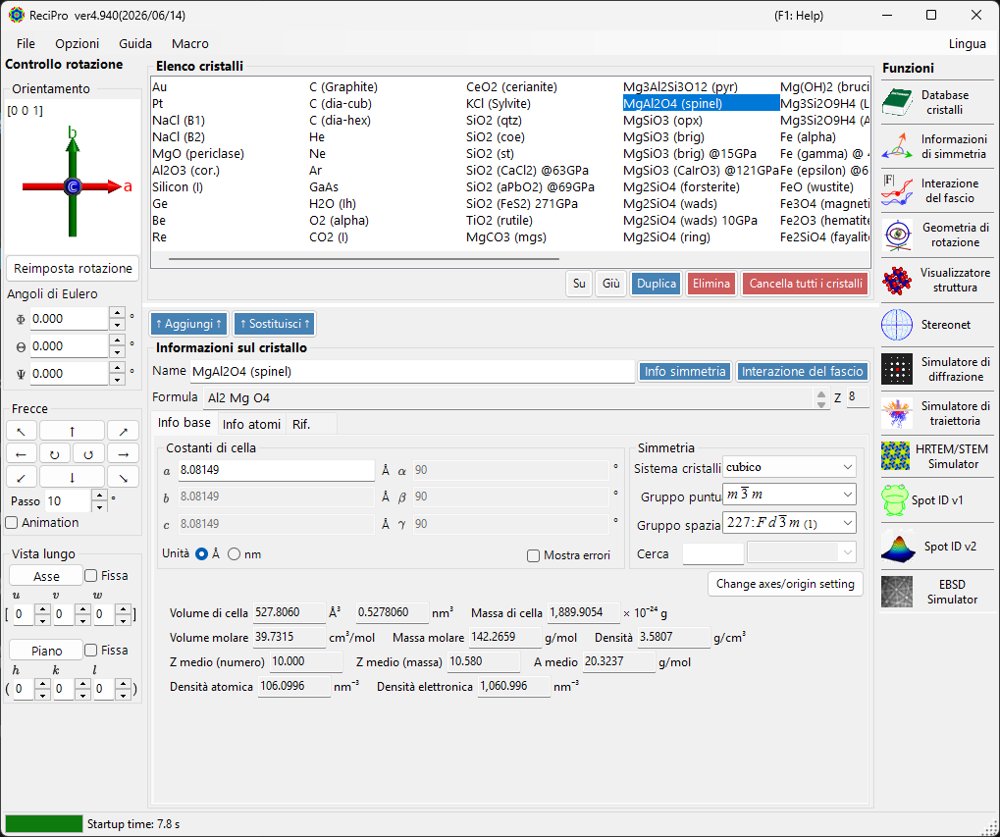

| Area | Posizione | Descrizione |
|------|----------|-------------|
| **Menu File** | In alto | Operazioni sui file, opzioni, guida |
| **Controllo della rotazione** | A sinistra | Visualizzare/impostare l'orientazione del cristallo |
| **Elenco cristalli** | Centro in alto | Selezionare e gestire i cristalli |
| **Informazioni sul cristallo** | Centro in basso | Modificare parametri reticolari, simmetria, atomi |
| **Funzioni** | A destra | Avviare le finestre di simulazione/analisi |

---

## Scorciatoie da tastiera e mouse {#keyboard-mouse-shortcuts}

La finestra principale installa diverse scorciatoie **valide per l'intera applicazione**. Restano attive mentre le finestre Visualizzatore struttura, Stereogramma, Simulatore di diffrazione, Spot ID e Calcolatrice hanno il focus.

| Scorciatoia | Azione |
|----------|--------|
| <kbd>F1</kbd> | Apre questa pagina del manuale online |
| <kbd>CTRL</kbd>+<kbd>SHIFT</kbd>+<kbd>D</kbd> | Apre / chiude il **Simulatore di diffrazione** |
| <kbd>CTRL</kbd>+<kbd>SHIFT</kbd>+<kbd>V</kbd> | Apre / chiude il **Visualizzatore struttura** |
| <kbd>CTRL</kbd>+<kbd>SHIFT</kbd>+<kbd>S</kbd> | Apre / chiude lo **Stereogramma** |
| <kbd>CTRL</kbd>+<kbd>SHIFT</kbd>+<kbd>T</kbd> | Apre / chiude **Spot ID** |
| <kbd>CTRL</kbd>+<kbd>SHIFT</kbd> + tasti freccia | Ruota il cristallo di un passo in quella direzione (tieni premute due frecce per una diagonale) |
| Doppio tocco di <kbd>CTRL</kbd> | Apre / chiude la **Calcolatrice** |
| <kbd>CTRL</kbd>+<kbd>SHIFT</kbd>+<kbd>R</kbd> | Commuta il contrassegno **Reserved** del cristallo selezionato |
| Tieni premuto <kbd>CTRL</kbd> all'avvio di ReciPro | Avvia con OpenGL disabilitato (ripristino in caso di problemi grafici) |
| Trascina con il tasto sinistro il widget di orientazione (in basso a sinistra, sotto *Current Direction*) | Ruota il cristallo |
| Doppio clic destro sul widget di orientazione | Copia l'immagine del widget negli appunti |
| Clic singolo su un pulsante di funzione | Apre / chiude quella finestra |
| Doppio clic su un pulsante di funzione | Forza la visibilità della finestra e la porta in primo piano |
| Clic destro su un cristallo nell'elenco | Menu contestuale (Rinomina / Duplica / Elimina / Esporta CIF…) |
| Doppio clic sull'etichetta **Current Index** | Mostra / nasconde il riquadro max-UVW |
| Trascina un file sulla finestra | Carica un elenco cristalli (`.xml`, `.cdb2`) o un cristallo (`.cif`, `.amc`) |

→ Vedi **[21. Scorciatoie da tastiera e mouse](21-shortcuts.md)** per uno sguardo d'insieme su ogni finestra.

---

## Flusso di lavoro di base

Se è la prima volta che usi ReciPro, segui questi passaggi:

1. Seleziona il cristallo desiderato nell'**Elenco cristalli**. Per usare un file CIF/AMC, trascinalo e rilascialo nelle **Informazioni sul cristallo**.
2. Se modifichi i parametri reticolari o le posizioni degli atomi, premi **Add** o **Replace** affinché le modifiche vengano riscritte nell'elenco cristalli.
3. Imposta l'orientazione del cristallo nel **Controllo della rotazione** tramite un asse di zona, un piano reticolare, gli angoli di Eulero o il trascinamento con il mouse.
4. Apri lo strumento desiderato dalle **Funzioni**. Le finestre di calcolo per diffrazione, HRTEM/STEM, EBSD e altre utilizzano il cristallo e l'orientazione attualmente selezionati.

---

## Menu File

### File

| Voce di menu | Descrizione |
|-----------|-------------|
| Read crystal list (as new list) | Carica un file di elenco cristalli (*.xml) sostituendo l'elenco corrente |
| Read crystal list (and add) | Aggiunge all'elenco corrente |
| Read initial crystal list | Ricarica l'elenco cristalli predefinito |
| Save crystal list | Salva l'elenco cristalli corrente |
| Export selected crystal to CIF | Salva in formato CIF |
| Clear crystal list | Rimuove tutti i cristalli |
| Exit | Chiude l'applicazione |

### Option

| Voce di menu | Descrizione |
|-----------|-------------|
| Show Tooltips | Commuta la visualizzazione dei tooltip |
| Use Miller-Bravais (hkil) index | Usa la notazione a 4 indici per i sistemi trigonale/esagonale in tutta l'applicazione |
| Reset registry settings on exit (effective after restart) | Reimposta le impostazioni al prossimo riavvio |
| Disable Crystallography.Native library (requires restart) | Ricade sul codice gestito se la libreria nativa (C++) non si carica |
| Disable all OpenGL rendering (requires restart) | Per GPU più datate / desktop remoto |
| Disable OpenGL text rendering (requires restart) | Soluzione alternativa per problemi di resa del testo su alcune GPU |
| Use MKL Library | Usa Intel MKL per le routine numeriche |
| Dark mode | Alterna tra tema chiaro e scuro |
| Powder diffraction function (under development) | Abilita la finestra di diffrazione policristallina (polveri) |
| Capture GUI Components… | Strumento per sviluppatori per salvare screenshot della GUI |

### Help

| Voce di menu | Descrizione |
|-----------|-------------|
| Program updates | Verifica se è disponibile una nuova versione di ReciPro e la installa |
| Hint | Mostra suggerimenti d'uso (deprecato) |
| Version history | Apre la finestra di dialogo della cronologia delle versioni |
| License | Mostra la licenza MIT |
| GitHub page | Apre il repository di ReciPro nel browser |
| Report bugs, requests, or comments | Apre la pagina GitHub Issues |
| Help (Web) | Apre il manuale online su GitHub Pages, nella pagina corrispondente alla lingua dell'interfaccia. |

La lingua si cambia dal menu separato **Language** (Inglese/Giapponese, richiede il riavvio).

### Language

Cambia la lingua dell'interfaccia tra Inglese e Giapponese. La modifica ha effetto dopo il riavvio di ReciPro.

### Macro

Apre la finestra [Macro](20-macro/index.md) per automatizzare le operazioni di ReciPro con script in stile Python. Per i flussi di lavoro ricorrenti, consulta le [funzioni integrate](20-macro/1-built-in-functions.md) e gli [esempi di macro](20-macro/2-examples.md).

---

## Controllo dell'orientazione del cristallo

Lo stato di rotazione del cristallo è condiviso dal simulatore di diffrazione, dal Visualizzatore struttura, dallo Stereogramma, dal simulatore HRTEM/STEM, dal simulatore EBSD e da altre finestre. Non è solo un'impostazione di visualizzazione: definisce la direzione del fascio incidente e la relazione tra le coordinate del cristallo utilizzata dalle simulazioni. Un breve tutorial video è disponibile nella pagina [Come usare](appendix/a0-how-to-use.md).

### Orientazione corrente

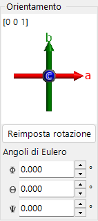

Mostra l'orientazione del cristallo. Trascina per ruotare. Assi: rosso = *a*, verde = *b*, blu = *c*.

### Reimposta rotazione
Ripristina lo stato iniziale: asse *c* perpendicolare allo schermo, asse *b* verso l'alto.

### Asse di zona
Mostra l'asse di zona più vicino alla normale dello schermo (ad es. *u*+*v*+*w* < 30).

### Angoli di Eulero (Z-X-Z)
Imposta l'orientazione del cristallo con gli angoli di Eulero **Z–X–Z**:

- \(\Phi\): rotazione attorno all'asse Z
- \(\Theta\): rotazione attorno all'asse X
- \(\Psi\): rotazione attorno all'asse Z

Le rotazioni vengono applicate nell'ordine \(\Psi \to \Theta \to \Phi\). Vedi [Geometria di rotazione](4-rotation-geometry.md) e [Appendice A1. Sistema di coordinate](appendix/a1-coordinate-system/1-orientation.md) per i dettagli.

### Frecce

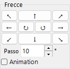

Ruota dell'angolo Step. Spunta Animation per la rotazione continua.

### Visualizza lungo

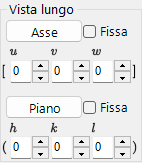

Allinea un asse di zona [*uvw*] o un piano reticolare (*hkl*) perpendicolarmente allo schermo.

- **Fix**: quando è spuntata, l'asse di zona o il piano specificato viene mantenuto fisso nello spazio durante le successive operazioni di rotazione.
- **Axis**: pone l'asse di zona immesso \([uvw]\) perpendicolare allo schermo. Se è impostato anche **Plane**, quella direzione viene orientata verso l'alto sullo schermo.
- **Plane**: pone la normale del piano reticolare immesso \((hkl)\) perpendicolare allo schermo. Se è impostato anche **Axis**, quella direzione viene orientata verso l'alto sullo schermo.

### Modi di base per impostare l'orientazione

| Metodo | Da usare quando | Dove |
|--------|----------|-------|
| Trascinamento con il mouse | Vuoi ruotare liberamente osservando gli assi del cristallo. | Pannello **Orientazione corrente** |
| Pulsanti freccia | Vuoi rotazioni piccole e ripetibili. | Pannello **Frecce** |
| Asse di zona | Conosci la direzione di osservazione, come \([001]\) o \([110]\). | **Visualizza lungo** / immissione asse di zona |
| Normale al piano | Vuoi un piano reticolare \((hkl)\) normale allo schermo. | **Visualizza lungo** / immissione piano |
| Angoli di Eulero | Hai bisogno di un'orientazione numerica riproducibile. | **Angoli di Eulero (Z-X-Z)** |

Vedi [Geometria di rotazione](4-rotation-geometry.md) e [Appendice A1. Sistemi di coordinate](appendix/a1-coordinate-system/1-orientation.md) per le matrici di rotazione e le convenzioni sulle coordinate.

---

## Elenco cristalli

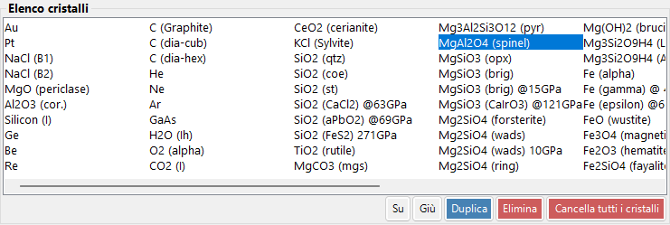

~80 cristalli nell'installazione predefinita. Seleziona per visualizzare i dettagli e impostarlo per i calcoli. **Clic destro su un cristallo** nell'Elenco cristalli per un menu contestuale: *Rename*, *Export as CIF*, *Duplicate*, *Delete*.

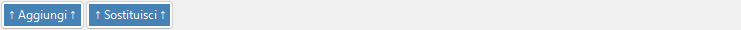

| Pulsante | Azione |
|--------|--------|
| Up / Down | Riordina |
| Duplicate | Copia il cristallo selezionato |
| Delete / All clear | Rimuove i cristalli |
| Add / Replace | Aggiunge all'elenco o sostituisce la voce selezionata |

---

## Informazioni sul cristallo

Modifica i parametri reticolari, la simmetria e gli atomi; trascina e rilascia file CIF/AMC per caricare una struttura. Questo controllo è condiviso da ReciPro, PDIndexer e CSmanager, ma le schede e le funzioni mostrate differiscono per ciascuna applicazione. ReciPro mostra le schede Basic Info, Atom e Reference (le schede EOS, Elasticity e altre sono per le altre applicazioni e non vengono mostrate in ReciPro).

> **Importante**: Premi **Add** o **Replace** per salvare le modifiche.

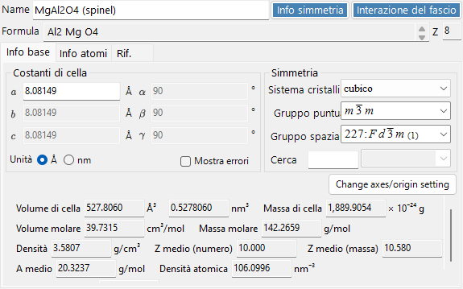

La parte superiore del pannello mostra sempre **Name** (nome del cristallo), **Formula** (formula chimica, calcolata dall'elenco degli atomi) e **Reset** (cancella tutti i campi).

### Scheda Basic Info

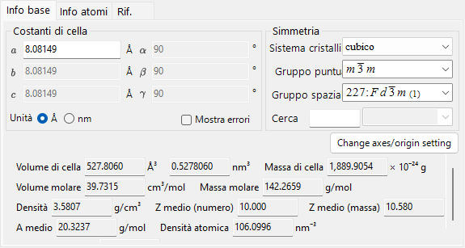

Parametri reticolari, simmetria e grandezze da essi derivate.

| Voce | Descrizione |
|------|------|
| Cell constants | Parametri reticolari a, b, c (in Å = 10⁻¹⁰ m) e α, β, γ. La scelta di una simmetria li vincola automaticamente (ad es. a=b=c, α=β=γ=90° per il sistema cubico). |
| Symmetry | Scegli il sistema cristallino, il gruppo puntuale e il gruppo spaziale. Digita nel campo **Search** per elencare i candidati corrispondenti (sensibile a maiuscole/minuscole). |
| Cell Volume / Cell Mass | Volume e massa della cella elementare. |
| Molar Volume / Molar Mass / Z / Density | Volume molare, massa molare, numero di unità di formula per cella elementare (Z) e densità. Mostrati **solo quando sono stati immessi degli atomi**. |
| Color of Profile | Colore usato per tracciare il profilo di diffrazione di questo cristallo. |

### Scheda Atom

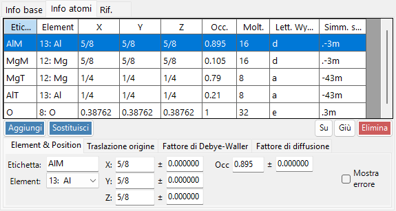

Imposta la specie, la posizione, il fattore di temperatura e il fattore di diffusione di ciascun atomo. Modifica l'elenco degli atomi con **Add**, **Replace** (sostituisce la riga selezionata), **Up/Down** (riordina) e **Delete**. Ogni atomo ha:

| Voce | Descrizione |
|------|------|
| Label | Etichetta dell'atomo (identificatore qualsiasi). |
| Element | Elemento (inclusa la valenza ionica). |
| X, Y, Z | Coordinate frazionarie (0–1). Si possono immettere frazioni come 1/2 o 2/3. |
| Occ | Occupazione (0–1). |

**Origin shift**: sposta l'origine di tutte le coordinate atomiche. Usa i pulsanti preimpostati (**+** / **−**) per gli spostamenti standard, oppure **Apply custom shift** per un valore arbitrario.

**Fattore di Debye–Waller (fattore di temperatura)**:

| Voce | Descrizione |
|------|------|
| Notation | Usa la notazione U o B. |
| Model | Isotropico o anisotropico. |
| B##, U## | Per il caso anisotropico, immetti ciascuna componente (B11, …). |

**Scattering factor**: scegli il fattore di diffusione usato per ciascun atomo.

| Radiazione | Sorgente / impostazione |
|-----------|------|
| X-ray | Fattori di diffusione inclusa la valenza ionica (International Tables for Crystallography, Vol. C). |
| Electron | Fattori di diffusione elettronica (Peng 1998, Acta Cryst. A54, 481–485). |
| Neutron | Lunghezze di diffusione neutronica. Scegli **Natural isotope abundance** o **Custom isotope abundance** (una composizione isotopica arbitraria). |

### Scheda Reference

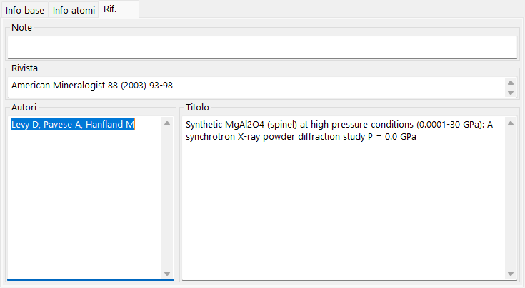

Registra la fonte della struttura: **Note**, **Authors**, **Journal** e **Title**.

### Menu contestuale (clic destro)

Clic destro su un'area vuota del controllo per queste azioni principali:

| Voce di menu | Azione |
|-----------|------|
| Beam Interaction | Apre la finestra [Interazione del fascio](3-beam-interaction.md). |
| Symmetry information | Apre la finestra [Informazioni di simmetria](2-symmetry-information.md). |
| Import from CIF, AMC | Carica un cristallo da un file CIF / AMC. |
| Export to CIF | Esporta il cristallo corrente come CIF. |
| Revert cell constants | Ripristina le costanti di cella ai valori caricati inizialmente. |
| Convert to P1 spacegroup | Espande la struttura al gruppo spaziale P1. |
| Convert to a superstructure | Converte in una superstruttura con multipli interi di a, b, c (finestra di dialogo delle dimensioni). |
| Convert to an equivalent space group | Converte in un gruppo spaziale equivalente (una diversa scelta degli assi). |

---

## Pannello Funzioni {#functions}

La barra verticale di pulsanti a destra avvia le finestre di analisi e simulazione (vedi la tabella [Funzioni](#functions) qui sotto).

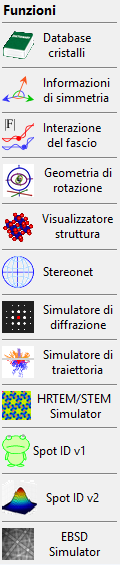

| Pulsante | Descrizione | Dettagli |
|--------|-------------|---------|
| Crystal Database | Cercare e importare cristalli dai database integrati / online | [1. Database dei cristalli](1-crystal-database.md) |
| Symmetry Information | Informazioni sul gruppo spaziale e diagrammi di simmetria ITC Vol. A | [2. Informazioni di simmetria](2-symmetry-information.md) |
| Beam Interaction | Interazione fascio–cristallo: riflessioni, attenuazione, fattori di diffusione, fluorescenza | [3. Interazione del fascio](3-beam-interaction.md) |
| Rotation Geometry | Matrice di rotazione 3D / angoli del goniometro | [4. Geometria di rotazione](4-rotation-geometry.md) |
| Structure Viewer | Struttura cristallina 3D | [5. Visualizzatore struttura](5-structure-viewer.md) |
| Stereonet | Proiezione stereografica | [6. Stereogramma](6-stereonet.md) |
| Diffraction Simulator | Diffrazione di raggi X / elettroni su singolo cristallo | [7. Simulatore di diffrazione](7-diffraction-simulator/index.md) |
| Trajectory Simulator | Simulazione Monte Carlo delle traiettorie elettroniche | [8. Traiettorie elettroniche](8-electron-trajectory.md) |
| HRTEM/STEM Simulator | Simulazione di immagini HRTEM / STEM | [9. Simulatore HRTEM/STEM](9-hrtem-stem-simulator/index.md) |
| Spot ID v1 | Indicizzazione di pattern SAED (precedentemente "TEM ID") | [10. Spot ID v1](10-spot-id.md) |
| Spot ID v2 | Rilevamento e indicizzazione degli spot | [11. Spot ID v2](11-spot-id-v2.md) |
| EBSD Simulator | Simulazione di pattern EBSD | [12. Simulazione EBSD](12-ebsd-simulation.md) |
| Powder Diffraction | Diffrazione policristallina (polveri) — abilitala tramite **Option ▸ Powder diffraction function** | - |

---

## Vedi anche

- [Database dei cristalli](1-crystal-database.md)
- [Geometria di rotazione](4-rotation-geometry.md)
- [Visualizzatore struttura](5-structure-viewer.md)
- [Simulatore di diffrazione](7-diffraction-simulator/index.md)
- [Scorciatoie da tastiera e mouse](21-shortcuts.md)
- [Sistema di coordinate di base e orientazione del cristallo](appendix/a1-coordinate-system/1-orientation.md)
