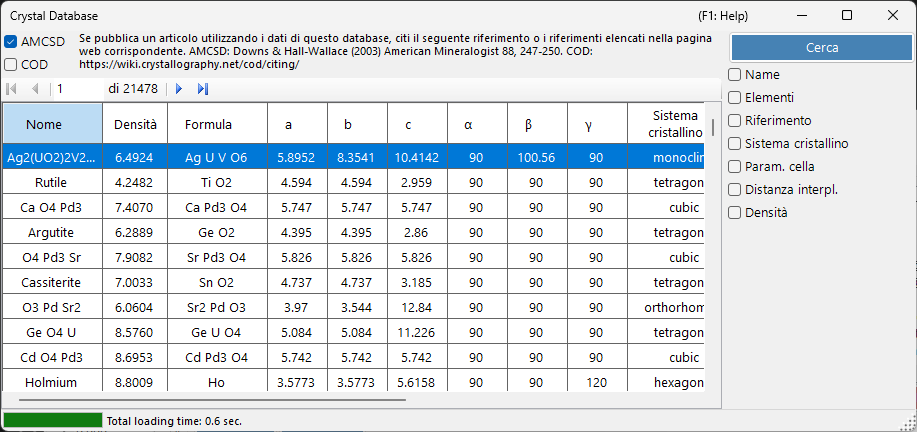
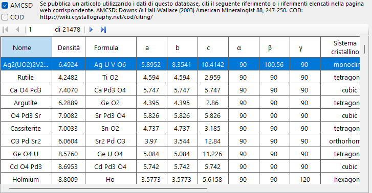
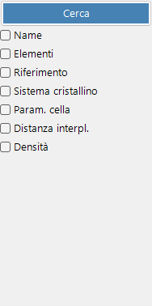

# Database dei cristalli

Il **Database dei cristalli** offre funzioni per cercare e importare strutture cristalline da due sorgenti, selezionabili tramite le caselle di controllo **AMCSD** e **COD**:

- **AMCSD** : il [American Mineralogist Crystal Structure Database](https://www.rruff.net/) incluso (più di 20.000 strutture).
- **COD** : il [Crystallography Open Database](https://www.crystallography.net/cod/). Poiché il file è di grandi dimensioni, non viene incluso nel programma di installazione; il file del database viene scaricato automaticamente al primo utilizzo. Quando il file viene aggiornato sul server, viene richiesto di scaricarlo nuovamente.

Si prega di citare i seguenti riferimenti quando si utilizzano questi database.

Quando si utilizza **AMCSD**:

> Downs, R.T. and Hall-Wallace, M. (2003) The American Mineralogist Crystal Structure Database. *American Mineralogist* **88**, 247-250.

Quando si utilizza **COD**:

> Gražulis, S. et al. (2009) Crystallography Open Database – an open-access collection of crystal structures. *Journal of Applied Crystallography* **42**, 726-729.
>
> Gražulis, S. et al. (2012) Crystallography Open Database (COD): an open-access collection of crystal structures and platform for world-wide collaboration. *Nucleic Acids Research* **40**, D420-D427.

---

## Scorciatoie da tastiera e mouse

Questa finestra non ha combinazioni con tasti modificatori; è gestita tramite clic ordinari. Gli unici input non ovvi sono:

| Scorciatoia | Azione |
|----------|--------|
| <kbd>F1</kbd> | Apre questa pagina del manuale online |
| <kbd>ENTER</kbd> in un qualsiasi campo di ricerca | Esegue la ricerca nel database (equivale al pulsante **Search**) |
| Clic su una riga della tabella dei risultati | Carica quel cristallo nella finestra principale |
| Clic su un elemento nel popup **Periodic table** | Cambia il suo filtro: *ignore* → *must include* → *must exclude* |

→ Vedi **[21. Scorciatoie da tastiera e mouse](21-shortcuts.md)** per una panoramica di ogni finestra.

---

## Tabella

Mostra i cristalli che corrispondono ai criteri di ricerca. Seleziona un cristallo per trasferirlo nelle Informazioni sul cristallo della Finestra principale. Premi **Add** o **Replace** per aggiungerlo all'Elenco cristalli.

---

## Opzioni di ricerca

Inserisci di seguito i criteri di ricerca e premi il pulsante **Search** o il tasto **Enter**.

| Criterio | Descrizione |
|-----------|-------------|
| **Name** | Nome del cristallo |
| **Element** | Selettore del sistema periodico (può/deve/non deve includere) |
| **Reference** | Titolo, rivista, autore |
| **Crystal system** | Seleziona il sistema cristallino |
| **Cell Param** | Costanti reticolari ed errore |
| **d-spacing** | Valori d della riflessione più intensa ed errore |
| **Density** | Densità ed errore |

### Name

Corrispondenza a testo libero rispetto al nome del cristallo. Sono ammesse corrispondenze parziali.

### Element

Premi il pulsante **Periodic Table** per aprire il selettore degli elementi. Ogni pulsante di elemento alterna tra tre stati:

- **May or may not include** (predefinito – grigio)
- **Must include** (verde)
- **Must exclude** (rosso)

I tre pulsanti in alto nella finestra reimpostano con un clic ogni elemento su uno dei tre stati.

### Reference

Corrispondenza a testo libero rispetto ai metadati della pubblicazione: titolo dell'articolo, nome della rivista ed elenco degli autori.

### Crystal system

Limita la ricerca a un sistema cristallino specifico (Cubic, Tetragonal, Orthorhombic, Hexagonal, Trigonal, Monoclinic, Triclinic).

### Ricerca per parametri di cella

Inserisci le costanti reticolari desiderate *a*, *b*, *c*, *α*, *β*, *γ* e gli errori accettabili. I campi vuoti vengono trattati come caratteri jolly.

### d-spacing

Inserisci il *d*-spacing della riflessione più intensa (o di diverse riflessioni intense) e un errore accettabile. Utile quando di un esperimento sono note solo le posizioni dei picchi di diffrazione.

### Density

Filtra per densità di massa (g/cm³) entro una banda di errore accettabile.

---

## Vedi anche

- [Finestra principale](0-main-window.md)
- [Informazioni di simmetria](2-symmetry-information.md)
- [Interazione del fascio](3-beam-interaction.md)
- [Visualizzatore struttura](5-structure-viewer.md)
