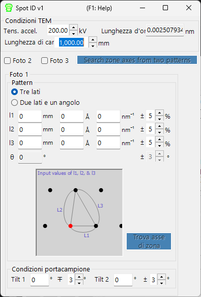

# Spot ID v1

**Spot ID v1** rileva, esegue il fit e indicizza i riflessi di diffrazione a partire da immagini sperimentali di diffrazione elettronica. Supporta inoltre la ricerca manuale dell'asse di zona da una geometria dei riflessi inserita numericamente (il precedente **TEM ID**).

---

## Scorciatoie da tastiera e mouse

Spot ID v1 acquisisce la geometria dei riflessi come **input numerico** (il precedente flusso di lavoro *TEM ID*), e il rilevamento/fit dei riflessi è controllato tramite pulsanti; l'immagine di diffrazione viene mostrata solo come riferimento e non è interattiva al clic (lo zoom con il mouse e la selezione manuale dei riflessi appartengono a [Spot ID v2](11-spot-id-v2.md)). L'unica scorciatoia si trova nella finestra dei risultati:

| Scorciatoia | Azione |
|----------|--------|
| <kbd>F1</kbd> | Apri questa pagina del manuale online |
| Doppio clic su una riga nell'elenco dei risultati | Seleziona quel cristallo e ruotalo verso l'asse di zona corrispondente |

→ Vedi **[21. Scorciatoie da tastiera e mouse](21-shortcuts.md)** per un colpo d'occhio su ogni finestra.

---

## Area principale

Mostra l'immagine di diffrazione come riferimento. Carica le immagini tramite trascinamento (drag and drop) o dal menu **File**.

### Regolazioni dell'immagine

| Impostazione | Descrizione |
|---------|-------------|
| Min / Max | Intervallo di luminosità (regolabile anche tramite la barra di scorrimento) |
| Gradient | Positivo o Negativo |
| Scale | Lineare o Log |
| Colour | Scala di grigi o Cold-Warm |
| Dust & Scratch | Rimuovi i pixel eccezionalmente chiari/scuri (imposta intervallo e soglia) |
| Gaussian blur | Applica la sfocatura (intervallo in pixel) |

---

## Optics

Inserisci la sorgente incidente, l'energia/lunghezza d'onda, la lunghezza di camera e la dimensione dei pixel del rivelatore.

> Se viene caricato un file dm3/dm4 (Gatan Digital Micrograph), questi valori vengono impostati automaticamente.

---

## Rilevamento e fit dei riflessi

Premi **Detect & fit spots** per rilevare automaticamente i riflessi di diffrazione e per eseguirne il fit con una funzione Pseudo-Voigt 2D. I risultati compaiono nella tabella.

### Opzioni di rilevamento

| Parametro | Descrizione |
|-----------|-------------|
| Number | Numero massimo di riflessi da rilevare |
| Nearest neighbour | Distanza minima tra i riflessi rilevati |
| Fitting range | Raggio (pixel) attorno a ciascun riflesso per il fit |

### Controlli della tabella

| Pulsante | Azione |
|--------|--------|
| Reset range | Reimposta l'intervallo di fit per tutti i riflessi |
| Show label/symbol | Sovrapponi etichette/simboli sull'immagine |
| Clear all spots | Rimuovi tutti i riflessi |
| Save / Copy | Esporta la tabella in formato separato da tabulazioni (Excel) |
| Re-fit all | Esegui di nuovo il fit di tutti i riflessi |

### Finestra di dettaglio del riflesso

Spunta la casella per aprire una finestra di dettaglio che mostra il riflesso selezionato (a sinistra) e i profili in quattro direzioni (a destra). Blu = dati osservati, rosso = fit.

---

## Index

Premi **Identify spots** per indicizzare i riflessi rilevati rispetto al cristallo selezionato nella Finestra principale.

| Impostazione | Descrizione |
|---------|-------------|
| Acceptable error | Tolleranza per l'indicizzazione |
| Single grain / Multi grains | Indicizza come cristallo singolo o come più grani (imposta il numero massimo di grani) |
| Show label/symbol | Sovrapponi le etichette indicizzate sull'immagine |
| Refine thickness and direction | Applica la teoria dinamica (metodo di Bethe) per affinare lo spessore del campione e l'orientazione del cristallo che meglio corrispondono alle intensità rilevate |

---

## Ricerca dell'asse di zona dalla geometria dei riflessi (precedente TEM ID)

Quando non disponi di un'immagine da caricare, puoi comunque cercare assi di zona candidati inserendo manualmente la geometria di un pattern di diffrazione elettronica ad area selezionata (SAED). Inserisci le condizioni di osservazione TEM e la geometria dei riflessi, quindi premi **Search zone axes** per trovare le orientazioni del cristallo candidate.

### TEM condition

Inserisci le condizioni di osservazione TEM (tensione di accelerazione, lunghezza di camera, ecc.).

### Photo 1, 2, 3

Inserisci la geometria dei riflessi di diffrazione.

- Per inserire la distanza tra due riflessi sul rivelatore, usa la casella **mm**.
- Se conosci il valore *d*, inseriscilo nelle unità **Å** o **nm⁻¹**.

**Three sides mode** : Inserisci le lunghezze dei tre lati di un triangolo che ha come uno dei vertici il direct spot.

**Two sides and an angle mode** : Inserisci le lunghezze di due lati (incluso il direct spot) e l'angolo tra di essi.

---

## Vedi anche

- [Spot ID v2](11-spot-id-v2.md)
- [Simulatore di diffrazione](7-diffraction-simulator/index.md)
- [Finestra principale](0-main-window.md)
- [Database dei cristalli](1-crystal-database.md)
- [Simulazione EBSD](12-ebsd-simulation.md)
