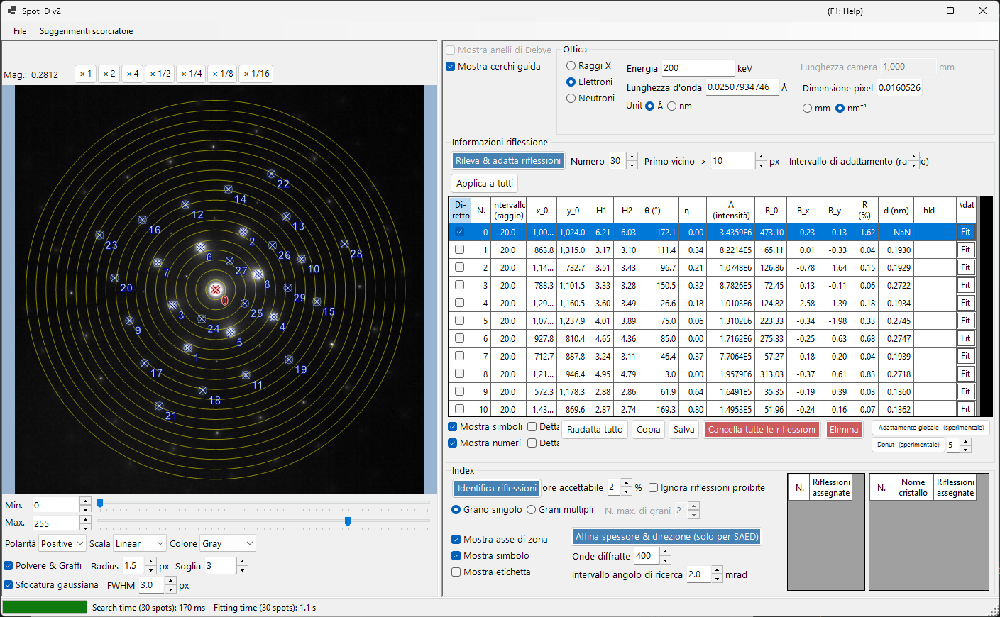
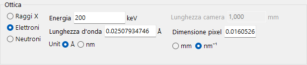
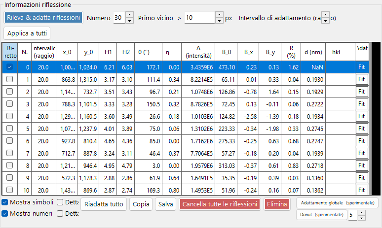
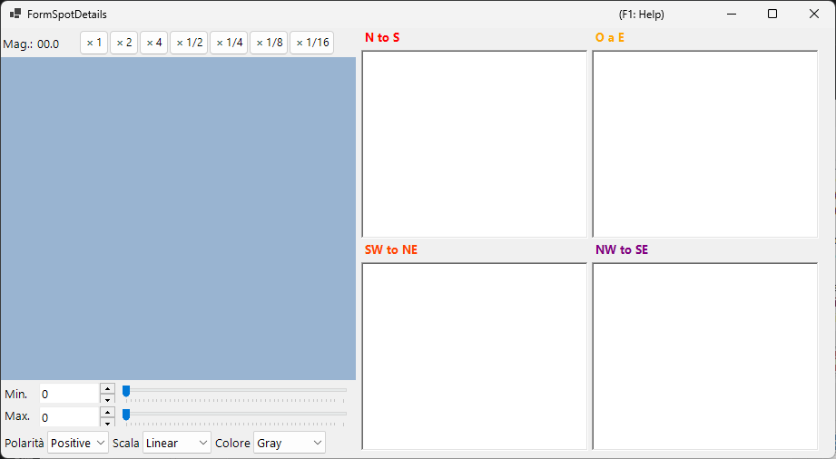
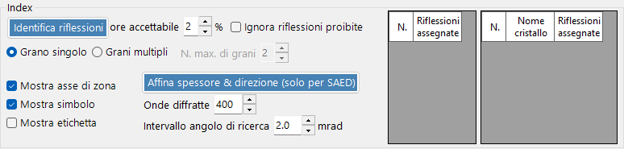

# Spot ID v2

**Spot ID v2** è la versione potenziata di [Spot ID](10-spot-id.md) con rilevamento degli spot migliorato, algoritmi di fitting perfezionati e un motore di indicizzazione più potente.

---

## Scorciatoie da tastiera e mouse

L'elenco degli spot si costruisce direttamente sull'immagine caricata. Il riquadro dell'immagine usa la [navigazione standard della vista immagine](21-shortcuts.md) di ReciPro per spostare/zoomare; per la modifica degli spot si aggiungono le combinazioni seguenti.

| Scorciatoia | Azione |
|----------|--------|
| <kbd>F1</kbd> | Apre questa pagina del manuale online |
| Doppio clic sinistro sull'immagine | Aggiunge uno spot in quel punto (con fitting del picco) |
| <kbd>CTRL</kbd> + doppio clic sinistro | Aggiunge uno spot e lo contrassegna come fascio diretto (000) |
| Clic sinistro su uno spot | Seleziona lo spot più vicino |
| <kbd>CTRL</kbd> + clic destro su uno spot | Elimina lo spot più vicino |
| <kbd>CTRL</kbd> + tasti freccia | Sposta lo spot selezionato di un pixel |
| Trascinamento sinistro / centrale (area vuota) | Sposta l'immagine |
| Rotellina del mouse | Zoom avanti / indietro alla posizione del cursore |
| Trascinamento destro di un riquadro | Zoom avanti sulla regione selezionata |
| Doppio clic destro | Zoom indietro |
| Doppio clic sull'intestazione di riga di uno spot (tabella) | Zoom su quello spot (×2) |

Nella finestra principale, <kbd>CTRL</kbd>+<kbd>SHIFT</kbd>+<kbd>T</kbd> apre/chiude questa finestra.

→ Vedi **[21. Scorciatoie da tastiera e mouse](21-shortcuts.md)** per una panoramica di ogni finestra.

---

## Menu File

Apre / salva un'immagine di diffrazione. È supportato lo stesso caricamento tramite trascinamento (drag and drop) di [Spot ID v1](10-spot-id.md), e i metadati Gatan DM3/DM4 (lunghezza di camera, lunghezza d'onda, dimensione del pixel) vengono rispettati automaticamente.

---

## Optics

### Sorgente incidente

Selezionare il tipo di radiazione (raggi X / elettrone / neutrone) e impostare l'energia o la lunghezza d'onda.

### Lunghezza di camera / Dimensione del pixel

La lunghezza di camera (mm) e la dimensione del pixel del rivelatore (mm o nm⁻¹). Quando viene caricato un file Gatan DM, questi valori vengono compilati dall'intestazione del file.

---

## Informazioni sullo spot

- **Detect & Fit Spots**: Rilevamento automatico degli spot mediante massimi locali e sottrazione del fondo.
- **Number**: Il numero massimo di spot da rilevare.
- **Nearest neighbour**: La separazione minima (px) consentita tra gli spot rilevati. I picchi più vicini di questo valore vengono uniti, impedendo la doppia rilevazione dello stesso spot.
- **Fitting range (radius)**: Il raggio (px) della regione circolare usata per fittare il picco di ogni spot. I pixel all'interno di questo cerchio vengono fittati con una funzione pseudo-Voigt.
- **Apply to All**: Imposta il raggio di fitting di ogni spot al valore corrente di **Fitting range (radius)**.
- **Delete spot / Clear spots**: Rimuove singoli spot o tutti gli spot rilevati.
- **Copy to clipboard**: Copia le posizioni e le intensità degli spot negli appunti.
- **Details of the spot**: Se selezionato, apre una finestra che mostra informazioni dettagliate sullo spot attualmente selezionato.

---

## Index

- **Identify Spots**: Esegue l'algoritmo di indicizzazione per trovare il cristallo e l'asse di zona che meglio corrispondono.
- **Acceptable error**: Imposta la deviazione accettabile nella distanza interplanare e nell'angolo per una corrispondenza.
- **Ignore prohibited reflections**: Se selezionato, le riflessioni vietate da assi elicoidali e piani di scorrimento vengono trattate come non necessariamente soddisfatte durante la ricerca dell'asse di zona.
- **Single Grain / Multiple Grains**: Cerca un singolo orientamento (monocristallo) oppure più orientamenti (una regione policristallina / multigrano). Per più grani, **Max. num. of grains** imposta il limite superiore al numero di grani da cercare.
- **Results**: Le migliori corrispondenze vengono visualizzate con il nome del cristallo, l'asse di zona [uvw] e gli indici dei singoli spot (hkl).

---

## Miglioramenti rispetto a v1

- Migliore gestione del rumore nel rilevamento degli spot.
- Algoritmi di fitting più robusti con molteplici forme di profilo.
- Indicizzazione più rapida con algoritmi di ricerca ottimizzati.
- Supporto per spot sovrapposti e riflessioni satelliti.

---

## Vedi anche

- [Spot ID v1](10-spot-id.md)
- [Simulatore di diffrazione](7-diffraction-simulator/index.md)
- [Finestra principale](0-main-window.md)
- [Scorciatoie da tastiera e mouse](21-shortcuts.md)
