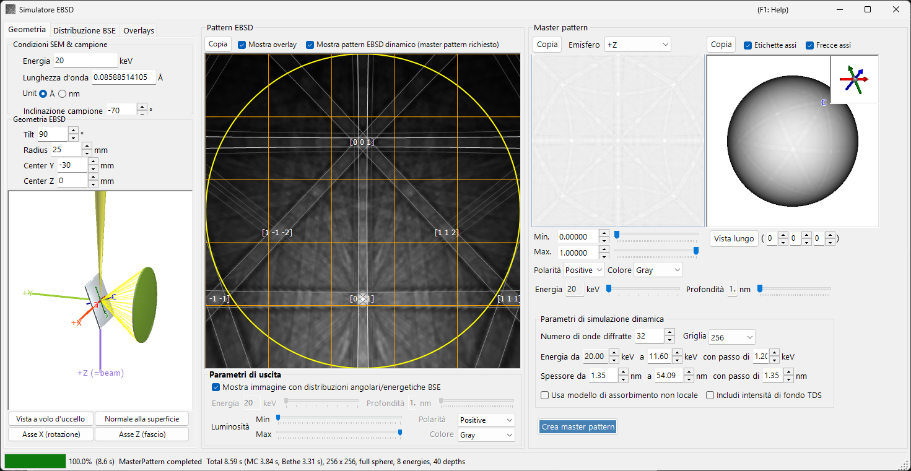
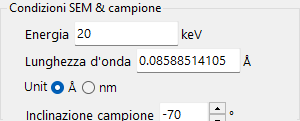
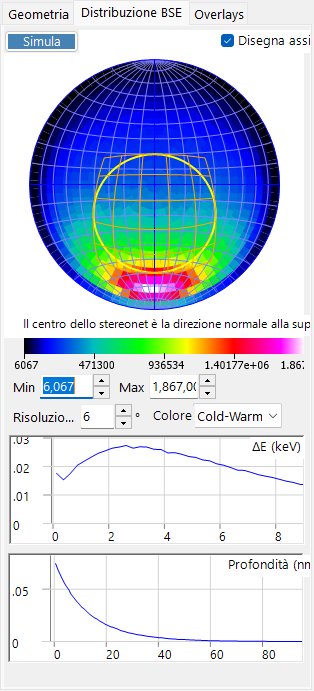
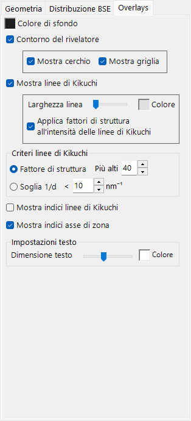
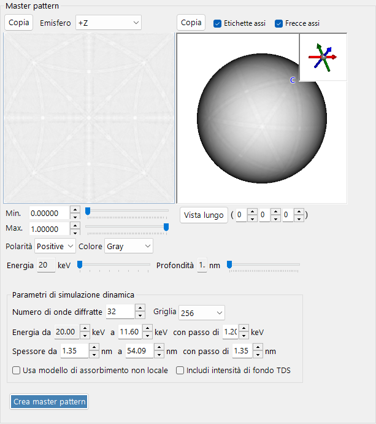
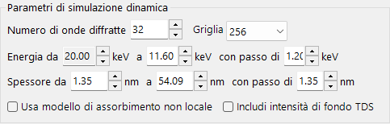
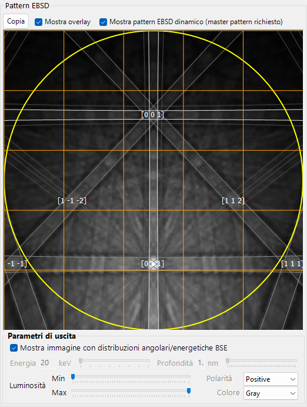

# Simulazione EBSD

Il **Simulatore EBSD** simula i pattern di diffrazione da retrodiffusione elettronica (EBSD) — pattern di Kikuchi — ottenuti in un microscopio elettronico a scansione (SEM), mediante calcoli di teoria dinamica. Calcola la distribuzione angolare/energetica/in profondità degli elettroni retrodiffusi (BSE) tramite una simulazione Monte-Carlo, costruisce un **master pattern** dinamico (a onde di Bloch) del cristallo e lo proietta sul rivelatore per l'orientazione corrente del cristallo.

La finestra è composta da tre colonne.

- **Sinistra** : condizioni di simulazione. Le schede selezionano **Geometry** (geometria campione/rivelatore e una vista 3D), **BSE Distribution** (distribuzioni degli elettroni retrodiffusi) e **Overlays** (linee di Kikuchi e altre annotazioni).
- **Centro** : il pattern EBSD (di Kikuchi) per l'orientazione corrente del cristallo.
- **Destra** : il master pattern indipendente dall'orientazione (proiezione 2D e sfera 3D).

---

## Scorciatoie da tastiera e mouse

La vista centrale del pattern EBSD (di Kikuchi) e le viste del master pattern sulla destra rispondono ad azioni del mouse differenti.

| Scorciatoia | Azione |
|----------|--------|
| <kbd>F1</kbd> | Apre questa pagina del manuale online |
| Trascinare con il tasto sinistro il pattern vicino al centro | Inclina il cristallo |
| Trascinare con il tasto sinistro l'area esterna del pattern | Ruota il cristallo |
| Doppio clic sul pattern | Seleziona la sotto-cella del rivelatore sotto il cursore e mostra le sue statistiche |
| Trascinare con il tasto sinistro una vista 3D (geometria / sfera master) | Ruotala |
| Trascinare con il tasto destro, o rotellina del mouse, su una vista 3D | Zoom |
| <kbd>CTRL</kbd> + doppio clic destro su una vista 3D | Commuta tra ortografica / prospettica |
| Trascinare / rotellina sul master pattern 2D | Sposta / zooma l'immagine |

Le viste 3D utilizzano la [navigazione della vista](21-shortcuts.md) standard di ReciPro (spostamento disabilitato).

→ Vedi **[21. Scorciatoie da tastiera e mouse](21-shortcuts.md)** per una panoramica di tutte le finestre.

---

## Flusso di lavoro

La pressione di **Build Master Pattern** esegue in ordine i passaggi seguenti.

1. **Simulazione Monte-Carlo dei BSE** : utilizzando la composizione del cristallo corrente, la densità, la tensione di accelerazione e l'inclinazione del campione, circa 2,5 milioni di elettroni vengono tracciati all'interno del campione (diffusione elastica: sezioni d'urto di Mott/NIST; diffusione anelastica: modello di risposta dielettrica). Ciò produce la distribuzione congiunta di *profondità di penetrazione × direzione di uscita × energia di uscita* degli elettroni retrodiffusi.
2. **Selezione automatica degli intervalli** : da tale distribuzione, l'intervallo di energia (dall'energia incidente fino a circa l'80° percentile della perdita di energia) e l'intervallo di profondità (fino a circa il 99° percentile della profondità di penetrazione) usati nel calcolo dinamico vengono impostati automaticamente.
3. **Costruzione del master pattern** : per ogni energia e profondità, il problema di diffrazione dinamica (a onde di Bloch) viene risolto e integrato sulla sfera delle direzioni, pesato con la distribuzione Monte-Carlo, per fornire l'intensità di diffrazione retrodiffusa in ogni direzione. Il risultato è memorizzato su una griglia equiareale (di Rosca–Lambert).
4. **Proiezione sul rivelatore, con pesatura** : per l'orientazione corrente del cristallo, l'intensità per la direzione sottesa da ciascun pixel del rivelatore viene cercata nel master pattern e disegnata come pattern di Kikuchi, opzionalmente pesata con la distribuzione angolare/energetica dei BSE.

Gli intervalli di energia e profondità vengono impostati automaticamente nei passaggi 1–2, ma possono essere regolati manualmente prima della costruzione.

---

## Impostazioni SEM-EBSD

### Condizioni SEM e campione

- **Energy** : tensione di accelerazione del fascio incidente (keV).
- **Wavelength** : lunghezza d'onda dell'elettrone (Å), collegata a Energy.
- **Sample tilt** : angolo di inclinazione del campione (tipicamente 70°). La forte inclinazione nell'EBSD aumenta la resa degli elettroni retrodiffusi.

### Geometria EBSD

- **Detector tilt** : inclinazione del rivelatore (schermo a fosfori).
- **Detector radius** : raggio del rivelatore (mm); stabilisce il campo visivo angolare del pattern disegnato.
- **Detector center** : posizione (Y, Z) del centro del rivelatore rispetto al punto di impatto del fascio (mm).

La geometria può essere esaminata nella vista 3D della scheda **Geometry**.

La piastra grigia è il campione, il cilindro/cono verde è il rivelatore e il **+Z (=beam)** viola è il fascio incidente. Sono mostrati anche gli assi cristallini **a / b / c** (fissi al campione). I pulsanti **Bird's-Eye View**, **Surface Normal**, **X Axis (Rotation Axis)** e **Z Axis (Beam Direction)** allineano la vista alle direzioni standard. Vedi [Appendice A1. Sistemi di coordinate](appendix/a1-coordinate-system/2-diffraction.md) per le definizioni dei sistemi di coordinate.

---

## Distribuzione dei BSE

La scheda **BSE Distribution** mostra le distribuzioni Monte-Carlo degli elettroni retrodiffusi. Usa **Simulate** per ricalcolarle.

- **Stereonet** : distribuzione angolare (istogramma delle direzioni di uscita) degli elettroni retrodiffusi. Il centro è la direzione della normale alla superficie e il contorno giallo/arancione segna la regione sottesa dal rivelatore. **Draw axes** sovrappone gli assi cristallini e la scala dei colori (Min/Max, risoluzione, colore) è regolabile.
- **ΔE (keV)** : distribuzione della perdita di energia degli elettroni retrodiffusi.
- **Depth (nm)** : distribuzione della profondità finale di uscita degli elettroni retrodiffusi.

Queste distribuzioni sono calcolate dallo stesso motore Monte-Carlo di [Traiettorie elettroniche](8-electron-trajectory.md) e sono utilizzate per pesare il master pattern.

---

## Overlays

La scheda **Overlays** configura le annotazioni disegnate sul pattern EBSD.

- **Background color** : colore di sfondo.
- **Detector outline** : il contorno del rivelatore. **Show circle** (perimetro) / **Show mesh** (griglia).
- **Show Kikuchi lines** : disegna le linee di Kikuchi. **Line Width** / **Color** e **Apply structure factors to Kikuchi line intensity**.
- **Show Kikuchi line indices** : mostra gli indici delle linee di Kikuchi (bande).
- **Show zone axis indices** : mostra gli indici degli assi di zona.
- **Kikuchi line criteria** : quali linee di Kikuchi disegnare: **Structure factor** (le prime *N* per fattore di struttura) oppure **1/d Cutoff** (quelle con 1/d al di sotto di una soglia).
- **Text settings** : **Text Size** / **Color** delle etichette degli indici.

---

## Master pattern

Il master pattern è l'intensità di diffrazione retrodiffusa su tutte le direzioni, calcolata in anticipo con la teoria dinamica tramite **Build Master Pattern**.

- **Vista 2D** (sinistra) : proiezione equiareale di un emisfero. **Hemisphere** seleziona l'emisfero proiettato (+Z / −Z).
- **Vista 3D** (destra) : una sfera con l'intensità mappata su di essa. Può essere ruotata con il mouse e un riquadro in alto a destra mostra gli assi cristallini sincronizzati (a/b/c). **Axis Labels** / **Axis Arrows** commutano le etichette/frecce e **View Along** guarda lungo un asse di zona scelto [u v w].
- **Min / Max, Polarity, Color** : intervallo di intensità visualizzato, polarità e scala dei colori.
- Cursori **Energy / Depth** : selezionano la sezione di energia/profondità da visualizzare.
- Ciascuna vista può essere inviata negli appunti con **Copy**.

### Parametri della simulazione dinamica

- **Number of diffracted waves** : numero di fasci diffratti (onde) inclusi nel calcolo a onde di Bloch. Più onde sono più accurate ma più lente.
- **Grid** : risoluzione della griglia del master pattern (predefinito 256).
- **Energy from … to … with step of …** : intervallo di energia e passo su cui si integra (keV); impostato automaticamente dal risultato Monte-Carlo.
- **Thickness from … to … with step of …** : intervallo di profondità e passo su cui si integra (nm); impostato anch'esso automaticamente.
- **Use non-local absorption model** : usa la forma di assorbimento non locale.
- **Include TDS background intensities** : include il fondo da diffusione termica diffusa (TDS).

---

## Pattern EBSD

Il pannello centrale mostra il pattern EBSD (a bande di Kikuchi) per l'orientazione corrente del cristallo.

- **Show Dynamical EBSD Pattern (Master Pattern Required)** : proietta sul rivelatore il master pattern costruito.
- **Show overlays** : disegna gli overlay (sotto), come le linee di Kikuchi e gli indici.
- **Output parameters**
  - **Show image with BSE angular/energy distributions** : se selezionata, il pattern viene composto pesando con la distribuzione dei BSE (energia, profondità, direzione) anziché con una singola sezione.
  - **Energy / Depth** : quando l'opzione precedente è disattivata, seleziona la sezione di energia/profondità da visualizzare.
  - **Brightness (Min/Max), Polarity, Color** : intervallo di luminosità, polarità e scala dei colori.
- **Copy** : copia il pattern negli appunti.

---

## Vedi anche

- [Traiettorie elettroniche](8-electron-trajectory.md) — Simulazione Monte-Carlo delle traiettorie elettroniche / dei BSE usata per la pesatura angolare/energetica/in profondità.
- [Simulatore di diffrazione](7-diffraction-simulator/index.md) — diffrazione elettronica dinamica (a onde di Bloch).
- [Appendice A1. Sistemi di coordinate](appendix/a1-coordinate-system/2-diffraction.md) — definizioni dei sistemi di coordinate del campione/rivelatore.
