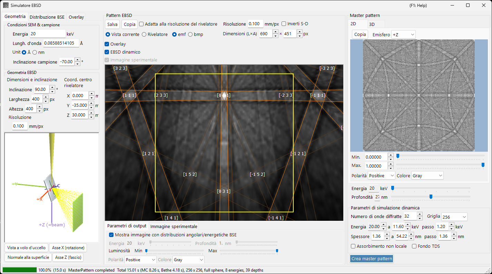
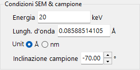
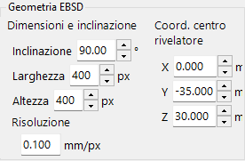
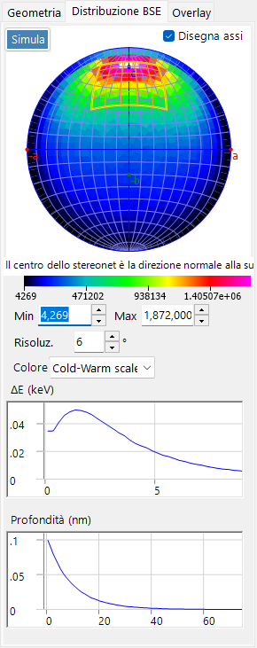
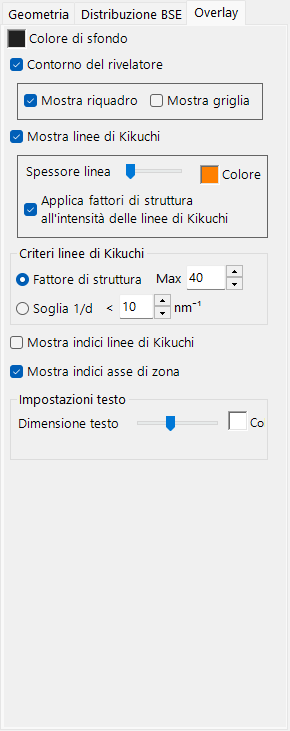
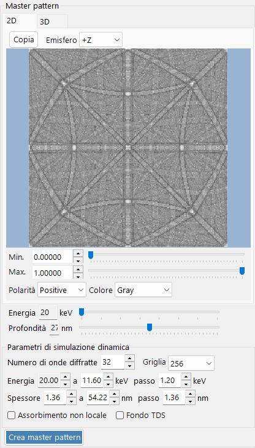
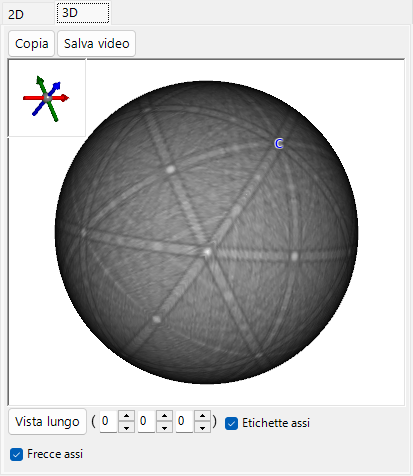
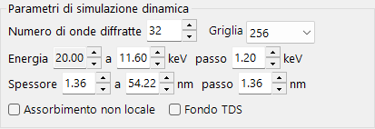
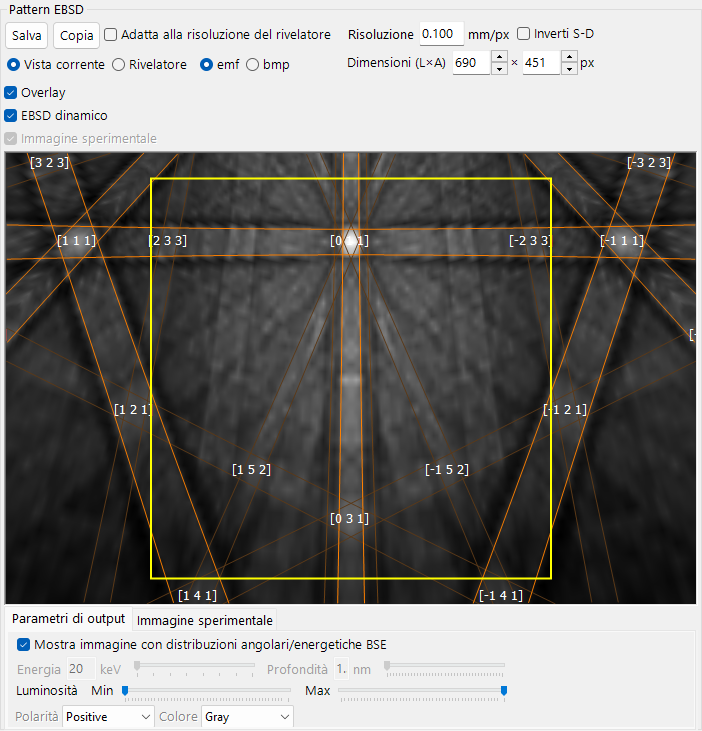
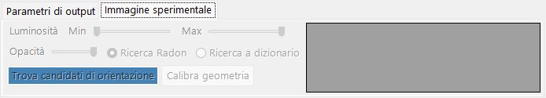

# Simulazione EBSD

Il **Simulatore EBSD** simula i pattern di diffrazione da retrodiffusione elettronica (EBSD) — pattern di Kikuchi — ottenuti in un microscopio elettronico a scansione (SEM), mediante calcoli di teoria dinamica. Calcola la distribuzione angolare/energetica/in profondità degli elettroni retrodiffusi (BSE) tramite una simulazione Monte-Carlo, costruisce un **master pattern** dinamico (a onde di Bloch) del cristallo e lo proietta sul rivelatore per l'orientazione corrente del cristallo. È anche possibile caricare un'immagine EBSD sperimentale e **indicizzarla**: l'orientazione che la spiega meglio viene cercata automaticamente ([Immagine sperimentale](#immagine-sperimentale)).

La finestra è composta da tre colonne.

- **Sinistra** : condizioni di simulazione. Le schede selezionano **Geometria** (geometria campione/rivelatore e una vista 3D), **Distribuzione BSE** (distribuzioni degli elettroni retrodiffusi) e **Overlay** (linee di Kikuchi e altre annotazioni).
- **Centro** : il pattern EBSD (di Kikuchi) per l'orientazione corrente del cristallo. Sotto di esso, le schede selezionano **Parametri di output** e **Immagine sperimentale**.
- **Destra** : il master pattern indipendente dall'orientazione, nelle schede **2D** e **3D**.

La barra di stato in basso mostra l'avanzamento del calcolo in corso e un riepilogo del risultato.

---

## Scorciatoie da tastiera e mouse

La vista centrale del pattern EBSD (di Kikuchi) e le viste del master pattern sulla destra rispondono ad azioni del mouse differenti.

| Scorciatoia | Azione |
|----------|--------|
| <kbd>F1</kbd> | Apre questa pagina del manuale online |
| Trascinare con il tasto sinistro il pattern vicino al centro | Inclina il cristallo |
| Trascinare con il tasto sinistro l'area esterna del pattern | Ruota il cristallo |
| Doppio clic sul pattern | Seleziona la sotto-cella del rivelatore sotto il cursore e mostra le sue statistiche |
| Rilasciare un file immagine sulla finestra | Lo carica come immagine EBSD sperimentale |
| Trascinare con il tasto sinistro una vista 3D (geometria / sfera master) | Ruotala |
| Trascinare con il tasto destro, o rotellina del mouse, su una vista 3D | Zoom |
| <kbd>CTRL</kbd> + doppio clic destro su una vista 3D | Commuta tra ortografica / prospettica |
| Trascinare / rotellina sul master pattern 2D | Sposta / zooma l'immagine |

Le viste 3D utilizzano la [navigazione della vista](21-shortcuts.md) standard di ReciPro (spostamento disabilitato).

→ Vedi **[21. Scorciatoie da tastiera e mouse](21-shortcuts.md)** per una panoramica di tutte le finestre.

---

## Flusso di lavoro

La pressione di **Crea master pattern** esegue in ordine i passaggi seguenti.

1. **Simulazione Monte-Carlo dei BSE** : utilizzando la composizione del cristallo corrente, la densità, la tensione di accelerazione e l'inclinazione del campione, circa 2,5 milioni di elettroni vengono tracciati all'interno del campione (diffusione elastica: sezioni d'urto di Mott/NIST; diffusione anelastica: modello di risposta dielettrica). Ciò produce la distribuzione congiunta di *profondità di penetrazione × direzione di uscita × energia di uscita* degli elettroni retrodiffusi.
2. **Selezione automatica degli intervalli** : da tale distribuzione, l'intervallo di energia (dall'energia incidente fino a circa l'80° percentile della perdita di energia) e l'intervallo di profondità (fino a circa il 99° percentile della profondità di penetrazione) usati nel calcolo dinamico vengono impostati automaticamente.
3. **Costruzione del master pattern** : per ogni energia e profondità, il problema di diffrazione dinamica (a onde di Bloch) viene risolto e integrato sulla sfera delle direzioni, pesato con la distribuzione Monte-Carlo, per fornire l'intensità di diffrazione retrodiffusa in ogni direzione. Il risultato è memorizzato su una griglia equiareale (di Roşca–Lambert).
4. **Proiezione sul rivelatore, con pesatura** : per l'orientazione corrente del cristallo, l'intensità per la direzione sottesa da ciascun pixel del rivelatore viene cercata nel master pattern e disegnata come pattern di Kikuchi, opzionalmente pesata con la distribuzione angolare/energetica dei BSE.

Gli intervalli di energia e profondità vengono impostati automaticamente nei passaggi 1–2, ma possono essere regolati manualmente prima della costruzione.

---

## Geometria

### Condizioni SEM & campione

- **Energy** : tensione di accelerazione del fascio incidente (keV).
- **Wavelength** : lunghezza d'onda dell'elettrone, collegata a Energy. **Unit** seleziona Å o nm.
- **Sample tilt** : angolo di inclinazione del campione (tipicamente −70°). La forte inclinazione nell'EBSD aumenta la resa degli elettroni retrodiffusi.

### Geometria EBSD

Il rivelatore (schermo a fosfori) è un rettangolo definito da un numero di pixel e da una dimensione di pixel.

- **Dimensioni e inclinazione** : **Tilt** è l'inclinazione del piano del rivelatore (°); **Width** e **Height** sono il numero di pixel del rivelatore.
- **Risoluzione** : la dimensione fisica di un pixel del rivelatore (mm/px). La dimensione fisica del rivelatore è quindi Width × Risoluzione per Height × Risoluzione.
- **Coordinate del centro del rivelatore** : posizione **X**, **Y**, **Z** del centro del rivelatore rispetto al punto di impatto del fascio (mm). Y e Z, insieme all'inclinazione, determinano la lunghezza di camera; X è lo scostamento sinistra-destra.

Caricando un'immagine sperimentale, **Width** e **Height** vengono portati alle dimensioni dell'immagine, così che un pixel del rivelatore corrisponda a un pixel dell'immagine (la **Risoluzione** resta invariata).

La geometria può essere esaminata nella vista 3D della scheda **Geometria**.

La piastra grigia è il campione, la lastra rettangolare verde è il rivelatore e il **+Z (=beam)** viola è il fascio incidente. Sono mostrati anche gli assi cristallini **a / b / c** (fissi al campione). I pulsanti **Vista a volo d'uccello**, **Normale alla superficie**, **Asse X (rotazione)** e **Asse Z (fascio)** allineano la vista alle direzioni standard. Vedi [Appendice A1. Sistemi di coordinate](appendix/a1-coordinate-system/2-diffraction.md) per le definizioni dei sistemi di coordinate.

---

## Distribuzione dei BSE

La scheda **Distribuzione BSE** mostra le distribuzioni Monte-Carlo degli elettroni retrodiffusi. Usa **Simula** per ricalcolarle.

- **Stereonet** : distribuzione angolare (istogramma delle direzioni di uscita) degli elettroni retrodiffusi. Il centro è la direzione della normale alla superficie e il contorno giallo segna la regione rettangolare sottesa dal rivelatore. **Disegna assi** sovrappone gli assi cristallini e la scala dei colori (**Min** / **Max**, **Resolution**, **Colore**) è regolabile.
- **ΔE (keV)** : distribuzione della perdita di energia degli elettroni retrodiffusi.
- **Profondità (nm)** : distribuzione della profondità alla quale gli elettroni retrodiffusi rivelati hanno subito l'ultimo evento di diffusione anelastica — la stessa definizione di profondità che pesa il master pattern.

Queste distribuzioni sono calcolate dallo stesso motore Monte-Carlo di [Traiettorie elettroniche](8-electron-trajectory.md) e sono utilizzate per pesare il master pattern.

---

## Overlay

La scheda **Overlay** configura le annotazioni disegnate sul pattern EBSD.

- **Background color** : colore di sfondo.
- **Contorno del rivelatore** : il contorno del rivelatore. **Mostra riquadro** (il rettangolo giallo al bordo del rivelatore) / **Mostra griglia** (griglia di suddivisione).
- **Mostra linee di Kikuchi** : disegna le linee di Kikuchi. **Spessore linea** / **Colore** e **Applica fattori di struttura all'intensità delle linee di Kikuchi** (ogni linea sfuma verso lo sfondo in proporzione al proprio fattore di struttura).
- **Criteri linee di Kikuchi** : quali linee di Kikuchi disegnare: **Fattore di struttura** (le prime **Top** *N* per fattore di struttura) oppure **Soglia 1/d** (quelle con 1/d al di sotto di una soglia, nm⁻¹).
- **Mostra indici linee di Kikuchi** : mostra gli indici delle linee di Kikuchi (bande).
- **Mostra indici asse di zona** : mostra gli indici degli assi di zona.
- **Impostazioni testo** : **Dimensione testo** / **Colore** delle etichette degli indici.

---

## Master pattern

Il master pattern è l'intensità di diffrazione retrodiffusa su tutte le direzioni, calcolata in anticipo con la teoria dinamica tramite **Crea master pattern** (**Arresta** interrompe il calcolo in corso).

- Scheda **2D** : proiezione equiareale (di Lambert) di un emisfero. **Emisfero** seleziona l'emisfero proiettato (+Z / −Z).
- Scheda **3D** : una sfera con l'intensità mappata su di essa. Può essere ruotata con il mouse e un riquadro in alto a sinistra mostra gli assi cristallini sincronizzati (a/b/c). **Etichette assi** / **Frecce assi** commutano le etichette/frecce e **Vista lungo** guarda lungo l'asse di zona [u v w] inserito accanto.
- Cursori **Energy / Depth** : selezionano la sezione di energia/profondità da visualizzare in anteprima.
- Ciascuna vista può essere inviata negli appunti con **Copia**.
- **Salva video** (scheda **3D**) : salva un video (MP4) del master pattern sferico in rotazione. Direzione di rotazione, velocità, durata, fps e qualità si impostano nella stessa finestra di dialogo «Movie setting» del [Visualizzatore struttura](5-structure-viewer.md). Ruota solo questa vista 3D; l'orientazione del cristallo (gli angoli di Eulero della finestra principale) non cambia.

### Parametri di simulazione dinamica

- **Number of diffracted waves** : numero di fasci diffratti (onde) inclusi nel calcolo a onde di Bloch. Più onde sono più accurate ma più lente.
- **Griglia** : risoluzione della griglia del master pattern (pixel per lato, 64–8192; predefinito 256). 4096 e 8192 richiedono un'enorme quantità di memoria per i dati intermedi (con le 16 energie × 40 profondità predefinite, circa 344 GB a 4096 e 1374 GB a 8192; già circa 86 GB a 2048), quindi il numero di passi in energia e profondità va ridotto drasticamente perché diventino utilizzabili. Se la memoria non basta, il calcolo termina con «MasterPattern failed» (ReciPro continua a funzionare).
- **Energy from … to … with step of …** : intervallo di energia e passo su cui si integra (keV); impostato automaticamente dal risultato Monte-Carlo.
- **Thickness from … to … with step of …** : intervallo di profondità e passo su cui si integra (nm); impostato anch'esso automaticamente.
- **Assorbimento non locale** : usa la forma di assorbimento non locale.
- **Sorgente non locale** : sostituisce la sorgente di retrodiffusione localizzata sui siti atomici con la forma non locale del potenziale assorbente (U'_back integrato sull'emisfero posteriore). Entrambe usano la stessa sezione d'urto fisica: è un cambio di modello, non un fondo additivo.
- **Profondità della sorgente (MC)** : quale evento Monte Carlo definisce la profondità della sorgente coerente di retrodiffusione usata nella pesatura (energia × profondità): l'ultimo evento anelastico (predefinito), l'ultimo evento di trasporto di qualsiasi tipo, o l'ultima decoerenza. In quest'ultimo caso un evento azzera la sorgente solo se è abbastanza localizzato da lasciare nel campione l'informazione su quale atomo ha diffuso: gli elastici con la probabilità termico-diffusa 1 − exp(−2B s²) del fattore di Debye–Waller (la diffusione di Bragg coerente no), gli anelastici sempre per eccitazioni di core o ad alta perdita e, per eccitazioni di valenza, solo con la frazione il cui trasferimento di impulso supera il taglio plasmonico q_c = ω_p/v_F (plasmoni e coppie elettrone–lacuna delocalizzate conservano lo stato di Bloch). Sorgenti più superficiali portano una modulazione di Kikuchi più debole: l'ultima opzione fissa il fondo diffuso con il solo trasporto, senza parametri liberi. Il cambio ricampiona solo gli elettroni salvati, senza ripetere il Monte Carlo.
- **Strato amorfo superficiale** : spessore (nm) di uno strato superficiale non cristallino (ossido nativo, contaminazione, danno da lucidatura o da assottigliamento ionico). Gli elettroni la cui sorgente coerente di retrodiffusione si trova nello strato non portano modulazione di Kikuchi e sono aggiunti come contributo uniforme mediato in direzione, con la stessa intensità per elettrone; le sorgenti sotto lo strato si misurano dalla superficie del cristallo. Il trasporto è calcolato con composizione e densità del cristallo, adeguato per pochi nm. 0 disattiva; il cambio ricampiona solo gli elettroni salvati, senza ripetere il Monte Carlo.
- **Pesare con la risposta del fosforo** (attivo per default, E_dead = 2 keV) : pesa ogni elettrone Monte Carlo con la resa luminosa di uno schermo al fosforo, φ(E) = max(0, E − E_dead), invece di contare ogni elettrone una volta. Gli elettroni di energia più alta lasciano il campione inclinato più in avanti, quindi la pesatura riduce il gradiente di intensità dall'alto in basso del pattern (per Si a 20 kV da circa 2,5 a 1,7 sul rivelatore) e attenua leggermente gli assi di zona. Si applica al binning sul piano del rivelatore e alla distribuzione di energia per bin; la modifica ri-raggruppa gli elettroni salvati senza rieseguire il Monte Carlo. Disattivare per un rivelatore diretto che conta gli elettroni. E_dead è l'energia dello strato morto (soglia) del fosforo; valori tipici 0–3 keV per uno schermo P43 con rivestimento di alluminio.
- **Reiniettare flusso assorbito come fondo** (disattivo per default) : nel calcolo a onde di Bloch, gli elettroni rimossi dal canale coerente dall'assorbimento (diffusione termica diffusa) scompaiono, mentre fisicamente raggiungono il rivelatore senza modulazione di Kikuchi. Questa opzione li restituisce come fondo diffuso D(t) = Σσ_n ∫(1 − N(z))dz (N(z) = densità dell'onda coerente mediata sulla cella), conservando il flusso. Le intensità assolute aumentano (a 20 kV circa il 10 % per Si e il 25 % per Fe₃O₄); la luminosità relativa degli assi di zona cambia poco e dipende dal cristallo, perché il flusso reiniettato appartiene ancora alla stessa direzione di uscita. Nessun effetto se i parametri di spostamento atomico sono zero (senza assorbimento); assegnare B a tali cristalli.

---

## Pattern EBSD

Il pannello centrale mostra il pattern EBSD (a bande di Kikuchi) per l'orientazione corrente del cristallo. La barra sopra il pattern controlla che cosa viene disegnato e come viene copiato.

- **EBSD dinamico** : proietta sul rivelatore il master pattern costruito; deselezionata resta solo lo sfondo.
- **Overlay** : disegna le linee di Kikuchi, gli indici e il contorno del rivelatore configurati nella scheda **Overlay**.
- **Immagine sperimentale** : sovrappone l'immagine sperimentale caricata (vedi sotto).
- **Inverti S-D** : specchia il pattern e tutti i suoi overlay da sinistra a destra. Deselezionata (impostazione predefinita) è la vista dal rivelatore verso il campione, cioè il pattern come lo registra una telecamera EBSD; selezionala solo se la tua immagine sperimentale ha la chiralità opposta.
- **Resolution** (mm/px) e **Size (W×H)** (px) : risoluzione e dimensioni della vista visualizzata.
- **Salva** : salva il pattern in un file, con l'intervallo e la risoluzione selezionati accanto. Il formato (PNG / TIFF / EMF) si sceglie nella finestra di salvataggio.
  - **Pattern values (\*.csv)** scrive, invece di un'immagine, le intensità grezze sulla griglia di pixel del rivelatore.
  - Un TIFF viene scritto in scala di grigi a 16 bit (non quantizzato a 256 livelli) quando l'intervallo è **Rivelatore**, **EBSD dinamico** è visualizzato e **Immagine sperimentale** no. In tal caso gli **Overlay** vengono omessi qualunque sia la loro casella, e i valori dei pixel sono il pattern mappato linearmente dal proprio minimo–massimo su 0–65535 (il minimo e il massimo usati sono riportati nella barra di stato; usare l'esportazione csv se servono valori assoluti).
- **Copia** : copia il pattern negli appunti, con l'intervallo e il formato selezionati accanto.
  - **Vista corrente** copia l'area attualmente visualizzata (con spostamento e zoom correnti); **Rivelatore** copia solo l'area del rivelatore, nel qual caso il riquadro giallo viene omesso così che l'immagine termini esattamente al bordo del rivelatore.
  - **emf** copia un Enhanced Metafile mantenendo vettoriali le linee di Kikuchi e le etichette degli indici; **bmp** rasterizza tutto.
  - **Adatta alla risoluzione del rivelatore** copia con un pixel dell'immagine per pixel del rivelatore (il lato maggiore è limitato a 4096 px). Deselezionata, viene usata la risoluzione a schermo.

### Parametri di output

- **Mostra immagine con distribuzioni angolari/energetiche BSE** : se selezionata, il pattern viene composto pesando con la distribuzione dei BSE (energia, profondità, direzione) anziché con una singola sezione.
- **Energy / Depth** : quando l'opzione precedente è disattivata, seleziona la sezione di energia/profondità da visualizzare.
- **Luminosità** (**Min** / **Max**), **Polarità**, **Colore** : intervallo di luminosità, polarità e scala dei colori.

### Immagine sperimentale

Rilascia un file immagine EBSD (TIFF, PNG, BMP o JPEG; i TIFF a 16 bit sono letti a piena profondità) in un punto qualsiasi della finestra per caricarlo come pattern sperimentale. Viene disegnato sull'area del rivelatore — sopra il pattern simulato e sotto gli overlay delle linee di Kikuchi — così da poter confrontare direttamente simulazione e misura. Il caricamento porta inoltre **Width** e **Height** del rivelatore alle dimensioni dell'immagine.

- **Luminosità** (**Min** / **Max**) : punti di nero e di bianco dell'immagine sovrapposta, come frazione del suo stesso intervallo di intensità (cursori logaritmici). Agiscono solo sull'immagine sperimentale, non sul pattern simulato.
- **Opacità** : opacità dell'immagine sovrapposta, da 0 (invisibile) a 100 % (opaca). Riducila per vedere il pattern simulato sottostante.

L'orientazione che spiega l'immagine viene poi cercata con uno dei due motori.

- **Ricerca Radon** : confronta modelli cinematici di bande di Kikuchi con la mappa di Radon (rilevazione di rette) dell'immagine sperimentale. Funziona senza master pattern; se ne esiste uno, i candidati vengono riordinati con una ZNCC robusta (correlazione incrociata normalizzata a media nulla) rispetto al pattern simulato.
- **Ricerca a dizionario** : genera dal master pattern dinamico i pattern di dizionario per tutte le orientazioni e li confronta tutti con ZNCC robusta. Richiede il master pattern e impiega alcuni secondi, ma è più affidabile della ricerca Radon.

**Trova candidati di orientazione** esegue il motore selezionato ed elenca fino a 10 candidati, dal migliore in giù; se è disponibile un master pattern, il candidato migliore viene raffinato a ±0,25°. Le colonne sono:

| Colonna | Significato |
|---------|-------------|
| **#** | Posizione (0 = migliore) |
| **Score** | Valore *z* dell'evidenza di bande Radon |
| **Bands** | Bande accoppiate / bande previste nel campo visivo |
| **ZNCC** | Correlazione con il pattern simulato |
| **Strong bands (hkl)** | Indici delle bande accoppiate (solo ricerca Radon) |

**Facendo clic su una riga, quell'orientazione viene applicata all'intero programma**: il pattern simulato viene ridisegnato sopra quello sperimentale e l'orientazione del cristallo di tutte le altre finestre lo segue.

**Calibra geometria** raffina la geometria del rivelatore — centro del pattern (PC) e distanza del rivelatore (DD) — alternandola con l'orientazione, massimizzando la ZNCC tra pattern simulato e sperimentale. Richiede il master pattern, mantiene fissa l'inclinazione del rivelatore e riscrive il risultato nei campi **Coordinate del centro del rivelatore** X/Y/Z. Poiché la scansione del fascio di un SEM sposta il centro del pattern solo di una frazione di millimetro, di norma una sola calibrazione all'inizio dell'esperimento basta per un'intera serie di immagini.

---

## Vedi anche

- [Traiettorie elettroniche](8-electron-trajectory.md) — Simulazione Monte-Carlo delle traiettorie elettroniche / dei BSE usata per la pesatura angolare/energetica/in profondità.
- [Simulatore di diffrazione](7-diffraction-simulator/index.md) — diffrazione elettronica dinamica (a onde di Bloch).
- [Appendice A1. Sistemi di coordinate](appendix/a1-coordinate-system/2-diffraction.md) — definizioni dei sistemi di coordinate del campione/rivelatore.
