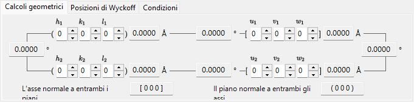
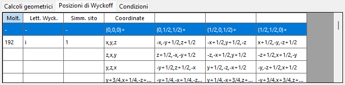
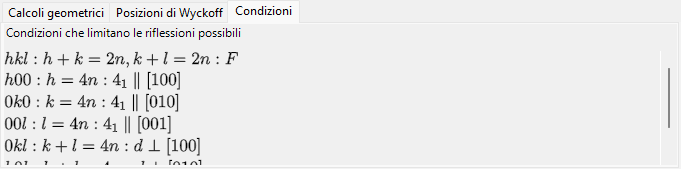
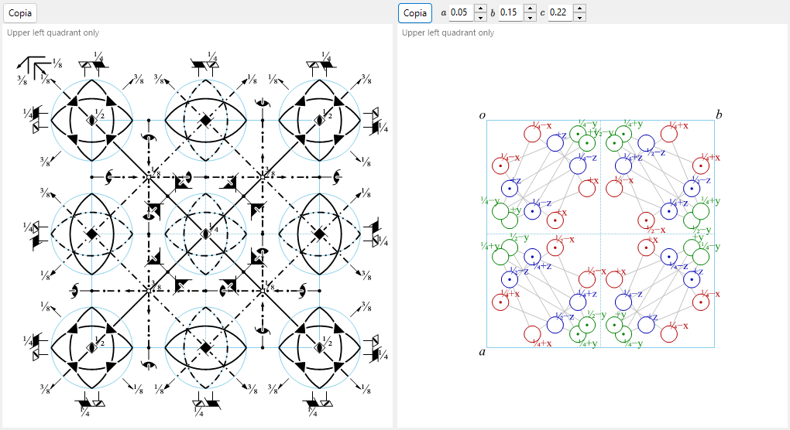

# Informazioni di simmetria

**Informazioni di simmetria** visualizza informazioni dettagliate sulla simmetria del gruppo spaziale del cristallo selezionato e, in aggiunta, traccia diagrammi schematici degli elementi di simmetria e delle posizioni generali nello stile delle *International Tables for Crystallography* Vol. A.

La finestra è suddivisa in un'area di identità del gruppo spaziale (in alto a sinistra), un'area di calcolo/tabella con schede (in alto a destra) e due diagrammi schematici (in basso).

---

## Scorciatoie da tastiera e mouse

Questa finestra non ha combinazioni speciali di tasti o di mouse. <kbd>F1</kbd> apre questa pagina del manuale, e i due pulsanti **Copy** copiano il diagramma degli elementi di simmetria e il diagramma delle posizioni generali negli appunti (come bitmap, oppure come EMF vettoriale quando **EMF** è selezionato).

→ Vedi **[21. Scorciatoie da tastiera e mouse](21-shortcuts.md)** per tutte le finestre a colpo d'occhio.

---

## Identità del gruppo spaziale

Il pannello in alto a sinistra elenca, per il gruppo spaziale corrente:

- **Number** (1–230) e l'indice di setting
- **Crystal System**
- **Point Group** : simboli di Hermann–Mauguin (HM) e Schoenflies (SF)
- **Space Group** : simbolo HM breve, simbolo HM completo, simbolo SF e **Hall symbol**

---

## Calcolo geometrico

Inserisci due piani cristallini \((h_1, k_1, l_1)\), \((h_2, k_2, l_2)\) oppure due indici di direzione \([u_1, v_1, w_1]\), \([u_2, v_2, w_2]\) per ottenere:

- la distanza interplanare di ciascun piano / la lunghezza di ciascun asse,
- l'angolo tra i due piani (o i due assi),
- **l'indice di direzione normale a entrambi i piani** e **l'indice di piano normale a entrambi gli assi**.

Questi calcoli rispettano la metrica della cella elementare corrente.

---

## Posizioni di Wyckoff

Elenca ogni posizione di Wyckoff con la sua molteplicità, la sua lettera di Wyckoff, la simmetria del sito e l'indicazione se si tratti di una posizione generale o speciale. Per i reticoli centrati, i vettori di traslazione reticolare sono mostrati nella riga di intestazione.

---

## Condizioni di estinzione

Le condizioni di riflessione derivanti dalla centratura del reticolo e dagli operatori di simmetria di slittamento/elicoidali.

---

## Diagrammi degli elementi di simmetria e delle posizioni generali

I due pannelli in basso riproducono i diagrammi schematici di simmetria del gruppo spaziale nella notazione delle *International Tables for Crystallography* Vol. A.

- **Elementi di simmetria (a sinistra)**: assi di rotazione/elicoidali, piani di riflessione/slittamento e centri di inversione/punti di rotoinversione sono disegnati con i simboli grafici convenzionali.
  - Per il reticolo \(F\) del sistema cubico, viene mostrato solo un ottavo della cella elementare (solo il quadrante in alto a sinistra).
  - Questi elementi di simmetria possono anche essere disegnati direttamente sul modello 3D nel [Visualizzatore struttura](5-structure-viewer.md).
- **Posizioni generali (a destra)**: le posizioni equivalenti generali sono rappresentate come cerchi (una virgola indica un'immagine speculare), annotate con le loro coordinate frazionarie.
  - Solo per il sistema cubico, linee ausiliarie collegano i tre cerchi correlati da un asse di rotazione ternario.

Controlli sotto i diagrammi:

- **Direction** (`a` / `b` / `c`) : scegli l'asse cristallino lungo cui proiettare.
- **Copy** ciascun diagramma negli appunti come immagine vettoriale (**EMF**) o immagine raster (**BMP**); l'EMF può essere separato e modificato in PowerPoint.

---

## Vedi anche

- [Database dei cristalli](1-crystal-database.md)
- [Visualizzatore struttura](5-structure-viewer.md)
- [Stereogramma](6-stereonet.md)
- [Geometria di rotazione](4-rotation-geometry.md)
- [Finestra principale](0-main-window.md)
