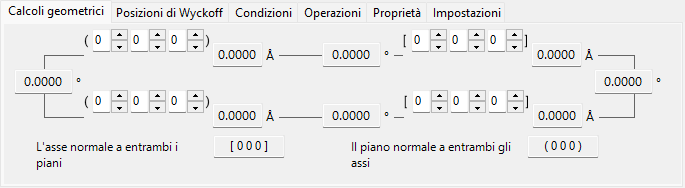
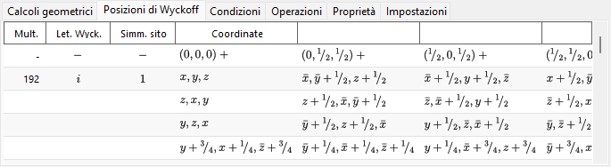
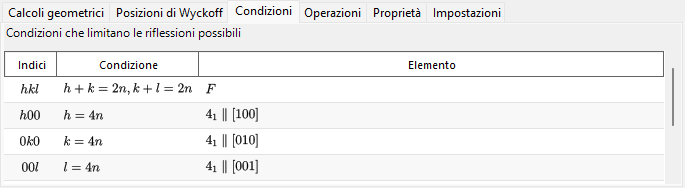
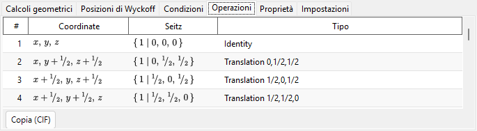
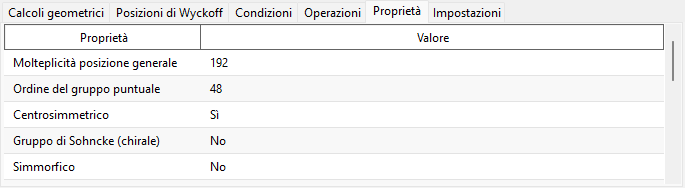
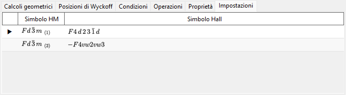

# Informazioni di simmetria

**Informazioni di simmetria** visualizza informazioni dettagliate sulla simmetria del gruppo spaziale del cristallo selezionato e, in aggiunta, traccia diagrammi schematici degli elementi di simmetria e delle posizioni generali nello stile delle *International Tables for Crystallography* Vol. A.

La finestra è suddivisa in un'area di identità del gruppo spaziale (in alto a sinistra), un'area di calcolo/tabella con schede (in alto a destra) e due diagrammi schematici (in basso).

!!! tip "Teoria della simmetria (Appendice A4)"
    Che cosa codifica realmente un simbolo di Hermann–Mauguin/Hall/Schoenflies, le classificazioni secondo la teoria dei gruppi nella scheda **Proprietà** (centrosimmetrico, Sohncke, simmorfico, polare, …), il significato dei diagrammi degli elementi di simmetria e delle posizioni generali in basso, e le relazioni gruppo–sottogruppo mostrate da **Relazioni di gruppo…** sono tutti spiegati nell'**[Appendice A4. Simmetria e gruppi spaziali](appendix/a4-symmetry-space-groups/index.md)**.

---

## Scorciatoie da tastiera e mouse

Questa finestra non ha combinazioni speciali di tasti o di mouse. <kbd>F1</kbd> apre questa pagina del manuale, e i due pulsanti **Copia** copiano negli appunti il diagramma degli elementi di simmetria e il diagramma delle posizioni generali (come **emf** vettoriale o **bmp** raster, a scelta con **Formato di copia**).

→ Vedi **[21. Scorciatoie da tastiera e mouse](21-shortcuts.md)** per tutte le finestre a colpo d'occhio.

---

## Identità del gruppo spaziale

Il pannello in alto a sinistra elenca, per il gruppo spaziale corrente:

- **Numero** (1–230) e l'indice del setting
- **Sistema cristallino**
- **Gruppo puntuale** : simboli di Hermann–Mauguin (HM) e di Schoenflies (SF)
- **Gruppo spaziale** : simbolo HM corto, simbolo HM completo, simbolo SF e **simbolo Hall**

---

## Calcoli geometrici

Inserisci due piani cristallini \((h_1, k_1, l_1)\), \((h_2, k_2, l_2)\) oppure due indici di direzione \([u_1, v_1, w_1]\), \([u_2, v_2, w_2]\) per ottenere:

- la distanza interplanare di ciascun piano / la lunghezza di ciascun asse,
- l'angolo tra i due piani (o i due assi),
- **l'indice di direzione normale a entrambi i piani** e **l'indice di piano normale a entrambi gli assi**.

Questi calcoli rispettano la metrica della cella elementare corrente.

---

## Posizioni di Wyckoff

Elenca ogni posizione di Wyckoff con la sua molteplicità, la lettera di Wyckoff, la simmetria del sito e l'indicazione se si tratti di una posizione generale o speciale. Per i reticoli centrati, i vettori di traslazione reticolare sono mostrati nella riga di intestazione.

---

## Condizioni

Le condizioni di riflessione derivanti dalla centratura del reticolo e dagli operatori di simmetria di slittamento ed elicoidali.

---

## Operazioni

Elenca ogni operazione di simmetria della posizione generale (con le traslazioni di centratura del reticolo già espanse) come tripletta di coordinate, simbolo di Seitz e tipo geometrico in linguaggio corrente (ad es. *"3-fold rotation"*, *"c-glide plane"*, *"screw axis"*). **Copia (CIF)** copia l'elenco completo negli appunti come loop CIF `_space_group_symop_operation_xyz`.

→ Vedi l'**[Appendice A4.1](appendix/a4-symmetry-space-groups/symbols-and-diagrams.md#operazioni-di-simmetria-scheda-operazioni)** per come leggere queste tre notazioni.

---

## Proprietà

Riporta le classificazioni secondo la teoria dei gruppi del gruppo spaziale corrente (molteplicità della posizione generale, ordine del gruppo puntuale, centrosimmetrico, Sohncke, simmorfico, direzione polare, coppia enantiomorfa, famiglia cristallina/sistema reticolare/tipo di Bravais, classe cristallina aritmetica, simmetria di Patterson) e quali proprietà fisiche macroscopiche (piroelettricità/ferroelettricità, piezoelettricità, generazione di seconda armonica, attività ottica) sono permesse da quella simmetria.

→ Vedi l'**[Appendice A4.1](appendix/a4-symmetry-space-groups/symbols-and-diagrams.md#classificazione-secondo-la-teoria-dei-gruppi-scheda-proprietà)** per il significato di ciascun termine.

---

## Impostazioni

Elenca, a titolo di riferimento, tutte le scelte tabulate di origine e di setting degli assi che condividono il numero IT del gruppo spaziale corrente, ciascuna con il proprio simbolo HM e simbolo Hall; il setting attualmente visualizzato è contrassegnato. Selezionare una riga non modifica il cristallo.

---

## Diagrammi degli elementi di simmetria e delle posizioni generali

I due pannelli in basso riproducono i diagrammi schematici di simmetria del gruppo spaziale nella notazione delle *International Tables for Crystallography* Vol. A.

- **Elementi di simmetria (a sinistra)**: assi di rotazione/elicoidali, piani di riflessione/slittamento e centri di inversione/punti di rotoinversione sono disegnati con i simboli grafici convenzionali.
  - Per il reticolo \(F\) del sistema cubico viene mostrato solo un ottavo della cella elementare (il solo quadrante in alto a sinistra).
  - Questi elementi di simmetria possono anche essere disegnati direttamente sul modello 3D nel [Visualizzatore struttura](5-structure-viewer.md).
- **Posizioni generali (a destra)**: le posizioni equivalenti generali sono rappresentate come cerchi (una virgola indica un'immagine speculare), annotati con le loro coordinate frazionarie.
  - Solo per il sistema cubico, linee ausiliarie collegano i tre cerchi correlati da un asse di rotazione ternario.

Controlli sotto i diagrammi:

- **Direzione** (`a` / `b` / `c`) : scegli l'asse cristallino lungo cui proiettare.
- **Copia** : copia ciascun diagramma negli appunti nel formato selezionato con **Formato di copia** (**emf** vettoriale / **bmp** raster); l'emf può essere separato nei suoi componenti e modificato in PowerPoint.
- **Relazioni di gruppo…** apre un browser per le relazioni sottogruppo massimale/supergruppo minimale del gruppo spaziale corrente. Vedi l'[Appendice A4.2](appendix/a4-symmetry-space-groups/group-subgroup-relations.md) per come leggerlo.

---

## Vedi anche

- [Database dei cristalli](1-crystal-database.md)
- [Visualizzatore struttura](5-structure-viewer.md)
- [Stereogramma](6-stereonet.md)
- [Geometria di rotazione](4-rotation-geometry.md)
- [Finestra principale](0-main-window.md)
- [Appendice A4. Simmetria e gruppi spaziali](appendix/a4-symmetry-space-groups/index.md) — il contesto cristallografico e di teoria dei gruppi dietro ogni scheda e diagramma di questa pagina.
