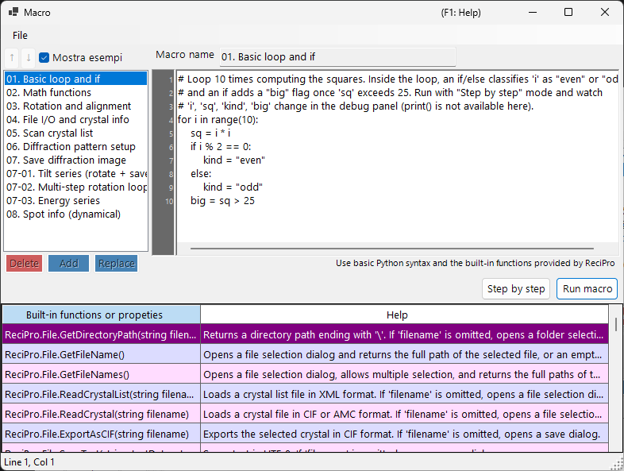

# Macro

ReciPro include un sistema di macro basato su **IronPython** per automatizzare operazioni sui cristalli, simulazioni di diffrazione e simulazioni di immagini tramite scripting.



Nello screenshot qui sopra è attivata l'opzione **Show samples**, che mostra le macro di esempio integrate. L'elenco delle macro è a sinistra, l'editor del codice a destra e una tabella di aiuto delle funzioni integrate in basso.

---

## Scorciatoie da tastiera e mouse

| Scorciatoia | Azione |
|----------|--------|
| <kbd>F1</kbd> | Apre questa pagina del manuale online |
| <kbd>CTRL</kbd>+<kbd>S</kbd> | Salva il testo dell'editor di nuovo nella voce selezionata dell'elenco delle macro |
| <kbd>F10</kbd> | Avanza di un passo (durante l'esecuzione passo-passo) |
| Doppio clic su una riga nell'elenco di aiuto delle funzioni | Inserisce la firma di quella funzione in corrispondenza del cursore |
| Trascina un file `.mcr` sulla finestra | Lo carica nell'editor |

**Run**, **Step** e **Stop** sono pulsanti (nessun acceleratore da tastiera).

→ Vedi **[21. Scorciatoie da tastiera e mouse](../21-shortcuts.md)** per uno sguardo d'insieme su ogni finestra.

---

## Panoramica

Le macro sono scritte con la sintassi di Python. Usando le classi e le funzioni integrate di ReciPro, è possibile eseguire programmaticamente le stesse operazioni disponibili tramite la GUI.

- **Linguaggio**: Python 3 (IronPython 3.4)
- **Archiviazione**: binario compresso nel Registro di sistema di Windows (persiste tra le sessioni)
- **Accesso**: fare clic sul pulsante Macro nella finestra principale per aprire l'editor delle macro

---

## Finestra dell'editor

L'editor delle macro ha quattro aree principali:

| Area | Scopo |
|------|---------|
| **Elenco delle macro** (a sinistra) | Macro memorizzate. `Add` aggiunge una nuova macro, `Replace` sovrascrive quella selezionata, `Delete` la rimuove. Up/Down ne cambiano l'ordine. |
| **Campo nome** (in alto) | Identificatore della macro in fase di modifica. |
| **Area del codice** (a destra) | Editor di codice Python con barra dei numeri di riga, indentazione automatica e popup di aiuto sulla sintassi. |
| **Tabella delle funzioni integrate** (in basso) | Elenco delle funzioni/proprietà integrate fornite da ReciPro, ciascuna con una descrizione di aiuto. Un riferimento durante la scrittura del codice. |
| **Barra di stato** (in fondo) | Mostra la posizione corrente del cursore come `Line N, Col M`. |
| **Pannello di debug** (visibile durante l'esecuzione Step) | Elenca le variabili locali alla riga corrente. |

La barra del titolo mostra **`Macro*`** (con un asterisco) finché vi sono modifiche non salvate, e torna a **`Macro`** dopo Add / Replace / <kbd>CTRL</kbd>+<kbd>S</kbd>.

### Macro di esempio

Attivando **Show samples** (in alto a sinistra) il proprio elenco di macro viene temporaneamente sostituito dalle macro di esempio integrate (cicli e condizioni di base, funzioni matematiche, rotazione/allineamento, scansione dell'elenco cristalli, simulazione di diffrazione/immagini, serie di inclinazioni/energie, informazioni sulle riflessioni e altro). Gli esempi sono di sola lettura e mostrati nella lingua corrente dell'interfaccia; usali per imparare o come punto di partenza da copiare. Disattivandolo si ripristinano le proprie macro.

---

## Funzioni di modifica

- **Indentazione automatica**: quando premi <kbd>ENTER</kbd>, la riga successiva eredita gli spazi iniziali della riga corrente. Se la riga termina con `:` (dopo `def`/`if`/`for`/ecc.), viene aggiunto automaticamente un ulteriore livello di indentazione (4 spazi).
- **Backspace intelligente**: all'interno degli spazi iniziali, <kbd>BACKSPACE</kbd> rimuove un intero livello di indentazione (4 spazi) anziché un singolo carattere.
- **<kbd>TAB</kbd> / <kbd>SHIFT</kbd>+<kbd>TAB</kbd>**:
  - Senza selezione: inserisce / rimuove un livello di indentazione in corrispondenza del cursore.
  - Selezione su più righe: indenta / riduce l'indentazione di tutte le righe selezionate contemporaneamente.
- **Completamento automatico**: durante la digitazione, un popup elenca i nomi di funzione e le parole chiave del linguaggio corrispondenti. I tasti freccia navigano, <kbd>ENTER</kbd> o <kbd>TAB</kbd> accetta, <kbd>ESC</kbd> annulla.
- **Aiuto tramite tooltip**: passando il puntatore su una voce selezionata del completamento automatico ne viene mostrata la documentazione.

### Scorciatoie da tastiera

| Scorciatoia | Azione |
|----------|--------|
| <kbd>CTRL</kbd>+<kbd>S</kbd> | Salva il codice corrente nella voce macro selezionata (sul posto) |
| <kbd>F10</kbd> | Passa alla riga successiva (durante l'esecuzione Step) |
| <kbd>ENTER</kbd> | Inserisce una nuova riga con indentazione automatica |
| <kbd>TAB</kbd> / <kbd>SHIFT</kbd>+<kbd>TAB</kbd> | Indenta / riduce l'indentazione |
| <kbd>BACKSPACE</kbd> | Elimina un livello di indentazione se all'interno degli spazi iniziali |
| <kbd>CTRL</kbd>+<kbd>↑</kbd> / <kbd>CTRL</kbd>+<kbd>↓</kbd> | Non disponibile — usa i pulsanti Up/Down per riordinare le macro |

---

## Esecuzione delle macro

Due modalità di esecuzione:

- **Run macro**: esegue il codice fino alla fine. In caso di errori compare una finestra di dialogo che mostra il traceback di Python ed evidenzia nell'editor la riga incriminata.
- **Step by step**: mette in pausa prima di ogni riga. Il pannello di debug mostra le variabili locali. Usa <kbd>F10</kbd> (o il pulsante **Next step (F10)**) per avanzare, oppure **Stop** per interrompere.

**Stop** funziona solo in modalità Step (la normale esecuzione di Run macro non può essere interrotta perché IronPython non rispetta `CancellationToken` e tutto viene eseguito sul thread dell'interfaccia).

---

## Supporto del linguaggio Python

Questo ambiente per macro è **IronPython 3.4**. Non tutte le funzionalità di Python hanno senso qui.

### Pre-importati

- **`math`** viene importato all'avvio. Usa direttamente `math.sqrt(x)`, `math.sin(x)`, `math.pi`, `math.radians(deg)`, ecc.

### Utilizzabili

- Controllo di flusso: `if`/`elif`/`else`, `for`, `while`, `def`, `class`, `return`, `try`/`except`/`finally`, `pass`, `break`, `continue`, `lambda`
- Letterali: `True`, `False`, `None`
- Funzioni integrate: `len`, `range`, `abs`, `min`, `max`, `sum`, `sorted`, `enumerate`, `zip`, `int`, `float`, `str`, `list`, `dict`, `tuple`, `type`, `isinstance`
- Moduli della libreria standard che sono Python puro: `random`, `datetime`, `time`, `re`, `json`, `itertools`, `functools`, `collections`

Questi elementi di base sono preregistrati nel popup di completamento automatico, quindi puoi scoprirli digitando le prime lettere.

### NON utilizzabili

- **`print()`** : non esiste una finestra di console; l'output non va da nessuna parte. Usa **Step by step** e guarda il pannello di debug per ispezionare i valori.
- **`input()`** : nessuno stdin.
- **I/O su file** (`open`, `with open`) : non previsto per le macro. Usa invece le funzioni di supporto `ReciPro.File.*`.
- **Pacchetti con estensioni C**: `numpy`, `scipy`, `pandas`, `matplotlib` — non compatibili con IronPython.

---

## Accesso all'API

L'API delle macro di ReciPro è esposta sotto il nome di livello superiore **`ReciPro`**. Ogni classe integrata è un campo di `ReciPro`:

```python
ReciPro.File.*         # File I/O helpers
ReciPro.Crystal.*      # Currently selected crystal
ReciPro.CrystalList.*  # Manage the crystal list
ReciPro.Dir.*          # Crystal orientation (Euler, zone-axis, rotation)
ReciPro.DifSim.*       # Diffraction simulator
ReciPro.HRTEM.*        # HRTEM simulation
ReciPro.STEM.*         # STEM simulation
ReciPro.Potential.*    # Potential simulation
ReciPro.Sleep(ms)      # Pause execution (milliseconds)
```

Il popup di completamento automatico mostra sempre la forma completa `ReciPro.Class.Member` e la inserisce alla lettera, quindi raramente è necessario digitare il prefisso a mano.

Vedi [20.1. Funzioni integrate](1-built-in-functions.md) per il riferimento completo dell'API.

---

## Messaggi di errore

Quando una macro fallisce, una finestra di dialogo mostra il traceback di Python nel formato standard:

```
Traceback (most recent call last):
  File "<string>", line 5, in <module>
NameError: name 'abc' is not defined
```

L'editor seleziona automaticamente la riga segnalata nel traceback (il frame più interno), in modo da poter correggere subito il problema. Anche gli errori di sintassi vengono segnalati con i numeri di riga, prima che inizi l'esecuzione.

---

## Vedi anche

- [20.1. Funzioni integrate](1-built-in-functions.md)
- [20.2. Esempi](2-examples.md)
