# Interazione del fascio

L'**Interazione del fascio** descrive come il cristallo selezionato interagisce con un fascio incidente di **raggi X, elettroni o neutroni**. Per una radiazione scelta calcola le riflessioni permesse e i loro fattori di struttura, l'attenuazione e il trasporto del fascio attraverso il materiale, i fattori di diffusione atomici di ciascun elemento e (per i raggi X) le righe di fluorescenza caratteristiche. Cambiando il tipo di radiazione in alto si ricalcola tutto, così lo stesso cristallo può essere confrontato tra tecniche di diffrazione e di spettroscopia.

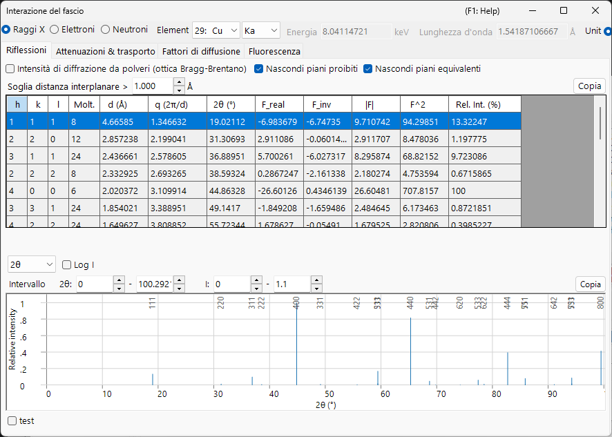

Il fascio incidente si seleziona nella banda in cima alla finestra; le quattro schede sottostanti — **Reflections**, **Attenuations & Transport**, **Scattering factors** e **Fluorescence** — mostrano i diversi aspetti dell'interazione. Ciascuna sezione di scheda qui sotto mostra la scheda sotto i fasci **X-ray / Electron / Neutron** (usa le schede in ogni figura); il contenuto cambia notevolmente con il fascio.

!!! tip "Background di fisica dello stato solido (Appendice A2)"
    La diffusione e la fisica dello stato solido alla base di queste quattro schede — fattori di diffusione atomici, fattore di struttura, attenuazione e trasporto del fascio, e fluorescenza — sono spiegate nell'**[Appendice A2. Interazione del fascio (background di fisica dello stato solido)](appendix/a2-beam-interaction/index.md)**.

!!! note "Dati sui raggi X e libreria xraylib inclusa"
    Molte delle grandezze relative ai raggi X (dispersione anomala $f'/f''$, la suddivisione di diffusione $F(q)+S(q)$, la scomposizione foto / Rayleigh / Compton dell'attenuazione massica, i salti dei bordi di assorbimento e le rese di fluorescenza) sono valutate con la libreria inclusa **[xraylib](https://github.com/tschoonj/xraylib)**. Se xraylib non è disponibile, ReciPro ricorre alle sue tabelle interne (attenuazione di sola fotoassorbimento, solo energie delle righe caratteristiche) e le celle interessate mostrano **N/A**. La riga **source** di ogni tabella indica quale set di dati è stato utilizzato.

---

## Scorciatoie da tastiera e mouse

Questa finestra non ha combinazioni di tasti speciali. <kbd>F1</kbd> apre questa pagina del manuale. Nella scheda **Scattering factors** la linea verticale del cursore può essere **trascinata** per leggere il fattore di diffusione di ciascun elemento in quella posizione, e ogni scheda ha un pulsante **Copy** che esporta la sua tabella come testo incollabile in un foglio di calcolo.

→ Vedi **[21. Scorciatoie da tastiera e mouse](21-shortcuts.md)** per tutte le finestre a colpo d'occhio.

---

## Fascio e lunghezza d'onda {#reflections-tab}

La banda superiore è un **Wave Length Control** condiviso con gli altri simulatori.

- **X-ray / Electron / Neutron** : i fattori di diffusione atomici e la fisica dell'interazione differiscono a seconda del tipo di fascio incidente, quindi vengono commutati qui.
- Per **X-ray**, la scelta dell'**Element** (materiale dell'anodo) e della riga caratteristica (Kα, ecc.) imposta automaticamente la lunghezza d'onda di quel raggio X caratteristico.
- **Energy (keV)** e **Wavelength (Å)** sono collegati; impostando l'uno si aggiorna l'altro, ed entrambi determinano il 2θ usato nella tabella **Reflections**.
- **Unit (Å / nm)** cambia l'unità di lunghezza usata per le distanze interplanari e per grandezze simili.

Il fascio scelto decide anche quali schede e curve sono significative:

| Fascio | Reflections | Attenuations & Transport | Scattering factors | Fluorescence |
|------|------|------|------|------|
| **X-ray** | fattori di struttura incl. dispersione anomala | µ/ρ, µ, trasmissione + bordi di assorbimento (vs energia) | $f(s)$ o $F(q)+S(q)$ | righe caratteristiche + barre EDX |
| **Electron** | fattori di struttura elettronici | σ, MFP, \|dE/ds\|, IMFP, range (vs energia) | Peng / Kirkland / 8-Gaussians | — (nascosta) |
| **Neutron** | fattori di struttura nucleari | lunghezze di diffusione e sezioni d'urto (nessuna curva in energia) | lunghezze di diffusione (nessuna dipendenza da *s*) | — (nascosta) |

La scheda **Fluorescence** è solo per i raggi X e scompare per i fasci di elettroni e di neutroni. Per i neutroni i grafici dipendenti dall'energia in **Attenuations & Transport** e **Scattering factors** sono sostituiti da tabelle per elemento, perché la lunghezza di diffusione nucleare non dipende dall'angolo di diffusione né dall'energia.

---

## Scheda Reflections

Elenca i piani cristallini permessi (riflessioni) del cristallo e il **fattore di struttura** e l'intensità di diffrazione di ciascuno. Per i raggi X il fattore di struttura include ora i termini di **dispersione anomala** $f'/f''$ all'energia corrente, così `F_inv` (la parte immaginaria) è in genere diversa da zero in prossimità di un bordo di assorbimento. Il layout è lo stesso per ogni fascio; cambiano solo i valori del fattore di struttura e il 2θ di ciascuna riflessione.

=== "X-ray"
    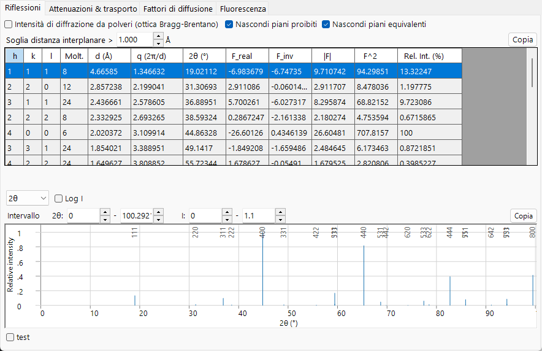

=== "Electron"
    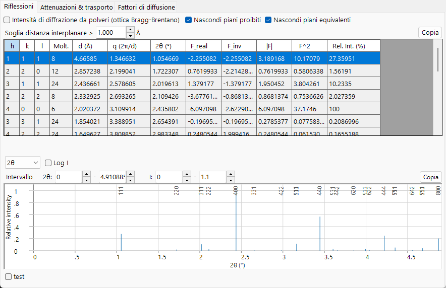

=== "Neutron"
    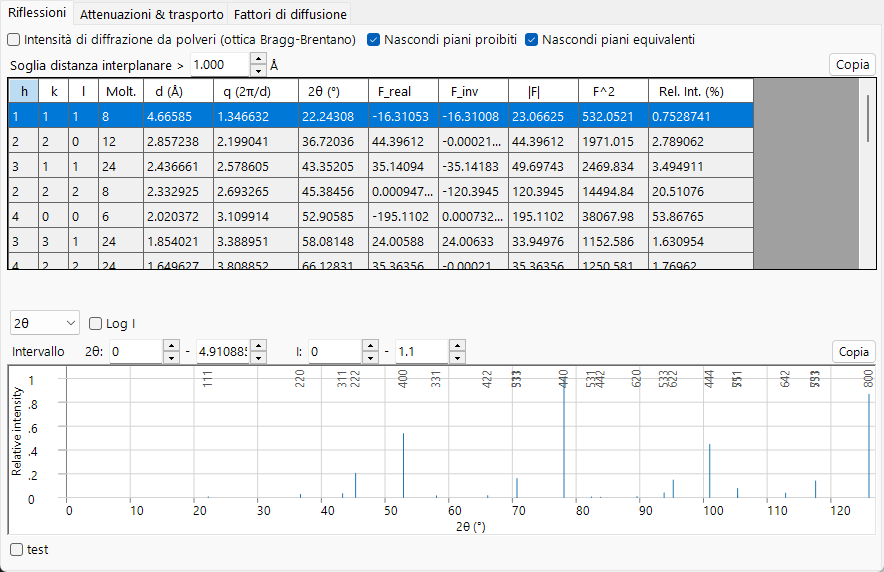

**Options**

- **Powder Diffraction Intensities (Bragg-Brentano Optics)** : calcola l'intensità relativa come intensità di diffrazione da polveri (Bragg–Brentano), includendo la molteplicità e il fattore di Lorentz–polarizzazione. Quando è disattivata, mostra l'intensità del fattore di struttura. Attivandola si forzano inoltre *Hide equivalent planes* e *Hide prohibited planes*.
- **Hide equivalent planes** : raggruppa i piani cristallograficamente equivalenti in un'unica voce.
- **Hide prohibited planes** : esclude i piani la cui intensità è zero per le regole di estinzione.
- **d-Spacing Cutoff >** : esclude le riflessioni con una distanza interplanare minore di questo valore (l'unità di lunghezza segue la selezione di **Unit**).

Ogni riga è una riflessione (o un gruppo di piani simmetricamente equivalenti):

| Colonna | Significato |
|------|------|
| **h, k, l** | indici di Miller |
| **Multi.** | molteplicità (numero di piani simmetricamente equivalenti) |
| **d (Å)** | distanza interplanare |
| **q (2π/d)** | modulo del vettore di diffusione |
| **2θ (°)** | angolo di diffrazione per la lunghezza d'onda selezionata |
| **F_real** | parte reale del fattore di struttura |
| **F_inv** | parte immaginaria del fattore di struttura (diversa da zero con dispersione anomala dei raggi X) |
| **\|F\|** | ampiezza del fattore di struttura ($= \sqrt{F_\text{real}^2 + F_\text{inv}^2}$) |
| **F^2** | intensità del fattore di struttura ($\lvert F\rvert^2$) |
| **Rel. Int. (%)** | intensità relativa, con la riflessione più forte posta a 100 |

**Grafico dei picchi di diffrazione.** Sotto la tabella le stesse riflessioni sono disegnate come pattern a barre, con i picchi più forti etichettati dai loro *hkl*.

- Il selettore dell'asse orizzontale sceglie tra **2θ** (angolo di diffusione in gradi), **d** (distanza tra i piani reticolari) e **Q** ($= 4\pi\sin\theta/\lambda$, il vettore di diffusione / trasferimento di quantità di moto). Le tre opzioni descrivono le stesse riflessioni; cambia solo la scala orizzontale.
- **Log I** commuta l'asse delle intensità tra lineare e logaritmico. Le intensità di diffrazione si estendono su molti ordini di grandezza, quindi una scala logaritmica dilata la parte inferiore per rivelare i picchi deboli che una scala lineare appiattisce contro la linea di base.
- I campi **Range** impostano l'intervallo orizzontale e di intensità rappresentato.

---

## Scheda Attenuations & Transport

Quanto a fondo il fascio penetra nel materiale e come perde energia. Il contenuto dipende dal fascio.

=== "X-ray"
    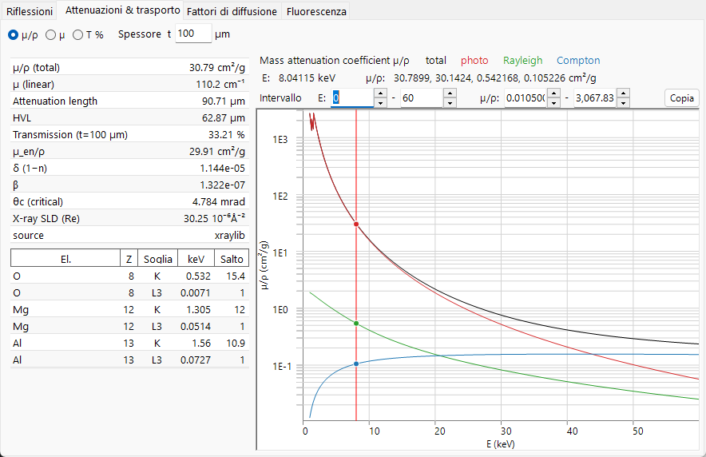

=== "Electron"
    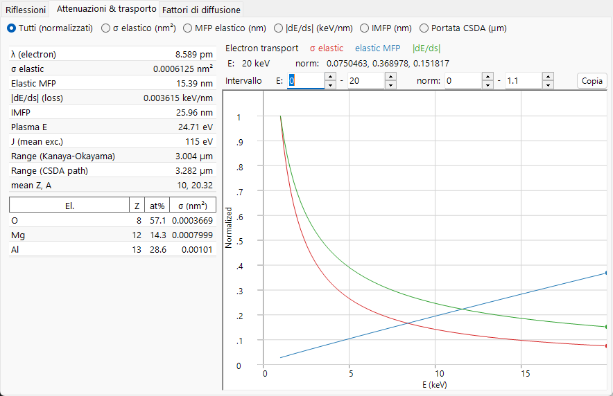

=== "Neutron"
    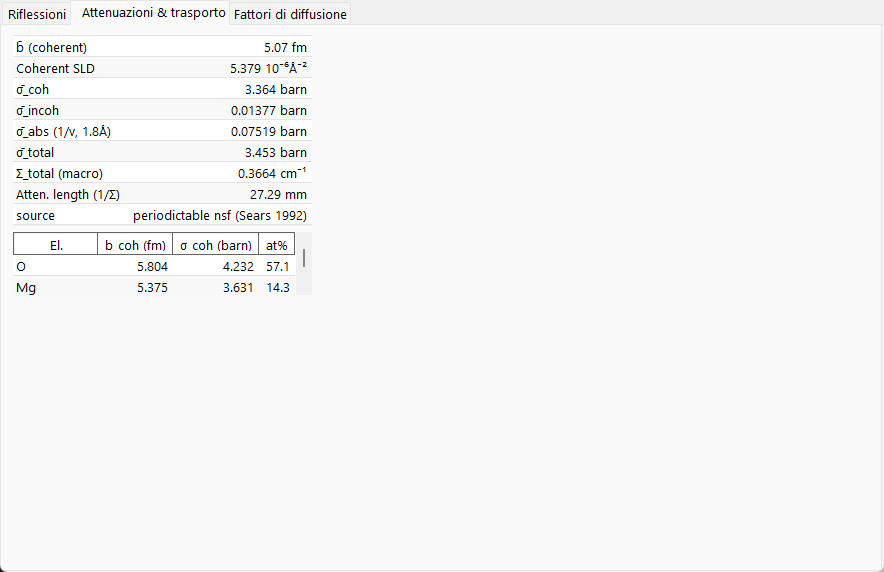

### X-ray

I pulsanti di opzione scelgono il coefficiente rappresentato in funzione dell'energia dei fotoni (1–60 keV, asse logaritmico):

- **µ/ρ** — il coefficiente di attenuazione **massico** (cm²/g): quanto fortemente il materiale rimuove i raggi X per grammo, indipendentemente da quanto è densamente impacchettato (è il valore che si trova nelle tabelle di riferimento). Il grafico mostra il valore **total** insieme alle sue componenti **photo**, **Rayleigh** e **Compton**.
- **µ** — il coefficiente di attenuazione **lineare** $\mu = (\mu/\rho)\cdot\rho$ (cm⁻¹): l'attenuazione per centimetro del materiale reale alla sua densità effettiva. L'intensità trasmessa segue $I = I_0\,e^{-\mu t}$, e $1/\mu$ è la distanza su cui l'intensità scende a circa il 37 % (1/e).
- **T %** — la **trasmissione** $T = e^{-\mu t}$ in percentuale per lo spessore del campione **t** impostato nel campo **Thickness t** (µm). 100 % = trasparente, 0 % = completamente bloccato; usalo per valutare uno spessore di campione sensato all'energia corrente.

Le linee verticali indicano l'energia corrente e i **bordi di assorbimento** di ciascun elemento. La tabella scalare a sinistra elenca, all'energia corrente: **µ/ρ (total)**, **µ (linear)**, **Attenuation length** ($1/\mu$), **HVL** (strato di dimezzamento, $\ln 2/\mu$), **Transmission** allo spessore *t*, **µ_en/ρ** (coefficiente di assorbimento di energia massico), i decrementi dell'indice di rifrazione per raggi X **δ** e **β** ($n = 1-\delta+i\beta$), l'angolo **θc (critical)** per la riflessione esterna totale e la **X-ray SLD** reale (densità di lunghezza di diffusione). La tabella inferiore elenca le energie dei **bordi** di assorbimento **K** e **L3** e i loro rapporti di **Jump** per ciascun elemento.

### Electron

Il selettore di grandezza sceglie cosa viene rappresentato in funzione dell'energia del fascio (1–30 keV):

- **All (normalized)** — sovrappone le tre curve sottostanti, ciascuna riscalata al proprio massimo così che le forme possano essere confrontate in un unico grafico (leggi i valori assoluti dalla tabella).
- **σ elastic (nm²)** — sezione d'urto di diffusione elastica: quanto è probabile che un singolo atomo devii l'elettrone.
- **Elastic MFP (nm)** — libero cammino medio: la distanza media percorsa dall'elettrone tra eventi di diffusione elastica.
- **|dE/ds| (keV/nm)** — modulo del potere frenante: l'energia che l'elettrone perde per nanometro di percorso.
- **IMFP (nm)** — libero cammino medio anelastico: la distanza media tra le collisioni con perdita di energia.
- **Range CSDA (µm)** — la lunghezza totale del percorso che l'elettrone compie prima di fermarsi.

La tabella scalare elenca la **wavelength** dell'elettrone, **σ elastic**, **Elastic MFP**, **|dE/ds|**, **IMFP**, la **Plasma E** e l'energia media di eccitazione **J**, due **range** dell'elettrone (la stima di penetrazione di Kanaya–Okayama e la lunghezza di percorso integrata CSDA) e il valore medio di **Z, A**. La tabella per elemento fornisce per ciascun elemento la frazione atomica e la sezione d'urto elastica σ. Le sezioni d'urto elastiche usano i dati **NIST Mott** (50 eV–36 keV) e ricorrono a **screened Rutherford** sopra i 36 keV.

### Neutron {#scattering-factors-tab}

L'interazione neutronica è determinata dalle sezioni d'urto nucleari piuttosto che da una curva dipendente dall'energia, quindi questa scheda mostra solo tabelle. La tabella scalare elenca la lunghezza di diffusione coerente media **b̄**, la **Coherent SLD**, le sezioni d'urto medie coerente / incoerente / di assorbimento / totale (**σ̄_coh**, **σ̄_incoh**, **σ̄_abs**, **σ̄_total**), la sezione d'urto totale macroscopica **Σ_total** e la corrispondente **attenuation length**. La sezione d'urto di assorbimento è valutata con la legge 1/v alla lunghezza d'onda corrente; i nuclidi per cui ciò non è valido (Cd, Sm, Eu, Gd, assorbitori risonanti) sono contrassegnati. La tabella per elemento elenca **b_coh**, **σ_coh** e la frazione atomica.

---

## Scheda Scattering factors {#fluorescence-tab}

Il fattore di diffusione atomico di ciascun elemento costituente, rappresentato in funzione di $s = \sin\theta/\lambda$ (Å⁻¹). Ogni elemento è disegnato con il proprio colore, e la **linea verticale del cursore** può essere trascinata per leggere il fattore di diffusione di ogni elemento in quella posizione nella tabella a sinistra.

=== "X-ray"
    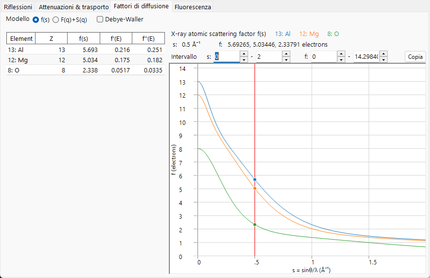

=== "Electron"
    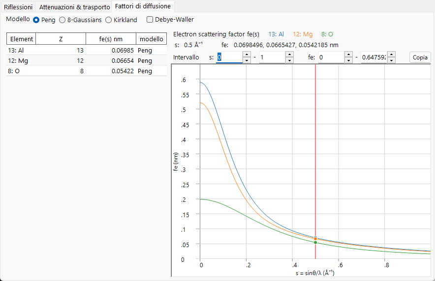

=== "Neutron"
    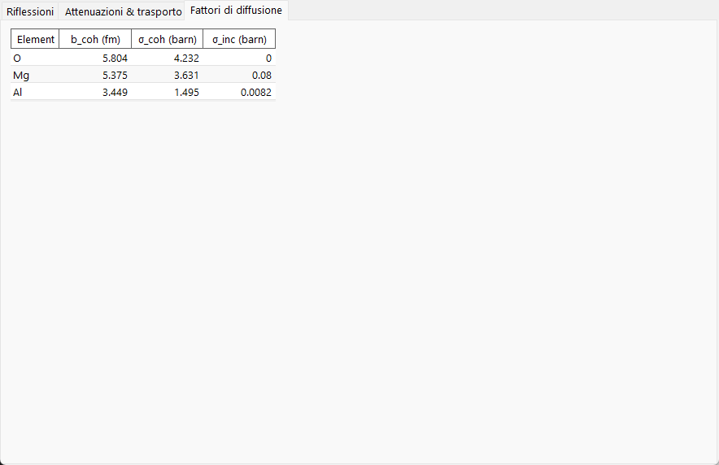

- **X-ray** offre due modalità di **Model**: **f(s)** rappresenta il fattore di diffusione atomico convenzionale per raggi X (in unità elettroniche); **F(q)+S(q)** rappresenta il fattore di forma **coerente** di Rayleigh $F(q)$ insieme alla funzione di diffusione **incoerente** di Compton $S(q)$ (da xraylib). La tabella elenca inoltre i termini di dispersione anomala **f'(E)** e **f''(E)** all'energia corrente.
- **Electron** offre tre parametrizzazioni del fattore di diffusione elettronico: **Peng**, **Kirkland** e **8-Gaussians**. La tabella mostra $f_e(s)$ (nm) e quale **model** lo ha prodotto.
- Le lunghezze di diffusione **Neutron** non dipendono da $s$, quindi non viene disegnata alcuna curva; la tabella elenca per ciascun elemento la lunghezza di diffusione coerente **b_coh** e le sue sezioni d'urto coerente / incoerente.
- **Debye-Waller** moltiplica ciascun fattore per lo smorzamento termico $e^{-B s^2}$ usando il parametro di spostamento isotropo di ciascun atomo.

---

## Scheda Fluorescence

Per un fascio di raggi X, l'emissione di **fluorescenza** caratteristica del campione. (Questa scheda è nascosta per i fasci di elettroni e di neutroni.)

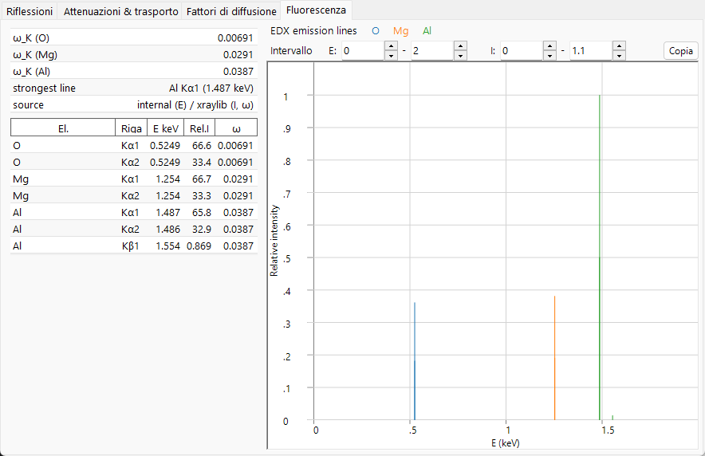

Il grafico **EDX emission lines** disegna le righe caratteristiche (Kα1, Kα2, Kβ1, Lα1, Lα2, Lβ1) di ogni elemento come barre alle loro energie fotoniche, con l'altezza proporzionale a frazione atomica × tasso radiativo × resa di fluorescenza (un'anteprima qualitativa in stile EDX; la sezione d'urto di eccitazione e l'efficienza del rivelatore non sono modellate). La tabella inferiore elenca, per riga, l'elemento, il nome della riga, l'energia **E keV**, l'intensità relativa **Rel.I** e la resa di fluorescenza **ω**. La tabella scalare riporta la resa di guscio K **ω_K** di ciascun elemento e la **strongest line** nello spettro.

---

## Copia negli appunti

Ogni scheda ha un pulsante **Copy** che copia la sua tabella negli appunti come testo che può essere incollato in un foglio di calcolo come Excel.

---

## Vedi anche

- [Database dei cristalli](1-crystal-database.md) — definizione del cristallo di cui si calcola l'interazione.
- [Simulatore di diffrazione](7-diffraction-simulator/index.md) — simulazione di pattern di diffrazione usando i fattori di struttura.
- [Appendice A2. Interazione del fascio (background di fisica dello stato solido)](appendix/a2-beam-interaction/index.md) — la diffusione e la fisica dello stato solido alla base di ogni scheda.
