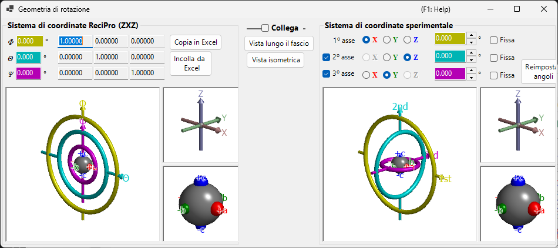

# Geometria di rotazione

Questa finestra rappresenta lo stato di rotazione di un cristallo come matrice 3×3 e converte tra diversi sistemi di coordinate euleriani.

ReciPro utilizza tre angoli di Eulero — **Ψ**, **θ** e **Φ** — applicati nell'ordine **Z–X–Z**. Tuttavia, questa convenzione non corrisponde necessariamente agli assi del goniometro del vostro strumento reale. La finestra **Geometria di rotazione** consente di convertire gli angoli di Eulero di ReciPro in un sistema di coordinate definito arbitrariamente, supportando la regolazione del goniometro in laboratorio.

---

## Scorciatoie da tastiera e mouse

Tutte e sei le viste 3D (i pannelli di ReciPro e del goniometro sperimentale / degli assi / degli oggetti) sono **collegate** — ruotandone una qualsiasi, ruotano tutte e sei insieme. Condividono la [navigazione standard della vista OpenGL](21-shortcuts.md) di ReciPro.

| Scorciatoia | Azione |
|----------|--------|
| <kbd>F1</kbd> | Apre questa pagina del manuale online |
| Trascinamento sinistro in una vista | Ruota il modello (tutte e sei le viste ruotano insieme) |
| Rotellina del mouse, o trascinamento destro su/giù | Zoom (le viste grandi del goniometro) |
| Trascinamento centrale | Spostamento (le viste grandi del goniometro) |
| <kbd>CTRL</kbd> + trascinamento destro su/giù | Modifica la distanza della telecamera (solo in modalità prospettica) |
| <kbd>CTRL</kbd> + doppio clic destro | Alterna tra proiezione ortografica e prospettica |

Nelle piccole viste *Axes* e *Objects* lo zoom e lo spostamento sono disabilitati. Non ci sono scorciatoie da tastiera oltre a <kbd>F1</kbd>.

---

## Sistema di coordinate ReciPro (ZXZ)

La metà superiore della finestra mostra lo stato di rotazione nel "sistema di coordinate ReciPro".

- I valori **Φ, θ, Ψ** sono sincronizzati con gli angoli di Eulero impostati nella Finestra principale.
- **Rotation matrix** mostra la matrice 3×3 corrispondente allo stato di rotazione corrente.

### Φ, θ, Ψ (angoli di Eulero Z–X–Z)

L'orientazione del cristallo è parametrizzata da tre rotazioni applicate in questo ordine:

1. **Φ** — prima rotazione attorno all'asse **Z**.
2. **θ** — rotazione attorno all'asse **X** del sistema di riferimento ruotato una volta.
3. **Ψ** — seconda rotazione attorno all'asse **Z** del sistema di riferimento ruotato due volte.

Ogni casella numerica è modificabile; modificare un valore qui aggiorna la Finestra principale e ogni simulatore collegato.

### Rotation matrix

La matrice 3 × 3 generata a partire dagli attuali (Φ, θ, Ψ). Utilizzate **Copy to Excel** / **Paste from Excel** per trasferire la matrice avanti e indietro attraverso un foglio di calcolo.

### Finestre OpenGL

La vista 3D mostra la rotazione corrente mediante tre tori colorati (ciambelle):

| Colore | Angolo di Eulero | Livello del goniometro |
|--------|------------|-----------------|
| **Giallo** | Φ | 1° asse (superiore) |
| **Azzurro** | θ | 2° asse (centrale) |
| **Rosa** | Ψ | 3° asse (inferiore) |

Le frecce **rossa**, **verde** e **blu** rappresentano gli assi X, Y, Z in coordinate cartesiane dello spazio reale. Questi *non* coincidono con gli assi cristallini mostrati nella Finestra principale.

La sfera grigia al centro rappresenta il campione; le sfere rosse/verdi/blu mostrano come l'oggetto è ruotato rispetto alla sua orientazione iniziale (quando Φ = θ = Ψ = 0, sono allineate rispettivamente a +X, +Y, +Z).

> **Nota**: Trascinare nella finestra OpenGL cambia solo la *direzione di proiezione* di questa vista, non l'orientazione del cristallo in sé. Per ruotare il cristallo, utilizzate la Finestra principale.

### Pulsanti

| Pulsante | Azione |
|--------|--------|
| Copy to Excel | Copia la matrice di rotazione 3×3 in formato separato da tabulazioni |
| Paste from Excel | Imposta la matrice di rotazione dagli appunti (3×3 separata da tabulazioni) |
| View along beam | Adatta alla proiezione della Finestra principale (asse Z perpendicolare allo schermo) |
| Isometric | Passa alla proiezione isometrica |

---

## Sistema di coordinate sperimentale

La metà inferiore definisce gli angoli di Eulero su un insieme arbitrario di assi di rotazione e legge/imposta lo stato del goniometro. Questo viene chiamato **Sistema di coordinate sperimentale**.

### 1°, 2°, 3° asse

Selezionate gli assi di rotazione del goniometro tra **±X**, **±Y** e **±Z** per ciascun livello (superiore, centrale, inferiore). La grafica si aggiorna di conseguenza.

Gli angoli di Eulero per ciascun asse sono visualizzati nelle corrispondenti caselle di testo colorate (giallo, azzurro, rosa). Potete anche inserire i valori direttamente.

---

## Link

Quando **Link** è attivato, il sistema di coordinate ReciPro e il sistema di coordinate sperimentale sono accoppiati: i loro angoli di Eulero vengono regolati in modo che l'orientazione dell'oggetto sia coerente tra i due sistemi.

### Esempio di flusso di lavoro

1. In laboratorio, impostate un goniometro in modo che l'asse *a* di un cristallo sia allineato con la direzione di incidenza dei raggi X e l'asse *b* sia orizzontale.
2. Inserite gli angoli di Eulero del goniometro di laboratorio nel sistema di coordinate sperimentale.
3. Nella Finestra principale, ruotate il cristallo in modo che l'asse *a* sia rivolto verso la normale dello schermo e l'asse *b* sia orizzontale.
4. Attivate **Link** — ora, ogni volta che orientate il cristallo verso una diversa orientazione nella Finestra principale, gli angoli del goniometro richiesti vengono visualizzati automaticamente.

---

## Vedi anche

- [Finestra principale](0-main-window.md)
- [Stereogramma](6-stereonet.md)
- [Sistema di coordinate di base e orientazione del cristallo](appendix/a1-coordinate-system/1-orientation.md)
- [Scorciatoie da tastiera e mouse](21-shortcuts.md)
