# Visualizzatore struttura

Il **Visualizzatore struttura** disegna la struttura del cristallo selezionato come immagine tridimensionale utilizzando OpenGL.

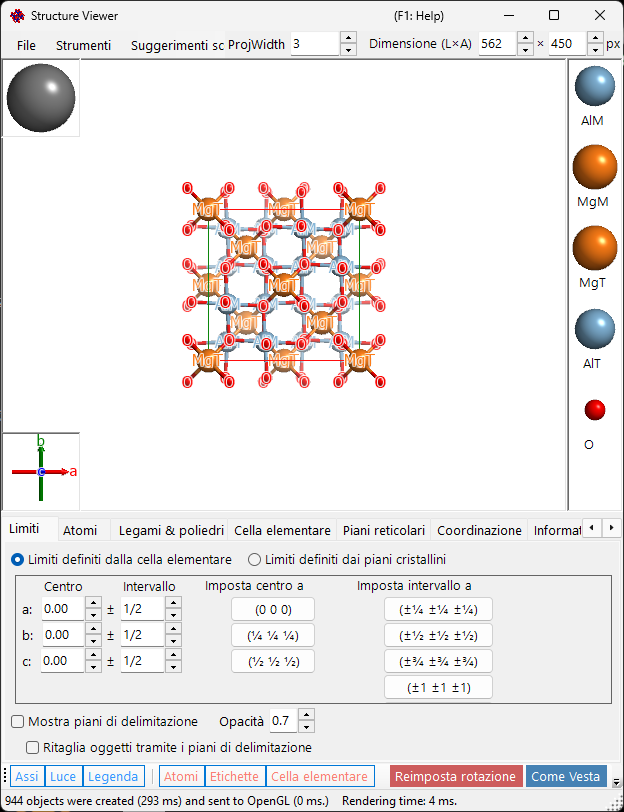

---

## Scorciatoie da tastiera e mouse

La finestra dispone di una vista 3D principale più due piccoli gizmo — il riquadro degli **assi cristallografici** (in basso a sinistra) e il riquadro della **direzione della luce** (in alto a sinistra) — e ciascuno risponde in modo diverso al trascinamento con il tasto sinistro. La vista principale utilizza la [navigazione della vista OpenGL](21-shortcuts.md) standard di ReciPro.

| Scorciatoia | Azione |
|----------|--------|
| <kbd>F1</kbd> | Apre questa pagina del manuale online |
| <kbd>CTRL</kbd>+<kbd>SHIFT</kbd>+<kbd>C</kbd> | Copia l'immagine renderizzata negli appunti |
| Trascinamento con il tasto sinistro nella vista principale | Ruota il modello |
| Doppio clic sinistro su un atomo | Mostra le sue coordinate, le distanze dai vicini più prossimi e gli angoli di legame |
| Trascinamento con il tasto destro su/giù, o rotellina del mouse | Zoom |
| Trascinamento con il tasto centrale | Spostamento |
| <kbd>CTRL</kbd> + trascinamento con il tasto destro su/giù | Cambia la distanza della camera (solo in modalità prospettica) |
| <kbd>CTRL</kbd> + doppio clic destro | Alterna la proiezione ortografica / prospettica |
| Trascinamento con il tasto sinistro sul gizmo degli **assi cristallografici** | Ruota il modello (senza rotazione nel piano) |
| Trascinamento con il tasto sinistro sul gizmo della **luce** | Cambia la direzione dell'illuminazione |

Anche le scorciatoie <kbd>CTRL</kbd>+<kbd>SHIFT</kbd> valide per tutta l'applicazione provenienti dalla [finestra principale](0-main-window.md#keyboard-mouse-shortcuts) funzionano mentre questa finestra ha il fuoco.

→ Vedi **[21. Scorciatoie da tastiera e mouse](21-shortcuts.md)** per una panoramica di tutte le finestre.

---

## Area principale

Struttura cristallina 3D con sorgente luminosa, assi cristallografici e legenda degli atomi.
> Il riquadro **Size (W×H)** in alto a destra nella finestra imposta la dimensione in pixel utilizzata quando si salva o si copia l'immagine renderizzata.
> Il riquadro **ProjWidth** accanto ad esso mostra la larghezza della vista proiettata in nm. Modifica il valore per zoomare numericamente — resta sincronizzato con lo zoom tramite trascinamento con il tasto destro / rotellina sulla vista.

---

## Barra dei menu

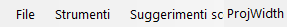

### Menu File

Salva immagine, copia negli appunti (Ctrl+Shift+C), salva filmato (MP4).

**Salva filmato** apre la finestra di dialogo delle impostazioni del filmato mostrata sotto. Un filmato può ruotare la vista, traslare il centro di proiezione o fare entrambe le cose contemporaneamente — seleziona **Rotation** e/o **Translation**:

- **Rotation**: ruota la vista alla velocità **Speed** (°/s; i valori negativi invertono il senso di rotazione) attorno all'asse scelto sotto — **Proiezione corrente** (direzione di inclinazione scelta con i pulsanti freccia), un **Indice di direzione** [uvw] o la normale di un **Piano reticolare** (hkl).
- **Translation**: sposta il centro di proiezione lungo l'indice di direzione [uvw] alla velocità **Speed** (periodi reticolari al secondo). Questa opzione compare solo quando la finestra di dialogo viene aperta dal Visualizzatore struttura e, finché è attiva, **Indice di direzione** è l'unica modalità di direzione disponibile.

Imposta la lunghezza del filmato (**Duration**), la frequenza dei fotogrammi (**FPS**, 1–120) e la qualità di codifica (**Quality**, 1–100; valori più alti usano un bitrate maggiore e producono un file più grande), scegli il codec (**H264** / **H265**) e premi **OK** per generare un file MP4. **Include final frame** aggiunge un fotogramma extra a t = Duration, così il filmato termina esattamente nell'orientamento/posizione finale. (L'elenco della velocità di codifica serve ormai solo come etichetta nella visualizzazione dell'avanzamento e non influisce più sulla codifica effettiva.)

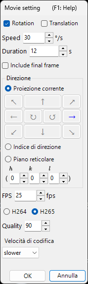

### Menu Strumenti

---

## Menu a schede

### Limiti definiti dalla cella

Specifica l'intervallo di disegno del cristallo. Sono disponibili due modalità, commutate con i pulsanti di opzione in alto.

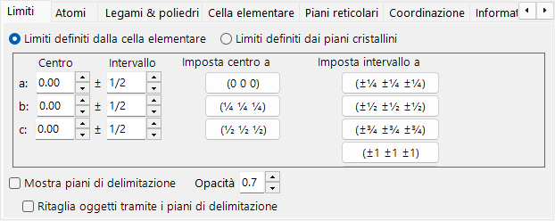

In questa modalità gli assi *a*, *b*, *c* della cella elementare sono l'unità dell'intervallo di disegno.

- **Center**: coordinata frazionaria centrale del volume di disegno.
- **Range**: limite superiore/inferiore per ciascuno degli assi *a*, *b*, *c*.
- **Pulsanti preimpostati** a destra forniscono valori usati di frequente (ad esempio, cella 1×1×1, cella 2×2×2).

### Limiti definiti dai piani cristallini

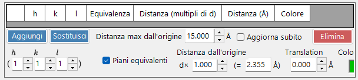

In questa modalità l'area di disegno è delimitata da un insieme di piani cristallini. Se i piani non definiscono una regione spazialmente chiusa, ReciPro ricorre automaticamente a un limite di una cella elementare.

#### Elenco dei limiti

Tutti i piani di delimitazione registrati per il cristallo corrente. Usa **Add / Replace / Delete** per gestire l'elenco; la casella di controllo più a sinistra disabilita temporaneamente un piano senza eliminarlo.

> Per salvare le modifiche in modo permanente, devi anche premere **Add** o **Replace** nella **Finestra principale**. Altrimenti le modifiche andranno perse la prossima volta che cambierai la selezione nell'elenco principale dei cristalli.

#### Indici H k l

Imposta il piano di delimitazione tramite il suo indice di Miller. La casella di controllo include i piani cristallograficamente equivalenti generati a partire da (*hkl*) selezionato.

#### Distanza dall'origine

La distanza dal centro del cristallo al piano di delimitazione. L'unità è selezionabile tra **d** e **Å**. Con **d**, la distanza è il valore immesso moltiplicato per la distanza interplanare *d* di (*hkl*) selezionato. Con **Å**, il valore è la distanza assoluta. La modifica di uno aggiorna automaticamente l'altro.

#### Mostra piani di delimitazione / Opacità

Mostra o nasconde i piani di delimitazione stessi. Quando sono mostrati, **Opacity** imposta la trasparenza (0 = trasparente, 1 = opaco).

#### Taglia gli oggetti con i piani di delimitazione

Se selezionato, viene renderizzata solo la regione interna definita dai limiti; gli atomi, i legami e i poliedri che intersecano i limiti vengono tagliati.

#### Nascondi atomi

Se selezionato, tutti gli atomi, i legami e i poliedri vengono nascosti — utile quando occorre visualizzare solo la cella o i piani reticolari.

### Atomi

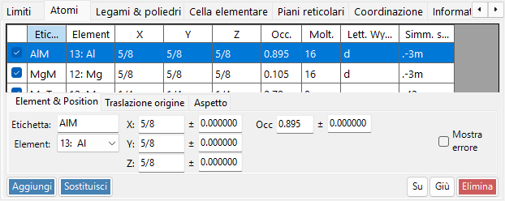

Coordinate, elemento, occupazione, raggio, colore, materiale. **Apply to same elements**.

#### Elenco degli atomi

L'elenco degli atomi nel cristallo. Usa **Add / Replace / Delete** per gestire l'elenco; la casella di controllo più a sinistra nasconde temporaneamente un atomo.

> Per salvare le modifiche in modo permanente, fai clic su **Add** o **Replace** anche nella **Finestra principale**.

#### Elemento e posizione

- **Label**: etichetta a testo libero per l'atomo (usata nelle legende e nei tooltip).
- **Element**: elemento chimico / stato di ionizzazione.
- **X, Y, Z**: coordinate frazionarie. Numeri reali in 0–1, oppure frazioni come `1/2` o `2/3`.
- **Occ**: occupazione, un numero reale 0–1.

#### Spostamento dell'origine

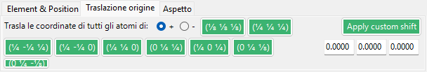

Sposta ogni atomo dello stesso scostamento frazionario. Premi un pulsante preimpostato (ad esempio, per scambiare la scelta dell'origine 1 / 2 per lo stesso gruppo spaziale), oppure inserisci un (Δx, Δy, Δz) personalizzato e premi **Apply custom shift**.

#### Aspetto

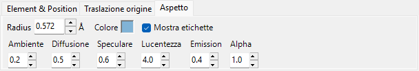

Raggio, colore e materiale per ciascun atomo.

- **Radius**: raggio atomico disegnato.
- **Atom color**: colore della superficie.
- **Material**: proprietà di texture / materiale usate dallo shader OpenGL.
- **Apply to same elements**: applica il raggio e il colore correnti a ogni atomo della stessa specie elementare.

### Legami e poliedri

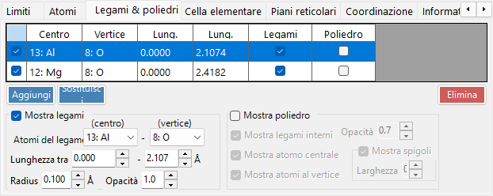

Soglie della lunghezza dei legami, visualizzazione dei poliedri, spigoli.

#### Elenco dei legami

Tutte le regole di legame/poliedro registrate per il cristallo. Usa **Add / Replace / Delete**; la casella di controllo più a sinistra disabilita temporaneamente una voce. Come per gli atomi e i limiti, è necessario **Add** / **Replace** nella **Finestra principale** per rendere permanente la modifica.

#### Proprietà del legame

- **Bonding Atom (center)**: specie elementare usata come atomo centrale del legame / poliedro.
- **Bonding Atom (vertex)**: specie elementare usata come vertice (l'altra estremità).
- **Length between … and …**: soglie di distanza inferiore e superiore. Le coppie di atomi al di fuori di questo intervallo non vengono disegnate.
- **Bond Radius**: spessore disegnato del legame (raggio del cilindro).
- **Alpha**: trasparenza del legame (0 = trasparente, 1 = opaco).

#### Proprietà del poliedro

- **Show Polyhedron**: se selezionato, viene disegnato il poliedro definito dal legame corrente (solo se l'insieme centro/vertice è geometricamente valido).
- **Inner Bonds**: mostra/nasconde i legami all'interno del poliedro.
- **Center Atom**: mostra/nasconde l'atomo centrale.
- **Vertex Atoms**: mostra/nasconde gli atomi ai vertici.
- **Color** / **Alpha**: colore della faccia e trasparenza.
- **Show Edge**: disegna gli spigoli che collegano i vertici.
- **Edge Color** / **Width**: colore e spessore della linea degli spigoli.

### Cella elementare

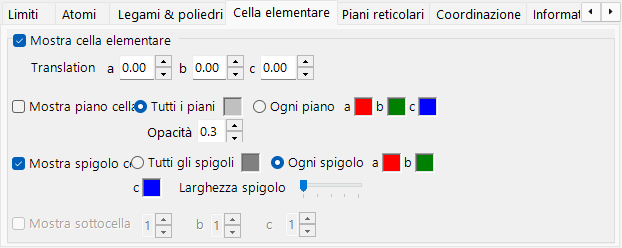

Traslazione, piani della cella, spigoli.

#### Traslazione

Ogni gruppo spaziale ha un'origine predefinita. Per allontanare il centro della cella elementare disegnata da tale origine, imposta la traslazione lungo *a*, *b*, *c*.

#### Mostra piano della cella

Se disegnare le sei facce che delimitano la cella elementare. Quando è abilitato, puoi impostare il colore della faccia e la trasparenza.

#### Mostra spigoli

Se disegnare gli spigoli della cella elementare. Il colore degli spigoli è configurabile.

### Piani reticolari

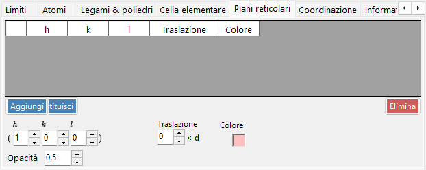

Specifica dell'indice di Miller con equivalenti cristallografici.

#### Indici H k l

Specifica il piano reticolare tramite il suo indice di Miller. La casella di controllo include facoltativamente i piani cristallograficamente equivalenti generati a partire da (*hkl*).

#### Traslazione

Trasla il piano reticolare disegnato di un multiplo intero della sua distanza interplanare *d* — utile per visualizzare piani successivi della stessa famiglia.

### Coordinazione

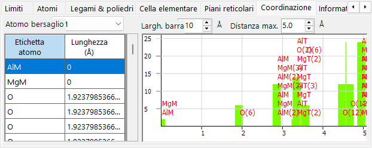

Tabella e grafico di coordinazione attorno all'atomo bersaglio.

#### Tabella (lato sinistro)

Elenca quali atomi circondano l'atomo bersaglio selezionato e a quale distanza. L'atomo bersaglio viene selezionato dal menu a discesa sopra la tabella.

#### Grafico (lato destro)

Istogramma del numero di vicini in funzione della distanza, derivato dagli stessi dati della tabella. Regola **Bar width** finché le barre non separano chiaramente i gusci di coordinazione — questo fornisce una stima visiva del numero di coordinazione.

### Informazioni

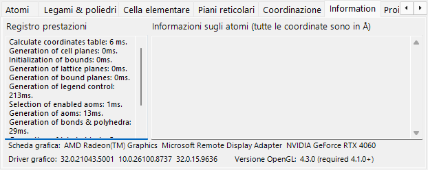

Registro di rendering (tempo per fotogramma, informazioni sulla GPU) e informazioni di base sull'atomo selezionato. In costruzione — i campi potrebbero aumentare nel tempo.

### Proiezione

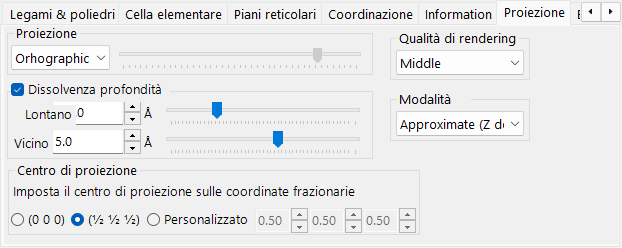

Modalità di proiezione (ortografica/prospettica), dissolvenza in profondità, qualità di rendering, modalità di trasparenza.

#### Proiezione

- **Orthographic**: proiezione parallela perfetta (punto di vista all'infinito).
- **Perspective**: proiezione prospettica dalla distanza del punto di vista impostata con il cursore.

#### Dissolvenza in profondità

Dissolve gli oggetti distanti nella direzione della profondità. Gli oggetti più lontani di **Far** sono completamente trasparenti; gli oggetti più vicini di **Near** sono completamente opachi; gli oggetti intermedi vengono interpolati linearmente.

#### Centro di proiezione

Imposta il centro della proiezione sulle coordinate specificate. Attiva **Personalizzato** per inserire coordinate arbitrarie. Ogni coordinata viene ricondotta all'intervallo da −0.5 a +0.5 (un periodo reticolare). Un filmato **Translation** (vedi il [Menu File](#menu-file)) controlla automaticamente questi valori.

#### Qualità di rendering

Qualità del disegno (suddivisione della mesh, anti-aliasing). Una qualità più alta è più lenta — scegli l'impostazione adatta alla tua GPU.

#### Modalità di trasparenza

Algoritmo usato per gli atomi e i poliedri traslucidi.

- **Approximate**: veloce ma può essere impreciso quando molti oggetti traslucidi si sovrappongono.
- **Perfect**: trasparenza indipendente dall'ordine — accurata ma molto lenta, richiede di fatto una GPU dedicata.

### Elementi di simmetria

La scheda **Symmetry Elements** disegna gli operatori di simmetria del gruppo spaziale direttamente sul modello 3D (attivabile con il pulsante **Symmetry Elements** della barra degli strumenti). Ogni classe di elementi può essere mostrata/nascosta in modo indipendente:

- **Assi di rotazione** e **assi elicogiri**
- **Piani speculari** e **piani di scorrimento**
- **Centri di inversione** e **assi di rotoinversione**

Per ciascuna classe puoi regolare la dimensione del simbolo, lo spessore della linea e il colore.

### Varie

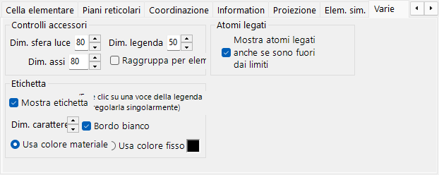

- **Accessory controls**: imposta le dimensioni di visualizzazione (sfera della luce, assi, legenda). **Group by element** commuta la visualizzazione della legenda.
- **Bonded atoms**: **Show bonded atoms even if they are outside the boundaries** continua a disegnare gli atomi legati ad atomi interni all'intervallo di disegno, anche quando ricadono al di fuori di esso.
- **Label**: imposta la dimensione del carattere, il colore e le altre proprietà delle etichette degli atomi.

---

## Barra degli strumenti

| Pulsante | Descrizione |
|--------|-------------|
| Axes | Mostra l'orientamento degli assi (dimensione = costante reticolare) |
| Light | Imposta la direzione della luce |
| Legend | Legenda degli atomi |
| Atoms | Commuta gli oggetti atomo |
| Labels | Commuta le etichette degli atomi |
| Unit Cell | Commuta gli spigoli della cella elementare |
| Sym. Elems. | Commuta la sovrapposizione degli elementi di simmetria (vedi sopra) |
| Reset Rotation | Torna all'orientamento iniziale |
| Like Vesta | Aspetto in stile Vesta |

---

## Vedi anche

- [Finestra principale](0-main-window.md)
- [Database dei cristalli](1-crystal-database.md)
- [Informazioni di simmetria](2-symmetry-information.md)
- [Simulatore di diffrazione](7-diffraction-simulator/index.md)
- [Scorciatoie da tastiera e mouse](21-shortcuts.md)
