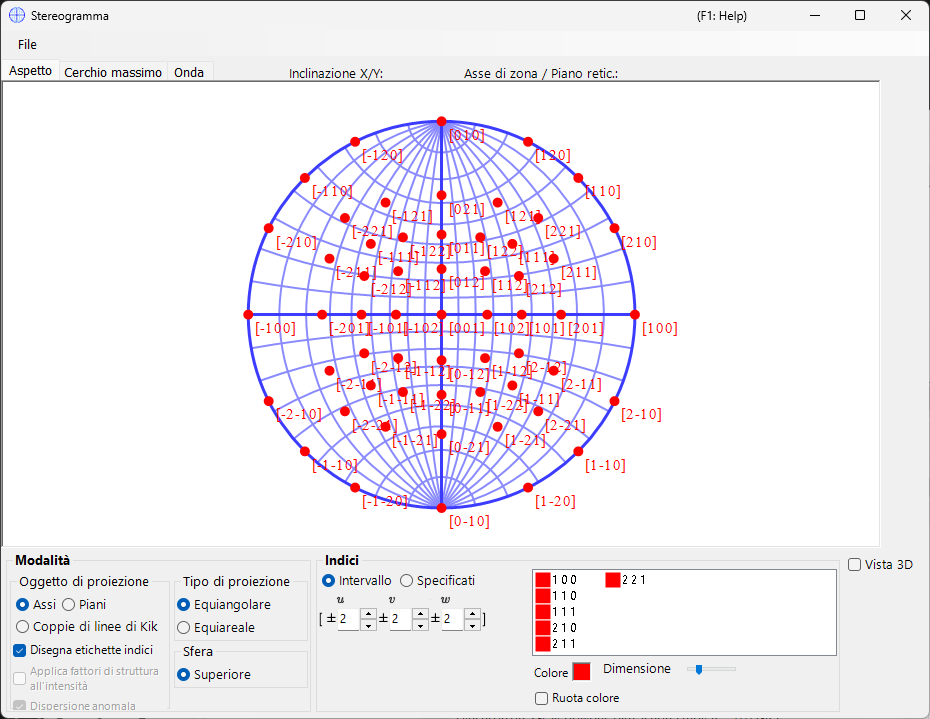
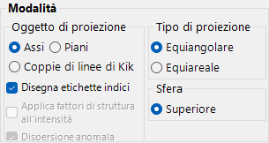
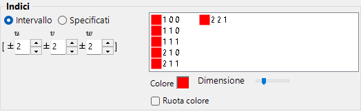
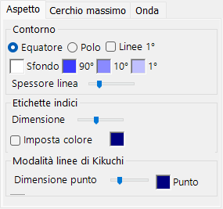
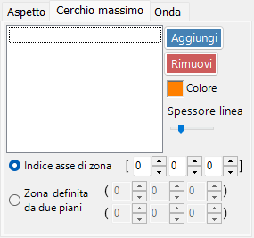
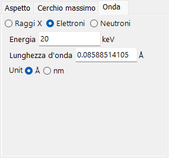

# Stereogramma

Lo **Stereogramma** visualizza le direzioni dei piani e degli assi cristallini mediante la proiezione stereografica.

---

## Scorciatoie da tastiera e mouse

Lo stereogramma in sé è una proiezione 2-D; una sfera 3-D opzionale può essere mostrata con **3D display**.

| Scorciatoia | Azione |
|----------|--------|
| <kbd>F1</kbd> | Apre questa pagina del manuale online |
| Trascinamento sinistro vicino al centro | Inclina il cristallo |
| Trascinamento sinistro nell'area esterna | Ruota il cristallo attorno all'asse di vista |
| Doppio clic sinistro | Commuta tra la proiezione **Plane** e **Axis** |
| Clic destro | Riduci lo zoom |
| Trascinamento destro di un riquadro | Ingrandisci la regione selezionata |
| Trascinamento centrale | Sposta la vista |
| Muovi il mouse (senza pulsante) | Leggi i valori (hkl)/[uvw] sotto il cursore — utile per indicizzare un riflesso misurato |

Il trascinamento sulla rete ruota il **cristallo**; lo stato di rotazione è condiviso tra tutte le finestre.

Il rendering 3-D utilizza la [navigazione della vista OpenGL](21-shortcuts.md) standard di ReciPro (trascinamento sinistro per ruotare, trascinamento destro / rotella per lo zoom, <kbd>CTRL</kbd> + doppio clic destro per commutare la proiezione) e ruota solo la vista 3-D, non il cristallo stesso.

Le scorciatoie <kbd>CTRL</kbd>+<kbd>SHIFT</kbd> valide per l'intera applicazione, descritte nella [finestra principale](0-main-window.md#keyboard-mouse-shortcuts), funzionano anch'esse mentre questa finestra è attiva.

→ Vedi **[21. Scorciatoie da tastiera e mouse](21-shortcuts.md)** per una panoramica di tutte le finestre.

---

## Area principale

Viene visualizzata la proiezione stereografica dei piani cristallini, degli indici di direzione e delle linee di Kikuchi del cristallo selezionato.

---

## Menu File

Salva o copia in formato raster o vettoriale. Il formato vettoriale consente di modificare il carattere/lo spessore delle linee in PowerPoint o in altri editor vettoriali.

---

## Mode

### Bersaglio di proiezione

Seleziona ciò che deve essere proiettato sulla rete.

- **Axes** — proietta gli indici di direzione \([uvw]\).
- **Planes** — proietta le normali dei piani cristallini \((hkl)\).
- **Kikuchi line pairs** — proietta le coppie di linee di Kikuchi.

### Metodo di proiezione

| Metodo | Descrizione |
|--------|-------------|
| **Wulff** (equiangolare / stereografico) | Preserva la relazione angolare tra gli elementi proiettati, ma non l'angolo solido. Utilizzato dai cristallografi classici per leggere gli angoli tra assi o tra piani. |
| **Schmidt** (equiareale / Lambert) | Preserva l'angolo solido (l'area) di ciascuna regione, ma distorce gli angoli. Preferito per le figure polari statistiche, in cui conta la densità relativa. |

### Emisfero

Scegli l'emisfero **Upper** o **Lower** come sorgente di proiezione — commuta se la faccia visibile della sfera sia quella più vicina o più lontana dall'osservatore.

### Opzioni di visualizzazione

- Mostra le etichette degli indici.
- Quando è selezionato **Planes** o **Kikuchi line pairs**, pesa ciascun punto o linea in base al fattore di struttura \(|F_{hkl}|\) (imposta la sorgente d'onda e la lunghezza d'onda nella [scheda Wave](#wave)).

> Per i cristalli trigonali/esagonali, la notazione di Miller–Bravais (4 indici) può essere abilitata da **Option ▸ Use Miller-Bravais (hkil) index** nella finestra principale.

---

## Indices

Imposta quali piani / assi cristallini vengono disegnati.

### Modalità intervallo

Specifica un intervallo di indici \([uvw]\) o \((hkl)\). ReciPro enumera ogni indice entro i limiti e proietta ciascuno di essi.

### Modalità specificata

Specifica singolarmente assi o piani particolari. Digita un indice, premi **Add** per registrarlo, oppure **Remove** per eliminarlo. Quando **include equivalent indices** è selezionato, vengono disegnati anche tutti gli indici cristallograficamente equivalenti.

### Colour / Size

Imposta il **colour** e la **size** dei punti tracciati. Spunta **Change colour automatically** per codificare con colori diversi ciascun insieme di assi/piani equivalenti — utile per distinguere le famiglie in un grafico a più indici.

---

## 3D Options

Controlla la sovrapposizione della rete 3D (sfera) — opacità della sfera, indicatori degli assi, ecc.

---

## Menu schede

### Appearance

#### Outline

Come viene disegnato il contorno dello stereogramma — il cerchio di delimitazione e l'eventuale griglia di latitudine/longitudine a cerchi massimi. Scegli **Equator** o **Pole**, attiva/disattiva **1° Lines** e il riempimento **Background**, imposta i colori della griglia **90° / 10° / 1°** e regola la **Line width** con il cursore.

#### Index labels

- **Size** — dimensione delle etichette degli indici.
- **Specify color** — usa un unico colore fisso per tutte le etichette degli indici anziché il colore specifico di ciascun punto; utile quando i punti sono codificati per colore ma si desiderano tutte le etichette in un unico colore per migliorare la leggibilità.
- **Delimiter** — carattere posto tra gli indici di ciascuna etichetta: **None** (es. 100), **Space** (1 0 0) o **Comma** (1,0,0).

#### Kikuchi line mode

- **Point size** — dimensione dei punti tracciati.
- **Point** / **Label** — colori dei punti e delle relative etichette.

### Great and Small Circle

Disegna cerchi massimi e cerchi minori. Specificali tramite l'**zone-axis index** \([uvw]\) (il cerchio massimo formato dalla zona di quell'asse) oppure tramite **two crystal-plane indices** che condividono l'asse di zona. Anche lo spessore delle linee dei cerchi è configurabile tramite cursore.

### Wave {#wave}

Disponibile solo quando come bersaglio di proiezione è selezionato **Planes** o **Kikuchi line pairs**. Imposta la sorgente d'onda (X-ray / electron / neutron) e la lunghezza d'onda o l'energia necessarie per calcolare i fattori di struttura del cristallo usati per l'opzione **structure-factor weighting** in [Mode](#mode).

---

## Vedi anche

- [Finestra principale](0-main-window.md)
- [Geometria di rotazione](4-rotation-geometry.md)
- [Visualizzatore struttura](5-structure-viewer.md)
- [Simulatore di diffrazione](7-diffraction-simulator/index.md)
- [Sistema di coordinate di base e orientazione del cristallo](appendix/a1-coordinate-system/1-orientation.md)
