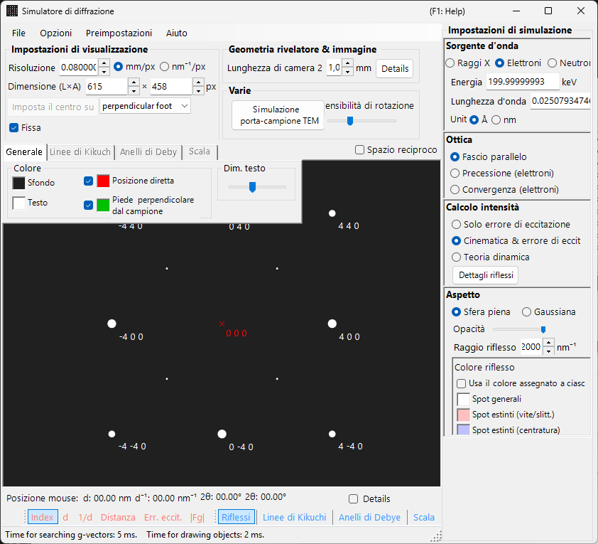
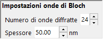

# Simulazione SAED (Selected Area Electron Diffraction)

La simulazione **SAED (Selected Area Electron Diffraction)** calcola i pattern di diffrazione elettronica di un monocristallo prodotti da un fascio elettronico parallelo. Questa è la modalità predefinita del [simulatore di diffrazione](index.md).

> Questa pagina elenca ogni impostazione che compare nel pannello **Spot property** a destra quando si scelgono **Wave Length = Electron** e **Incident beam mode = Parallel**. Per le operazioni a livello di finestra, come il disegno e il salvataggio, vedere la [pagina panoramica](index.md).

Condizioni GUI: Wave Length = Electron, Incident beam mode = Parallel, Intensity calculation = Only excitation error / Kinematical / Dynamical.

---

## Panoramica

Simula il pattern di diffrazione prodotto quando un fascio elettronico parallelo attraversa un campione sottile. Le posizioni degli spot sono fissate dalla relazione geometrica tra la sfera di Ewald e i punti del reticolo reciproco, e la luminosità di ciascuno spot è calcolata secondo la modalità di calcolo dell'intensità selezionata.

---

## Wave Length

Impostare la sorgente di radiazione su **Electron**. Inserire l'energia (keV) o la lunghezza d'onda (nm) e viene calcolata la lunghezza d'onda corretta relativisticamente. Per le sorgenti a raggi X e a neutroni, vedere [Simulazione di diffrazione a raggi X](4-x-ray-neutron-diffraction.md).

---

## Incident beam mode

Impostare la geometria del fascio incidente su **Parallel**. Questa è la geometria standard a onda piana usata per SAED e per la diffrazione a raggi X.

> **Note**: Per gli elettroni è possibile scegliere **Parallel / Precession (electron = PED) / Convergence (CBED)**. La scelta di **Precession** dà una [simulazione PED](2-ped-simulation.md) e la scelta di **Convergence** dà una [simulazione CBED](3-cbed-simulation.md); in entrambi i casi il calcolo dell'intensità passa automaticamente a Dynamical.

---

## Intensity calculation

Seleziona come vengono calcolate le intensità degli spot.

### Solo errore di eccitazione

L'intensità è determinata esclusivamente dalla distanza geometrica tra la sfera di Ewald e il punto del reticolo reciproco (l'errore di eccitazione $s_g$). Più piccolo è $\lvert s_g \rvert$, più alta è l'intensità; essa raggiunge il suo massimo al valore impostato tramite **Radius** e scende a zero quando $\lvert s_g \rvert$ supera Radius. Poiché il fattore di struttura del cristallo viene ignorato, questa è la modalità più veloce ed è adatta a verificare le posizioni degli spot di diffrazione.

### Cinematica

Oltre all'errore di eccitazione, nel calcolo dell'intensità viene incluso il fattore di struttura cinematico $\lvert F_{hkl} \rvert^2$. Le regole di estinzione vengono riprodotte correttamente, rendendo questa modalità adatta a campioni sottili o a diffrazione debole.

### Dinamica (metodo delle onde di Bloch, solo elettroni)

Un calcolo dinamico rigoroso con il metodo delle onde di Bloch (metodo di Bethe). Riproduce lo scattering multiplo e la variazione dell'intensità in funzione dello spessore, ed è necessario per campioni spessi o per diffrazione forte. Disponibile solo quando è selezionato Electron. Per la teoria, vedere [Appendice A3. Metodo delle onde di Bloch](../appendix/a3-bloch-wave/calculation.md).

> **Note**: Quando è selezionato **Dynamical**, sotto compare un pannello **Bloch wave settings**.

---

## Bloch wave settings (teoria dinamica)

Attivo solo quando **Intensity calculation = Dynamical**.

| Parametro | Descrizione |
|-----------|-------------|
| **Number of diffracted waves** | Numero di onde di Bloch incluse nel problema agli autovalori. Valori più grandi danno intensità più accurate ma aumentano il tempo di calcolo con $O(N^3)$ |
| **Thickness** | Spessore del campione (nm) usato nel calcolo dinamico |

---

## Spot appearance

Controlla come viene rappresentato ciascuno spot di diffrazione.

- **Solid sphere / Gaussian** : il modello geometrico del punto del reticolo reciproco. **Solid sphere** disegna la sezione (un cerchio) tra una sfera di raggio $R$ e la sfera di Ewald, con l'area del cerchio corrispondente all'intensità di diffrazione; **Gaussian** disegna la sezione (una gaussiana 2-D) di una gaussiana 3-D con $\sigma = R$, il cui integrale corrisponde all'intensità di diffrazione.
- **Opacity** : trasparenza dello spot (0 = trasparente, 1 = opaco).
- **Radius (R)** : raggio virtuale del punto del reticolo reciproco. La dimensione dello spot è fissata dalla combinazione tra la modalità **Appearance** e l'**Intensity calculation** (ad es. Solid sphere + Dynamical dà un raggio proporzionale a $I_\text{dyn}^{1/2}$).
- **Brightness** : attivo solo in modalità **Gaussian**. Intensità integrata della gaussiana disegnata.
- **Color scale** : **Gray scale** oppure **Cold-warm**.
- **Log scale** : visualizza le intensità su scala logaritmica. Utile per pattern con grande contrasto di intensità.
- **Spot color** : colore dello spot usato quando la scala di colori non è in uso.
- **Use crystal color** : se selezionato, gli spot vengono disegnati nel colore assegnato a ciascun cristallo.

---

## Spot labels

Le etichette sovrapposte agli spot vengono selezionate dalla [barra degli strumenti](index.md#toolbar).

| Label | Contenuto |
|-------|---------|
| **Index** | indici di Miller $(hkl)$ |
| **d** | distanza interplanare $d$ |
| **Distance** | distanza spot-spot sul rivelatore |
| **Excit. Err.** | errore di eccitazione $s_g$ |
| **\|Fg\|** | valore assoluto del fattore di struttura $\lvert F_{hkl} \rvert$ |

---

## Operazioni condivise

Le informazioni sul rivelatore, il ribaltamento, la visualizzazione dello spazio reciproco, le linee di Kikuchi, gli anelli di Debye, le linee di scala, le impostazioni dei colori, il salvataggio e simili sono comuni a tutte le modalità. Vedere la [pagina panoramica](index.md). I dettagli per riflessione ottenuti dal calcolo dinamico possono essere consultati in [informazioni sugli spot di diffrazione](index.md#diffraction-spot-information).

---

## Vedere anche

- [Simulatore di diffrazione (panoramica)](index.md)
- [Calcolo SAED con fascio parallelo](../appendix/a3-bloch-wave/calculation.md#parallel-beam-saed)
- [Simulazione di diffrazione a raggi X](4-x-ray-neutron-diffraction.md)
- [Simulazione della diffrazione elettronica per precessione (PED)](2-ped-simulation.md)
- [Definizione del sistema di coordinate](../appendix/a1-coordinate-system/1-orientation.md)
