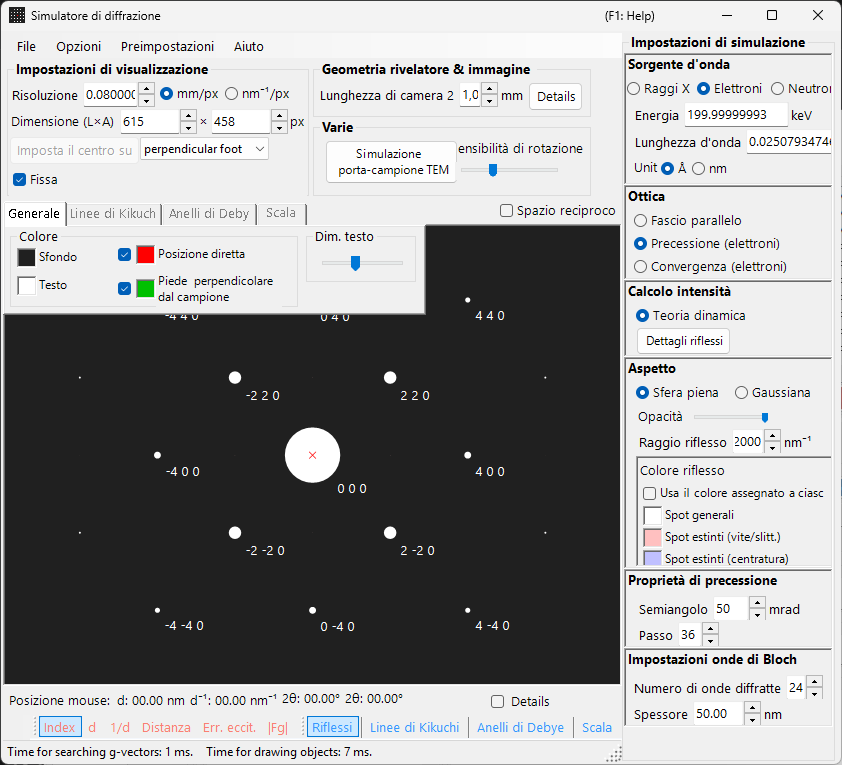
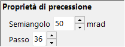

# Simulazione della diffrazione elettronica per precessione (PED)

La simulazione della **PED (Precession Electron Diffraction)** calcola i pattern di diffrazione elettronica ottenuti facendo precessare il fascio incidente lungo un cono attorno all'asse ottico.

> Questa pagina elenca tutte le impostazioni che compaiono sul lato destro quando si seleziona **Wave = Electron beam, Incident beam = Precession (electron), Intensity = Dynamical (automatic)**. Si noti che **la selezione di Precession (electron) per il fascio incidente commuta automaticamente il calcolo dell'intensità su Dynamical**. Per le operazioni a livello dell'intera finestra, come il disegno e il salvataggio, vedere la [pagina panoramica](index.md).

Condizioni GUI: **Wave = Electron beam, Incident beam = Precession (electron), Intensity = Dynamical (automatic)**

---

## Panoramica

Nella PED il fascio elettronico viene fatto precessare lungo un cono attorno all'asse ottico, e i pattern di diffrazione ottenuti per ciascuna direzione del fascio sul cono di precessione vengono integrati. Rispetto alla SAED convenzionale, ciò offre i seguenti vantaggi:

- Gli effetti dinamici vengono mediati, fornendo dati di intensità prossimi ai rapporti di intensità cinematici
- Le riflessioni delle zone di Laue di ordine superiore (HOLZ) si osservano più chiaramente
- È possibile ottenere dati di intensità adatti all'analisi strutturale

---

## Impostazione della lunghezza d'onda

Poiché la PED è una diffrazione elettronica, selezionare **Electron beam** come sorgente. Inserendo l'energia degli elettroni (keV) o la lunghezza d'onda (nm) si calcola la lunghezza d'onda corretta relativisticamente.

---

## Fascio incidente

Per la geometria del fascio incidente, selezionare **Precession (electron)** (disponibile solo quando è selezionato il fascio elettronico).

> **Nota** : la selezione di **Precession (electron)** **commuta automaticamente il calcolo dell'intensità su Dynamical**, e compaiono il pannello delle impostazioni del metodo delle onde di Bloch e il pannello delle impostazioni della precessione. **Only excitation error** / **Kinematical** non possono più essere selezionati.

---

## Impostazioni della precessione

Impostare la forma e il campionamento del cono di precessione.

| Parametro | Descrizione | Consigliato |
|-----------|-------------|-------------|
| **Semi-angle** | Semiapertura del cono di precessione (mrad) | 10–40 mrad |
| **Step** | Numero di direzioni di fascio parallelo campionate sul cono di precessione. Valori maggiori danno un'integrazione più regolare ma aumentano linearmente il tempo di calcolo | 36–72 |

---

## Calcolo dell'intensità e impostazioni del metodo delle onde di Bloch

Nel momento in cui si seleziona **Precession (electron)**, viene fissato **Intensity = Dynamical (automatic)**. Per il fascio parallelo in ciascuna direzione di precessione, l'intensità di diffrazione viene calcolata con il metodo delle onde di Bloch (calcolo dinamico), e l'integrazione su tutte le direzioni fornisce il pattern PED.

| Parametro | Descrizione | Consigliato |
|-----------|-------------|-------------|
| **No. of diffracted waves** | Numero di onde di Bloch incluse nel problema agli autovalori. Valori maggiori danno intensità più accurate ma il tempo di calcolo cresce come $O(N^3)$ | 50–200 |
| **Thickness** | Spessore del campione usato nel calcolo dinamico (nm) | — |

Il costo computazionale è all'incirca "numero di passi × calcolo delle onde di Bloch per direzione". Per i dettagli del calcolo dinamico, vedere [Calcolo dinamico (metodo delle onde di Bloch)](../appendix/a3-bloch-wave/calculation.md).

---

## Aspetto degli spot

Controlla il modo in cui viene disegnato ciascuno spot di diffrazione.

- **Solid sphere / Gaussian** : modello geometrico dei punti del reticolo reciproco. **Solid sphere** disegna la sezione tra una sfera di raggio $R$ e la sfera di Ewald, mentre **Gaussian** disegna la sezione (una gaussiana 2D) tra una gaussiana 3D con $\sigma = R$ e la sfera di Ewald.
- **Opacity** : trasparenza dello spot (0 = trasparente, 1 = opaco).
- **Radius (R)** : raggio dei punti del reticolo reciproco. Per le intensità dinamiche, l'integrale della gaussiana $=$ Brightness $\times I_\text{dyn}$, e Solid sphere usa il raggio $R \times I_\text{dyn}^{1/2}$ (in modo che l'area sia proporzionale all'intensità dinamica).
- **Brightness** : disponibile solo nella modalità **Gaussian**. Intensità integrata della gaussiana disegnata.
- **Colour scale** : mappa di colori **Gray scale** o **Cold-warm**.
- **Log scale** : visualizza l'intensità in scala logaritmica.
- **Spot colour** : colore dello spot usato quando non è applicata alcuna scala di colori.
- **Use crystal colour** : disegna gli spot nel colore assegnato a ciascun cristallo.

---

## Confronto con la SAED

| Caratteristica | SAED | PED |
|---------|------|-----|
| Fascio | Parallelo, fisso | In precessione (scansione conica) |
| Effetti dinamici | Grandi | Mediati, minori |
| Riflessioni HOLZ | Deboli | Compaiono marcate |
| Affidabilità dell'intensità | Può essere insufficiente per l'analisi strutturale | Adatta all'analisi strutturale |
| Tempo di calcolo | Breve | Lungo |

---

## Vedi anche

- [Simulatore di diffrazione (panoramica)](index.md)
- [Simulazione della diffrazione dei raggi X](4-x-ray-neutron-diffraction.md)
- [Simulazione SAED](1-saed-simulation.md)
- [Calcolo dinamico (metodo delle onde di Bloch)](../appendix/a3-bloch-wave/calculation.md)
