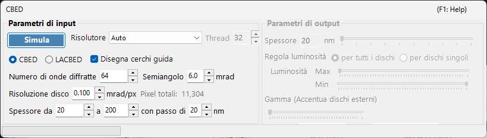
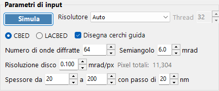
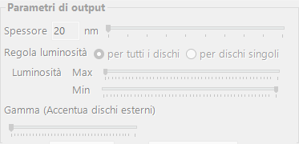

# Simulazione CBED

La **simulazione CBED (Convergent-Beam Electron Diffraction)** calcola e visualizza i pattern di diffrazione a fascio convergente utilizzando il metodo delle onde di Bloch (Bethe). I pattern CBED mostrano dischi di diffrazione anziché spot e contengono informazioni ricche sulla simmetria del cristallo, sullo spessore e sulla struttura.

> Questa pagina elenca tutte le impostazioni della finestra dedicata che si apre quando si seleziona **Wavelength = Electron** e **Incident beam = Convergence (CBED, electron only)** nel [Simulatore di diffrazione](index.md). Commutando il fascio incidente su convergente, **Intensity calculation** viene impostato automaticamente su **Dynamical** e si apre questa finestra delle impostazioni CBED. Per il disegno e il salvataggio dei pattern di diffrazione e per le altre operazioni comuni al simulatore di diffrazione, vedere la [pagina panoramica](index.md).

Condizioni GUI: Wave Length = Electron · Incident beam = Convergence (CBED, electron only) · Intensity calculation = Dynamical (automatico)

---

## Parametri di input

| Parametro | Descrizione | Predefinito / Tipico |
|-----------|-------------|-------------------|
| **Mode** | **CBED**: pattern standard a fascio convergente in cui ogni disco corrisponde a una riflessione, con il disco trasmesso (000) al centro. **LACBED** (Large-Angle CBED): pattern a fascio convergente ad ampio angolo in cui i dischi di riflessioni diverse si sovrappongono. Utile per osservare le linee HOLZ (higher-order Laue zone) e la simmetria | CBED |
| **Convergence semi-angle (mrad)** | Semiangolo del cono del fascio convergente. Determina la dimensione di ciascun disco di diffrazione (il diametro del disco nello spazio reciproco corrisponde a $2\alpha$) | 5–30 mrad |
| **Disk resolution (mrad/px)** | Risoluzione angolare all'interno di ciascun disco. Valori più piccoli danno una risoluzione maggiore, ma il numero di direzioni del fascio (pixel) calcolate cresce con il quadrato, quindi anche il tempo di calcolo aumenta in modo quadratico. Il conteggio totale dei pixel risultante (= numero totale di direzioni del fascio) è mostrato a destra | — |
| **No. of Bloch waves** | Numero massimo di fasci inclusi nel calcolo delle onde di Bloch per ciascuna direzione del fascio incidente. Più fasci danno una maggiore accuratezza, ma il costo del problema agli autovalori cresce come $O(N^3)$ | 100–500 |
| **Thickness range** | Valori iniziale, finale e di passo dello spessore del campione (nm). Più spessori vengono calcolati insieme e commutati con il cursore dello spessore sul lato di output | — |
| **Solver** | Motore di calcolo per il problema agli autovalori. **Auto**: seleziona automaticamente il solver migliore. **Eigenproblem (MKL)**: basato su Intel MKL (il più veloce). **Eigenproblem (Eigen)**: libreria C++ Eigen. **Managed**: .NET gestito puro (il più lento ma sempre disponibile) | Auto |
| **Thread count** | Numero di thread paralleli per il calcolo | — |
| **Draw disk outlines** | Quando selezionato, disegna un cerchio che indica il contorno di ciascun disco di diffrazione | — |

---

## Run / Stop

- **Start** : avvia la simulazione CBED con i parametri di input correnti.
- **Stop** : annulla il calcolo in corso.

---

## Parametri di output

Una volta completato il calcolo, i parametri di output diventano disponibili. Tutti modificano solo la visualizzazione senza ricalcolare.

| Parametro | Descrizione |
|-----------|-------------|
| **Sample thickness** | Seleziona con un cursore lo spessore del campione da visualizzare, all'interno dell'intervallo di spessore dei parametri di input |
| **Brightness adjustment** | **Common to all disks**: utilizza una scala di luminosità comune a tutti i dischi per visualizzare il pattern CBED completo. **Per disk**: visualizza un singolo disco selezionato a piena risoluzione, normalizzato all'interno di quel disco |
| **Brightness (Max / Min)** | Limite superiore e inferiore dell'intensità visualizzata. Da regolare quando si desidera enfatizzare caratteristiche deboli |
| **γ (emphasis of outer disks)** | Correzione gamma. Utilizzata per rendere più visibili i dischi esterni scuri ad ampio angolo rispetto al disco trasmesso centrale |
| **Scale** | Seleziona la gradazione di intensità tra **Positive** / **Negative** (bianco-nero invertito) |
| **Color** | Mappa di colori utilizzata per la visualizzazione. Scegliere tra **Gray** e altri |

---

## Contesto fisico

Nel CBED il fascio incidente è considerato come un cono di onde piane con direzioni diverse. Per ciascuna direzione (ciascun punto all'interno dell'apertura di convergenza = un'onda piana incidente parziale) il metodo delle onde di Bloch risolve l'equazione di Schrödinger degli elettroni all'interno del cristallo, e i risultati vengono riorganizzati come dischi di diffrazione. Le linee HOLZ (higher-order Laue zone) appaiono come linee scure/chiare sottili all'interno dei dischi e derivano da riflessioni nelle zone di Laue superiori. Sono sensibili al parametro reticolare lungo l'asse $c$ e sono utili per l'analisi strutturale tridimensionale.

Per i dettagli teorici, vedere [Calcolo CBED](../appendix/a3-bloch-wave/cbed.md).

---

## Vedere anche

- [Simulatore di diffrazione (panoramica)](index.md)
- [Simulazione SAED](1-saed-simulation.md)
- [Simulazione PED](2-ped-simulation.md)
- [Calcolo CBED](../appendix/a3-bloch-wave/cbed.md)
