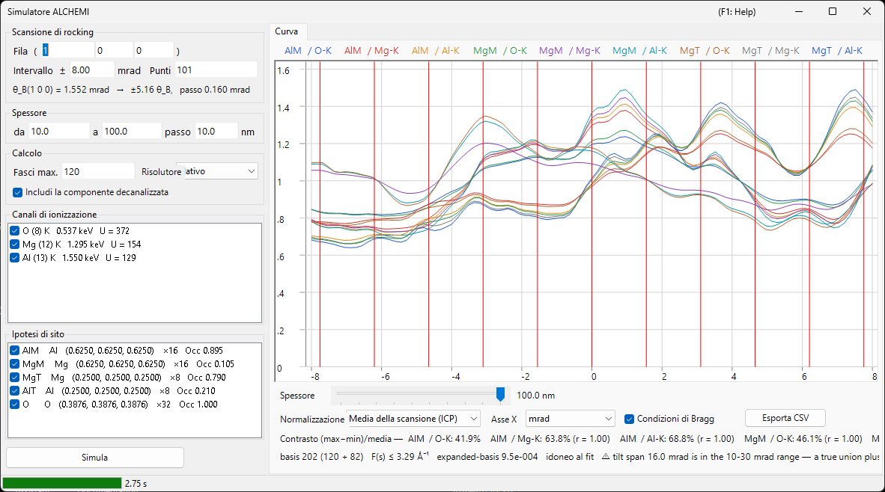

# Simulazione ALCHEMI

**ALCHEMI (Atom Location by CHannelling-Enhanced MIcroanalysis)** determina **quale sito occupa un drogante** misurando le rese di raggi X caratteristici mentre il cristallo viene inclinato lungo una fila sistematica, e leggendo la dipendenza dall'orientazione. Il simulatore ALCHEMI di ReciPro calcola in avanti la **curva di rocking (resa di ionizzazione in funzione dell'orientazione)** a partire da una struttura cristallina e da un insieme di ipotesi di sito.

> **È una funzione Preview.** La v1 esegue **solo il calcolo diretto unidimensionale**; l'adattamento ai dati sperimentali e la mappa 2D (2D-HARECXS) non sono implementati (quelle schede sono nascoste). **Per quanto ne sanno gli autori, non esiste alcun altro simulatore diretto ALCHEMI disponibile pubblicamente.** Poiché non c'è un'implementazione con cui fare un riscontro, leggere [Ambito di validità e limiti noti](#ambito-di-validità-e-limiti-noti) prima di usare i risultati in modo quantitativo.

Si apre dal menu **Opzioni** del [Simulatore di diffrazione](index.md) → **Simulatore ALCHEMI...**

Condizioni GUI: Wave Length = Electron (cristallo, tensione di accelerazione e orientazione provengono dal simulatore di diffrazione padre)



La finestra ha **le impostazioni a sinistra** (scansione, spessore, calcolo, canali di ionizzazione, ipotesi di sito) e **il risultato a destra** (scheda Curva).

---

## Che cosa viene calcolato

Per ogni orientazione incidente il campo d'onda all'interno del cristallo viene risolto con il metodo delle onde di Bloch e, per ogni coppia sito $s$ / canale di ionizzazione $c$, la resa di ionizzazione viene integrata analiticamente fino allo spessore $t$.

$$
Y_\text{dyn} = \mathrm{Re} \sum_{jj'} \alpha_j^{*}\,\bigl(C^{\dagger} \mu_{s,c} C\bigr)_{jj'}\, \alpha_{j'}\, F_{jj'}(t),
\qquad F_{jj'}(t) = \frac{e^{\lambda t} - 1}{\lambda}
$$

La matrice di ionizzazione $\mu$ dipende solo dalla differenza di due riflessi, $G = \mathbf{g}_h - \mathbf{g}_g$.

$$
\mu_{hg} = \sum_a \mathrm{Occ}_a\, e^{-M_a(G)}\, \sigma_c\, F_c(|G|/2)\, e^{-2\pi i\,G \cdot \mathbf{r}_a}
$$

- $\sigma_c$ : sezione d'urto totale di ionizzazione, modello **Bote–Salvat**
- $F_c(s)$ : fattore di forma di ionizzazione normalizzato, tabelle **DHFS** generate internamente (la stessa base dati di [Interazione del fascio](../3-beam-interaction.md) e [STEM-EDX](../9-hrtem-stem-simulator/2-stem-simulation.md))
- $e^{-M_a(G)}$ : fattore di Debye-Waller (sono supportati ADP anisotropi)

Corrisponde all'**approssimazione del fattore di forma locale** di ICSC (Oxley & Allen 2003). La MDFF a due impulsi non viene usata.

### Componente decanalizzata

Gli elettroni sottratti al campo di Bloch coerente dall'assorbimento termico diffuso percorrono lo spessore rimanente come elettroni di direzione casuale, e ionizzano anche lì.

$$
Y_\text{dech} = \frac{\mu_{00}}{V_c}\,\bigl(t - L_\text{coh}(t)\bigr),
\qquad L_\text{coh}(t) = \int_0^t \sum_g |\psi_g(z)|^2\,dz
$$

Deselezionare **Includi la componente decanalizzata** nel riquadro **Calcolo** elimina questo termine. Agli spessori tipici vale decine di punti percentuali della resa totale, quindi ometterlo fa apparire il contrasto di sito più forte di quanto sia.

### Grandezza in uscita

La grandezza primaria è il **numero di lacune di guscio interno generate per elettrone incidente**. **La conversione in fotoni X (resa di fluorescenza e ramificazione delle righe), l'autoassorbimento dei raggi X nel campione e l'efficienza e l'angolo solido del rivelatore NON sono applicati.**

⚠ **Le lacune non sono conteggi.** Tra questa grandezza e un'intensità EDX misurata restano altri tre stadi — atomico, del campione e strumentale —, nessuno dei quali è eseguito da ReciPro.

1. **lacuna → fotone** : resa di fluorescenza e ramificazione delle righe del guscio
2. **fotone → fotone che esce dal campione** : autoassorbimento dei raggi X, che dipende dalla **profondità a cui il fotone è stato creato** e dall'angolo di uscita
3. **fotone → conteggio** : efficienza del rivelatore, angolo solido ed elaborazione dello spettro

In particolare lo stadio 2 non si recupera a posteriori moltiplicando la curva finita per un unico fattore di assorbimento: occorrerebbe prima risolvere la resa in profondità. Confrontare queste curve con intensità misurate, fattori k o composizioni richiede quindi di eseguire quegli stadi fuori da ReciPro.

Si noti quali di essi sopravvivono a una normalizzazione. Gli stadi 1 e 3, e qualunque assorbimento trattato come costante, sono **moltiplicativi e indipendenti dall'orientazione**, quindi cadono nella normalizzazione ICP (media della scansione), anche per due righe di energia molto diversa. **L'autoassorbimento in generale no**: la canalizzazione cambia la distribuzione in profondità in cui le lacune vengono create, così la frazione assorbita varia lungo la scansione e sopravvive alla normalizzazione. È contro questo residuo che aiuta scegliere righe di energia simile.

---

## Riquadro sinistro: impostazioni

### Scansione di rocking

| Voce | Descrizione | Predefinito |
|------|-------------|-------------|
| **Fila ( h k l )** | Fila sistematica da percorrere, indicata con gli indici di riflesso. L'asse di inclinazione è preso perpendicolare sia al fascio sia a questo $\mathbf{g}$, così la scansione attraversa le condizioni di Bragg di questa fila | (1 0 0) |
| **Intervallo ±** | Semiampiezza della scansione di inclinazione (mrad). Oltre circa 10 mrad una base unione fissa non è più garantita, e oltre 30 mrad si esce dalla garanzia della v1 | 8 mrad |
| **Punti** | Numero di punti della scansione (3–1001) | 101 |

La riga sottostante mostra l'angolo di Bragg $\theta_B$ della fila scelta, a quanti $\theta_B$ corrisponde l'ampiezza della scansione e il passo di inclinazione, così si vede quanto arriva davvero la scansione prima di eseguirla.

⚠ **Il valore predefinito di ±8 mrad è un comodo punto di partenza, non un ottimo di letteratura.** La rassegna di Jones (2002) non prescrive alcuna ampiezza numerica di scansione in mrad, e i limiti superiori citati nella tabella qui sopra sono limiti della numerica della v1, non raccomandazioni. Valutate l'ampiezza in unità di $\theta_B$ (è quanto riporta la riga sotto la tabella) e sceglietela in modo che le caratteristiche dinamiche che intendete confrontare cadano dentro la scansione.

⚠ L'affermazione che l'illuminazione possa essere aperta fino a **circa l'angolo di Bragg** — data da Jones per la condizione ottimizzata a fila sistematica — riguarda il **semiangolo di convergenza del cono incidente**, cioè **Allargamento angolare** nel riquadro **Calcolo** più sotto. **Non** è una semiampiezza di scansione raccomandata. Sono due grandezze diverse e non vanno confuse.

### Spessore

Indicare inizio, fine e passo (nm). **Tutti gli spessori vengono calcolati insieme in una sola esecuzione**, e il risultato si commuta con il cursore sotto la curva.

Il contrasto di sito cambia molto — e può perfino invertire segno — tra campioni sottili e spessi, quindi verificare più spessori prima di trarre conclusioni. Per questo il selettore di spessore sta direttamente sotto la curva.

### Calcolo

| Voce | Descrizione | Predefinito |
|------|-------------|-------------|
| **Fasci max.** | Limite superiore del numero di onde di Bloch per orientazione (1–1600). L'unione su tutta la scansione è maggiore | 120 |
| **Risolutore** | Motore di calcolo del problema agli autovalori: **Nativo** (Eigen C++) o **Gestito** (.NET). Dove il risolutore nativo non è disponibile, la scelta è fissata su Gestito | Nativo |
| **Includi la componente decanalizzata** | Se aggiungere $Y_\text{dech}$ sopra | attivo |
| **Allargamento angolare** | Convolve la curva con l'allargamento angolare del fascio incidente: **Nessuno** o **Gaussian** con una larghezza a metà altezza in mrad. È una post-elaborazione sull'asse delle orientazioni, applicata **prima** della normalizzazione di visualizzazione | Nessuno |

**Il tetto di 1600 fasci è la controparte dell'intervallo tabulato $s \le 16\ \text{Å}^{-1}$ del fattore di forma di ionizzazione.** In pratica anche 1600 fasci richiedono solo circa 10,5 Å⁻¹, quindi l'intervallo tabulato non viene mai esaurito finché il tetto è rispettato. Il valore effettivamente raggiunto è riportato nella riga di [diagnostica della base](#diagnostica-della-base) sotto il grafico.

### Canali di ionizzazione

Elenco di elemento e guscio da ionizzare. Ogni riga si legge `elemento (Z) guscio   energia di soglia   U = sovratensione`, con un'etichetta tra parentesi dove serve cautela.

- I canali che **non possono essere eccitati** (l'energia incidente è sotto la soglia di assorbimento) o che cadono **fuori dall'intervallo tabulato** sono elencati con la motivazione e non possono essere selezionati
- I canali la cui sovratensione $U = E_0/E_\text{soglia}$ è inferiore a 1,2 portano un avviso, perché lì la sezione d'urto è meno affidabile

### Ipotesi di sito

Elenco dei siti atomici la cui resa è calcolata separatamente, mostrati come `etichetta elemento (x, y, z) ×molteplicità Occ occupazione`.

⚠ **Nell'approssimazione a tracciante un canale può essere abbinato a qualsiasi sito.** Abbinare il canale di ionizzazione di un drogante alla geometria di un sito ospite (posizione, ADP, occupazione) è l'uso previsto; limitare l'abbinamento agli elementi coincidenti sarebbe sbagliato. Vengono calcolate **tutte le combinazioni** dei canali e dei siti selezionati.

### Simula / Ferma

**Simula** avvia la scansione. L'avanzamento è riportato nella barra di stato in cinque fasi (risoluzione dei dati di ionizzazione → costruzione della base unione → costruzione delle matrici di ionizzazione → risoluzione delle orientazioni → verifica della base ampliata), e **Ferma** interrompe in qualsiasi momento.

---

## Riquadro destro: scheda Curva

Al termine del calcolo viene tracciata una curva per ogni coppia sito × canale. La legenda si legge `etichetta di sito / canale`.

| Voce | Descrizione |
|------|-------------|
| **Spessore** | Seleziona con un cursore lo spessore visualizzato (non viene ricalcolato nulla) |
| **Normalizzazione** | **Media della scansione (ICP)** = dividere per la media su tutta la scansione (la grandezza normalmente usata in ALCHEMI) / **Massimo = 1** / **Grezzo (per elettrone)** |
| **Asse X** | Commuta tra **mrad** e **θ_B** (in unità dell'angolo di Bragg della fila percorsa) |
| **Condizioni di Bragg** | Traccia linee verticali a $\theta = n\,\theta_B$ |
| **Esporta CSV** | Scrive le curve grezze per ogni orientazione, spessore, sito e canale in un file CSV ([sotto](#esportazione-csv)) |

⚠ **La normalizzazione è solo una trasformazione di visualizzazione.** La grandezza memorizzata è sempre il numero di lacune generate per elettrone incidente, e **Massimo = 1 serve solo per la visualizzazione**: non va usato come riferimento ICP.

### Contrasto e correlazione

La prima riga sotto la curva riporta, per ogni serie, il **contrasto** $(\max-\min)/\text{media}$ e il **coefficiente di correlazione** $r$ rispetto alla prima serie. È una sintesi per capire a colpo d'occhio quale sito sta agendo: due serie con $r$ vicino a $+1$ hanno la stessa dipendenza dall'orientazione, cioè quei dati non possono separare quei siti.

### Diagnostica della base

La seconda riga riporta lo stato della base.

```text
basis 347 (184 + 163)   F(s) ≤ 6.20 Å⁻¹   expanded-basis 6.7e-3   ⚠ idoneità al fit NON valutata   ⚠ Experimental: verificato quantitativamente solo per beta-AlCo [001] a 250 keV
```

- **basis N (solo centro + aggiunti dall'unione)** : dimensione dell'unione vera dei riflessi su tutte le orientazioni della scansione
- **F(s) ≤ … Å⁻¹** : il maggiore argomento del fattore di forma effettivamente richiesto dalla base
- **expanded-basis** : massima differenza relativa quando il centro e i due estremi della scansione vengono risolti di nuovo con una base 1,25×. È un **indicatore indiretto dell'errore di convergenza**
- **idoneità al fit** : la v1 riporta sempre **NON valutata**. La diagnostica ha tre difetti noti — il denominatore è il massimo su
  tutto il tensore, il numeratore è la resa assoluta, e passa banalmente quando la base 1,25× non cresce davvero — perciò
  certificare un risultato come «idoneo» sbaglierebbe nella direzione pericolosa
- **Experimental** : ogni esecuzione porta questa etichetta insieme all'ambito verificato, perché solo β-AlCo è stato controllato quantitativamente

⚠ **La v1 non certifica adattamenti quantitativi dell'occupazione.** Il valore grezzo della diagnostica resta visibile e più è piccolo meglio è, ma va trattato come un'indicazione, non come un esito di prova. Si noti inoltre che è definita sulla **resa assoluta**, quindi risulta conservativa se si guarda solo l'ICP (che divide per la media della scansione).

Nelle situazioni seguenti vengono aggiunti ulteriori avvisi.

- **Tensione di accelerazione sotto 80 kV** : a questa tensione la tabella dei fattori di forma non garantisce $s$ fino a $16\ \text{Å}^{-1}$. Il calcolo in sé resta corretto finché il $s$ richiesto dalla base rimane nell'intervallo certificato, quindi è un **avviso, non un rifiuto**
- **Troncamento del fattore di forma** : dove $F(s)$ oltre l'intervallo certificato è stato troncato a zero, **il limite di errore risultante $|F| \le \varepsilon$ è mostrato numericamente**. Nulla viene estrapolato in silenzio

---

## Esportazione CSV {#esportazione-csv}

**Esporta CSV** scrive una tabella in formato lungo preceduta da un'intestazione nel formato `# key: value` (qui abbreviata). L'intestazione è pensata perché il solo file dichiari le condizioni necessarie a riprodurlo.

```text
# generator: ReciPro ALCHEMI, ver 4.947 (2026-08-09)
# model: LocalFormFactor (local form-factor approximation; NOT the two-momentum MDFF)
# quantity: IonizationVacanciesGenerated (PerIncidentElectron)
# crystal: MgAl2O4 (spinel) / F d -3 m
# cell_nm: a 0.808000 b 0.808000 c 0.808000 alpha 90.0000 beta 90.0000 gamma 90.0000 deg
# accelerating_voltage_kV: 200.000
# scan_row_hkl: 1 0 0
# theta_B_mrad: 1.552030
# thicknesses_nm: 10.0000 20.0000 ... 100.0000
# angular_spread: Gaussian1D FWHM 1.0000 mrad (kernel renormalized at the scan ends)
# processing_order: forward yield -> angular spread convolution -> (display normalization, NOT applied to these columns)
# basis: 202 beams (120 centre-only + 82 added by the union), hash 1F3A...
# expanded_basis_max_rel_diff: 9.500e-004
# fit_eligibility: NotEvaluated (v1 does not certify quantitative occupancy fits; raw diagnostic AcceptedForFit=True at tolerance 3e-3)
# occupancy_coupling: Tracer (dilute limit; site responses may be combined linearly). VCA is not implemented
# verification: Experimental. Quantitatively verified only for beta-AlCo [001] at 250 keV (Al-K / Co-K / Co-L). ...
# not_modelled: X-ray self-absorption, detector efficiency and solid angle, fluorescence yield and line branching, background, specimen thickness distribution, specimen bending
# channel[Al-K]: edge 1.5596 keV, sigma 1.95e-007 nm2, sigma_source ... , F(s)_source ... (tabulated to s = 16.0 A^-1), not truncated
# site[AlM]: atom indices 0, occupancy from the crystal
# conventions: tilt is the signed rotation about the axis perpendicular to both the beam and g(scan_row_hkl), positive toward +g; angles in mrad; lengths in nm; ...
tilt_mrad,thickness_nm,site,channel,dynamic,dechannelled,total,dynamic_conv,dechannelled_conv,total_conv
```

`dynamic` / `dechannelled` / `total` sono memorizzati separatamente, così **il contributo della componente decanalizzata può essere valutato a posteriori**. Le colonne `*_conv` compaiono solo con l'allargamento angolare attivo e contengono le curve convolute: il file porta quindi sia il risultato grezzo riproducibile sia quello da confrontare con un esperimento. I valori sono grezzi (per elettrone incidente) e non passano per la normalizzazione di visualizzazione; il separatore decimale è sempre il punto.

---

## Ambito di validità e limiti noti

«Calcolabile» e «verificato quantitativamente» sono due cose diverse. Questa sezione riguarda la seconda.

### Nessuna accuratezza ±% generale — tre cose da tenere distinte

ReciPro **non** dichiara deliberatamente un'accuratezza generale del tipo «occupazioni di sito a ±N %». Nemmeno la rassegna di Jones (2002) riporta un errore di occupazione universale, e i numeri pubblicati di quella forma appartengono a un sistema misurato con una procedura: non sono una proprietà del metodo, tanto meno di questo simulatore.

Nel giudicare un risultato, tenete distinte tre cose diverse.

**Precisione** : quanto è riproducibile il numero — statistica di conteggio, la barra d'errore restituita da una regressione, la dispersione tra ripetizioni. Un residuo di fit piccolo, o un coefficiente di correlazione vicino a 1, non stabilisce di per sé che il modello sia giusto. Nel caso discusso da Jones, aggiungere una costante libera al fit ne ha migliorato la precisione senza dimostrare una migliore accuratezza.

**Distorsione del modello** : l'errore sistematico del calcolo diretto stesso — la mancata correlazione di sito del termine decanalizzato, l'approssimazione del fattore di forma locale, l'assenza di distribuzione di spessore e di curvatura (tutto più sotto). La fisica mancante di questo tipo non si riduce raccogliendo più conteggi o aggiungendo punti di scansione. (Allargare la base è un'altra cosa: riduce l'errore **numerico** di troncamento, che la [diagnostica della base](#diagnostica-della-base) riporta separatamente.)

**Verifiche indipendenti** : l'accordo con qualcosa che non condivide le stesse ipotesi — e ce ne sono due livelli. Il confronto con un'**implementazione** formulata in modo indipendente (codice contro codice) mette alla prova la formulazione e la programmazione; è ciò che è stato fatto qui, per un sistema. Il confronto con l'**esperimento**, che è quello che mette la fisica alla prova della realtà, non è stato fatto.

### Ambito verificato quantitativamente

**β-AlCo [001] a 250 keV, canali Al-K / Co-K / Co-L**, e nient'altro. Confronto con un calcolo multislice + fononi congelati (py_multislice), la cui formulazione dinamica è completamente indipendente:

- **Sito Al (colonna leggera)** : residuo RMS rispetto alla modulazione ICP ≤3,2 % a tutti gli spessori, ≤0,6 % per $t \ge 10$ nm
- **Sito Co (colonna pesante)** : ≤3 % per $t \le 4$ nm, ma **6–17 % per $t \gtrsim 10$ nm**

Qualsiasi altro sistema, elemento, guscio o tensione è «calcolabile» ma non «verificato quantitativamente».

**Non è stato effettuato alcun confronto con dati sperimentali.** Il confronto sopra riportato è tra codici, nell'intervallo $t$ = 2–30 nm. Il valore di 10–19 punti citato nella sezione successiva è una grandezza *diagnostica* per isolare la causa della discrepanza: non è una correzione applicata dal simulatore, e l'accordo ottenuto dopo averla applicata non viene rivendicato come verifica.

### Errore sistematico noto: il termine decanalizzato non ha correlazione di sito

Il termine decanalizzato della v1 è una costante indipendente dall'orientazione, quindi il suo unico effetto sull'ICP è di avvicinarlo a 1. In realtà parte degli elettroni diffusi termicamente si ricanalizza nelle colonne e, essendo forti diffusori, ritorna **preferenzialmente alle colonne pesanti**. Nel confronto precedente l'entità effettiva di questo contributo era **sottostimata di 10–19 punti sulle colonne pesanti**.

→ **Per siti leggeri o debolmente diffondenti, o per $t \lesssim 5$ nm, l'accordo con un'implementazione indipendente è dell'1–3 %. Per colonne pesanti con $t \gtrsim 10$ nm resta un errore sistematico del 6–17 % della modulazione ICP.** Un modello di reiniezione con correlazione di sito è rimandato alla v1.1 o oltre.

### Non incluso nel modello diretto

**Una convoluzione con l'allargamento angolare da sola non riprodurrà un esperimento.** Nessuno dei seguenti effetti è incluso.

- **Distribuzione dello spessore** e **flessione** del campione
- **Autoassorbimento** dei raggi X
- **Efficienza e angolo solido del rivelatore**
- **Fondo** (bremsstrahlung, righe sovrapposte)

L'**allargamento angolare del fascio incidente** (semiangolo di convergenza, deriva) *è* modellato — vedere **Allargamento angolare** nel riquadro Calcolo — ma convolvere con esso non sostituisce nessuno dei punti precedenti.

### Righe di bassa energia — dove l'approssimazione locale è più debole {#local-approximation}

La matrice di ionizzazione della v1 è funzione del solo vettore $G = \mathbf{g}_h - \mathbf{g}_g$ (approssimazione del fattore di forma locale). ICSC afferma che ciò è ragionevole per gusci interni fortemente legati la cui emissione caratteristica sta **sopra circa 3–4 keV** (Oxley & Allen 2003, p. 941).

⚠ **Quel valore è una guida empirica e dipendente dal modello, non una soglia netta — e ReciPro non lo usa per rifiutare nulla.** Le righe al di sotto vengono calcolate normalmente, e spesso sono proprio quelle di interesse: Al-K è a 1,49 keV e Co-L a 0,79 keV, ed entrambe appartengono all'insieme β-AlCo usato per il confronto tra codici più sopra.

Ciò che quel valore segnala è il punto in cui la riduzione a un **unico** vettore $G$ comincia a diventare insufficiente. L'evento di ionizzazione non avviene sul nucleo: la sua probabilità è massima a distanza finita dal nucleo, e tale distanza cresce al diminuire dell'energia richiesta. Si noti che cosa l'approssimazione mantiene e che cosa scarta: $F_c(|G|/2)$ dipende dall'impulso, quindi un raggio d'interazione finito **è** mantenuto; ciò che viene scartato è la dipendenza separata dai due trasferimenti di impulso, cioè la struttura non locale della MDFF completa. Al crescere della delocalizzazione, è proprio quella struttura scartata a iniziare a contare.

L'energia della riga da sola non può certificare un risultato: entrano l'estensione spaziale del guscio, l'orientazione, lo spessore e i vettori reciproci effettivamente richiesti dalla base. Trattate 3–4 keV come un invito a guardare più da vicino, non come un esito di prova. Dove potete scegliere, confrontare righe di **energia simile** tende a rendere più confrontabile la distorsione da delocalizzazione delle due; Jones (2002) raccomanda esattamente questo come primo passo pratico e, come secondo, di preferire una fila sistematica a un asse di zona — la geometria che la v1 calcola (un asse di zona canalizza più fortemente, ma richiede una correzione di delocalizzazione maggiore).

⚠ Le basse energie di emissione risentono anche di più dell'**autoassorbimento dei raggi X**, benché quanto dipenda dalla composizione del campione e dalle sue soglie di assorbimento, dal cammino e dall'angolo di uscita, non dalla sola energia emessa. È una sorgente d'errore **distinta**, per nulla modellata (vedere [Grandezza in uscita](#grandezza-in-uscita) sopra), e falsa il confronto con un esperimento indipendentemente da quanto fa l'approssimazione locale.

### Ipotesi del modello

- **Solo approssimazione a tracciante** : la sovrapposizione lineare delle risposte di sito vale solo nel limite diluito in cui il drogante non perturba il campo d'onda elastico. La VCA a concentrazione finita è fuori dall'ambito della v1
- **Approssimazione del fattore di forma locale** : $\mu$ è funzione del solo $G = \mathbf{g}_h - \mathbf{g}_g$, non della MDFF a due impulsi (Modello A di OAR 1999). L'approssimazione è più debole per i gusci K degli elementi leggeri e per le soglie di bassa energia — vedere [sopra](#local-approximation)
- **Lacune, non fotoni X** : la resa di fluorescenza e la ramificazione delle righe non sono applicate
- **Il limite inferiore della tensione di accelerazione è 80 kV** : è la tensione più bassa alla quale si può garantire $s = 16\ \text{Å}^{-1}$, non una soglia di rifiuto

---

## Vedere anche

- [Simulatore di diffrazione (panoramica)](index.md)
- [Simulazione CBED](3-cbed-simulation.md)
- [Calcolo dinamico (nucleo comune)](../appendix/a3-bloch-wave/calculation.md)
- [Simulazione STEM](../9-hrtem-stem-simulator/2-stem-simulation.md) — STEM-EDX, che usa la stessa base dati di ionizzazione
- [Interazione del fascio](../3-beam-interaction.md) — dati di sezioni d'urto e soglie di assorbimento
