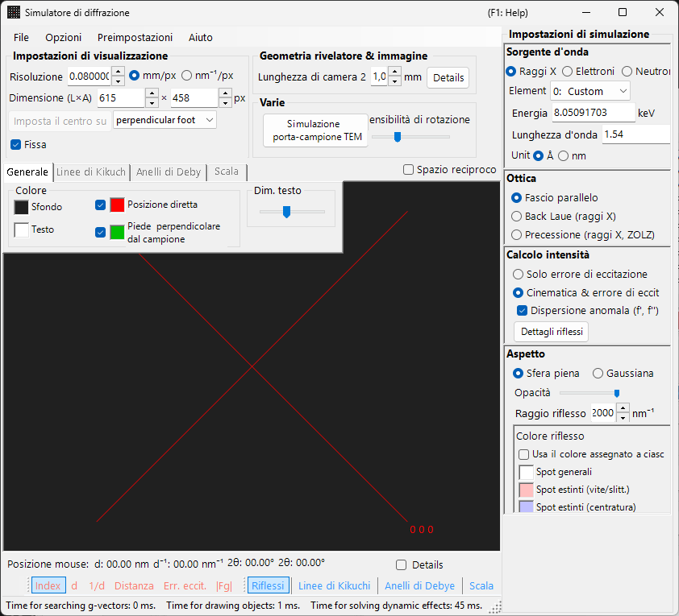
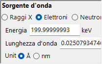
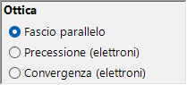
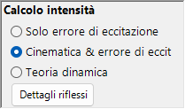
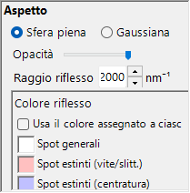

# Simulazione della diffrazione di raggi X / neutroni

La **simulazione della diffrazione di raggi X / neutroni** calcola i pattern di diffrazione di raggi X e neutroni da monocristallo. È una delle modalità principali del [simulatore di diffrazione](index.md).

> Questa pagina elenca tutte le impostazioni che compaiono sul lato destro quando si seleziona **Wave Length = X-ray** (o neutron). Per le operazioni a livello di finestra, come il disegno e il salvataggio, consultare la [pagina panoramica](index.md).

Condizioni della GUI: Wave Length = X-ray / Neutron · Incident beam = Parallel / Precession (X-ray) / Back-Laue · Intensity calculation = Only excitation error / Kinematical

---

## Panoramica

I raggi X hanno una lunghezza d'onda maggiore degli elettroni (Cu Kα: 0.15406 nm = 1.5406 Å), per cui la sfera di Ewald è più fortemente curvata. Di conseguenza, un numero minore di punti del reticolo reciproco soddisfa simultaneamente la condizione di diffrazione rispetto agli elettroni. Poiché il potere di diffusione atomico è piccolo e la diffusione multipla è debole, la teoria cinematica della diffrazione fornisce un'accuratezza sufficiente per le intensità (il calcolo dinamico è supportato solo per gli elettroni).

---

## Wave Length

Selezionare **X-ray** come sorgente di radiazione. I raggi X possono essere specificati in due modi: raggi X caratteristici e radiazione di sincrotrone.

### Raggi X caratteristici

La scelta di un **elemento** e di una **transizione** fissa la lunghezza d'onda dei raggi X caratteristici. La transizione è specificata nella notazione di Siegbahn (Kα₁ / Kα₂ / Kβ, ecc.). Lunghezze d'onda Kα₁ di elementi rappresentativi:

| Elemento | Linea | Lunghezza d'onda (Å) | Energia (keV) |
|---------|------|-----------------|--------------|
| Cu | Kα₁ | 1.5406 | 8.048 |
| Mo | Kα₁ | 0.7107 | 17.479 |
| Co | Kα₁ | 1.7890 | 6.930 |
| Cr | Kα₁ | 2.2910 | 5.415 |

### Radiazione di sincrotrone

Impostare **Element** su **0: Custom** e inserire direttamente l'energia (keV) o la lunghezza d'onda (Å). È possibile utilizzare qualsiasi lunghezza d'onda.

---

## Modalità del fascio incidente

Seleziona la geometria del fascio incidente. Per i raggi X sono disponibili tre modalità.

### Parallel

L'onda piana standard. Un fascio incidente parallelo utilizzato per SAED e per la diffrazione di raggi X da monocristallo.

### Precession (X-ray) — camera di precessione

Simula una camera di precessione a raggi X. Si tratta di una fotografia di precessione che cattura un singolo strato del reticolo reciproco.

### Back-Laue (Laue in retroriflessione)

Simula un pattern di Laue in retroriflessione con raggi X bianchi (policromatici). In questa geometria di retroriflessione il rivelatore è collocato sul lato della sorgente e **Monochrome** viene disattivato. La geometria di riflessione è data da **Tau / Phi** in **Detector geometry** (vedere [Detector geometry](index.md#detector-geometry)).

> **Nota**: Le opzioni del fascio incidente seguono la lunghezza d'onda. **Precession (electron)** e **Convergence (CBED)** compaiono solo quando è selezionata la radiazione elettronica, mentre le opzioni **Precession (X-ray)** e **Back-Laue** sopra indicate compaiono solo quando è selezionata la radiazione a raggi X. Per i neutroni è disponibile solo **Parallel**. A seconda dello stato al momento dell'acquisizione, lo screenshot potrebbe non mostrare le opzioni specifiche dei raggi X.

---

## Calcolo dell'intensità

Seleziona il metodo utilizzato per calcolare le intensità degli spot. Per i raggi X sono disponibili due modalità.

### Only excitation error

L'intensità è determinata esclusivamente dalla distanza geometrica tra la sfera di Ewald e il punto del reticolo reciproco (l'errore di eccitazione $s_g$). Un $\lvert s_g \rvert$ più piccolo dà un'intensità maggiore, con un picco al valore impostato da **Radius**, e scende a zero quando $\lvert s_g \rvert$ supera Radius. Il fattore di struttura viene ignorato.

### Kinematical & excitation error

Oltre all'errore di eccitazione, il fattore di struttura cinematico $\lvert F_{hkl} \rvert^2$ viene incorporato nell'intensità. Le regole di estinzione sono rigorosamente rispettate. I fattori di Lorentz e di polarizzazione non sono inclusi (si tratta di una simulazione del pattern geometrico).

> **Nota**: La **teoria dinamica** è disabilitata per i raggi X (disponibile solo quando è selezionata la radiazione elettronica).

---

## Aspetto degli spot

Controlla come viene reso ciascuno spot di diffrazione.

- **Solid sphere / Gaussian** : modello geometrico del punto del reticolo reciproco. **Solid sphere** utilizza la sezione trasversale tra una sfera di raggio *R* e la sfera di Ewald (l'area del cerchio corrisponde all'intensità di diffrazione); **Gaussian** utilizza la sezione trasversale tra una gaussiana 3-D con σ = *R* e la sfera di Ewald (l'integrale della gaussiana 2-D corrisponde all'intensità di diffrazione).
- **Opacity** : trasparenza dello spot (0 = trasparente, 1 = opaco).
- **Radius (R)** : raggio del punto del reticolo reciproco. La dimensione dello spot reso è determinata dalla combinazione di **Appearance** e **Intensity calculation**.
- **Brightness** : attivo solo nella modalità **Gaussian**. Imposta l'intensità integrata della gaussiana resa.
- **Color scale** : scegliere tra le mappe di colore **Gray scale** e **Cold-warm**.
- **Log scale** : visualizza le intensità su scala logaritmica.
- **Spot color** : colore predefinito dello spot quando la scala di colore non viene applicata.
- **Use crystal color** : se selezionato, disegna gli spot nel colore assegnato a ciascun cristallo.

---

## Anelli di Debye (policristallino)

È possibile visualizzare gli anelli di Debye di un campione policristallino. Abilitare **Debye rings** sulla barra degli strumenti (vedere [Toolbar](index.md#toolbar)).

- **Ignore diffraction intensity** : disegna tutti gli anelli con lo stesso colore e la stessa intensità (utilizzato per un confronto puramente geometrico che ignora il fattore di struttura).
- **Show index label** : visualizza l'indice (*hkl*) accanto a ciascun anello.

Le impostazioni dettagliate si trovano nella scheda Debye rings del [menu a schede](index.md#drawing-overlay-tabs).

---

## Diffrazione di neutroni

La selezione di **Neutron** nel controllo Wave Length calcola un pattern di diffrazione di neutroni. Inserire l'energia (meV) o la lunghezza d'onda (nm). Il fascio incidente può essere solo **Parallel**. Il calcolo dell'intensità può essere **Only excitation error** o **Kinematical** (Dynamical non è disponibile). L'intensità cinematica utilizza la lunghezza di diffusione del neutrone al posto del fattore di diffusione atomico.

---

## Differenze tra diffrazione di raggi X ed elettronica

| Caratteristica | Diffrazione di raggi X | Diffrazione elettronica |
|---------|-------------------|----------------------|
| Lunghezza d'onda | Lunga (0.5–2.5 Å) | Corta (0.02–0.04 Å) |
| Curvatura della sfera di Ewald | Grande | Piccola (quasi piatta) |
| Riflessioni simultanee | Poche | Molte |
| Fattore di diffusione | Fattore di diffusione atomico $f(s)$ | Fattore di diffusione elettronico $f_e(s)$ |
| Effetti dinamici | Solitamente piccoli | Grandi |
| Regole di estinzione | Rigorosamente rispettate | Possono essere violate dalla diffusione multipla |

---

## Operazioni comuni

Per le operazioni a livello di finestra come la lunghezza della camera, la geometria del rivelatore, il salvataggio dei pattern e le impostazioni dei colori, consultare la [pagina panoramica](index.md). La geometria dettagliata del rivelatore si configura nella finestra di geometria seguente.

---

## Vedere anche

- [Simulatore di diffrazione (panoramica)](index.md)
- [Simulazione SAED](1-saed-simulation.md)
- [Simulazione di diffrazione elettronica in precessione (PED)](2-ped-simulation.md)
- [Simulazione di diffrazione elettronica a fascio convergente (CBED)](3-cbed-simulation.md)
- [Sistema di coordinate — orientazione del cristallo](../appendix/a1-coordinate-system/1-orientation.md)
